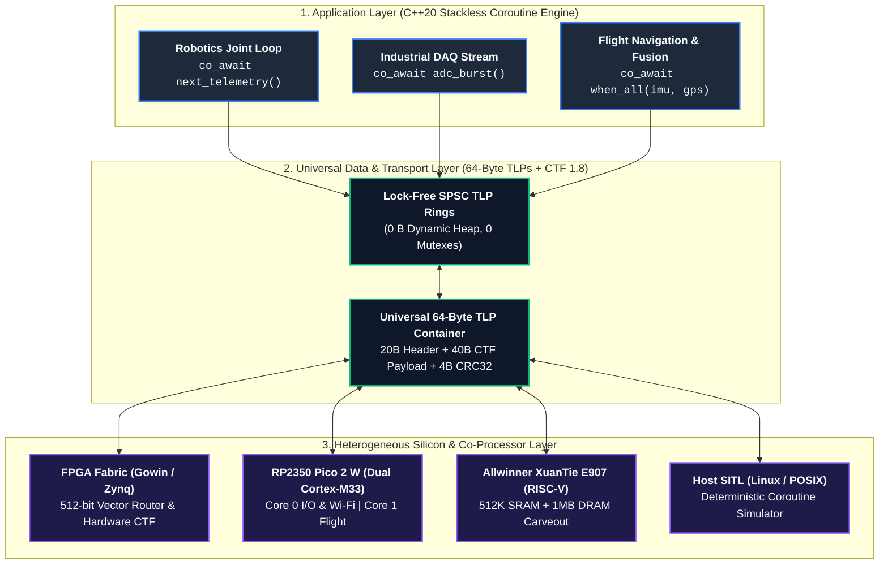
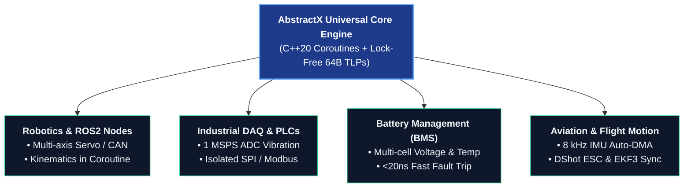
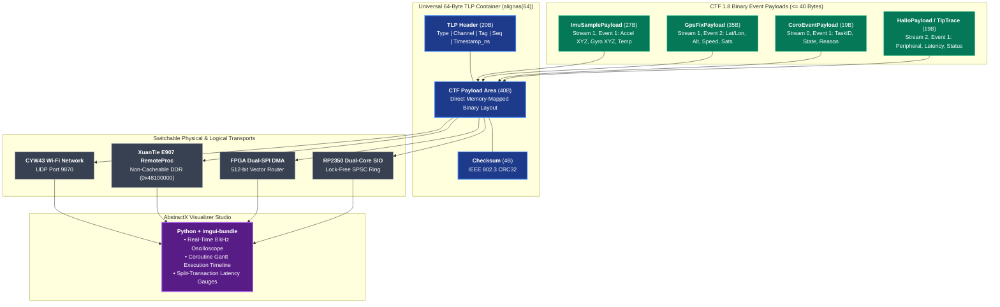

# AbstractX

**Universal Asynchronous Hardware Offloader & Heterogeneous Interconnect Framework**  
*Small. Deterministic. Zero-Blocking I/O for FPGAs, Microcontrollers, and Linux Hosts.*  
*The Modern C++20 Evolution of Protothreads with Smart I/O Dispatching.*

> **Read the Technical Whitepaper:** [**`docs/PROTOTHREADS_TO_COROUTINE_WHITEPAPER.md`**](docs/PROTOTHREADS_TO_COROUTINE_WHITEPAPER.md)  
> *Abstract: Embedded systems development has long been divided between the heavy memory/jitter overhead of preemptive RTOS threads and the fragmented callback/state-machine architecture of single-stack cooperative schedulers. Adam Dunkels' 2005 Protothreads demonstrated the promise of stackless cooperative concurrency, but remained constrained by Duff's Device macro limitations, broken local variables, and a lack of hardware integration. Meanwhile, flight control firmware (such as INAV and Betaflight) developed priority-based cooperative task schedulers, yet were still forced into manual sub-state machines within I/O drivers to yield during multi-millisecond bus delays. AbstractX modernizes embedded concurrency by uniting compiler-native C++20 stackless coroutines with a split-transaction, lock-free SPSC I/O dispatcher. By isolating slow physical bus clocking (I2C, SPI, UART, CAN, DMA) into autonomous background transports while resuming suspended coroutine handles on the main thread in nanoseconds, AbstractX achieves deterministic, single-threaded execution with guaranteed zero dynamic heap allocations (via static atomic frame pools) and sub-64-byte frame footprints across Linux SBCs, MCUs, and FPGAs.*

---

## 1. Overview & Vision

Modern real-time systems—whether in **Robotics (ROS2)**, **Industrial Automation & DAQ**, **Power Electronics (BMS)**, or **Autonomous Flight (iNav / ArduPilot)**—struggle with a fundamental architecture problem: **The I/O Latency Mismatch**.

High-frequency control and telemetry algorithms cannot afford to block while slow physical peripheral buses (400 kHz I2C, 100 kHz Modbus, slow SPI ADC/DACs, UART serial) clock out data:
- In **bare-metal firmware**, developers are forced to write fragile, fragmented **callback state machines** across global tick timers.
- In **RTOS and Linux systems**, synchronous blocking I/O calls force multi-threading that causes **$1\text{--}50\ \mu\text{s}$ context-switch and lock-contention jitter, cache thrashing, and priority inversions**.

**AbstractX solves this permanently** by introducing a unified, multi-platform architecture:
1. **The Modern Evolution of Protothreads**: Replaces fragile macro hacks (Duff's Device) with native **C++20 Stackless Coroutines (`asp_coro`)** that preserve local variables across yields with **guaranteed 0 dynamic heap memory (`0 B`)** via static atomic frame pools and **0 mutexes**.
2. **PCIe TLP-Inspired Split-Transaction Protocol (`asp-tlp`)**: Request operations (`MemRd`, `MemWr`) are tagged and dispatched asynchronously; completions (`CplD`, `DMA_Stream`) are posted into lock-free rings when hardware finishes (mapping to physical PCIe BARs on FPGA, and lock-free shared SRAM on MCUs).
3. **Smart Hardware I/O Dispatcher**: FPGAs (Gowin / Zynq), Microcontrollers (RP2350 Pico 2W, ESP32-P4, STM32), and Linux hosts execute I/O autonomously with **sub-20ns hardware timestamping**.



---

## 2. Key Multi-Domain Application Profiles

AbstractX is domain-agnostic and provides tailored acceleration across multiple industries. The canonical dispatch abstraction is `DomainDispatcher`; the legacy `IsrDispatcher` name remains as a compatibility alias only for older code and documentation.



1. **Robotics & Motion Control (ROS2 / Micro-ROS)**:
   - Synchronizes multi-axis servo loops, CAN/RS-485 telemetry, and joint kinematics in straight-line coroutines using `co_await when_all(joint1.write(), joint2.write(), ...)`.
2. **Industrial Data Acquisition & Automation**:
   - Streams 1MSPS ADC vibration data continuously over `DMA_Stream` TLPs while servicing slow Modbus/I2C environmental sensors without buffer overruns.
3. **Power Electronics & Battery Management Systems (BMS)**:
   - High-voltage multi-cell voltage and temperature monitoring over isolated SPI daisy chains with sub-20ns hardware fault-trip timestamping.
4. **Aviation & Autonomous Flight Control**:
   - Flagship reference implementation for iNav, Betaflight, and ArduPilot with 8 kHz IMU Auto-DMA streaming, DShot motor output, and nanosecond EKF3 state estimation.

---

## 3. Execution Domains and Queue Bridge Model

AbstractX separates execution by domain rather than by “thread vs. IRQ” alone:

- **Coroutine domain**: the cooperative top-level execution domain. This is the main coroutine/scheduler domain where user logic, higher-level drivers, and top-level application flow run.
- **ISR domain**: hardware interrupt handlers and top-half completion paths. These can fire asynchronously and must never block or do unprotected queue mutation.
- **Core-to-core / thread-to-thread domains**: separate execution domains for future multi-core or RTOS-backed platforms, using the same bridge pattern but with different interconnect implementations.

The key rule is that inter-domain communication is always bridged through a queue or message boundary, not by assuming a single shared SPSC model applies everywhere.

- **Coroutine-to-ISR bridge**: ISR-safe ring or request queue that preserves interrupt state during the critical section.
- **Coroutine-to-core bridge**: same pattern, implemented with shared-memory or processor-local queues.
- **Coroutine-to-thread bridge**: same conceptual pattern, implemented with OS message queues or RTOS primitives.
- **Driver request queue**: a driver-facing queue used by a top-level coroutine and by ISR-triggered hardware completion paths; this must be ISR-safe and capable of buffering multiple pending requests.

ETL provides the concrete transport: the bridge is `etl::queue_spsc_isr<T, N, abstractx::InterruptLock>`, so no ring buffer is hand-rolled. `InterruptLock` implements the ETL `lock()` / `unlock()` pair with nesting-aware interrupt save/restore, saving the prior state on the outermost lock and restoring the exact previous state on the matching unlock. The direction of travel is explicit at the call site: the coroutine domain uses the locked `push()` / `pop()`, while an ISR uses the unlocked `push_from_isr()` / `pop_from_isr()` because interrupts are already masked there.

This is not optional: the queue semantics must match the execution-domain boundary, not just the producer/consumer count. For ISR-connected queues, the safety requirement is not implied by SPSC topology alone.

## 4. Universal Data Standard: CTF 1.8 Inside 64-Byte Switchable TLPs

AbstractX unifies all inter-core, inter-process, and network messages under a single wire standard: **Common Trace Format (CTF 1.8 / barectf) binary payloads encapsulated inside 64-Byte Transaction Layer Packets (`Tlp64`)**.



### Why CTF-in-TLP is Superior to Traditional Protocols:
1. **Switchable Across Any Transport**: Because the container is fixed-size (64 bytes) with a normative 20-byte header, the transport layer routes packets by `Channel` and `Tag` at line rate without understanding payload internals.
2. **Zero Serialization Overhead**: Sensor drivers (`Icm42688p`, `UbloxGps`), coroutine dispatchers, and HAL drivers write packed C++ CTF structs directly into `tlp.wire.payload` at compile time—**0 dynamic heap allocations, 0 protobuf overhead, and 0 memory copies**.
3. **FPGA Hardware Observability**: The FPGA fabric includes dedicated hardware event probes that emit 512-bit CTF trace TLPs on `CH_DEBUG_TRACE` (`0x04`), giving sub-microsecond visibility into physical Wishbone bus stalls and DShot ESC jitter.

---

## 5. Cross-Platform Silicon & Target Matrix

AbstractX runs unmodified across heterogeneous multi-core microcontrollers, RISC-V co-processors, FPGAs, and Linux workstations:

| Target Platform | Architecture / Cores | Primary Role | Memory & Transport |
|---|---|---|---|
| **Raspberry Pi Pico 2 W** | Dual ARM Cortex-M33 (RP2350) | Core 0: I/O & CYW43 Wi-Fi<br/>Core 1: 8 kHz Flight Coroutines | Lock-Free `SpscTlpRing<64>` & SIO Doorbells |
| **Allwinner XuanTie E907** | 32-bit RISC-V Co-processor | 8 kHz SPI DMA & GPS UART Parser | 512K SRAM A3 + 1MB Carveout (`0x48100000`) for Linux `remoteproc` |
| **Gowin Tang 9K / 20K** | Synthesizable SystemVerilog FPGA | Hardware Auto-DMA & 512-bit Router | Dual-SPI (50 MHz) / AXI-Stream (`asp_router.sv`) |
| **ESP32-P4** | Dual RISC-V HP Cores (400 MHz) | High-Performance Sensor Gateway | Hardware Mailboxes / PSRAM Streams |
| **Host Workstation SITL** | Linux POSIX / x86_64 / ARM64 | Full Desktop Simulation & Test Suite | Loopback UDP & Shared Memory |

---

## 6. AbstractX Visualizer Studio (Python + Dear ImGui Bundle)

The AbstractX Visualizer ([`tools/visualizer/abstractx_studio.py`](tools/visualizer/abstractx_studio.py)) is a high-performance, real-time observability dashboard built with **Python** and **`imgui-bundle`** (`Dear ImGui` + `ImPlot`):

```
+-----------------------------------------------------------------------------------------+
|  ABSTRACTX STUDIO   [Live UDP :9870] [Target: Pico 2 W RP2350] [Trace Rate: 8.2 kHz]   |
+-----------------------------------------------------------------------------------------+
| PANE 1: COROUTINE GANTT EXECUTION TIMELINE (Microsecond Precision)                     |
| Core 0 [I/O]:  [===SPI DMA===]          [==UART RX==]         [===CYW43 Wi-Fi Poll===]  |
| Core 1 [Coro]: [imu_task]──────>[gps_task]────────>[attitude_ekf]────────>[pid_loop]    |
+-----------------------------------------------------------------------------------------+
| PANE 2: SYNCHRONIZED 8 kHz SENSOR OSCILLOSCOPE & U-BLOX GPS STATUS                      |
| Gyro X/Y/Z [dps]:  /\_/\__/\_/\__/\_/\__/\_/\__/\_     [ UBX-NAV-PVT Status ]           |
| Accel X/Y/Z [g] :  ═══════════════════════════════     Lat/Lon: 37.7749° N, 122.4194° W |
|                                                        MSL Alt: 142.50 m | 18 SVs (3D)  |
+-----------------------------------------------------------------------------------------+
| PANE 3: SPSC TLP RING SATURATION & SPLIT-TRANSACTION LATENCY GAUGES                     |
| g_sensor_ring   : [████████░░░░░░░░░░░░] 24 / 64 pkts  (Avg Latency: 1.2 µs)            |
| g_telemetry_ring: [████░░░░░░░░░░░░░░░░] 12 / 64 pkts  (Avg Latency: 0.8 µs)            |
+-----------------------------------------------------------------------------------------+
```

### Running the Visualizer Studio:
```bash
# 1. Install dependencies
pip install -r tools/visualizer/requirements.txt

# 2. Launch with live UDP stream from Pico 2 W / E907 (Port 9870)
python3 tools/visualizer/abstractx_studio.py --port 9870

# 3. Or launch standalone with high-fidelity synthetic telemetry simulation
python3 tools/visualizer/abstractx_studio.py --sim
```

---

## 7. Specification Traceability & "Markdown Drives the Code"

AbstractX enforces strict **Specification-Driven Development**. Every architectural contract, register layout, and driver behavior is defined in [`docs/DESIGN_SPECIFICATION.md`](docs/DESIGN_SPECIFICATION.md) and tracked in code using `// @impl [SPEC-*]`:

```bash
# Run automated specification audit:
python3 tools/audit_specs.py
```
```
================================================================================
             AbstractX Spec-to-Code Traceability Audit Matrix                  
================================================================================
SPEC ID                | STATUS       | IMPLEMENTING SOURCE FILE(S)             
--------------------------------------------------------------------------------
SPEC-ARCH-01..05       | COMPLETE     | include/abstractx/hal/async_driver.hpp, ...
SPEC-TLP-01..03        | COMPLETE     | include/asp_tlp64.hpp, spsc_tlp_ring.hpp
SPEC-HAL-01..05        | COMPLETE     | spi.hpp, uart.hpp, timer.hpp, mailbox.hpp
SPEC-IMU-01..02        | COMPLETE     | include/abstractx/drivers/imu/icm42688p.hpp
SPEC-GPS-01..02        | COMPLETE     | include/abstractx/drivers/gps/ublox_gps.hpp
SPEC-TRACE-01..03      | COMPLETE     | tracer.hpp, barectf_config.yaml, main.cpp
================================================================================
Total Specifications: 20 | Implemented: 20 | Traceability Coverage: 100.0%
================================================================================
```

---

## 8. Quick Start & Build Instructions

### 1. Build and Run Desktop SITL Test Suite (Host):
```bash
cmake --preset host
cmake --build build_host
ctest --test-dir build_host --output-on-failure
```

### 2. Cross-Compile Raspberry Pi Pico 2 W Firmware:
```bash
cmake --preset pico2w
cmake --build build_pico2w
# Generates build_pico2w/apps/gps_imu_app/gps_imu_app.uf2
```

### 3. Cross-Compile XuanTie E907 RISC-V Firmware:
```bash
cmake --preset e907
cmake --build build_e907
# Generates build_e907/apps/e907_coprocessor/e907_coprocessor and gps_imu_app.bin
```

---

## 9. Repository Structure

```
AbstractX/
├── include/abstractx/            # Universal C++20 Header-Only Architecture
│   ├── coro.hpp                  # C++20 Coroutine Task<T>, Dispatcher, Combinators
│   ├── domain_dispatcher.hpp     # Lock-free Work Queue & Interrupt Management
│   ├── drivers/                  # Standardized Sensor Drivers (ICM-42688-P, U-Blox GPS)
│   ├── hal/                      # Split-Queue Asynchronous HAL (SPI, UART, Timer, Mailbox)
│   └── trace/tracer.hpp          # Zero-Allocation CTF 1.8 Tracer & TLP Encapsulation
├── include/                      # Wire Protocol & Containers
│   ├── asp_tlp64.hpp             # Strongly typed C++20 Tlp64 with make_ctf / as_ctf
│   ├── asp_tlp64.h               # Normative C 64-Byte TLP packed struct definition
│   └── spsc_tlp_ring.hpp         # Lock-free SPSC TLP ring buffer
├── rtl/                          # Synthesizable SystemVerilog FPGA IP Cores
│   ├── asp_top.sv                # Top-level FPGA integration & Dual-SPI frontend
│   ├── asp_router.sv             # 512-bit vector channel routing fabric
│   └── asp_wishbone_master.sv    # Wishbone bridge & peripheral registers
├── apps/                         # Target Application Firmwares
│   ├── gps_imu_app/              # Single Cross-Platform Sensor Application (Pico 2 W, Linux, E907)
│   └── e907_coprocessor/         # XuanTie E907 RemoteProc DDR Engine
├── trace/                        # CTF 1.8 Metadata Specifications
│   └── barectf_config.yaml       # CTF Stream 0 (Coro), Stream 1 (Telemetry), Stream 2 (HAL)
├── tools/                        # Python Tooling & Visualizer
│   ├── visualizer/               # AbstractX Visualizer Studio (Python + imgui-bundle)
│   │   ├── abstractx_studio.py   # Live UDP / simulation Dear ImGui + ImPlot visualizer
│   │   └── requirements.txt      # Python dependencies
│   └── audit_specs.py            # Automated Spec-to-Code Traceability Validator
├── docs/                         # Specifications & Hardware Debugging Guides
│   ├── DESIGN_SPECIFICATION.md   # Single Source of Truth Requirements Matrix
│   ├── HARDWARE_DEBUGGING_PICO2W_ESP32P4.md # OpenOCD SWD & GDB Debugging Guide
│   ├── PICO2W_DUAL_CORE_ARCHITECTURE.md     # Dual-core AMP memory map & SIO rings
│   ├── E907_COPROCESSOR_ARCHITECTURE.md     # XuanTie E907 DDR & RemoteProc guide
│   └── ABSTRACTX_VISUALIZER_SPECIFICATION.md# Visualizer architecture & roadmap
└── sim/                          # SITL Simulation & Verification Test Suite
```

---

## 10. Licensing Model

AbstractX is released under a **Dual-License Model**:
- **Open Source (GPLv3)**: Free to use for open-source projects, academic research, and community experimentation.
- **Commercial License**: Available for commercial products requiring closed-source firmware integration, dedicated hardware support, or proprietary extensions. Contact the maintainers for licensing inquiries.