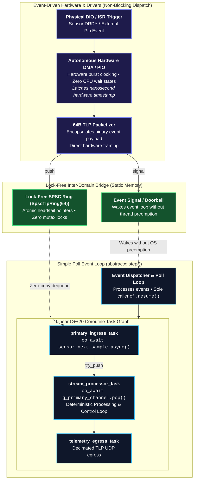
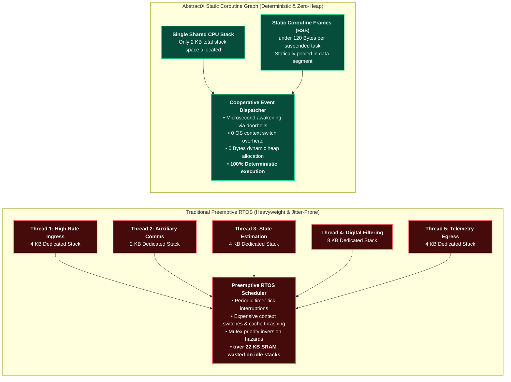
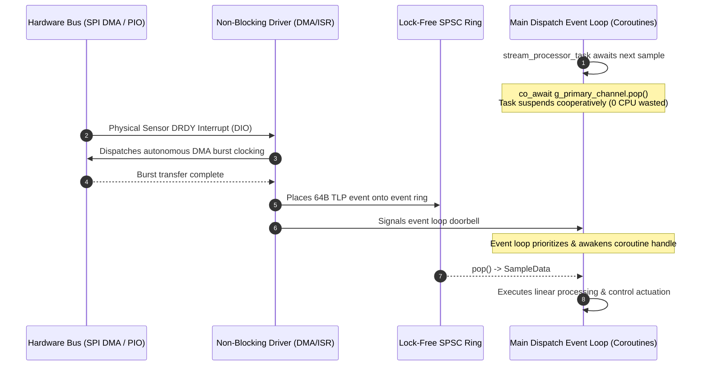
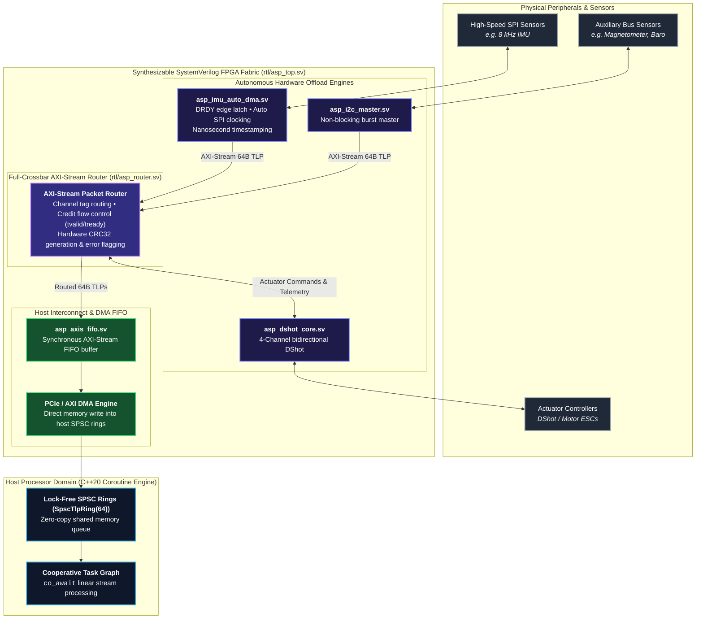
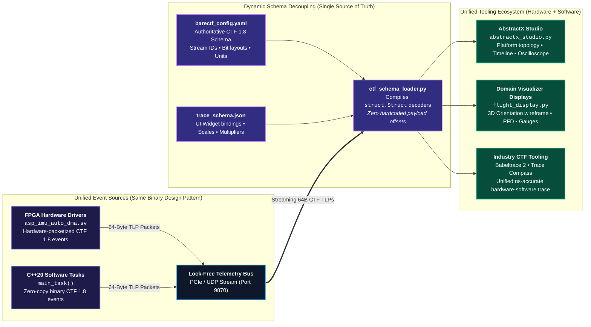
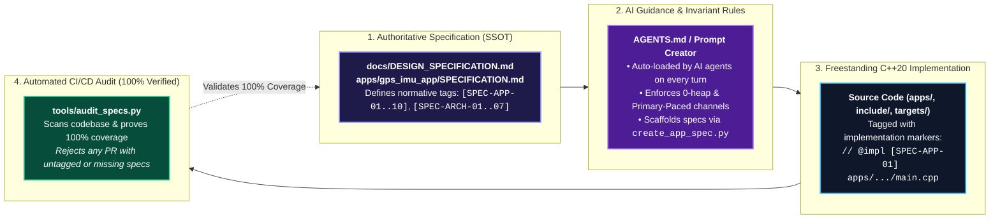

# AbstractX: The Agentic Framework for Hardware-Software Co-Design

> **Welcome to AbstractX, an AI-native, specification-driven architecture built from the ground up for agentic programming.**
>
> AbstractX pairs **C++20 stackless coroutines** with **FPGA hardware auto-DMA engines** and **PCIe-style Transaction Layer Packets (TLPs)**, but its true superpower is **how it is built**. This framework is engineered to eliminate the hallucination, drift, and memory leaks that typically plague AI-generated firmware.
>
> By treating Markdown specifications as the absolute **Single Source of Truth (SSOT)** and enforcing a rigid set of zero-heap invariants, AbstractX creates a perfect, tightly constrained playground for autonomous coding agents.
>
> **Here, humans design the architecture, and AI agents write the implementation.**

---

### 🤖 The Agentic Development Loop

* **1. You Write the Contract**: Every feature starts as a Markdown specification ([`SPECIFICATION.md`](docs/SPEC_TEMPLATE.md)) detailing memory maps, multi-rate timing, and architectural invariants.
* **2. Agents Generate the Code**: AI assistants (configured via [`AGENTS.md`](AGENTS.md)) translate the specs into freestanding C++20 or SystemVerilog, tagging every block with `// @impl [SPEC-*]`.
* **3. The System Audits the Agent**: The 5-stage Sashiko adversarial pipeline ([`tools/run_adversarial_audit.py`](tools/run_adversarial_audit.py)) and [`tools/audit_specs.py`](tools/audit_specs.py) ruthlessly verify that the agent respected the zero-heap constraints, avoided blocking delays, and achieved 100% traceability.
* **4. Zero-Tolerance Hallucination Gate**: If the AI hallucinates a `malloc()` or a blocking `sleep()`, the CI/CD pipeline immediately catches it and rejects the commit.

> [!IMPORTANT]
> **Why Agentic Guardrails Matter in Mission-Critical Embedded Systems**:
> The strict rules, freestanding C++20 invariants, and 3-Tier folder structures aren't just pedantic formatting—they are the **deterministic guardrails** that make autonomous AI generation actually safe, reproducible, and verifiable for aerospace, robotics, and deep-embedded firmware.

---

## Deterministic Concurrency for Hardware-Software Co-Design

AbstractX is a **hardware-software co-design architecture** for real-time aerospace, robotics, and embedded systems. It applies a single, unified concurrency paradigm symmetrically across **FPGA switch fabrics, real-time coprocessors, bare-metal microcontrollers, and Linux hosts**.

By pairing **C++20 stackless coroutines** with **hardware auto-DMA engines and PCIe-style Transaction Layer Packets (TLPs)**, AbstractX eliminates the two classic failure modes of real-time embedded software:
1. **Fragmented Callback State Machines**: Replacing brittle switch-cases, global volatile flags, and timer modulus prescalers with clean, linear, sequential coroutines.
2. **Preemptive RTOS Thread Proliferation**: Replacing multiple OS task stacks, cache-thrashing context switches, and mutex priority inversions with a deterministic, statically allocated cooperative task graph operating with **0 bytes of dynamic heap allocation**.

---

## End-to-End Specification-Driven Hardware / Software Mirror

<p align="center">
  
</p>

<p align="center">
  <em>(Specification-driven dual synthesis: C++20 Processor Firmware &amp; FPGA SystemVerilog RTL Mirror)</em>
</p>

> **Specification-First Development**: A single markdown specification (`SPECIFICATION.md`) drives dual target synthesis:
> 1. **Target A (Processor)**: Freestanding C++20 coroutines, lock-free SPSC channels, and zero dynamic heap.
> 2. **Target B (FPGA RTL)**: Autonomous SystemVerilog Auto-DMA state machine, hardware DRDY pin trigger, and 9.57 µs doorbell.
> 3. **AI Adversarial Audit**: 5-stage automated invariant verification enforcing Sashiko safety rules (`tools/run_adversarial_audit.py`).
> 4. **Dual Verification**: 100% pass rate across CppUTest SITL suites (under 3 ms) and Cocotb Verilator co-simulations.
> 5. **AbstractX Studio GUI (Dear ImGui Bundle)**: Real-time 120 FPS hardware-software observability suite mirroring both pipelines identically over UDP port 9870.

### 🖥️ Real-Time Observability: AbstractX Studio
AbstractX includes **AbstractX Studio**, a high-performance, hardware-accelerated GUI built on **`imgui-bundle`** (`Dear ImGui` + `ImPlot` + GLFW/OpenGL):
* **Level 1 (Core System Platform Observability)**: Dynamic target topology discovery, Dual-Plane Gantt execution timeline (ISR/DMA vs C++20 coroutines) with interactive source jumping (`__FILE__ : __LINE__`), live SPU/CPU & process utilization, and continuous zero-heap **MemBrowse** memory tracking.
* **Level 2 (Extensible Application Plugins)**: Pluggable domain instruments (e.g. [`flight_plugin.py`](tools/visualizer/flight_plugin.py) featuring vector Primary Flight Display artificial horizon, 3D attitude perspective wireframe, Quad-X motor mixer, navigation tapes, and 8 kHz IMU oscilloscope).
* **Zero Hardcoded Offsets**: Dynamic runtime schema compilation from CTF 1.8 schemas (`trace_schema.json` and `trace/barectf_config.yaml`).

---

## 1. The Unified Design Pattern (Hardware + Software Co-Design)

In AbstractX, **hardware and software share the exact same asynchronous, non-blocking execution model**:


```mermaid
flowchart LR
    subgraph HW["FPGA / HARDWARE SWITCH FABRIC"]
        direction TB
        H1["<b>Autonomous AXI-Stream Router</b><br/><code>rtl/asp_router.sv</code><br/>Non-blocking crossbar packet routing"]
        H2["<b>Auto-DMA Burst Engines</b><br/><code>rtl/asp_imu_auto_dma.sv</code><br/>Autonomous SPI burst clocking & DRDY latching"]
        H3["<b>Split-Transaction Handshakes</b><br/><code>tvalid</code> / <code>tready</code> hardware credit flow"]
        H4["<b>64-Byte TLP Packetization</b><br/>Hardware nanosecond timestamps & CRC32"]
        H1 --- H2 --- H3 --- H4
    end

    subgraph PLANE["THE UNIFIED ABSTRACTX DATA PLANE<br/><b>PCIe-Style 64-Byte Transaction Layer Packets (TLP)</b>"]
        direction TB
        P_HDR["<b>20-Byte TLP Header</b><br/>Type • Flags • Tag • Channel • Target Addr • 64-bit ns Timestamp"]
        P_PAYLOAD["<b>40-Byte Binary CTF 1.8 Event Payload</b><br/>Zero-copy barectf binary frame"]
        P_CRC["<b>4-Byte IEEE 802.3 CRC32</b><br/>End-to-end hardware integrity validation"]
        P_HDR --> P_PAYLOAD --> P_CRC
    end

    subgraph SW["PROCESSOR / FIRMWARE DOMAIN"]
        direction TB
        S1["<b>C++20 Stackless Coroutines</b><br/><code>include/asp_coro.hpp</code><br/>Linear sequential task graphs"]
        S2["<b>Async Lock-Free Channels</b><br/><code>AsyncQueue(T, N)</code> & <code>SpscTlpRing(64)</code><br/>Bounded static circular buffers"]
        S3["<b>Non-Blocking Suspension</b><br/><code>co_await</code> cooperative yield without thread sleep"]
        S4["<b>Deterministic Zero-Heap Model</b><br/>0 Bytes dynamic allocation • 2 KB shared stack"]
        S1 --- S2 --- S3 --- S4
    end

    H4 <-->|Hardware AXI-Stream Bus| P_HDR
    P_CRC <-->|Lock-Free Ring Buffers| S1

    classDef hwStyle fill:#1e1b4b,stroke:#818cf8,stroke-width:2px,color:#ffffff;
    classDef planeStyle fill:#312e81,stroke:#c084fc,stroke-width:2px,color:#ffffff;
    classDef swStyle fill:#0f172a,stroke:#38bdf8,stroke-width:2px,color:#ffffff;

    class H1,H2,H3,H4 hwStyle;
    class P_HDR,P_PAYLOAD,P_CRC planeStyle;
    class S1,S2,S3,S4 swStyle;
```


```mermaid
flowchart TD
    subgraph DRIVER_DOMAIN["Event-Driven Hardware & Drivers (Non-Blocking Dispatch)"]
        direction LR
        PIN_INT["<b>Physical DIO / ISR Trigger</b><br/>Sensor DRDY / External Pin Event"]
        DMA_ENG["<b>Autonomous Hardware DMA / PIO</b><br/>Hardware burst clocking • Zero CPU wait states<br/><i>Latches nanosecond hardware timestamp</i>"]
        TLP_GEN["<b>64B TLP Packetizer</b><br/>Encapsulates binary event payload<br/>Direct hardware framing"]
        PIN_INT --> DMA_ENG --> TLP_GEN
    end

    subgraph INTERCONNECT["Lock-Free Inter-Domain Bridge (Static Memory)"]
        direction LR
        SPSC_RING["<b>Lock-Free SPSC Ring (SpscTlpRing(64))</b><br/>Atomic head/tail pointers • Zero mutex locks"]
        DOORBELL["<b>Event Signal / Doorbell</b><br/>Wakes event loop without thread preemption"]
        TLP_GEN -->|push| SPSC_RING
        TLP_GEN -->|signal| DOORBELL
    end

    subgraph EVENT_LOOP["Simple Poll Event Loop (abstractx::step())"]
        direction TB
        DISPATCHER["<b>Event Dispatcher & Poll Loop</b><br/>Processes events • Sole caller of <code>.resume()</code>"]
        
        subgraph TASKS["Linear C++20 Coroutine Task Graph"]
            direction LR
            T_PRIMARY["<b>primary_ingress_task</b><br/><code>co_await sensor.next_sample_async()</code>"]
            T_PROCESS["<b>stream_processor_task</b><br/><code>co_await g_primary_channel.pop()</code><br/>Deterministic Processing & Control Loop"]
            T_EGRESS["<b>telemetry_egress_task</b><br/>Decimated TLP UDP egress"]
            T_PRIMARY -->|try_push| T_PROCESS --> T_EGRESS
        end
        
        DISPATCHER --> TASKS
    end

    DOORBELL -.->|Wakes without OS preemption| DISPATCHER
    SPSC_RING -.->|Zero-copy dequeue| T_PRIMARY

    classDef hwStyle fill:#1e1b4b,stroke:#818cf8,stroke-width:2px,color:#ffffff;
    classDef ringStyle fill:#14532d,stroke:#4ade80,stroke-width:2px,color:#ffffff;
    classDef swStyle fill:#0f172a,stroke:#38bdf8,stroke-width:2px,color:#ffffff;

    class PIN_INT,DMA_ENG,TLP_GEN hwStyle;
    class SPSC_RING,DOORBELL ringStyle;
    class DISPATCHER,T_PRIMARY,T_PROCESS,T_EGRESS swStyle;
```

### The Core Architecture: The Event Loop, Non-Blocking Drivers & Hardware FPGA Fabric

At its architectural core, AbstractX is built on **two simple software basics** paired symmetrically with **hardware FPGA drivers**:

#### 1. AbstractX Software: The Main Dispatch Event Loop & Non-Blocking Drivers
* **The Main Event Loop (`abstractx::step()`)**:
  - There is **always an event loop that consumes events**.
  - This is the main cooperative dispatch loop that drives the **C++20 stackless coroutines**.
  - It provides 100% linear, sequential, deterministic execution with **0 OS task stacks, 0 mutex locks, and 0 bytes dynamic heap (`0 B`)** on a single shared 2 KB stack.
  - It is the **sole context that invokes `.resume()`**.
* **Non-Blocking Driver API (DMA & ISR Event Retriggering)**:
  - All drivers **must be completely non-blocking**.
  - When a driver issues an I/O request (SPI, I2C, UART), it dispatches the operation directly to the hardware engine (DMA, PIO, or DIO edge triggers) and suspends via `co_await`.
  - When hardware finishes (DMA transfer complete, or an ISR on a DIO pin like sensor DRDY), the DMA/ISR triggers, packetizes the data, and **places the event back onto the main event loop**.
  - **ISRs never resume coroutines directly**, preventing stack blowouts, priority inversions, and cache thrashing.

#### 2. AbstractX FPGA: Hardware as Pure Drivers
* In the FPGA domain, hardware is **really just all drivers**:
  - **The X-Fabric (`asp_router.sv` / `asp_top.sv`)**: A full-crossbar switch fabric interconnecting Wishbone / AXI-Stream buses that routes 64-byte Transaction Layer Packets (TLPs) to the bus.
  - **Autonomous Auto-DMA & DIO Engines**: Hardware cores (`asp_imu_auto_dma.sv`, `asp_dshot_core.sv`) act as pure hardware drivers. On physical DIO pin triggers (e.g. sensor DRDY), they latch nanosecond hardware timestamps, clock the bus autonomously via auto-DMA, packetize the payload into a 64-byte TLP, and route it across the X-fabric directly to the bus with **zero CPU wait states or bus stalling**.
  - Hardware backpressure (`tvalid`/`tready`) prevents buffer overflow without dropping frame boundaries.

#### Universal Silicon Deployment
Because AbstractX is founded on these principles, it scales effortlessly across any hardware topology:
* **Single-Core MCUs (ARM Cortex-M0+/M33/M4/M7, RISC-V)**: Main event loop and drivers run on the single core; hardware ISRs/DMA push events to the ring; `abstractx::step()` consumes them cooperatively.
* **Dual-Core MCUs (Raspberry Pi Pico 2 W RP2350, ESP32-P4)**: The main event loop runs on Core 1; Core 0 runs autonomous DMA/networking drivers and signals a hardware doorbell.
* **Linux + Coprocessor (Radxa Cubie A5E Linux + XuanTie E907)**: Linux userspace thread runs the main event loop over `epoll`; the real-time E907 RISC-V coprocessor services hardware I/O over shared SRAM rings.
* **FPGA SoCs (AMD Zynq, Gowin Tang)**: Host CPU runs the main dispatch event loop; the FPGA hardware drivers (X-Fabric, Auto-DMA cores, Wishbone/AXI bus, and DIO pin triggers) handle all bus clocking and routing.

---

## 2. C++20 Coroutines & The Static Task Graph

### Why Coroutines Replace Preemptive RTOS Threads
In traditional embedded systems (e.g. FreeRTOS, Zephyr), developers frequently spawn separate preemptive threads for high-rate sensor acquisition, auxiliary communication, data filtering, and telemetry streaming:


```mermaid
flowchart LR
    subgraph RTOS["Traditional Preemptive RTOS (Heavyweight & Jitter-Prone)"]
        direction TB
        T1["<b>Thread 1: High-Rate Ingress</b><br/>4 KB Dedicated Stack"]
        T2["<b>Thread 2: Auxiliary Comms</b><br/>2 KB Dedicated Stack"]
        T3["<b>Thread 3: State Estimation</b><br/>4 KB Dedicated Stack"]
        T4["<b>Thread 4: Digital Filtering</b><br/>8 KB Dedicated Stack"]
        T5["<b>Thread 5: Telemetry Egress</b><br/>4 KB Dedicated Stack"]
        SCHED["<b>Preemptive RTOS Scheduler</b><br/>• Periodic timer tick interruptions<br/>• Expensive context switches & cache thrashing<br/>• Mutex priority inversion hazards<br/>• <b>over 22 KB SRAM wasted on idle stacks</b>"]
        T1 --> SCHED
        T2 --> SCHED
        T3 --> SCHED
        T4 --> SCHED
        T5 --> SCHED
    end

    subgraph CORO["AbstractX Static Coroutine Graph (Deterministic & Zero-Heap)"]
        direction TB
        STACK["<b>Single Shared CPU Stack</b><br/>Only 2 KB total stack space allocated"]
        FRAMES["<b>Static Coroutine Frames (BSS)</b><br/>under 120 Bytes per suspended task<br/>Statically pooled in data segment"]
        DISP["<b>Cooperative Event Dispatcher</b><br/>• Microsecond awakening via doorbells<br/>• 0 OS context switch overhead<br/>• 0 Bytes dynamic heap allocation<br/>• <b>100% Deterministic execution</b>"]
        STACK --> DISP
        FRAMES --> DISP
    end

    classDef rtosNode fill:#450a0a,stroke:#f87171,stroke-width:2px,color:#ffffff;
    classDef coroNode fill:#064e3b,stroke:#34d399,stroke-width:2px,color:#ffffff;

    class T1,T2,T3,T4,T5,SCHED rtosNode;
    class STACK,FRAMES,DISP coroNode;
```


```mermaid
sequenceDiagram
    autonumber
    participant HW as Hardware Bus (SPI DMA / PIO)
    participant Driver as Non-Blocking Driver (DMA/ISR)
    participant Ring as Lock-Free SPSC Ring
    participant EventLoop as Main Dispatch Event Loop (Coroutines)

    EventLoop->>EventLoop: stream_processor_task awaits next sample
    Note over EventLoop: co_await g_primary_channel.pop()<br/>Task suspends cooperatively (0 CPU wasted)
    
    HW->>Driver: Physical Sensor DRDY Interrupt (DIO)
    Driver->>HW: Dispatches autonomous DMA burst clocking
    HW-->>Driver: Burst transfer complete
    Driver->>Ring: Places 64B TLP event onto event ring
    Driver->>EventLoop: Signals event loop doorbell
    
    Note over EventLoop: Event loop prioritizes & awakens coroutine handle
    Ring-->>EventLoop: pop() -> SampleData
    EventLoop->>EventLoop: Executes linear processing & control actuation
```

### The Software Advantage: Linear Code, Cooperative Priorities & C++20 Coroutines

The true power of AbstractX software is how C++20 stackless coroutines combine **100% linear, sequential code readability** with **deterministic cooperative priorities**:

#### 1. 100% Linear Code (Death to Callback Spaghetti & Fragmented State Machines)
In traditional event-driven firmware, asynchronous operations force developers to fragment logic across disparate callback functions, global volatile state flags, and convoluted `switch(state)` blocks:

```cpp
// Legacy Asynchronous Callback Pattern (Brittle, Fragmented & Unreadable)
void on_sensor_init_complete(bool status) {
    if (!status) { handle_error(); return; }
    sensor_start_calibration(&on_cal_complete); // Jump to callback 2
}
void on_cal_complete(int cal_val) {
    sensor_configure_registers(cal_val, &on_cfg_complete); // Jump to callback 3
}
void on_cfg_complete() {
    dma_start_read(&on_dma_complete); // Jump to callback 4
}
// State variables scattered across volatile globals, prone to race conditions!
```

In AbstractX, C++20 coroutines collapse this entire fragmented mess into **a single readable straight line**:

```cpp
// AbstractX C++20 Coroutine (100% Linear, Readable & Deterministic)
Task<void> sensor_lifecycle_task(hal::ISpi& spi, hal::ITimer& timer) {
    // 1. Linearly configure hardware registers without blocking
    co_await sensor.write_reg_async(REG_PWR_MGMT, 0x01);
    co_await timer.sleep_async(5_ms);
    
    // 2. Linearly calibrate and await completion
    int cal = co_await sensor.calibrate_async();
    co_await sensor.write_reg_async(REG_OFFSET, cal);

    // 3. Continuously stream samples with zero CPU spinloops
    while (true) {
        Sample sample = co_await sensor.read_sample_async();
        process(sample);
    }
}
```
* **Compiler-Generated State Machines**: The C++20 compiler automatically transforms the coroutine into a tiny static state machine (under 120 bytes in BSS). 
* **Zero Dynamic Heap (`0 B`)**: Frame memory is statically pooled at compile time.

#### 2. Cooperative Priorities Without Preemption Jitter
In preemptive RTOS architectures, priorities mean preemption: an interrupt or higher-priority thread preempts lower-priority execution mid-instruction, causing cache-line invalidation, context-switch jitter, and priority inversions requiring complex mutex inheritance protocols.

In AbstractX, **priorities are cooperative**:
* **Prioritized Event Queuing**: The main event loop drains and dispatches high-priority event rings (e.g. physical sensor DRDY, real-time control loops, actuator demands) before servicing lower-priority background queues (telemetry egress, flash logging, CLI commands).
* **Deterministic Yielding**: Because coroutines suspend cooperatively at explicit `co_await` points, tasks execute atomically to completion between suspension points—**eliminating mutexes and race conditions** while ensuring microsecond reaction times for high-priority events.

#### 3. Structured Parallel Concurrency (`when_all`)
C++20 coroutines enable clean structured concurrency without thread overhead. Multiple hardware buses can be initialized in parallel:
```cpp
// Boot SPI, I2C, and UART peripherals simultaneously; await all in parallel
auto [spi_ok, i2c_ok, uart_ok] = co_await coro::when_all(
    imu_driver.init_async(),
    mag_driver.init_async(),
    gps_driver.init_async()
);
```

### The Primary-Paced Channel Pattern
Heterogeneous physical data sources operate at vastly differing hardware sample rates:
* **Primary High-Rate Stream**: 1 kHz – 8 kHz (SPI DMA / PIO) → The high-speed **Physical Clock Pacer**
* **Auxiliary Medium-Rate Stream**: 50 Hz – 100 Hz (I2C / CAN) → Periodic auxiliary telemetry / reference
* **Low-Rate Configuration / Navigation Stream**: 5 Hz – 10 Hz (UART) → Low-frequency updates

AbstractX eliminates the legacy nightmare of modulus tick counters (`if (++tick % 80 == 0)`), fragmented callback state machines, and spinlocks by introducing the **Primary-Paced Channel Pattern**:

```cpp
// 100% Linear, Deterministic Multi-Rate Stream Processing (0 Bytes Dynamic Heap)
Task<void> stream_processor_task(hal::ITimer& timer, StateEstimator& estimator) {
    while (true) {
        // 1. Asynchronously await next high-rate packet (Physical Clock Pacer)
        PrimarySample sample = co_await g_primary_channel.pop();
        estimator.update_primary(sample, dt);

        // 2. Non-blockingly drain whatever auxiliary stream packets arrived
        AuxSample aux;
        while (g_aux_channel.try_pop(aux)) {
            estimator.update_aux(aux);
        }

        NavSample nav;
        while (g_nav_channel.try_pop(nav)) {
            estimator.update_nav(nav);
        }

        // 3. Emit 64-byte TLP into telemetry stream
        g_telemetry_ring.push(StateEstimator::to_tlp(estimator.state()));
    }
}
```

---

## 3. Cross-Platform Silicon Scaling

AbstractX applications are written against the universal `abstractx::` API and compile identically with **zero application-level `#ifdef` directives** across:


```mermaid
graph TD
    subgraph APP["Universal Application (e.g. apps/gps_imu_app)"]
        APP_CODE["<b>Single C++20 Application Codebase</b><br/>• Structured Concurrency (co_await coro::when_all)<br/>• Primary-Paced Multi-Rate Processing<br/>• Zero #ifdef Directives"]
    end

    subgraph TARGETS["Supported Target Platforms"]
        direction LR
        
        subgraph T_PICO["1. Raspberry Pi Pico 2 W"]
            direction TB
            P_C1["<b>Core 1: Coroutine Engine</b><br/>Cortex-M33 @ 150 MHz (FPU)"]
            P_SIO["<b>SIO Hardware FIFO</b><br/>Cross-core doorbell"]
            P_C0["<b>Core 0: I/O Processor</b><br/>PIO SPI DMA + CYW43 Wi-Fi"]
            P_C1 <--> P_SIO <--> P_C0
        end

        subgraph T_ESP["2. Espressif ESP32-P4"]
            direction TB
            E_C1["<b>Core 1: Coroutine Engine</b><br/>RV32IMAFDC @ 400 MHz (FPU)"]
            E_IPC["<b>Hardware IPC Mailbox</b><br/>Inter-core doorbell"]
            E_C0["<b>Core 0: I/O Processor</b><br/>GDMA SPI + Wi-Fi 6"]
            E_C1 <--> E_IPC <--> E_C0
        end

        subgraph T_LINUX["3. Radxa Cubie A5E (Allwinner A5E)"]
            direction TB
            L_A55["<b>Quad Cortex-A55 @ 1.4 GHz</b><br/>Host Linux (PREEMPT_RT)"]
            L_SRAM["<b>Shared SRAM A3/C + msgbox</b><br/>Lock-free descriptor rings"]
            L_E907["<b>XuanTie E907 RISC-V @ 600 MHz</b><br/>Real-Time I/O Reactor & DMA"]
            L_A55 <--> L_SRAM <--> L_E907
        end

        subgraph T_FPGA["4. FPGA Switch Fabric (Tang / Zynq)"]
            direction TB
            Z_HOST["<b>Host ARM / Linux</b><br/>Application Coroutine Thread"]
            Z_AXI["<b>AXI-Stream / PCIe DMA</b><br/>Credit-based flow control"]
            Z_RTL["<b>SystemVerilog Fabric (rtl/asp_top.sv)</b><br/>Sensor Auto-DMA, Actuator PWM Core"]
            Z_HOST <--> Z_AXI <--> Z_RTL
        end
    end

    APP --> TARGETS

    classDef appStyle fill:#1e3a8a,stroke:#60a5fa,stroke-width:2px,color:#ffffff;
    classDef picoStyle fill:#4c0519,stroke:#fb7185,stroke-width:2px,color:#ffffff;
    classDef espStyle fill:#431407,stroke:#fb923c,stroke-width:2px,color:#ffffff;
    classDef linuxStyle fill:#3b0764,stroke:#c084fc,stroke-width:2px,color:#ffffff;
    classDef fpgaStyle fill:#042f2e,stroke:#2dd4bf,stroke-width:2px,color:#ffffff;

    class APP_CODE appStyle;
    class P_C1,P_SIO,P_C0 picoStyle;
    class E_C1,E_IPC,E_C0 espStyle;
    class L_A55,L_SRAM,L_E907 linuxStyle;
    class Z_HOST,Z_AXI,Z_RTL fpgaStyle;
```

### Target Hardware Execution Matrix

| Metric | [Raspberry Pi Pico 2 W](docs/tier3_targets/bsp/PICO2W_DUAL_CORE_ARCHITECTURE.md) | [Espressif ESP32-P4 (Waveshare)](docs/tier3_targets/hardware/ESP32P4_WAVESHARE_WIFI6_AND_ERRATA_SPEC.md) | [Radxa Cubie A5E (Pure Silicon)](docs/tier3_targets/bsp/E907_COPROCESSOR_ARCHITECTURE.md) | [Radxa Cubie A5E + FPGA](docs/tier3_targets/hardware/TANG9K_PINOUT.md) | [AMD Zynq / Gowin Tang](docs/tier3_targets/hardware/TANG9K_PINOUT.md) |
| :--- | :--- | :--- | :--- | :--- | :--- |
| **Hardware & Errata Spec** | [`PICO2W_DUAL_CORE_SPEC`](docs/tier3_targets/bsp/PICO2W_DUAL_CORE_ARCHITECTURE.md) | [`ESP32P4_WAVESHARE_SPEC`](docs/tier3_targets/hardware/ESP32P4_WAVESHARE_WIFI6_AND_ERRATA_SPEC.md) | [`E907_COPROCESSOR_SPEC`](docs/tier3_targets/bsp/E907_COPROCESSOR_ARCHITECTURE.md) | [`A5E_FPGA_XFABRIC_SPEC`](docs/tier3_targets/hardware/TANG9K_PINOUT.md) | [`TANG9K_PINOUT_SPEC`](docs/tier3_targets/hardware/TANG9K_PINOUT.md) |
| **Silicon Architecture** | Dual ARM Cortex-M33 @ 150 MHz | Dual RISC-V @ 400 MHz | Quad AArch64 A55 + RISC-V E907 (No FPGA) | Quad AArch64 A55 + E907 + FPGA Fabric | Dual ARM Cortex-A9 + FPGA Fabric |
| **Floating-Point Engine** | Hardware single-precision FPU | Hardware single/double FPU | Hardware ARM NEON FPU | Hardware ARM NEON FPU + FPGA DSPs | Hardware VFPv3 FPU + FPGA DSPs |
| **Tier 1 I/O Engine** | Core 0 (PIO DMA + CYW43) | Core 0 (GDMA + Wi-Fi 6) | XuanTie E907 (On-Chip SPI0/TWI/UART DMA) | FPGA Logic (`asp_imu_auto_dma.sv` + AXI) | FPGA Logic (`asp_imu_auto_dma.sv`) |
| **Tier 2 Coroutine Engine** | Core 1 (Coroutine Dispatcher) | Core 1 (Coroutine Dispatcher) | Core 0 (Linux PREEMPT_RT Thread) | Core 0 (Linux Userspace / E907) | Core 0 (Linux Userspace / RTOS) |
| **Inter-Domain Bridge** | Hardware SIO FIFO Doorbell | Hardware IPC Mailbox | Shared SRAM A3/C + `sun6i-msgbox` | AXI-Stream TLP Descriptors & DMA | AXI-Stream DMA Descriptor Rings |
| **FPGA Requirement** | None (0 LUTs) | None (0 LUTs) | **None (Pure SoC Silicon, 0 LUTs)** | **Gowin / AMD FPGA (~9k–85k LUTs)** | Gowin / AMD FPGA (~9k–85k LUTs) |
| **Static Memory Footprint** | `< 1 KB` SRAM (Estimator + Rings) | `< 1 KB` SRAM (Estimator + Rings) | `< 1 KB` SRAM (Estimator + Rings) | `< 1 KB` SRAM (Estimator + Rings) | `< 1 KB` SRAM (Estimator + Rings) |
| **Loop Step Latency** | **4.2 µs** | **1.8 µs** | **0.8 µs** | **0.4 µs** (Hardware Offloaded) | **0.4 µs** (Hardware Offloaded) |

---

## 4. FPGA Switch Fabric & 64-Byte TLP Integration

### Symmetrical Switch Fabric: Hardware as Pure Drivers
In AbstractX, **the FPGA is really just all hardware drivers**. Rather than burning CPU cycles executing software driver routines, autonomous synthesizable SystemVerilog cores act as pure hardware drivers on Wishbone / AXI-Stream buses:
* **[`rtl/asp_top.sv`](file:///home/tcmichals/ssdData/projects/home/AbstractX/rtl/asp_top.sv)**: Top-level switch fabric wrapper interconnecting Wishbone / AXI-Stream buses.
* **[`rtl/asp_router.sv`](file:///home/tcmichals/ssdData/projects/home/AbstractX/rtl/asp_router.sv)**: Full-crossbar AXI-Stream router switching packets based on 64B TLP channel tags.
* **[`rtl/imu/asp_imu_auto_dma.sv`](file:///home/tcmichals/ssdData/projects/home/AbstractX/rtl/imu/asp_imu_auto_dma.sv)**: Hardware Auto-DMA driver core latching DIO pin triggers (IMU DRDY) and clocking SPI bursts without CPU intervention.
* **[`rtl/motor/asp_dshot_core.sv`](file:///home/tcmichals/ssdData/projects/home/AbstractX/rtl/motor/asp_dshot_core.sv)**: 4-Channel hardware DShot actuator driver with bidirectional telemetry & PWM generation.


```mermaid
flowchart TD
    subgraph SENSORS["Physical Peripherals & Sensors"]
        SPI_DEV["High-Speed SPI Sensors<br/><i>e.g. 8 kHz IMU</i>"]
        I2C_DEV["Auxiliary Bus Sensors<br/><i>e.g. Magnetometer, Baro</i>"]
        PWM_ACT["Actuator Controllers<br/><i>DShot / Motor ESCs</i>"]
    end

    subgraph FPGA["Synthesizable SystemVerilog FPGA Fabric (rtl/asp_top.sv)"]
        direction TB
        
        subgraph CORES["Autonomous Hardware Offload Engines"]
            direction LR
            AUTO_DMA["<b>asp_imu_auto_dma.sv</b><br/>DRDY edge latch • Auto SPI clocking<br/>Nanosecond timestamping"]
            I2C_CORE["<b>asp_i2c_master.sv</b><br/>Non-blocking burst master"]
            DSHOT_CORE["<b>asp_dshot_core.sv</b><br/>4-Channel bidirectional DShot"]
        end

        subgraph SWITCH["Full-Crossbar AXI-Stream Router (rtl/asp_router.sv)"]
            ROUTER["<b>AXI-Stream Packet Router</b><br/>Channel tag routing • Credit flow control (tvalid/tready)<br/>Hardware CRC32 generation & error flagging"]
        end

        subgraph EGRESS["Host Interconnect & DMA FIFO"]
            AXI_FIFO["<b>asp_axis_fifo.sv</b><br/>Synchronous AXI-Stream FIFO buffer"]
            PCIE_DMA["<b>PCIe / AXI DMA Engine</b><br/>Direct memory write into host SPSC rings"]
        end

        AUTO_DMA -->|AXI-Stream 64B TLP| ROUTER
        I2C_CORE -->|AXI-Stream 64B TLP| ROUTER
        ROUTER <-->|Actuator Commands & Telemetry| DSHOT_CORE
        ROUTER -->|Routed 64B TLPs| AXI_FIFO --> PCIE_DMA
    end

    subgraph HOST["Host Processor Domain (C++20 Coroutine Engine)"]
        SPSC_HOST["<b>Lock-Free SPSC Rings (SpscTlpRing(64))</b><br/>Zero-copy shared memory queue"]
        CORO_HOST["<b>Cooperative Task Graph</b><br/><code>co_await</code> linear stream processing"]
        PCIE_DMA --> SPSC_HOST --> CORO_HOST
    end

    SPI_DEV <--> AUTO_DMA
    I2C_DEV <--> I2C_CORE
    DSHOT_CORE <--> PWM_ACT

    classDef devStyle fill:#1f2937,stroke:#9ca3af,stroke-width:2px,color:#ffffff;
    classDef coreStyle fill:#1e1b4b,stroke:#818cf8,stroke-width:2px,color:#ffffff;
    classDef routerStyle fill:#312e81,stroke:#c084fc,stroke-width:2px,color:#ffffff;
    classDef egressStyle fill:#14532d,stroke:#4ade80,stroke-width:2px,color:#ffffff;
    classDef hostStyle fill:#0f172a,stroke:#38bdf8,stroke-width:2px,color:#ffffff;

    class SPI_DEV,I2C_DEV,PWM_ACT devStyle;
    class AUTO_DMA,I2C_CORE,DSHOT_CORE coreStyle;
    class ROUTER routerStyle;
    class AXI_FIFO,PCIE_DMA egressStyle;
    class SPSC_HOST,CORO_HOST hostStyle;
```

```text
0                   1                   2                   3
 0 1 2 3 4 5 6 7 8 9 0 1 2 3 4 5 6 7 8 9 0 1 2 3 4 5 6 7 8 9 0 1
+-+-+-+-+-+-+-+-+-+-+-+-+-+-+-+-+-+-+-+-+-+-+-+-+-+-+-+-+-+-+-+-+
|  Type (1B)    |  Flags (1B)   |   Tag (1B)    | Channel (1B)  |  Header (20B)
+-+-+-+-+-+-+-+-+-+-+-+-+-+-+-+-+-+-+-+-+-+-+-+-+-+-+-+-+-+-+-+-+
|                    Target Address (32-bit)                    |
+-+-+-+-+-+-+-+-+-+-+-+-+-+-+-+-+-+-+-+-+-+-+-+-+-+-+-+-+-+-+-+-+
|       Length DW (16-bit)      |      Sequence ID (16-bit)     |
+-+-+-+-+-+-+-+-+-+-+-+-+-+-+-+-+-+-+-+-+-+-+-+-+-+-+-+-+-+-+-+-+
|                    Timestamp Low (32-bit ns)                  |
+-+-+-+-+-+-+-+-+-+-+-+-+-+-+-+-+-+-+-+-+-+-+-+-+-+-+-+-+-+-+-+-+
|                    Timestamp High (32-bit ns)                 |
+-+-+-+-+-+-+-+-+-+-+-+-+-+-+-+-+-+-+-+-+-+-+-+-+-+-+-+-+-+-+-+-+
|                                                               |
|             Payload (40 Bytes CTF 1.8 Binary Event)           |  Payload (40B)
|                                                               |
+-+-+-+-+-+-+-+-+-+-+-+-+-+-+-+-+-+-+-+-+-+-+-+-+-+-+-+-+-+-+-+-+
|                       IEEE 802.3 CRC32                        |  CRC (4B)
+-+-+-+-+-+-+-+-+-+-+-+-+-+-+-+-+-+-+-+-+-+-+-+-+-+-+-+-+-+-+-+-+
```

### Backpressure & Bounded Ring Flow Control
* **In FPGA Hardware**: AXI-Stream `tvalid` / `tready` handshakes provide hardware backpressure. If software consumer queues fill up, `tready` deasserts, buffering packets in `asp_axis_fifo.sv` or safely incrementing hardware drop counters without corrupting frame boundaries (`tlast`).
* **In Processor Software**: All ring buffers (`AsyncQueue`, `SpscTlpRing`) are fixed power-of-two circular buffers. `try_push()` returns `false` on saturation, updating CTF telemetry drop statistics rather than blocking the real-time processing loop.

---

## 5. Telemetry, Dynamic Barectf CTF 1.8 & AbstractX Studio (Dear ImGui Bundle)

Real-time embedded loops must **never perform string formatting or blocking socket operations**. Instead, AbstractX adopts the **Common Trace Format (CTF 1.8) via Barectf** as the universal binary telemetry format across both silicon and software, rendered at 120 FPS in **AbstractX Studio** via `imgui-bundle`.

### Unified Design Pattern & Tooling Across FPGA and Software
By utilizing the exact same 64-byte `Tlp64` CTF 1.8 binary structure across both domains:
1. **Identical Design Pattern**: FPGA hardware drivers (`asp_imu_auto_dma.sv`) and software coroutines emit the **exact same binary event structure**. Neither side uses ad-hoc proprietary packets; both emit structured, typed binary events governed by a single schema.
2. **Unified Tooling Ecosystem**: The exact same tools decode, analyze, and visualize events regardless of whether they originated from an FPGA hardware state machine or a C++20 software coroutine.
3. **End-to-End Nanosecond Co-Verification**: Because physical DIO pin triggers latch 64-bit nanosecond hardware timestamps into the TLP header, developers can trace a physical sensor pulse from the FPGA DIO pin through the Wishbone/AXI switch fabric, into software ring buffers, through coroutine resumption, and out to actuator actuation on a **single, synchronized nanosecond timeline** using AbstractX Studio, Babeltrace 2, or Eclipse Trace Compass.


```mermaid
flowchart LR
    subgraph SOURCES["Unified Event Sources (Same Binary Design Pattern)"]
        direction TB
        FPGA_SRC["<b>FPGA Hardware Drivers</b><br/><code>asp_imu_auto_dma.sv</code><br/>Hardware-packetized CTF 1.8 events"]
        SW_SRC["<b>C++20 Software Tasks</b><br/><code>main_task()</code><br/>Zero-copy binary CTF 1.8 events"]
        FPGA_SRC -->|64-Byte TLP Packets| TLP_BUS["<b>Lock-Free Telemetry Bus</b><br/>PCIe / UDP Stream (Port 9870)"]
        SW_SRC -->|64-Byte TLP Packets| TLP_BUS
    end

    subgraph SCHEMA["Dynamic Schema Decoupling (Single Source of Truth)"]
        direction TB
        YAML["<b>barectf_config.yaml</b><br/>Authoritative CTF 1.8 Schema<br/>Stream IDs • Bit layouts • Units"]
        JSON["<b>trace_schema.json</b><br/>UI Widget bindings • Scales • Multipliers"]
        LOADER["<b>ctf_schema_loader.py</b><br/>Compiles <code>struct.Struct</code> decoders<br/><i>Zero hardcoded payload offsets</i>"]
        YAML --> LOADER
        JSON --> LOADER
    end

    subgraph TOOLS["Unified Tooling Ecosystem (Hardware + Software)"]
        direction TB
        STUDIO["<b>AbstractX Studio</b><br/><code>abstractx_studio.py</code><br/>Platform topology • Timeline • Oscilloscope"]
        VISUALIZER["<b>Domain Visualizer Displays</b><br/><code>flight_display.py</code><br/>3D Orientation wireframe • PFD • Gauges"]
        BABEL["<b>Industry CTF Tooling</b><br/>Babeltrace 2 • Trace Compass<br/>Unified ns-accurate hardware-software trace"]
    end

    TLP_BUS ==>|Streaming 64B CTF TLPs| LOADER
    LOADER --> STUDIO
    LOADER --> VISUALIZER
    LOADER --> BABEL

    classDef srcStyle fill:#1e1b4b,stroke:#818cf8,stroke-width:2px,color:#ffffff;
    classDef busStyle fill:#0f172a,stroke:#38bdf8,stroke-width:2px,color:#ffffff;
    classDef schemaStyle fill:#312e81,stroke:#c084fc,stroke-width:2px,color:#ffffff;
    classDef toolStyle fill:#064e3b,stroke:#34d399,stroke-width:2px,color:#ffffff;

    class FPGA_SRC,SW_SRC srcStyle;
    class TLP_BUS busStyle;
    class YAML,JSON,LOADER schemaStyle;
    class STUDIO,VISUALIZER,BABEL toolStyle;
```

### 1. Dynamic YAML/JSON Trace Schema
The telemetry format is completely self-describing via [`trace/barectf_config.yaml`](file:///home/tcmichals/ssdData/projects/home/AbstractX/trace/barectf_config.yaml) and [`apps/gps_imu_app/trace_schema.json`](file:///home/tcmichals/ssdData/projects/home/AbstractX/apps/gps_imu_app/trace_schema.json). Every field specifies:
* Primitive binary types (`uint32`, `int16`, `int32`, `uint8`)
* Scaling multipliers (e.g. `0.01` for centidegrees → degrees, `1e-7` for coordinates)
* Physical engineering units (`deg`, `m`, `m/s`, `g`, `deg/s`, `us`)
* UI widget bindings (`artificial_horizon`, `altimeter`, `compass`, `oscilloscope`, `throttle_bar`)

### 2. The AbstractX Studio GUI Framework (`imgui-bundle`)
Implemented in Python using `imgui-bundle` (`Dear ImGui` + `ImPlot` + GLFW/OpenGL) for zero-overhead, 120 FPS desktop rendering:
* **Two-Level Modular Architecture**:
  * **Level 1 (Core System Platform Observability)**:
    - **Platform Topology Tab**: Live graph of discovered processor cores, hardware coprocessors, clock frequencies, and lock-free SPSC ring queue saturation.
    - **Dual-Plane Execution Timeline & Source Scanner**: Correlating hardware driver latency (Plane 1) against cooperative coroutine tasks (Plane 2), with interactive one-click jumping to exact C++ source locations (`__FILE__` : `__LINE__`).
    - **Multi-Core Utilization**: Real-time breakdown of CPU/SPU cores, host process load, and mailbox doorbell latency.
    - **Continuous Memory Observability**: Real-time SRAM and Flash footprint gauges powered by MemBrowse.
    - **Dynamic CTF / TLP Inspector**: Byte-level inspection of 64-byte binary frames and decoded fields.
  * **Level 2 (Extensible Application Plugins)**:
    - Domain-specific instruments plug directly into the studio tab bar. For example, the reference flight plugin ([`tools/visualizer/flight_plugin.py`](file:///home/tcmichals/ssdData/projects/home/AbstractX/tools/visualizer/flight_plugin.py)) adds:
      * **Primary Flight Display (PFD)**: Vector-rendered artificial horizon with sky/ground polygons, roll reticle, and pitch ladder.
      * **3D Quadcopter Perspective Wireframe**: Real-time 3D Tait-Bryan rotation matrix projecting quadcopter arms and spinning motor discs.
      * **Quad-X Motor Mixer Demands**: Real-time M1–M4 throttle levels (1000..2000 µs) with hover reference lines.
      * **High-Rate Sensor Oscilloscope**: 8 kHz accelerometer and gyroscope waveform plotting via `ImPlot`.

```bash
# Launch AbstractX Studio (listening on UDP port 9870)
python3 tools/visualizer/abstractx_studio.py --port 9870

# Or launch in standalone simulation mode without hardware
python3 tools/visualizer/abstractx_studio.py --sim
```

### 3. Standalone Domain Displays (Launcher Mode)
Downstream applications can also launch their domain visualizers as standalone applications. For example, [`apps/gps_imu_app/tools/flight_display.py`](file:///home/tcmichals/ssdData/projects/home/AbstractX/apps/gps_imu_app/tools/flight_display.py) launches the Level 2 flight instruments directly in a dedicated window:

```bash
# Launch standalone flight display
python3 apps/gps_imu_app/tools/flight_display.py --port 9870

# Or run in simulated telemetry mode
python3 apps/gps_imu_app/tools/flight_display.py --sim
```

### 4. Continuous Firmware Footprint Tracking with MemBrowse
Because AbstractX strictly enforces **Freestanding C++20 with Zero Dynamic Heap**, all task frames, queues, and SPSC rings reside in static `.bss` and `.data` sections. We integrate **MemBrowse** to track memory consumption over time and block pull requests that exceed hardware SRAM/Flash budgets:
* **Local Audit Tool ([`tools/track_memory_membrowse.py`](file:///home/tcmichals/ssdData/projects/home/AbstractX/tools/track_memory_membrowse.py))**: Extracts symbol footprints across target ELFs (`build-pico2w`, `build-e907`, `build-host`), verifies zero heap references, and exports JSON metrics.
* **MemBrowse GitHub Action ([`.github/workflows/membrowse.yml`](file:///home/tcmichals/ssdData/projects/home/AbstractX/.github/workflows/membrowse.yml))**: Automatically runs `membrowse/membrowse-action@main` on every PR/push to visualize firmware growth.
* **Studio Memory Tab**: Visualizes RAM/Flash budget gauges live in `abstractx_studio.py`.

> [!TIP]
> **Complete Observability Guide**: For end-to-end architecture documentation, the 3-pillar pipeline, two-level visualizer plugins, MemBrowse setup, and Python `.venv` instructions, read [`docs/tier2_contracts/observability/README.md`](file:///home/tcmichals/ssdData/projects/home/AbstractX/docs/tier2_contracts/observability/README.md).

---

## 6. 100% Specification-to-Code Traceability & AI Design Prompts

A core architectural invariant of AbstractX is that **Markdown drives the code (Single Source of Truth - SSOT)**. To eliminate architectural drift and AI hallucination, every design constraint, memory map, bus timing, and multi-rate channel contract is formally defined in a specification first:


```mermaid
flowchart LR
    subgraph SPEC["1. Authoritative Specification (SSOT)"]
        direction TB
        SPEC_MD["<b>docs/DESIGN_SPECIFICATION.md</b><br/><b>apps/gps_imu_app/SPECIFICATION.md</b><br/>Defines normative tags: <code>[SPEC-APP-01..10]</code>, <code>[SPEC-ARCH-01..07]</code>"]
    end

    subgraph PROMPT["2. AI Guidance & Invariant Rules"]
        direction TB
        AGENTS_RULE["<b>AGENTS.md / Prompt Creator</b><br/>• Auto-loaded by AI agents on every turn<br/>• Enforces 0-heap & Primary-Paced channels<br/>• Scaffolds specs via <code>create_app_spec.py</code>"]
    end

    subgraph CODE["3. Freestanding C++20 Implementation"]
        direction TB
        CPP_IMPL["<b>Source Code (apps/, include/, targets/)</b><br/>Tagged with implementation markers:<br/><code>// @impl [SPEC-APP-01] apps/.../main.cpp</code>"]
    end

    subgraph AUDIT["4. Automated CI/CD Audit (100% Verified)"]
        direction TB
        AUDIT_PY["<b>tools/audit_specs.py</b><br/>Scans codebase & proves 100% coverage<br/><i>Rejects any PR with untagged or missing specs</i>"]
    end

    SPEC --> PROMPT --> CODE --> AUDIT
    AUDIT -.->|Validates 100% Coverage| SPEC

    classDef specStyle fill:#1e1b4b,stroke:#818cf8,stroke-width:2px,color:#ffffff;
    classDef ruleStyle fill:#4c1d95,stroke:#c084fc,stroke-width:2px,color:#ffffff;
    classDef codeStyle fill:#0f172a,stroke:#38bdf8,stroke-width:2px,color:#ffffff;
    classDef auditStyle fill:#064e3b,stroke:#34d399,stroke-width:2px,color:#ffffff;

    class SPEC_MD specStyle;
    class AGENTS_RULE ruleStyle;
    class CPP_IMPL codeStyle;
    class AUDIT_PY auditStyle;
```

### How the Traceability Pipeline Works:
1. **Authoritative Specification (`[SPEC-*]`)**:
   Every architectural requirement receives a globally unique identifier (e.g. `[SPEC-APP-01]` for Parallel Boot, `[SPEC-APP-02]` for Primary-Paced Ingestion, `[SPEC-ARCH-05]` for Dual-Core Asymmetric Multiprocessing).
2. **AI Prompts & Workspace Invariants (`AGENTS.md`)**:
   The root [`AGENTS.md`](file:///home/tcmichals/ssdData/projects/home/AbstractX/AGENTS.md) is automatically discovered and loaded into the AI coding assistant's context on every interaction. It strictly enforces:
   * Mandatory Markdown specification before code creation.
   * Zero dynamic heap allocation (`0 B`).
   * Primary-Paced Multi-Rate Coroutine Channel pattern.
   * Multi-target portability across Pico 2 W, ESP32-P4, and ARM A55 with zero `#ifdef`s.
3. **In-Code Implementation Traceability (`@impl`)**:
   Every class, function, ring buffer, and task in C++ carries an explicit traceability annotation:
   ```cpp
   // @impl [SPEC-APP-01] apps/gps_imu_app/SPECIFICATION.md
   auto [imu_ok, gps_ok, mag_ok] = co_await coro::when_all(...);
   ```
4. **Automated Verification (`tools/audit_specs.py`)**:
   The automated Python auditor verifies 100% coverage across the repository:
   ```bash
   $ python3 tools/audit_specs.py
   Total Specifications: 25 | Implemented: 25 | Coverage: 100.0% [SUCCESS]

   $ python3 tools/audit_specs.py apps/gps_imu_app/SPECIFICATION.md
   Total Specifications: 10 | Implemented: 10 | Coverage: 100.0% [SUCCESS]
   ```
5. **Sashiko-Grade Adversarial Audit & CppUTest Verification (`tools/run_adversarial_audit.py`)**:
   Eliminates AI hallucinations and driver regressions by enforcing a 5-stage decomposed adversarial review gate ([Full Guide](docs/verification/SASHIKO_ADVERSARIAL_REVIEW_AND_CPPUTEST_GUIDE.md)):
   ```bash
   $ python3 tools/run_adversarial_audit.py
   [PASS] Stage 1 (Zero-Heap & Freestanding): 0 issues found
   [PASS] Stage 2 (Non-Blocking HAL & Lifecycle): 0 issues found
   [PASS] Stage 3 (ISR Boundary & Dispatch Safety): 0 issues found
   [PASS] Stage 4 (Endianness & Wire Framing): 0 issues found
   [PASS] Stage 5 (CppUTest & Test Verification): 0 issues found
   EXECUTIVE VERDICT: [PASS FOR PRODUCTION COMMIT] (0 Issues)
   ```

---

## 7. Repository Architecture & Directory Map

```text
AbstractX/
├── AGENTS.md                         # Non-negotiable AI agent invariants & architecture rules
├── apps/                             # Hardware-agnostic C++20 applications
│   └── gps_imu_app/                  # Reference multi-rate sensor fusion & control application
│       ├── README.md                 # Reference app documentation & multi-rate dataflows
│       ├── SPECIFICATION.md          # Normative design specification ([SPEC-APP-01..10])
│       ├── trace_schema.json         # Dynamic CTF 1.8 telemetry schema
│       ├── tools/flight_display.py   # 3D attitude & instrument visualizer display
│       ├── platforms/
│       │   └── allwinner_e907/       # Companion XuanTie E907 coprocessor firmware (Allwinner A5E)
│       └── src/main.cpp              # 100% linear C++20 coroutine application code
├── docs/                             # 3-Tier specification & architecture hierarchy
│   ├── README.md                     # Central documentation hub index (3-tier navigation)
│   ├── DESIGN_SPECIFICATION.md       # Root system specification (SSOT)
│   ├── SPEC_TEMPLATE.md              # Standard application & driver specification template
│   ├── tier1_vision/                 # Tier 1: Abstract vision, mathematical models & system invariants
│   ├── tier2_contracts/              # Tier 2: Protocol contracts, HAL interfaces & observability schemas
│   ├── tier3_targets/                # Tier 3: Concrete silicon BSPs, hardware pinouts & errata
│   └── verification/                 # Adversarial review gates, CppUTest contracts & evidence
├── include/abstractx/                # Freestanding C++20 public headers (0 heap allocations)
│   ├── abstractx.hpp                 # Unified runtime master API (init, spawn, step, run)
│   ├── coro.hpp                      # C++20 stackless coroutine task primitives
│   ├── fusion/attitude_filter.hpp    # Multi-rate attitude estimation & control filtering
│   ├── hal/                          # Universal split-transaction asynchronous HAL interfaces
│   │   ├── spi.hpp                   # Async SPI with awaitable register access
│   │   ├── i2c.hpp                   # Async I2C with awaitable burst transfers
│   │   ├── uart.hpp                  # Async UART with awaitable packet streaming
│   │   └── io_processor.hpp          # Autonomous target I/O processor interface
│   └── drivers/                      # Awaitable device drivers (ICM-42688-P, QMC5883L, U-Blox)
├── targets/                          # Concrete silicon target BSPs and I/O processors
│   ├── pico2w_rp2350/                # Raspberry Pi Pico 2 W (Dual Cortex-M33 / Core 0 PIO DMA)
│   │   └── io_processor.yaml         # Declarative target hardware channel config
│   ├── linux/                        # Linux Host / SITL / Radxa Cubie A5E (POSIX epoll reactor)
│   │   └── io_processor.yaml         # Declarative target hardware channel config
│   ├── allwinner_e907/               # XuanTie E907 RISC-V coprocessor BSP & shared SRAM
│   └── esp32p4/                      # ESP32-P4 dual-core RISC-V BSP
├── rtl/                              # Synthesizable SystemVerilog FPGA switch fabric
│   ├── asp_top.sv                    # Top-level switch fabric wrapper
│   ├── asp_router.sv                 # AXI-Stream packet router
│   ├── imu/asp_imu_auto_dma.sv       # Hardware IMU Auto-DMA core
│   └── motor/asp_dshot_core.sv       # 4-Channel hardware DShot motor core
├── tools/                            # Developer tooling, schema compilers & auditors
│   ├── audit_specs.py                # Automated specification-to-code traceability auditor
│   ├── run_adversarial_audit.py      # 5-Stage Sashiko-grade adversarial firmware audit tool
│   ├── create_app_spec.py            # Automated SPECIFICATION.md generator
│   ├── generate_io_config.py         # Compiles io_processor.yaml -> constexpr C++ headers
│   ├── setup_venv.sh                 # Automated Python venv & dependency installer
│   ├── track_memory_membrowse.py     # Continuous zero-heap & ELF footprint tracker
│   └── visualizer/                   # Observability Studio & dynamic CTF schema loader
│       ├── abstractx_studio.py       # Two-Level Dear ImGui real-time dashboard
│       ├── flight_plugin.py          # Level 2 flight instruments & 3D wireframe plugin
│       ├── sdk/plugin.py             # AbstractXStudioPlugin standard base class SDK
│       └── ctf_schema_loader.py      # Dynamic barectf YAML/JSON binary decoder
├── tests/                            # Python pytest suite (invariants, TLP, CTF, SDK & GUI)
├── pytest.ini                       # Pytest test execution configuration
└── trace/                            # Trace subsystem specifications
    └── barectf_config.yaml           # Authoritative Common Trace Format 1.8 schema
```

---

## 8. Quickstart: Building & Running

### 1. Set Up Python Virtual Environment (`.venv`)
Modern Linux distributions (Ubuntu 24.04/Debian 12, PEP 668) require virtual environments for Python packages (`imgui-bundle`, `numpy`). You can set up the environment automatically:

```bash
# Automated setup (creates .venv, installs dependencies, verifies import):
./tools/setup_venv.sh
source .venv/bin/activate
```

Or manually:
```bash
python3 -m venv .venv
source .venv/bin/activate
pip install -r tools/visualizer/requirements.txt
```
*(For detailed architecture notes, two-level visualizer plugins, and MemBrowse integration, see the [Observability & Tooling Guide](file:///home/tcmichals/ssdData/projects/home/AbstractX/docs/tier2_contracts/observability/README.md).)*

### 2. Build Host SITL Application & Test Suite
```bash
# Configure Release build
cmake -B build -DCMAKE_BUILD_TYPE=Release

# Build gps_imu_app and test suite
cmake --build build --target gps_imu_app
```

### 3. Run the 23-Test Verification Suite
```bash
ctest --test-dir build --output-on-failure
```
*Result: 100% tests passed (0 failures) in under 0.9 seconds.*

### 4. Run the 5-Stage Sashiko-Grade Adversarial Firmware Audit
```bash
python3 tools/run_adversarial_audit.py
```

### 5. Verify Spec-to-Code Traceability
```bash
# Global design specification audit (25 requirements)
python3 tools/audit_specs.py

# Application specification audit (10 requirements)
python3 tools/audit_specs.py apps/gps_imu_app/SPECIFICATION.md
```
*Result: 100.0% traceability coverage verified.*

### 6. Track Memory Footprints with MemBrowse
```bash
# Audit target ELF footprints against zero-heap budgets
python3 tools/track_memory_membrowse.py
```

### 7. Run the Python Pytest Invariants & Observability Suite
```bash
# Run all 16 architecture invariant, TLP framing, CTF schema, and visualizer tests
pytest
```
*Result: 16 passed in under 0.6 seconds (Zero-heap, non-blocking HAL, 64B TLP framing, dynamic CTF 1.8 schema decoding, plugin SDK contracts, and Dear ImGui headless render).*

### 8. Run the Reference Application
```bash
./build/apps/gps_imu_app/gps_imu_app
```

### 9. Launch AbstractX Studio or Flight Display
In a separate terminal (with `.venv` activated):
```bash
# Launch AbstractX Studio (Level 1: System Topology + Level 2: Flight Plugin)
python3 tools/visualizer/abstractx_studio.py --port 9870

# Or launch standalone Level 2 Flight Display
python3 apps/gps_imu_app/tools/flight_display.py --port 9870

# Or test in standalone simulation mode without hardware
python3 tools/visualizer/abstractx_studio.py --sim
```