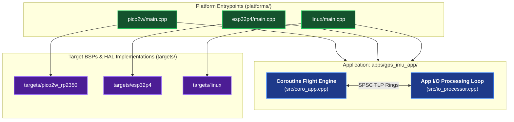

# AbstractX Applications Directory

Welcome to the `apps/` directory of AbstractX. This directory contains deployable end-to-end applications designed around the **Universal Asynchronous Hardware Offloader & Heterogeneous Interconnect Framework**.

---

## 1. Application Architecture Philosophy

In AbstractX, **applications are organized by application capability, NOT by silicon target.**

Every application is strictly decoupled from physical microcontroller or processor architectures:
1. **Application Logic (`src/coro_app.cpp`)**:
   - Implemented as pure, portable **C++20 Stackless Coroutines** (`Task<T>`, `co_await`, `when_all`, `when_any`).
   - Guarantees **0 dynamic heap memory allocations (`0 B`)** via static atomic frame pools.
   - Operates solely on high-level engineering units ($g$, $\text{dps}$, coordinates) or 64-byte TLP messages.
2. **Application I/O Processing Loop (`src/io_processor.cpp`)**:
   - The application defines *how* it uses physical peripherals (e.g. "Configure SPI1 at 12 MHz Mode 3, configure GPIO Pin 3 as a rising-edge interrupt for IMU `DRDY`, and stream 64B auto-sample TLPs").
   - **Crucially**: The I/O processing loop performs this configuration exclusively using the **generic AbstractX HAL interfaces** (`ISpi`, `IGpio`, `IUart`, `ITimer`).
   - It does NOT include vendor SDK headers or manipulate hardware registers directly.
3. **Platform Bindings (`platforms/<target>/main.cpp`)**:
   - Thin platform boot wrappers that initialize the target BSP, obtain the concrete HAL driver instances, and launch the application.

---

## 2. Directory Index

| Application | Description | Authoritative Spec | Status |
| :--- | :--- | :--- | :--- |
| **`gps_imu_app/`** | Flagship unified 8 kHz IMU auto-burst & GPS navigation streaming application (runs across Pico 2 W, Linux, and E907). | [`apps/gps_imu_app/SPECIFICATION.md`](gps_imu_app/SPECIFICATION.md) | 🚀 Active |
| **`e907_coprocessor/`** | XuanTie E907 RemoteProc DDR coprocessor firmware. | [`apps/e907_coprocessor/CMakeLists.txt`](e907_coprocessor/CMakeLists.txt) | 🚀 Active |
| **`esp32p4_hub/`** | Legacy ESP32-P4 sensor hub app (migrated to `gps_imu_app`). | [`apps/esp32p4_hub/CMakeLists.txt`](esp32p4_hub/CMakeLists.txt) | Legacy |
