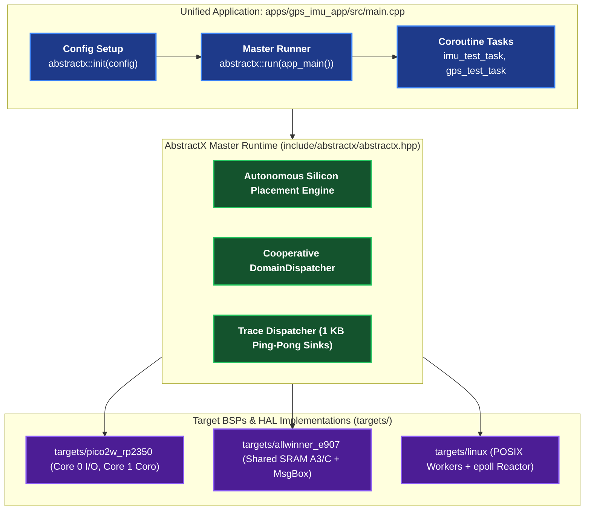

# AbstractX Applications Directory

Welcome to the `apps/` directory of AbstractX. This directory contains deployable end-to-end applications designed around the **Universal Asynchronous Hardware Offloader & Heterogeneous Interconnect Framework**.

---

## 1. Application Architecture Philosophy

In AbstractX, **applications are organized by application capability, NOT by silicon target.**

Every application is strictly decoupled from physical microcontroller or processor architectures:
1. **Single Portable Entrypoint (`src/main.cpp`)**:
   - The application defines its sensor/actuator pipeline in pure **C++20 Stackless Coroutines** (`Task<T>`, `co_await`, `when_all`, `when_any`).
   - Guarantees **0 dynamic heap memory allocations (`0 B`)** via static atomic frame pools.
   - Operates solely on high-level engineering units ($g$, $\text{dps}$, coordinates) or 64-byte TLP messages.
   - Configures the I/O channel descriptors (`AutoChannelConfig`) and SPSC rings in an `abstractx::Config` structure.
2. **Unified Master Runtime Lifecycle (`abstractx::init()` and `abstractx::run()`)**:
   - `abstractx::init(config)` initializes the target platform clocks, peripheral HAL drivers, and autonomous co-processor domain placement (Core 0 vs Core 1 on RP2350, E907 vs Linux on Allwinner SoCs, or SITL loop).
   - `abstractx::run(app_main())` executes application coroutines, I/O reactors, and background CTF trace dispatchers cooperatively.
   - **Zero `#ifdef` Directives**: The identical `src/main.cpp` compiles and executes across Linux SITL, Raspberry Pi Pico 2 W, and XuanTie E907 without code modifications.

---

## 2. Directory Index

| Application | Description | Authoritative Spec | Status |
| :--- | :--- | :--- | :--- |
| **`gps_imu_app/`** | Flagship unified 8 kHz IMU auto-burst & GPS navigation streaming application (runs across Pico 2 W, Linux, and E907). | [`apps/gps_imu_app/SPECIFICATION.md`](gps_imu_app/SPECIFICATION.md) | 🚀 Active |
| **`e907_coprocessor/`** | XuanTie E907 RemoteProc DDR coprocessor firmware. | [`apps/e907_coprocessor/CMakeLists.txt`](e907_coprocessor/CMakeLists.txt) | 🚀 Active |
| **`esp32p4_hub/`** | Legacy ESP32-P4 sensor hub app (migrated to `gps_imu_app`). | [`apps/esp32p4_hub/CMakeLists.txt`](esp32p4_hub/CMakeLists.txt) | Legacy |
