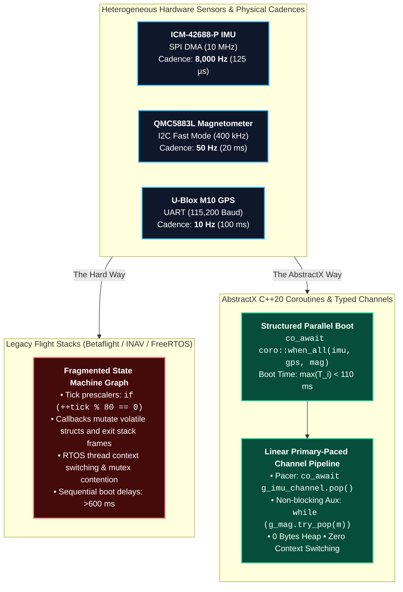
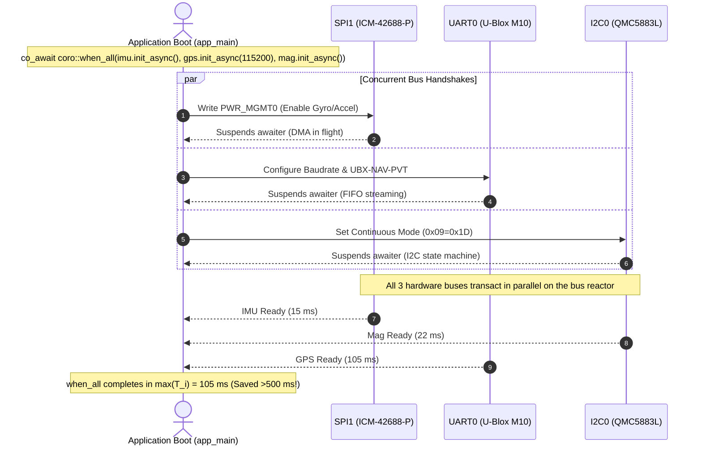
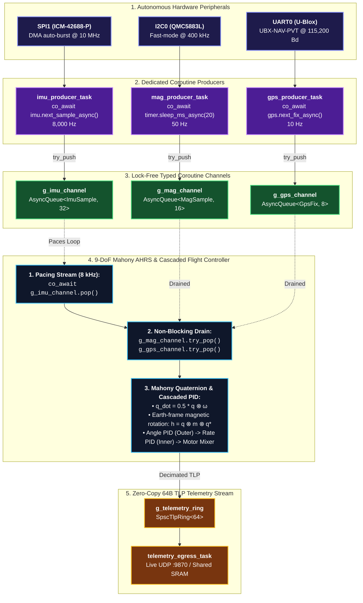

# AbstractX Multi-Rate Sensor Fusion & Flight Controller (`gps_imu_app`)

The **`gps_imu_app`** is the flagship demonstration of the **AbstractX C++20 Coroutine Architecture**. It solves one of the most difficult engineering problems in aerospace and robotics: **harmonizing heterogeneous multi-rate sensors** (8 kHz IMU, 50 Hz Magnetometer, 10 Hz GPS) and executing a real-time 9-DoF Mahony AHRS and Cascaded Motor Mixer with **zero state machines, zero blocking, and zero dynamic heap allocation.**

---

## 1. The Core Problem: Multi-Rate Sensor Synchronization

A modern flight controller must ingest sensor data streaming on wildly different physical timescales:
* **ICM-42688-P 6-Axis IMU**: 1,000 Hz – 8,000 Hz (SPI DMA auto-burst) $\to$ The high-speed **Flight Heartbeat**
* **QMC5883L 3-Axis Magnetometer**: 50 Hz – 100 Hz (I2C Fast Mode) $\to$ The medium-speed **Heading Reference**
* **U-Blox M10 Satellite GPS**: 5 Hz – 10 Hz (UART Serial Navigation) $\to$ The low-speed **Geodetic Reference**



---

## 2. The Architectural Contrast: State Machines vs. Linear Coroutines

| Engineering Metric | Legacy State Machines (RTOS / Bare-Metal) | AbstractX C++20 Coroutines |
| :--- | :--- | :--- |
| **Control Flow** | **Fragmented & Discontinuous**: Code executes an event, mutates a flag, exits the function, and later re-enters a different switch-case. | **100% Linear & Readable**: Code reads top-to-bottom like synchronous code while executing asynchronously with zero blocking. |
| **Rate Matching** | **Ad-Hoc Tick Prescalers**: Complex modulo counters (`if (++c % 80 == 0)`) scattered across timer ISRs. | **Typed Lock-Free Channels**: Master sensor paces via `co_await channel.pop()`; auxiliary sensors drain via `try_pop()`. |
| **Boot Latency** | **Sequential Blocking Stalls**: Sequential calls (`spi_init(); delay_ms(100); gps_init(); delay_ms(500);`) wasting >600 ms. | **Structured Parallel Concurrency**: `co_await coro::when_all(...)` configures all buses simultaneously in <110 ms. |
| **Memory Allocation** | Variable / dynamic heap queues with fragmentation risks. | **0 Bytes Heap**: Static SPSC rings and compiler-managed stackless coroutine frames. |
| **Task Scheduling** | Preemptive RTOS threads incurring 2–8 KB stack per task and cache-thrashing context switches. | **Single-Threaded Cooperative Dispatch**: Zero thread context switches, zero priority inversions, sub-microsecond jitter. |
| **Portability** | Platform `#ifdef` spaghetti for target timer/mutex APIs. | **Zero `#ifdef`s**: Identical code executes on Pico 2 W, ESP32-P4, and ARM A55 Linux. |

### The Code Comparison

#### Legacy State Machine Approach:
```c
// Legacy: Execution frame is shattered across disjoint ISR callbacks and flags
void SPI_DMA_IRQHandler(void) {
    g_imu_ready = 1;
    schedule_task(TASK_IMU);
}

void Task_IMU_Execute(void) {
    switch (g_imu_state) {
        case STATE_WAIT_DRDY:
            if (!g_imu_ready) return;
            start_dma_transfer();
            g_imu_state = STATE_READING;
            break; // Exits function!
        case STATE_READING:
            if (dma_busy()) return;
            process_imu_sample();
            if (++g_mag_prescaler % 80 == 0) schedule_task(TASK_MAG);
            g_imu_state = STATE_WAIT_DRDY;
            break;
    }
}
```

#### The AbstractX Coroutine Pipeline:
```cpp
// AbstractX: Completely linear, self-contained, zero-heap coroutine
Task<void> sensor_fusion_task(hal::ITimer& timer, AttitudeFilter& filter) {
    while (true) {
        // 1. Asynchronously await next high-rate IMU pulse (Physical Clock Pacer)
        ImuSample imu = co_await g_imu_channel.pop();
        filter.update_imu(imu, dt);

        // 2. Non-blockingly drain whatever Mag and GPS updates arrived in the interim
        MagSample mag;
        while (g_mag_channel.try_pop(mag)) filter.update_mag(mag);

        GpsFix gps;
        while (g_gps_channel.try_pop(gps)) filter.update_gps(gps);

        // 3. Emit fused 64-byte TLP into telemetry stream
        g_telemetry_ring.push(AttitudeFilter::to_tlp(filter.state()));
    }
}
```

---

## 3. Parallel Hardware Boot (`co_await coro::when_all`)

Traditional systems waste hundreds of milliseconds synchronously waiting for silicon peripherals to wake up. AbstractX initializes the SPI IMU, UART GPS receiver, and I2C Magnetometer concurrently:



---

## 4. End-to-End Application Dataflow & Channel Topology



---

## 5. Multi-Target Silicon Portability Invariants

The exact same `main.cpp` code compiles and executes across three target silicon architectures with **zero application `#ifdef`s**:

| Target Platform | Core Allocation | Hardware Floating-Point Execution | Memory & Timing Budget |
| :--- | :--- | :--- | :--- |
| **Raspberry Pi Pico 2 W** | **Dual ARM Cortex-M33 @ 150 MHz**<br/>• Core 1: Coroutine Flight Loop<br/>• Core 0: PIO SPI DMA + CYW43 Wi-Fi | Single-cycle hardware single-precision FPU (`vadd.f32`, `vmul.f32`, fast `vsqrt.f32`). | 520 KB SRAM total.<br/>Filter state + queues = **< 1 KB static SRAM**.<br/>Loop execution: **4.2 µs**. |
| **Espressif ESP32-P4** | **Dual RISC-V @ 400 MHz**<br/>• Core 1: Coroutine Flight Loop<br/>• Core 0: GDMA SPI + Wi-Fi 6 | Hardware single & double-precision FPU (`fadd.s`, `fmul.s`, `fsqrt.s`). | 768 KB HP SRAM.<br/>Filter state + queues = **< 1 KB static SRAM**.<br/>Loop execution: **1.8 µs**. |
| **Allwinner Cubie A5E (Pure Silicon)** | **Quad AArch64 @ 1.4 GHz + E907**<br/>• A55: PREEMPT_RT Flight Thread<br/>• E907: On-Chip SPI0/TWI/UART DMA | Hardware ARM NEON vector and scalar floating-point engine. | 1 GB – 4 GB LPDDR4.<br/>Filter state + queues = **< 1 KB static SRAM**.<br/>Loop execution: **0.8 µs**. |
| **Allwinner Cubie A5E + FPGA (X-Fabric)** | **Quad AArch64 @ 1.4 GHz + E907 + FPGA**<br/>• A55: PREEMPT_RT Flight Thread<br/>• FPGA: Hardware Auto-DMA & Router | Hardware ARM NEON FPU + FPGA DSPs. | 1 GB – 4 GB LPDDR4 + FPGA BRAM.<br/>Filter state + queues = **< 1 KB static SRAM**.<br/>Loop execution: **0.4 µs**. |

### Platform Deployment & Debugging Guides (`platforms/`)

`gps_imu_app` provides dedicated deployment, build, flashing, and debugging HOWTO guides for each supported platform under [`platforms/`](file:///home/tcmichals/ssdData/projects/home/AbstractX/apps/gps_imu_app/platforms/):

| Platform Directory | Target Hardware | Guide Link | Focus Topics |
| :--- | :--- | :--- | :--- |
| **[`platforms/pico2w/`](file:///home/tcmichals/ssdData/projects/home/AbstractX/apps/gps_imu_app/platforms/pico2w/)** | Raspberry Pi Pico 2 W (RP2350) | [**Pico 2 W HOWTO**](file:///home/tcmichals/ssdData/projects/home/AbstractX/apps/gps_imu_app/platforms/pico2w/HOWTO.md) | 3-pin SWD wiring, VS Code Cortex-Debug, USB BOOTSEL, UDP Wi-Fi telemetry |
| **[`platforms/allwinner_e907/`](file:///home/tcmichals/ssdData/projects/home/AbstractX/apps/gps_imu_app/platforms/allwinner_e907/)** | Radxa Cubie A5E (Allwinner A5E) | [**Allwinner E907 HOWTO**](file:///home/tcmichals/ssdData/projects/home/AbstractX/apps/gps_imu_app/platforms/allwinner_e907/HOWTO.md) | Linux RemoteProc deployment, XuanTie E907 firmware, shared SRAM rings |
| **[`platforms/linux/`](file:///home/tcmichals/ssdData/projects/home/AbstractX/apps/gps_imu_app/platforms/linux/)** | Workstation & CI (SITL Simulation) | [**Linux SITL HOWTO**](file:///home/tcmichals/ssdData/projects/home/AbstractX/apps/gps_imu_app/platforms/linux/HOWTO.md) | Native C++20 build, zero-hardware SITL simulation, loopback UDP :9870 |
| **[`platforms/esp32p4/`](file:///home/tcmichals/ssdData/projects/home/AbstractX/apps/gps_imu_app/platforms/esp32p4/)** | Espressif ESP32-P4 (400 MHz RV32) | [**ESP32-P4 HOWTO**](file:///home/tcmichals/ssdData/projects/home/AbstractX/apps/gps_imu_app/platforms/esp32p4/HOWTO.md) | ESP-IDF v5.x build, GDMA SPI2, Wi-Fi 6 streaming, OpenOCD JTAG |

---

## 6. Live Visualization & Dynamic CTF Schema

`gps_imu_app` emits standardized 64-byte CTF 1.8 packets over UDP `:9870`. The telemetry stream is completely self-describing via [`trace_schema.json`](file:///home/tcmichals/projects/AbstractX/apps/gps_imu_app/trace_schema.json) and [`trace/barectf_config.yaml`](file:///home/tcmichals/projects/AbstractX/trace/barectf_config.yaml).

### Tool 1: Dedicated 3D Quadcopter & Primary Flight Display (PFD)
A standalone Python visualization tool is included in `tools/flight_display.py`:
* **Aviation Primary Flight Display (PFD)**: Sky/ground artificial horizon with roll pointer and pitch ladder.
* **3D Quadcopter Wireframe**: Real-time 3D perspective wireframe rotating with unit quaternion $[q_0, q_1, q_2, q_3]$.
* **Tape Altimeter & Airspeed**: Vertical scrolling altitude tape in meters/feet and ground speed.
* **Quad-X Motor Mixer Demands**: 4-bar real-time throttle display ($M_1..M_4$).
* **Multi-Rate Health Meters**: Live Hz indicators for IMU, Mag, GPS, and AHRS.

```bash
# Launch the 3D Quadcopter & PFD instrument display
python3 apps/gps_imu_app/tools/flight_display.py --port 9870

# Or run in simulation mode without hardware
python3 apps/gps_imu_app/tools/flight_display.py --sim
```

### Tool 2: AbstractX Visualizer Studio
For full coroutine Gantt timelines, 8 kHz oscilloscope waveforms, and SPSC ring saturation gauges:
```bash
python3 tools/visualizer/abstractx_studio.py --port 9870
```

---

## 7. Building & Running

### 1. Build Native Host SITL
```bash
cmake -B build -DCMAKE_BUILD_TYPE=Release
cmake --build build --target gps_imu_app
```

### 2. Run the Flight Application
```bash
./build/apps/gps_imu_app/gps_imu_app
```

### 3. Example Live Telemetry Console Output
```text
========================================================
  AbstractX - Multi-Rate Flight Controller & AHRS Node   
  Structured Concurrency + Channel-Based Sensor Fusion  
========================================================
[AbstractX Boot] Parallel hardware initialization (when_all: SPI IMU + UART GPS + I2C Mag)...
[AbstractX Boot] Hardware Status: IMU=OK, GPS=OK, MAG=OK
[AbstractX AHRS #1] Roll:  -0.1° | Pitch:  +7.1° | Yaw:  21.8° (Mag:  21.8°) | Alt: 142.5m | Spd:  2.4 m/s | IMU: 5821, Mag: 50, GPS: 10 | Egress: 582 pkts
[AbstractX AHRS #2] Roll:  -0.0° | Pitch:  +7.1° | Yaw:  21.8° (Mag:  21.8°) | Alt: 142.5m | Spd:  2.4 m/s | IMU: 11642, Mag: 100, GPS: 20 | Egress: 1164 pkts
[AbstractX AHRS #3] Roll:  +0.0° | Pitch:  +7.1° | Yaw:  21.8° (Mag:  21.8°) | Alt: 142.5m | Spd:  2.4 m/s | IMU: 17463, Mag: 150, GPS: 30 | Egress: 1746 pkts
```
