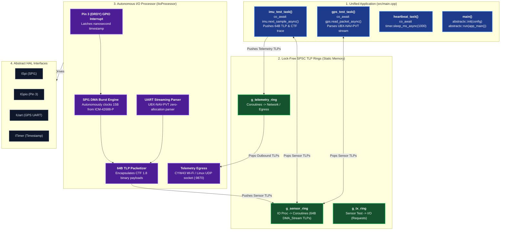

# GPS & IMU Application Specification

This document is the **authoritative design specification** for the **GPS & IMU Application (`apps/gps_imu_app/`)**. It details the dual-domain architecture, the I/O processing loop peripheral setup, the 8 kHz IMU auto-sample pipeline, the C++20 coroutine state machines, and the 64-byte TLP wire contract.

---

## 1. Application Overview & Objectives

The `gps_imu_app` is the flagship reference application for AbstractX. It coordinates high-rate inertial sensing and precision satellite navigation:
1. **ICM-42688-P 6-Axis IMU**: 8,000 Hz accelerometer and gyroscope burst telemetry with sub-microsecond hardware timestamping.
2. **U-Blox UBX GPS Receiver**: 10 Hz / 25 Hz 3D position, velocity, and time-of-week navigation stream.
3. **100% Portability**: The same application code runs unmodified across **Pico 2 W (RP2350)**, **ESP32-P4**, **Linux (Allwinner Cubie A5E)**, and **Desktop SITL**.



---

## 2. Master Entrypoint & Setup (`src/main.cpp`)

The application entrypoint sets up the sensor channel mappings, SPSC rings, and launches the runtime:

```cpp
int main() {
    // 1. Unified Configuration
    Config config{};
    config.trace.sink_type = TraceSinkType::Udp;
    config.trace.sink_target = "127.0.0.1:9870";
    config.trace.flush_interval_ms = 10;

    // 2. Configure Sensor HW Fusion Channel
    static hal::AutoChannelConfig auto_channels[1]{};
    auto_channels[0].channel_id = 0;
    auto_channels[0].auto_mode = true;
    auto_channels[0].trigger_mode = hal::TriggerMode::GpioEdge;
    auto_channels[0].trigger_pin = 20; // Pin 3 / GP20 DRDY
    auto_channels[0].bus_type = hal::BusType::Spi;
    auto_channels[0].bus_index = 1;
    auto_channels[0].bus_speed_hz = 10'000'000;
    auto_channels[0].rx_len = 15;
    auto_channels[0].tlp_channel = 0x02;

    config.io_setup.channels = auto_channels;
    config.io_setup.egress_tx_ring = &g_tx_ring;
    config.io_setup.ingress_rx_ring = &g_sensor_ring;

    // 3. One-line initialization: handles clocks, HAL, SPSC rings, coprocessor, and tracing
    abstractx::init(config);

    // 4. One-line execution: runs coroutines, I/O reactor, and trace dispatcher to completion
    abstractx::run(app_main());

    return 0;
}
```

---

## 3. C++20 Coroutine Application Tasks (`src/main.cpp`)

The Coroutine Domain runs the sensor benchmarks and telemetry tasks:

```cpp
// 1. High-Rate 8 kHz IMU Control Task
Task<void> imu_test_task(Icm42688p& imu) {
    uint32_t seq = 0;
    while (true) {
        // Suspends task until the next 64B DMA_Stream TLP arrives
        ImuSample sample = co_await imu.next_sample_async();
        if (sample.valid) {
            seq++;
            Tlp64 tlp = Icm42688p::to_tlp(sample);
            g_telemetry_ring.push(tlp);
            trace::g_tracer.trace_imu(seq, ...);
        }
    }
}

// 2. Navigation GPS Task
Task<void> gps_test_task(UbloxGps& gps) {
    while (true) {
        // Suspends task until verified 3D UBX-NAV-PVT fix arrives
        GpsFix fix = co_await gps.next_fix_async();
        if (fix.valid) {
            update_ekf_navigation(fix.lat, fix.lon, fix.alt_mm, fix.speed_mm_s);
            
            Tlp64 telem = UbloxGps::to_tlp(fix);
            g_telemetry_ring.push(telem);
        }
    }
}

// 3. Heartbeat & Diagnostics Task
Task<void> heartbeat_task(hal::ITimer& timer) {
    uint32_t count = 0;
    while (true) {
        co_await timer.sleep_ms_async(1000);
        count++;
        log_diagnostics(count, g_sensor_ring.size(), g_telemetry_ring.size());
    }
}
```

---

## 4. TLP Wire Format & Message Classification (TX, RX, IOCTL)

The `gps_imu_app` uses 64-byte `Tlp64` messages across the lock-free SPSC rings categorized into three message types:
1. **RX Messages (Sensor Telemetry Stream)**: `DMA_Stream` (`Type = 0x10`) packets emitted by `io_processor.cpp` on `Channel::Telemetry` carrying 8 kHz IMU samples and GPS fixes.
2. **TX Messages (Outbound Telemetry Stream)**: Telemetry TLPs produced by `coro_app.cpp` pushed into `g_telemetry_ring` for external network/serial transmission.
3. **IOCTL Messages (Runtime Reconfiguration)**: `MemWr` and `MemRd` packets for dynamic sensor scaling, rate changes, or calibration queries, correlated via `Tag`.

| Field | Value | Meaning |
| :--- | :--- | :--- |
| **`type`** | `0x10` (`DMA_Stream`) | Autonomous sensor stream packet |
| **`channel`** | `0x02` (`Channel::Telemetry`) | Telemetry plane |
| **`tag`** | `0x01` (IMU) / `0x02` (GPS) | Split-transaction correlation tag |
| **`timestamp_ns`** | 64-bit nanosecond timer | Cycle-accurate hardware timestamp latched at Pin 3 edge |
| **`payload[40]`** | CTF 1.8 binary payload | Packed `ImuSamplePayload` (23B) or `GpsFixPayload` (35B) |
| **`crc32`** | IEEE 802.3 CRC32 | Hardware/software link integrity check |

---

## 5. Supported Target Platforms

| Platform | Location | Execution Strategy |
| :--- | :--- | :--- |
| **Raspberry Pi Pico 2 W** | `platforms/pico2w/` | Core 0 runs `io_processor` + Wi-Fi; Core 1 runs `coro_app`. |
| **Espressif ESP32-P4** | `platforms/esp32p4/` | Core 0 runs `io_processor` (GDMA); Core 1 runs `coro_app`. |
| **Desktop SITL** | `platforms/sitl/` | Main thread runs `coro_app`; worker threads simulate 8 kHz IMU. |
| **Allwinner Cubie A5E** | `platforms/linux/` | PREEMPT_RT thread runs `coro_app`; POSIX workers service `/dev/spidev1.0`. |
