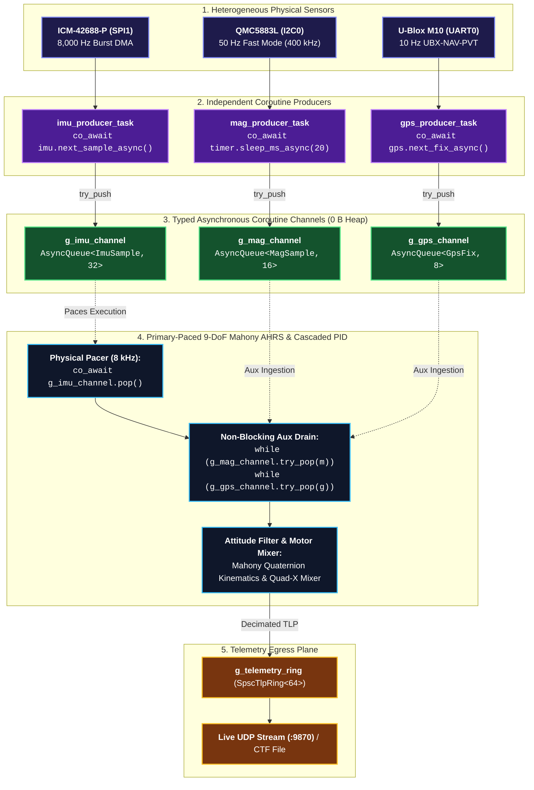

# GPS & IMU Multi-Rate Application Specification (`apps/gps_imu_app`)

This document is the **authoritative architectural design specification** for the **GPS & IMU Multi-Rate Application (`apps/gps_imu_app/`)**. It specifies the multi-rate sensor channel pipeline, parallel hardware initialization, 9-DoF Mahony AHRS attitude filter, cascaded PID flight controller, and cross-target execution invariants across **Raspberry Pi Pico 2 W (RP2350)**, **Espressif ESP32-P4**, and **ARM Cortex-A55 Linux (Radxa Cubie A5E)**.

---

## 1. Application Overview & Objectives

The `gps_imu_app` coordinates heterogeneous sensors streaming at three distinct physical frequencies:
1. **ICM-42688-P 6-Axis IMU**: 8,000 Hz accelerometer and gyroscope burst telemetry over SPI DMA.
2. **QMC5883L 3-Axis Magnetometer**: 50 Hz geomagnetic vector over I2C Fast Mode (400 kHz).
3. **U-Blox M10 Satellite GPS Receiver**: 10 Hz 3D position, velocity, and time-of-week stream over UART.
4. **100% Portability**: Identical single-source C++20 code executes across all target platforms with **zero application `#ifdef`s**.


```mermaid
flowchart TD
    subgraph HW_LAYER["1. Heterogeneous Physical Sensors"]
        SPI_HW["<b>ICM-42688-P (SPI1)</b><br/>8,000 Hz Burst DMA"]
        I2C_HW["<b>QMC5883L (I2C0)</b><br/>50 Hz Fast Mode (400 kHz)"]
        UART_HW["<b>U-Blox M10 (UART0)</b><br/>10 Hz UBX-NAV-PVT"]
    end

    subgraph PRODUCER_LAYER["2. Independent Coroutine Producers"]
        P_IMU["<b>imu_producer_task</b><br/><code>co_await imu.next_sample_async()</code>"]
        P_MAG["<b>mag_producer_task</b><br/><code>co_await timer.sleep_ms_async(20)</code>"]
        P_GPS["<b>gps_producer_task</b><br/><code>co_await gps.next_fix_async()</code>"]
    end

    subgraph CHANNEL_LAYER["3. Typed Asynchronous Coroutine Channels (0 B Heap)"]
        Q_IMU["<b>g_imu_channel</b><br/><code>AsyncQueue&lt;ImuSample, 32&gt;</code>"]
        Q_MAG["<b>g_mag_channel</b><br/><code>AsyncQueue&lt;MagSample, 16&gt;</code>"]
        Q_GPS["<b>g_gps_channel</b><br/><code>AsyncQueue&lt;GpsFix, 8&gt;</code>"]
    end

    subgraph FUSION_LAYER["4. Primary-Paced 9-DoF Mahony AHRS & Cascaded PID"]
        F_PACE["<b>Physical Pacer (8 kHz):</b><br/><code>co_await g_imu_channel.pop()</code>"]
        F_DRAIN["<b>Non-Blocking Aux Drain:</b><br/><code>while (g_mag_channel.try_pop(m))</code><br/><code>while (g_gps_channel.try_pop(g))</code>"]
        F_AHRS["<b>Attitude Filter & Motor Mixer:</b><br/>Mahony Quaternion Kinematics & Quad-X Mixer"]
        F_PACE --> F_DRAIN --> F_AHRS
    end

    subgraph EGRESS_LAYER["5. Telemetry Egress Plane"]
        RING["<b>g_telemetry_ring</b> (SpscTlpRing&lt;64&gt;)"]
        NET["<b>Live UDP Stream (:9870)</b> / CTF File"]
        RING --> NET
    end

    SPI_HW --> P_IMU -->|try_push| Q_IMU
    I2C_HW --> P_MAG -->|try_push| Q_MAG
    UART_HW --> P_GPS -->|try_push| Q_GPS

    Q_IMU -.->|Paces Execution| F_PACE
    Q_MAG -.->|Aux Ingestion| F_DRAIN
    Q_GPS -.->|Aux Ingestion| F_DRAIN

    F_AHRS -->|Decimated TLP| RING

    classDef hwStyle fill:#1e1b4b,stroke:#818cf8,stroke-width:2px,color:#ffffff;
    classDef prodStyle fill:#4c1d95,stroke:#c084fc,stroke-width:2px,color:#ffffff;
    classDef chanStyle fill:#14532d,stroke:#4ade80,stroke-width:2px,color:#ffffff;
    classDef fuseStyle fill:#0f172a,stroke:#38bdf8,stroke-width:2px,color:#ffffff;
    classDef egStyle fill:#78350f,stroke:#fbbf24,stroke-width:2px,color:#ffffff;

    class SPI_HW,I2C_HW,UART_HW hwStyle;
    class P_IMU,P_MAG,P_GPS prodStyle;
    class Q_IMU,Q_MAG,Q_GPS chanStyle;
    class F_PACE,F_DRAIN,F_MATH,F_AHRS fuseStyle;
    class RING,NET egStyle;
```

---

## 2. Mathematical Foundations: 9-DoF Mahony AHRS & Cascaded Flight Control

### 2.1 Orientation Representation: Unit Quaternion Kinematics
To eliminate Euler angle gimbal lock, orientation is tracked using a 4D unit quaternion $\mathbf{q} = [q_0, q_1, q_2, q_3]^T$:
$$\dot{\mathbf{q}} = \frac{1}{2}\mathbf{q} \otimes \boldsymbol{\omega}$$
where $\boldsymbol{\omega} = [\omega_x, \omega_y, \omega_z]^T$ is the Mahony-corrected angular velocity vector in rad/s.

### 2.2 Accelerometer Gravity Cross-Product Error
The gravity vector in the body frame is estimated by rotating the vertical Earth gravity $[0, 0, 1]^T$ using $\mathbf{q}$:
$$\mathbf{v} = \begin{bmatrix} 2(q_1 q_3 - q_0 q_2) \\ 2(q_0 q_1 + q_2 q_3) \\ q_0^2 - q_1^2 - q_2^2 + q_3^2 \end{bmatrix}$$
The accelerometer error is the cross product between measured normalized acceleration $\hat{\mathbf{a}}$ and estimated gravity $\mathbf{v}$:
$$\mathbf{e}_a = \hat{\mathbf{a}} \times \mathbf{v}$$

### 2.3 Magnetometer Earth Reference Rotation & Body Projection
The normalized geomagnetic vector $\hat{\mathbf{m}}$ is rotated to the Earth frame $\mathbf{h} = \mathbf{q} \otimes \hat{\mathbf{m}} \otimes \mathbf{q}^*$. The reference magnetic field in the body frame $\mathbf{w}$ is reprojected, producing the magnetic cross-product error:
$$\mathbf{e}_m = \hat{\mathbf{m}} \times \mathbf{w}$$

### 2.4 Integral Bias Elimination
Total error $\mathbf{e} = \mathbf{e}_a + \mathbf{e}_m$ drives the proportional-integral correction:
$$\boldsymbol{\omega}_{\text{corr}} = \boldsymbol{\omega}_{\text{raw}} + K_p \mathbf{e} + \mathbf{e}_{\text{int}}, \quad \dot{\mathbf{e}}_{\text{int}} = K_i \mathbf{e}$$

### 2.5 Cascaded Flight Control & Quad-X Motor Mixer
* **Outer Loop (Attitude PID)**: $\boldsymbol{\omega}_{\text{target}} = K_{p,\text{angle}} (\mathbf{0} - [\phi, \theta]^T)$
* **Inner Loop (Rate PID)**: $\boldsymbol{\tau} = K_{p,\text{rate}} (\boldsymbol{\omega}_{\text{target}} - \boldsymbol{\omega}) + K_{d,\text{rate}} \dot{\mathbf{e}}_{\text{rate}}$
* **Quad-X Motor Mixer**:
  $$M_1 = T_{\text{hover}} - \tau_{\text{roll}} + \tau_{\text{pitch}} + \tau_{\text{yaw}} \quad (\text{Front-Right CCW})$$
  $$M_2 = T_{\text{hover}} + \tau_{\text{roll}} - \tau_{\text{pitch}} + \tau_{\text{yaw}} \quad (\text{Rear-Left CCW})$$
  $$M_3 = T_{\text{hover}} + \tau_{\text{roll}} + \tau_{\text{pitch}} - \tau_{\text{yaw}} \quad (\text{Front-Left CW})$$
  $$M_4 = T_{\text{hover}} - \tau_{\text{roll}} - \tau_{\text{pitch}} - \tau_{\text{yaw}} \quad (\text{Rear-Right CW})$$

---

## 3. Structured Concurrency Parallel Boot (`coro::when_all`)

The application boots all independent hardware peripherals concurrently without sequential blocking delays:

```cpp
// [SPEC-APP-01] Parallel Structured Hardware Boot
auto [imu_ok, gps_ok, mag_ok] = co_await coro::when_all(
    imu.init_async(),
    gps.init_async(115200),
    mag.init_async()
);
```

Total boot time is bounded by $\max(T_{\text{imu}}, T_{\text{gps}}, T_{\text{mag}}) \approx 105\text{ ms}$, rather than $\sum T_i \approx 650\text{ ms}$.

---

## 4. Multi-Target Silicon Execution Invariants

The application code in `src/main.cpp` and `include/abstractx/fusion/attitude_filter.hpp` satisfies the following strict hardware invariants across all target platforms:

| Silicon Target | Architecture | Core Allocation | FPU Execution | Memory Footprint |
| :--- | :--- | :--- | :--- | :--- |
| **Raspberry Pi Pico 2 W** | Dual ARM Cortex-M33 @ 150 MHz | Core 1: Coroutines<br/>Core 0: PIO SPI DMA + Wi-Fi | Hardware single-precision FPU (`vadd.f32`, `vmul.f32`, `vsqrt.f32`) | SRAM Budget: 520 KB<br/>Filter + Queues: < 1 KB static SRAM |
| **Espressif ESP32-P4** | Dual RISC-V RV32IMAFDC @ 400 MHz | Core 1: Coroutines<br/>Core 0: GDMA SPI + Wi-Fi 6 | Hardware single/double FPU (`fadd.s`, `fmul.s`, `fsqrt.s`) | SRAM Budget: 768 KB HP SRAM<br/>Filter + Queues: < 1 KB static SRAM |
| **Allwinner Cubie A5E (Pure Silicon)** | Quad AArch64 A55 + XuanTie E906 (No FPGA) | A55: PREEMPT_RT Coroutines<br/>E906: On-Chip SPI/I2C/UART DMA | Hardware ARM NEON vector/scalar FPU | LPDDR4: 1 GB – 4 GB<br/>Filter + Queues: < 1 KB static SRAM |
| **Allwinner Cubie A5E + FPGA (X-Fabric)** | Quad AArch64 A55 + E906 + FPGA Fabric | A55: PREEMPT_RT Coroutines<br/>FPGA: Auto-DMA + Crossbar Switch | Hardware ARM NEON FPU + FPGA DSPs | LPDDR4: 1 GB – 4 GB + FPGA BRAM<br/>Filter + Queues: < 1 KB static SRAM |

### Invariant Rules:
1. **Zero Dynamic Allocation**: `operator new` and `malloc` are strictly banned during flight execution. All coroutine frames and queues are statically sized.
2. **Zero Synchronous Bus I/O**: Drivers MUST expose awaitable C++20 coroutine methods (`init_async()`, `next_sample_async()`, `read_sample_async()`).
3. **Zero Application `#ifdef`s**: The application MUST NOT use target preprocessor directives (`#ifdef PICO_BOARD`, `#ifdef ESP_PLATFORM`).

---

## 5. 64-Byte TLP Wire Contract & CTF 1.8 Schema

Fused attitude and motor outputs are packaged into standard 64-byte `Tlp64` messages matching [`apps/gps_imu_app/trace_schema.json`](file:///home/tcmichals/projects/AbstractX/apps/gps_imu_app/trace_schema.json):

| Byte Offset | Field Name | Type | Scale | Engineering Unit | Description |
| :--- | :--- | :--- | :--- | :--- | :--- |
| `0..19` | `TlpHeader` | POD | 1.0 | — | Type=0x02, Tag=0x04, Channel=0x02, Timestamp (ns) |
| `20..21` | `roll_cdeg` | `int16` | 0.01 | deg | Euler Roll Angle ($\pm 180^\circ$) |
| `22..23` | `pitch_cdeg` | `int16` | 0.01 | deg | Euler Pitch Angle ($\pm 90^\circ$) |
| `24..25` | `yaw_cdeg` | `uint16` | 0.01 | deg | Euler Yaw Angle ($0..360^\circ$ North ref) |
| `26..29` | `alt_mm` | `int32` | 0.001 | m | Fused MSL Altitude |
| `30..31` | `speed_cm_s` | `uint16` | 0.01 | m/s | Horizontal Ground Speed |
| `32..33` | `m1_throttle` | `uint16` | 1.0 | µs | Front-Right Motor ESC (100..1000) |
| `34..35` | `m2_throttle` | `uint16` | 1.0 | µs | Rear-Left Motor ESC (100..1000) |
| `36..37` | `m3_throttle` | `uint16` | 1.0 | µs | Front-Left Motor ESC (100..1000) |
| `38..39` | `m4_throttle` | `uint16` | 1.0 | µs | Rear-Right Motor ESC (100..1000) |
| `60..63` | `crc32` | `uint32` | 1.0 | — | IEEE 802.3 Frame Integrity Check |

---

## 6. Normative Specification Requirements Matrix

Every requirement below is verified in code with an `@impl` tag:

### `[SPEC-APP-01]` Parallel Hardware Initialization
The application MUST initialize SPI IMU, UART GPS, and I2C Magnetometer concurrently using `coro::when_all(...)`.

### `[SPEC-APP-02]` Primary-Paced Rate Execution
The sensor fusion loop MUST be paced exclusively by awaiting the primary high-rate IMU channel (`co_await g_imu_channel.pop()`).

### `[SPEC-APP-03]` Non-Blocking Auxiliary Drains
Auxiliary medium-rate (Mag) and low-rate (GPS) sensor channels MUST be drained non-blockingly using `try_pop()` without stalling the IMU loop.

### `[SPEC-APP-04]` 9-DoF Mahony Quaternion AHRS
Orientation MUST be maintained via unit quaternion differential kinematics ($\dot{\mathbf{q}} = \frac{1}{2}\mathbf{q}\otimes\boldsymbol{\omega}$) corrected by cross-product gravity and geomagnetic error vectors.

### `[SPEC-APP-05]` Cascaded Angle and Rate PID
Flight control MUST implement a cascaded control architecture where attitude angle error drives target angular rate, and rate error drives motor torque demands.

### `[SPEC-APP-06]` Quad-X Motor Mixer
Motor output demands MUST resolve four motor throttle values ($M_1..M_4$) clamped between 100 µs and 1000 µs.

### `[SPEC-APP-07]` Zero Dynamic Heap Allocation
All sensor channels (`AsyncQueue`), SPSC rings (`SpscTlpRing`), and filter instances MUST allocate exclusively from static memory with 0 heap bytes allocated during flight.

### `[SPEC-APP-08]` Dynamic CTF 1.8 Schema Compliance
Telemetry packets MUST conform to the barectf-compatible CTF 1.8 specification defined in `trace_schema.json`.

### `[SPEC-APP-09]` Multi-Target Portability
Application code in `apps/gps_imu_app` MUST compile and execute without modification across Pico 2 W, ESP32-P4, and ARM A55 Linux with zero application `#ifdef`s.

### `[SPEC-APP-10]` Telemetry Decimation & Egress
Fused AHRS state packets MUST be emitted into the lock-free telemetry ring at a decimated rate (e.g. 100 Hz) and serviced by a background egress task.
