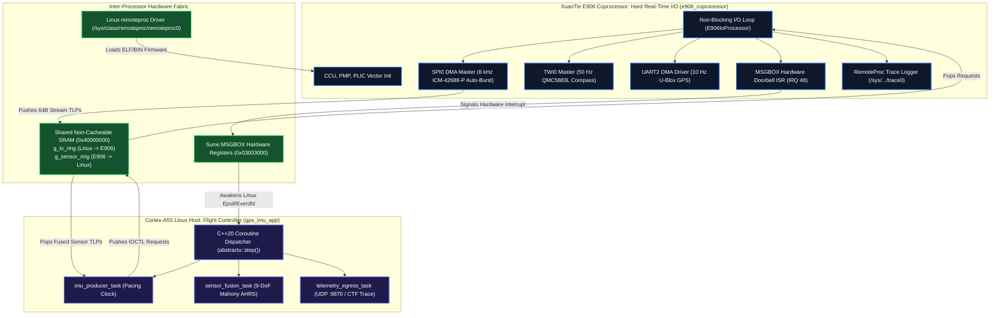

# Allwinner A5E & XuanTie E906 - `gps_imu_app` Deployment Guide

This guide provides step-by-step instructions for building, deploying via Linux `remoteproc`, and executing **`gps_imu_app`** on the **Allwinner Cubie A5E (Allwinner A5E SoC)** heterogeneous computing platform.

---

## 1. Heterogeneous Computing Architecture

The Allwinner A5E couples high-throughput Linux computing with hard real-time RISC-V coprocessing:



* **Cortex-A55 (Linux Host)**: Runs `gps_imu_app` as a PREEMPT_RT process. Consumes 64-byte sensor TLPs from the shared SRAM ring, executes the attitude estimation filter, and emits telemetry.
* **XuanTie E906 (Coprocessor)**: Runs `e906_coprocessor.bin`. Handles top-half SPI/TWI/UART interrupts and DMA descriptors, pushing parsed completion frames into shared SRAM and signaling `sun6i-msgbox`.

---

## 2. Hardware Peripheral & Bus Mapping

| Peripheral | Controller Base | PLIC IRQ | DRQ Ch | Function |
| :--- | :--- | :--- | :--- | :--- |
| **SPI0** | `0x04025000` | **54** | **22** | 10–20 MHz DMA Master to ICM-42688-P IMU |
| **TWI0 (I2C)** | `0x02502000` | **26** | — | 400 kHz Fast-Mode Master to QMC5883L Compass |
| **UART2** | `0x02500800` | **36** | **16** | 115200–921600 baud streaming GPS receiver |
| **UART0** | `0x02500000` | **34** | **14** | Diagnostic debug console |
| **MSGBOX** | `0x03003000` | **48** | — | Hardware inter-core doorbell signaling |
| **GPIO DRDY**| `0x02000000` | **82** | — | Rising-edge pin interrupt from IMU DRDY line |
| **SRAM A3/C**| `0x40000000` | — | — | Shared lock-free SPSC circular TLP rings |

---

## 3. Toolchain & Prerequisites

### 3.1 XuanTie RISC-V Toolchain (for E906)
```bash
export PATH="/home/tcmichals/.tools/xpack-riscv-none-elf-gcc-15.2.0-1/bin:$PATH"
export E906_LDSCRIPT="$(pwd)/targets/allwinner_e906/bsp/e906.ld"
```

### 3.2 AArch64 Host Toolchain (for Cortex-A55 Linux)
Compile natively on the Radxa Cubie A5E, or cross-compile using `aarch64-linux-gnu-g++`:
```bash
sudo apt-get install g++-aarch64-linux-gnu
```

---

## 4. Building the System

### 4.1 Step 1: Build the E906 Coprocessor Firmware
```bash
cmake --preset e906
cmake --build build_e906 -j$(nproc)
```
Outputs in `build_e906/apps/gps_imu_app/platforms/allwinner_e906/`:
* `e906_coprocessor.elf`: Target ELF file
* `e906_coprocessor.bin`: Raw flat binary for `remoteproc`
* `e906_coprocessor.map`: Linker section map

### 4.2 Step 2: Build the Linux Host `gps_imu_app`
```bash
cmake -B build_a55 -DCMAKE_BUILD_TYPE=Release -DABSTRACTX_TARGET=linux
cmake --build build_a55 --target gps_imu_app -j$(nproc)
```
Output: `build_a55/apps/gps_imu_app/gps_imu_app`.

### 4.3 Step 3: Compile the E906 RemoteProc Device Tree Overlay

The dedicated device tree overlay [`cubie_a5e_e906_overlay.dtso`](file:///home/tcmichals/ssdData/projects/home/AbstractX/apps/gps_imu_app/platforms/allwinner_e906/cubie_a5e_e906_overlay.dtso) performs critical silicon resource partitioning:
1. **Configures Clocks & Pins via UIO (Zero Driver Contention)**: Binds `&spi0`, `&spi1`, `&uart2`, `&i2c1`, and `&i2c3` to `generic-uio`. Linux automatically configures the pinctrl (pin multiplexing) and parent clock routing at boot, but does *not* bind native kernel drivers (`sun6i-spi`, `8250_dw`, `i2c-mv64xxx`). This guarantees the E906 coprocessor has exclusive, zero-collision hardware control over the ICM-42688-P IMU, secondary SPI, GPS serial stream, and magnetometer/barometer.
2. **Powers & Enumerates AIC8800 Wi-Fi 6**: Configures the fixed 3.3V regulators on PL7 (`reg_3v3_wifi`) and PM1 (`reg_wifi_en`) plus `&mmc1` SDIO host so Linux can stream CTF 1.8 UDP telemetry (:9870) and provide SSH access out-of-the-box.
3. **Carves Out Non-Cacheable Reserved Memory**:
   * **SRAM A3 Space 0** (`0x07280000` ARM64 physical / `0x3FFC0000` E906 local, 256 KB): Dedicated on-chip SRAM for E906 vector table, code execution, lock-free SPSC TLP rings (`g_tx_ring`, `g_sensor_ring`), and RemoteProc trace logging (`trace0`).
   * **DDR Shared DMA Pool** (`0x48000000`, 1 MB): Reserved non-cacheable DMA memory for virtio vrings and high-bandwidth burst transfers.
4. **Hardware Doorbell Wiring**: Enables `&msgbox` channels 8 and 9 for inter-core hardware doorbells between Linux and XuanTie E906.

#### 1. Install Device Tree Compiler (`dtc`)
On your host or directly on the Radxa Cubie A5E:
```bash
sudo apt-get update && sudo apt-get install -y device-tree-compiler
```

#### 2. Compile `.dtso` to `.dtbo`
Run the `dtc` compiler with dynamic symbol generation enabled:
```bash
dtc -@ -I dts -O dtb \
  -o apps/gps_imu_app/platforms/allwinner_e906/cubie_a5e_e906_overlay.dtbo \
  apps/gps_imu_app/platforms/allwinner_e906/cubie_a5e_e906_overlay.dtso
```

> [!IMPORTANT]
> **Why `-@` (or `--symbols`) is Mandatory**:
> Overlays reference labeled nodes defined in the base board device tree (`&spi0`, `&spi1`, `&uart2`, `&i2c3`, `&mmc1`, `&msgbox`, `&rproc`). The `-@` flag instructs `dtc` to generate the `__fixups__` and `__symbols__` metadata tables. Without `-@`, U-Boot and the Linux kernel cannot resolve external node references and will reject the overlay with `Failed to apply overlay` errors.

#### 3. Automated Compilation via CMake
Building the `e906` target automatically compiles the overlay if `dtc` is present on your system:
```bash
cmake --build build_e906 --target e906_dtbo
```

---

## 5. Loading the Device Tree Overlay & Starting RemoteProc

You can load and activate the device tree overlay on the Radxa Cubie A5E using either of the following methods:

### 5.1 Method A: Boot-Time Loading via U-Boot (Persistent / Recommended)

This method ensures the overlay is permanently applied on every system boot:

1. Copy the compiled `.dtbo` to the system overlay directory:
   ```bash
   sudo cp cubie_a5e_e906_overlay.dtbo /boot/dtb/overlay/
   # Note: On some distributions, the path is /boot/overlays/
   ```

2. Open your boot environment configuration (`/boot/uEnv.txt` or `/boot/armbianEnv.txt`):
   ```bash
   sudo nano /boot/uEnv.txt
   ```

3. Add or update the overlay entry:
   ```ini
   # For Radxa OS / U-Boot:
   user_overlays=cubie_a5e_e906_overlay

   # For Armbian / sunxi:
   # overlays=cubie_a5e_e906_overlay
   ```

4. Reboot the board to apply the new device tree:
   ```bash
   sudo reboot
   ```

---

### 5.2 Method B: Dynamic Runtime Loading via ConfigFS (Zero Reboot!)

Linux supports applying device tree overlays dynamically at runtime via Kernel ConfigFS without rebooting:

```bash
# 1. Mount configfs (if not already mounted)
sudo mount -t configfs none /sys/kernel/config 2>/dev/null || true

# 2. Create an overlay directory in configfs
sudo mkdir -p /sys/kernel/config/device-tree/overlays/e906

# 3. Stream the compiled DTBO into the dtbo attribute
sudo cat cubie_a5e_e906_overlay.dtbo | sudo tee /sys/kernel/config/device-tree/overlays/e906/dtbo

# 4. Verify that the overlay was applied successfully
cat /sys/kernel/config/device-tree/overlays/e906/status
# Expected output: "applied"
```

To remove or unload the overlay dynamically at runtime:
```bash
sudo rmdir /sys/kernel/config/device-tree/overlays/e906
```

---

### 5.3 Method C: Loading via `dtoverlay` CLI Tool

If your board runs Radxa OS or Armbian with the `dtoverlay` tool installed:
```bash
# Apply overlay immediately
sudo dtoverlay cubie_a5e_e906_overlay.dtbo

# Verify active overlays
sudo dtoverlay -l
```

---

### 5.4 Verifying Device Tree Application in Linux

Before starting the coprocessor, verify that the Linux kernel applied the resource partitioning:

1. **Verify Reserved Memory Carveout**:
   ```bash
   grep -E "40000000|48000000" /proc/iomem
   ```
   You should see `40000000-4003ffff : sram@40000000` reserved from general kernel allocation.

2. **Verify Linux Released Peripheral Control**:
   Check that `spi0` and `uart2` are disabled in the active Linux device tree so the E906 coprocessor has exclusive DMA ownership:
   ```bash
   cat /proc/device-tree/soc/spi@4025000/status
   # Output: "disabled"

   cat /proc/device-tree/soc/serial@2500800/status
   # Output: "disabled"
   ```

3. **Verify RemoteProc Driver Registration**:
   ```bash
   ls -la /sys/class/remoteproc/
   cat /sys/class/remoteproc/remoteproc0/name
   # Output will show the sunxi E906 remoteproc instance
   ```

---

### 5.5 Deploy Firmware & Start the XuanTie E906

1. Copy the compiled E906 coprocessor binary to `/lib/firmware/`:
   ```bash
   sudo cp e906_coprocessor.bin /lib/firmware/e906_coprocessor.bin
   ```

2. Point the RemoteProc subsystem to the firmware:
   ```bash
   # Stop coprocessor if previously running
   if [ "$(cat /sys/class/remoteproc/remoteproc0/state)" = "running" ]; then
       echo stop | sudo tee /sys/class/remoteproc/remoteproc0/state
   fi

   # Select firmware file
   echo e906_coprocessor.bin | sudo tee /sys/class/remoteproc/remoteproc0/firmware

   # Boot XuanTie E906 RISC-V core
   echo start | sudo tee /sys/class/remoteproc/remoteproc0/state
   ```

3. Confirm execution state:
   ```bash
   cat /sys/class/remoteproc/remoteproc0/state
   # Output: "running"
   ```

4. Read live boot diagnostics directly from kernel debugfs:
   ```bash
   sudo cat /sys/kernel/debug/remoteproc/remoteproc0/trace0
   ```
   Expected diagnostic output:
   ```text
   ================================================================
     AbstractX - XuanTie E906 RISC-V Co-Processor Ready!           
     Runtime: C++20 Coroutine + ETL Fixed Container Engine         
     Trace Buffer: /sys/kernel/debug/remoteproc/remoteproc0/trace0 
   ================================================================
   [E906 Boot] Hardware CCU Clocks & MSGBOX Doorbell Online
   [E906 Boot] SPI0 DMA & TWI0 Sensors Initialized
   ```

---

## 6. Running the Flight Application

Launch `gps_imu_app` on the Cortex-A55 Linux host:
```bash
sudo ./gps_imu_app
```

The application attaches to the shared SRAM ring at `0x40000000`, receives sensor frames, runs the 9-DoF attitude filter, and streams telemetry frames to UDP `:9870`.

---

## 7. Connecting Visualizers

Connect the visualization tools from your workstation over the local network:

```bash
# Replace 192.168.1.100 with your Cubie A5E IP address
python3 apps/gps_imu_app/tools/flight_display.py --host 192.168.1.100 --port 9870
python3 tools/visualizer/abstractx_studio.py --host 192.168.1.100 --port 9870
```
