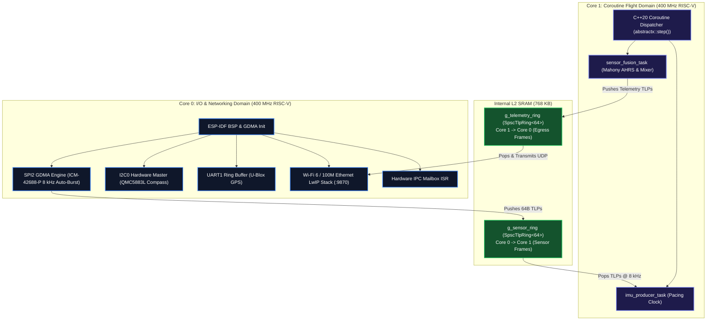

# Espressif ESP32-P4 - `gps_imu_app` Deployment & Debugging Guide

This guide details how to build, flash, debug via JTAG, and visualize live flight telemetry from **`gps_imu_app`** on the **Espressif ESP32-P4** dual-core 400 MHz RISC-V SoC.

---

## 1. Platform Architecture: Dual 400 MHz RISC-V Cores

The ESP32-P4 features dual high-performance RISC-V cores running at 400 MHz with single/double-precision hardware FPUs:



---

## 2. Hardware Pinout & Wiring

| Peripheral | Signal | ESP32-P4 GPIO | Description |
| :--- | :--- | :--- | :--- |
| **SPI2 (IMU Bus)** | `SCK` | **GPIO 7** | Serial Clock to ICM-42688-P (up to 24 MHz) |
| | `MOSI` | **GPIO 8** | Master Out Slave In |
| | `MISO` | **GPIO 9** | Master In Slave Out |
| | `CS_N` | **GPIO 10** | Active-Low Hardware Chip Select |
| **IMU Interrupt** | `DRDY` | **GPIO 6** / **Pin 3** | Data-Ready Rising Edge Interrupt |
| **I2C0 (Compass)** | `SDA` | **GPIO 4** | 400 kHz Fast Mode Data |
| | `SCL` | **GPIO 5** | 400 kHz Fast Mode Clock |
| **UART1 (GPS)** | `TX` | **GPIO 11** | ESP TX to GPS RX |
| | `RX` | **GPIO 12** | ESP RX from GPS TX |
| **Console UART** | `TX` / `RX` | **USB-Serial-JTAG** | Built-in USB Type-C Port |

---

## 3. Toolchain Setup (ESP-IDF v5.2+)

Install and export ESP-IDF with RISC-V support:
```bash
# Source the ESP-IDF environment
. $HOME/esp/esp-idf/export.sh

# Verify RISC-V compiler
riscv32-esp-elf-gcc --version
```

---

## 4. How to Compile & Flash

### 4.1 Set Target to ESP32-P4
```bash
idf.py set-target esp32p4
```

### 4.2 Configure Wi-Fi Credentials
Configure the network SSID and password for live UDP telemetry:
```bash
idf.py menuconfig
# Navigate to: Component config -> AbstractX Platform -> Wi-Fi Configuration
```

### 4.3 Build the Firmware
```bash
idf.py build
```

### 4.4 Flash and Monitor
Connect the ESP32-P4 via USB-C:
```bash
idf.py -p /dev/ttyACM0 flash monitor
```

---

## 5. On-Chip JTAG Debugging

The ESP32-P4 includes integrated USB-Serial-JTAG on the main USB port:

### 5.1 Start OpenOCD
```bash
openocd-esp32 -f board/esp32p4-builtin.cfg
```

### 5.2 Launch GDB
In a separate terminal:
```bash
riscv32-esp-elf-gdb -ex "target remote localhost:3333" build/gps_imu_app.elf
```

Or select **"ESP32-P4: JTAG Debug (GDB / OpenOCD)"** in VS Code and press **`F5`**.

---

## 6. Real-Time Telemetry Visualization

The ESP32-P4 broadcasts 64-byte CTF 1.8 frames over Wi-Fi 6 or Ethernet to UDP port **9870**:

```bash
# Connect visualizers across the Wi-Fi network (replace with ESP32-P4 IP)
python3 apps/gps_imu_app/tools/flight_display.py --host 192.168.1.150 --port 9870
python3 tools/visualizer/abstractx_studio.py --host 192.168.1.150 --port 9870
```
