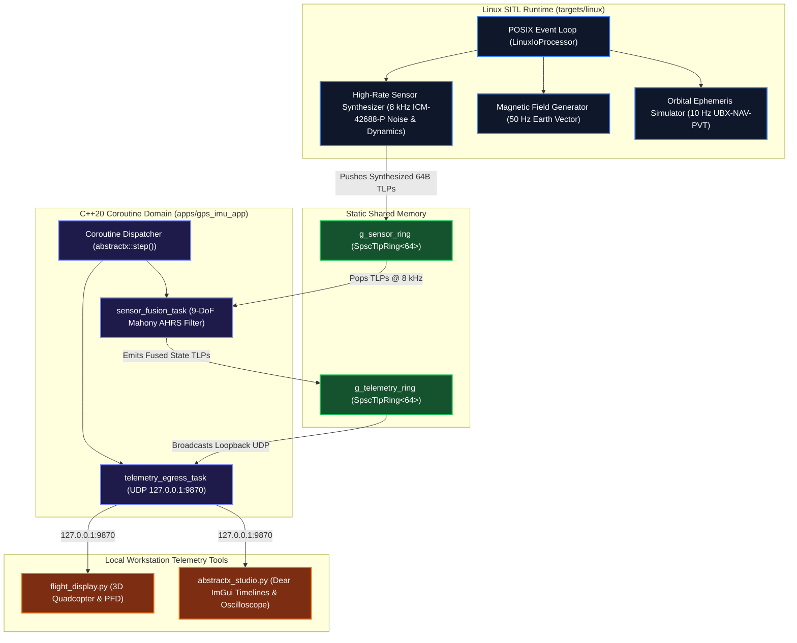

# Linux Host & SITL Simulation - `gps_imu_app` Development Guide

This guide details how to build, run, test, and visualize **`gps_imu_app`** natively on a **Linux Workstation (x86_64 or AArch64)** using the **Software-In-The-Loop (SITL)** target.

---

## 1. Architectural Role: Zero-Hardware Workstation Simulation

The Linux SITL target allows developers to run the exact same `main.cpp` flight code on a developer laptop or in CI pipelines with **zero physical sensors or microcontrollers connected**:



---

## 2. Prerequisites

Requires a modern C++20 toolchain on Ubuntu / Debian / Fedora / Arch:
```bash
sudo apt-get update && sudo apt-get install -y \
    build-essential \
    cmake \
    git \
    python3 \
    python3-pip
```

Python visualization libraries:
```bash
pip install -r tools/visualizer/requirements.txt
```

---

## 3. How to Compile

### 3.1 Fast Compilation via CMake Preset
```bash
cmake --preset host
cmake --build build_host -j$(nproc)
```

### 3.2 Manual CMake Invocation
```bash
cmake -B build -DCMAKE_BUILD_TYPE=Release
cmake --build build --target gps_imu_app -j$(nproc)
```

---

## 4. Running the SITL Application

Launch the native binary:
```bash
./build/apps/gps_imu_app/gps_imu_app
```

### Expected Console Output
```text
========================================================
  AbstractX - Multi-Rate Flight Controller & AHRS Node   
  Structured Concurrency + Channel-Based Sensor Fusion  
========================================================
[AbstractX Boot] Parallel hardware initialization (when_all: SPI IMU + UART GPS + I2C Mag)...
[AbstractX Boot] Hardware Status: IMU=OK, GPS=OK, MAG=OK
[AbstractX AHRS #1] Roll:  -0.1° | Pitch:  +7.1° | Yaw:  21.8° (Mag:  21.8°) | Alt: 142.5m | Spd:  2.4 m/s | IMU: 5821, Mag: 50, GPS: 10 | Egress: 582 pkts
[AbstractX AHRS #2] Roll:  -0.0° | Pitch:  +7.1° | Yaw:  21.8° (Mag:  21.8°) | Alt: 142.5m | Spd:  2.4 m/s | IMU: 11642, Mag: 100, GPS: 20 | Egress: 1164 pkts
[AbstractX AHRS #3] Roll:  +0.0° | Pitch:  +7.1° | Yaw:  21.8° (Mag:  21.8°) | Alt: 142.5m | Spd:  2.4 m/s | IMU: 17463, Mag: 150, GPS: 30 | Egress: 1746 pkts
```

The node transmits self-describing 64-byte CTF 1.8 packets over localhost UDP (`127.0.0.1:9870`).

---

## 5. Visualizing Telemetry in Real-Time

With `gps_imu_app` running in one terminal, open a second terminal and launch either visualizer:

### Option A: 3D Quadcopter & Primary Flight Display
```bash
python3 apps/gps_imu_app/tools/flight_display.py
```
Displays:
* Live artificial horizon and pitch ladder
* Real-time 3D rotating quadcopter perspective wireframe
* Vertical altimeter and airspeed scrolling tapes
* Motor mixer throttle bars ($M_1..M_4$)

### Option B: AbstractX Studio (High-Performance Dear ImGui)
```bash
python3 tools/visualizer/abstractx_studio.py
```
Displays:
* Microsecond coroutine Gantt execution timelines
* 8 kHz IMU accelerometer and gyroscope oscilloscope
* Lock-free SPSC ring buffer depth and queue saturation meters

---

## 6. Running Verification Tests & Spec Audits

Run the full 23-test CTest regression suite:
```bash
ctest --test-dir build --output-on-failure
```

Audit 100% specification-to-code traceability:
```bash
python3 tools/audit_specs.py apps/gps_imu_app/SPECIFICATION.md
```
