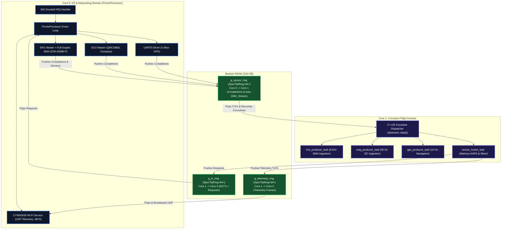

# Raspberry Pi Pico 2 W (RP2350) - `gps_imu_app` Deployment & Debugging Guide

This guide provides step-by-step instructions for building, flashing, debugging via SWD, and visualizing live flight telemetry from **`gps_imu_app`** on the **Raspberry Pi Pico 2 W (RP2350)**.

---

## 1. Platform Architecture: Dual-Core ioProcessor Model

On the Pico 2 W, `gps_imu_app` executes across both ARM Cortex-M33 cores using AbstractX's zero-blocking architecture:



---

## 2. Hardware Pinout & Wiring

### 2.1 Sensor Matrix Connections

| Sensor | Peripheral | Signal | Pico 2 W GPIO | Physical Pin | Notes |
| :--- | :--- | :--- | :--- | :--- | :--- |
| **ICM-42688-P** | **SPI1** | `SCK` | **GP10** | Pin 14 | Clock (10–24 MHz) |
| | | `MOSI` | **GP11** | Pin 15 | Data In to Sensor |
| | | `MISO` | **GP12** | Pin 16 | Data Out to Pico |
| | | `CS_N` | **GP13** | Pin 17 | Active-Low Chip Select |
| | **GPIO** | `DRDY` | **GP20** / **Pin 3** | Pin 26 / 3 | Rising Edge Interrupt (Auto-DMA) |
| **QMC5883L** | **I2C0** | `SDA` | **GP4** | Pin 6 | 400 kHz Fast Mode |
| | | `SCL` | **GP5** | Pin 7 | 400 kHz Fast Mode |
| **U-Blox M10** | **UART0** | `TX` (Pico TX) | **GP0** | Pin 1 | Commands to GPS |
| | | `RX` (Pico RX) | **GP1** | Pin 2 | UBX-NAV-PVT stream |
| **Power** | — | `3V3(OUT)` | — | Pin 36 | Clean 3.3V power |
| | — | `GND` | — | Pin 38 | System Ground |

### 2.2 SWD Debug & UART Console Wiring

Connect your **Raspberry Pi Debug Probe** (or CMSIS-DAP debugger) to the 3-pin JST-SH port:
* **Pin 1 (Left / Square Pad)**: `SWCLK` (Probe Orange / D-)
* **Pin 2 (Center Pad)**: `GND` (Probe Black)
* **Pin 3 (Right Pad)**: `SWDIO` (Probe Yellow / D+)

For serial console logging:
* Pico `GP0` (TX) $\to$ Debug Probe `RX`
* Pico `GP1` (RX) $\to$ Debug Probe `TX`
* Serial baud: **115200 8N1**

---

## 3. Environment & Prerequisites

Ensure your environment variables are configured:
```bash
export PICO_SDK_PATH="/home/tcmichals/.tools/pico/pico-sdk"
export PATH="/home/tcmichals/.tools/xpack-arm-none-eabi-gcc-15.2.1-1.1/bin:$PATH"
```

---

## 4. How to Compile

### 4.1 Debug Build (Recommended for Development)
Debug mode retains full DWARF-5 debug information (`-g3`) and coroutine frame pointers across `co_await`:

```bash
# Configure with optional Wi-Fi credentials for live telemetry
cmake --preset pico2w-debug -DWIFI_SSID="MyFlightRouter" -DWIFI_PASSWORD="SecretPassword"

# Compile with parallel workers
cmake --build build_pico2w_debug -j$(nproc)
```

Generated outputs in `build_pico2w_debug/apps/gps_imu_app/`:
* `gps_imu_app.elf`: Debug binary with symbols (used by GDB/OpenOCD)
* `gps_imu_app.uf2`: Drag-and-drop binary for BOOTSEL flashing
* `gps_imu_app.bin`: Raw flash binary

### 4.2 Release Build (Maximum Optimization)
```bash
cmake --preset pico2w
cmake --build build_pico2w -j$(nproc)
```

---

## 5. Flashing and Debugging

### Method 1: 1-Click VS Code Debugging (`F5`)
1. Open AbstractX in VS Code.
2. Select **"Pico 2 W: SWD Debug (Cortex-Debug)"** from the Run & Debug view (`Ctrl+Shift+D`).
3. Press **`F5`**. VS Code will automatically compile `build_pico2w_debug`, flash the board via OpenOCD, and halt at `main()`.
4. Inspect Coroutine execution on Core 1 and I/O DMA on Core 0 simultaneously.

### Method 2: Command-Line SWD Flash
```bash
/home/tcmichals/.tools/oss-cad-suite/bin/openocd \
  -s /home/tcmichals/.tools/oss-cad-suite/share/openocd/scripts \
  -f interface/cmsis-dap.cfg \
  -f target/rp2350.cfg \
  -c "adapter speed 5000" \
  -c "program build_pico2w_debug/apps/gps_imu_app/gps_imu_app.elf verify reset exit"
```

### Method 3: USB BOOTSEL Drag-and-Drop
1. Hold the white **BOOTSEL** button and plug in the Pico 2 W USB cable.
2. Copy `build_pico2w_debug/apps/gps_imu_app/gps_imu_app.uf2` to the mounted `RPI-RP2` drive:
   ```bash
   cp build_pico2w_debug/apps/gps_imu_app/gps_imu_app.uf2 /media/$USER/RPI-RP2/
   ```

---

## 6. Running Live Telemetry Visualizers

The Pico 2 W streams 64-byte CTF 1.8 binary frames over UDP to port **9870**:

```bash
# 1. 3D Quadcopter & Primary Flight Display
python3 apps/gps_imu_app/tools/flight_display.py --port 9870

# 2. AbstractX Studio (Gantt Timelines & 8 kHz Oscilloscope)
python3 tools/visualizer/abstractx_studio.py --port 9870
```
