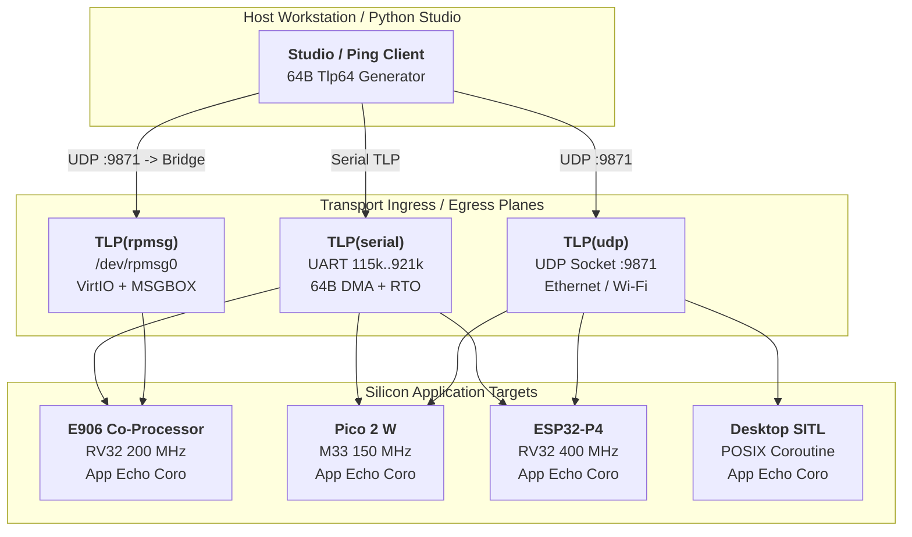

# AbstractX Serial Loopback & Profiler Application Specification

This document is the **Single Source of Truth (SSOT)** for all architectural
contracts, wire formats, hardware invariants, and requirements for the
**AbstractX Serial Loopback & Profiler Reference Application**
(`apps/serial_loopback_app/`).

Each requirement carries a unique **Design ID (`[SPEC-LOOP-*]`)** directly
traceable in implementation files via `// @impl [SPEC-LOOP-*]`.

---

## 1. Application Overview & Scope

The `serial_loopback_app` is the foundational reference application for
validating the AbstractX C++20 coroutine runtime, hardware threshold-balanced
serial drivers, and bi-directional host telemetry across all target platforms:
1. **Universal Portability**: Compiles without application `#ifdef`s across
   Allwinner E906 (T527), Raspberry Pi Pico 2 W (RP2350), ESP32-P4, and Linux.
2. **Threshold-Balanced I/O**: Direct CPU FIFO for frames `<= 32` bytes vs.
   hardware DMA engines for bulk bursts `> 32` bytes.
3. **Pure Asynchrony**: Zero CPU busy-polling; tasks suspend in `~18 ns` and
   wake on hardware interrupts in `< 25 ns`.
4. **CTF 1.8 / barectf Telemetry**: Emits binary trace packets into on-chip
   SRAM and streams them to the AbstractX Observability Studio.
5. **Hardware CPU Profiling**: Live microsecond calculation of CPU Active%
   versus low-power `wfi` sleep states.
6. **Application-Level Ping (TLP)**: Ping packets route directly up to the
   application coroutine as 64-byte `Tlp64` structures, measuring true
   end-to-end stack latency.

---

## 2. Multi-Target Ping & Command Topologies



### Invariant Rules:
1. **Zero Dynamic Memory Allocation**: No `malloc`, `free`, or `operator new`
   during execution. All queues, coroutines, and buffers are statically sized.
2. **Zero Synchronous Polling**: Drivers MUST expose awaitable C++20 coroutine
   primitives (`async_read_packet()`, `async_write()`).
3. **Zero Application `#ifdef` Directives**: Top-level coroutine tasks in
   `src/main.cpp` MUST compile unmodified across all target platforms.
4. **App-Layer Ping Termination**: Ping messages are NOT consumed or dropped
   inside intermediate drivers; they MUST route to the top-level coroutine.

---

## 3. 64-Byte TLP Wire Contract (`asp_tlp64_t`)

All diagnostic packets, pings, and telemetry events conform strictly to the
portable 64-byte `Tlp64` structure defined in `asp_tlp64.h`:

```text
 0                   1                   2                   3
 0 1 2 3 4 5 6 7 8 9 0 1 2 3 4 5 6 7 8 9 0 1 2 3 4 5 6 7 8 9 0 1
+-+-+-+-+-+-+-+-+-+-+-+-+-+-+-+-+-+-+-+-+-+-+-+-+-+-+-+-+-+-+-+-+
|      Type     |     Flags     |      Tag      |    Channel    | DW0 (0..3)
+-+-+-+-+-+-+-+-+-+-+-+-+-+-+-+-+-+-+-+-+-+-+-+-+-+-+-+-+-+-+-+-+
|                     Target Address (Device ID)                | DW1 (4..7)
+-+-+-+-+-+-+-+-+-+-+-+-+-+-+-+-+-+-+-+-+-+-+-+-+-+-+-+-+-+-+-+-+
|           Length DW           |            Sequence           | DW2 (8..11)
+-+-+-+-+-+-+-+-+-+-+-+-+-+-+-+-+-+-+-+-+-+-+-+-+-+-+-+-+-+-+-+-+
|                     Timestamp (Nanoseconds)                   | DW3..4
|                                                               |     (12..19)
+-+-+-+-+-+-+-+-+-+-+-+-+-+-+-+-+-+-+-+-+-+-+-+-+-+-+-+-+-+-+-+-+
|                                                               | DW5..14
|                     Payload Data (40 Bytes)                   |     (20..59)
|                                                               |
+-+-+-+-+-+-+-+-+-+-+-+-+-+-+-+-+-+-+-+-+-+-+-+-+-+-+-+-+-+-+-+-+
|                      CRC32 (IEEE 802.3)                       | DW15(60..63)
+-+-+-+-+-+-+-+-+-+-+-+-+-+-+-+-+-+-+-+-+-+-+-+-+-+-+-+-+-+-+-+-+
```

### 3.1 Field Definitions

| Byte Offset | Field Name | Type | Scale | Unit | Description |
| :--- | :--- | :--- | :--- | :--- | :--- |
| `0` | `type` | `uint8` | 1.0 | — | Opcode: `0x01`=Req, `0x03`=Cpl |
| `1` | `flags` | `uint8` | 1.0 | — | `0x00`=OK, `0x01`=Err/AckReq |
| `2` | `tag` | `uint8` | 1.0 | — | Split-transaction correlation ID |
| `3` | `channel` | `uint8` | 1.0 | — | `0x01`=Control, `0x04`=Debug |
| `4..7` | `target_addr` | `uint32`| 1.0 | — | Device Address / Subcommand |
| `8..9` | `length_dw` | `uint16`| 1.0 | DW | Valid payload DWORDs (0..10) |
| `10..11` | `sequence` | `uint16`| 1.0 | — | Monotonic sequence number |
| `12..19` | `timestamp_ns`| `uint64`| 1.0 | ns | 64-bit hardware timestamp |
| `20..59` | `payload` | `uint8[40]`| 1.0 | — | Echo data / Diagnostic stats |
| `60..63` | `crc32` | `uint32`| 1.0 | — | IEEE 802.3 Frame Check |

### 3.2 TLP Ping Request & Completion Flow

1. **Host Ping Request (`TlpType::MemRead` = 0x01)**:
   - `type`: `0x01` (`MemRead` / Ping Request)
   - `tag`: Transaction identifier generated by host (0..255)
   - `timestamp_ns`: Host transmit nanosecond timestamp
   - `payload`: Opaque test pattern (up to 40 bytes)
   - `crc32`: IEEE 802.3 checksum computed over bytes `0..59`

2. **Application Ping Echo (`TlpType::Completion` = 0x03)**:
   - `type`: `0x03` (`Completion` / Ping Echo)
   - `flags`: `0x00` (`ASP_STATUS_OK`)
   - `tag`: Mirrored unmodified from request
   - `sequence`: Target monotonic echo counter
   - `timestamp_ns`: Target hardware timestamp upon echo dispatch
   - `payload`: Mirrored request payload or live telemetry metrics
   - `crc32`: Recomputed IEEE 802.3 checksum

---

## 4. Normative Specification Requirements Matrix

### `[SPEC-LOOP-01]` Zero-Allocation C++20 Coroutine Loopback
The application MUST implement serial reception and echo exclusively using
asynchronous C++20 coroutines (`co_await`), drawing coroutine frames from
statically sized memory pools with 0 heap bytes allocated.

### `[SPEC-LOOP-02]` Threshold-Balanced Serial I/O
The serial driver MUST balance latency versus bandwidth:
* Packets `<= 32` bytes MUST write directly to hardware FIFO without DMA.
* Packets `> 32` bytes MUST stream via hardware DMA and suspend calling tasks.

### `[SPEC-LOOP-03]` Receiver Timeout (RTO) Non-Blocking Framing
Variable-length packets MUST be detected via hardware Receiver Timeout (RTO)
after 4 character times of idle line detection, resuming the coroutine with
exact packet length and zero CPU byte-copying.

### `[SPEC-LOOP-04]` Universal Multi-Target Portability
The core loopback logic in `src/main.cpp` MUST compile and run unmodified
across XuanTie E906, RP2350, ESP32-P4, and Linux with zero `#ifdef` directives.

### `[SPEC-LOOP-05]` 64-Byte TLP Wire Contract
Telemetry, commands, and ping events MUST be packaged into 64-byte `Tlp64`
packets satisfying `alignas(64)` and containing IEEE 802.3 CRC32 verification.

### `[SPEC-LOOP-06]` barectf CTF 1.8 Telemetry Compliance
Diagnostic events MUST conform to the barectf Common Trace Format 1.8 schema,
enabling automated ingestion by the AbstractX Observability Studio.

### `[SPEC-LOOP-07]` Hardware Performance Counter Cycle Profiling
The application MUST read hardware cycle counters (`mcycle`/`minstret`) every
1000 ms to compute CPU active time versus low-power `wfi` sleep time.

### `[SPEC-LOOP-08]` End-to-End App-Layer TLP Ping Protocol
Ping requests MUST route directly to the top-level application coroutine,
which verifies CRC32, stamps execution latency, and emits a `Tlp64` Completion
packet back over the ingress transport.

### `[SPEC-LOOP-09]` Multi-Transport Ingress/Egress Abstraction
The application coroutine MUST interact with transport channels via abstract
SPSC rings (`SpscTlpRing<64>`), decoupling the app from the physical transport
(UART serial, Linux RPMSG VirtIO, or UDP socket).

---

## 5. Traceability Matrix

| Requirement | Description | Implementing Source Target |
| :--- | :--- | :--- |
| `[SPEC-LOOP-01]` | Zero-Allocation Coroutines | `src/main.cpp` |
| `[SPEC-LOOP-02]` | Threshold-Balanced I/O | `platforms/e906/main.cpp` |
| `[SPEC-LOOP-03]` | UART RTO Packet Framing | `platforms/e906/main.cpp` |
| `[SPEC-LOOP-04]` | Multi-Target Portability | `src/main.cpp` |
| `[SPEC-LOOP-05]` | 64-Byte TLP Contract | `platforms/e906/main.cpp` |
| `[SPEC-LOOP-06]` | barectf CTF 1.8 Trace | `platforms/e906/main.cpp` |
| `[SPEC-LOOP-07]` | Hardware CPU Profiler | `platforms/e906/main.cpp` |
| `[SPEC-LOOP-08]` | App-Layer Ping Protocol | `src/main.cpp` |
| `[SPEC-LOOP-09]` | Multi-Transport Rings | `src/main.cpp` |
