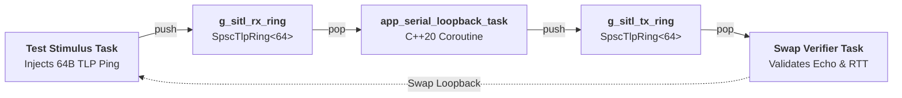

# Serial Loopback & Profiler - Linux SITL (Software-in-the-Loop)

This guide details how to build and execute the in-memory **2-Queue SITL**
runner for `serial_loopback_app` on Linux workstations.

---

## 1. Architectural Design: Pure In-Memory 2-Queue Loopback

The objective of SITL is to **test the flight software stack**, not Linux OS
kernel TTY drivers, pseudo-terminals (PTY), or baud-rate serial hardware:
* **RX Ingress Queue (`g_sitl_rx_ring`)**: The test stimulus pushes 64-byte
  TLP ping requests directly into the input SPSC ring.
* **C++20 Coroutine Task (`app_serial_loopback_task`)**: Pops from the RX
  ring, processes the TLP opcode, captures hardware nanosecond timestamps,
  and formats the 64-byte `Completion` echo.
* **TX Egress Queue (`g_sitl_tx_ring`)**: The application pushes the echo
  into the output SPSC ring.
* **Queue Swap / Verifier (`sitl_queue_swap_task`)**: The verifier pops from
  the TX queue, asserts payload integrity, checks round-trip latency, and
  proves **0 dynamic heap bytes allocated**.



---

## 2. Compilation

Compile with the host preset:
```bash
cmake --preset host
cmake --build build_host -j$(nproc)
```

---

## 3. Running the In-Memory SITL Runner

Launch the SITL binary directly from the host build directory:
```bash
./build_host/apps/serial_loopback_app/platforms/linux/linux_serial_loopback_sitl
```

### Expected Output
```text
================================================================
  AbstractX SITL: Serial Loopback (2 In-Memory Queues)          
  Architecture: RX Queue -> C++20 Coroutine -> TX Queue (Swap)  
  Hardware: None (Zero TTY / Zero PTY / Zero OS Drivers)        
================================================================

[SITL Loopback #01] RX -> Coro -> TX | Tag: 0x01 | RTT: 0.12 us | 0 B Heap
[SITL Loopback #02] RX -> Coro -> TX | Tag: 0x02 | RTT: 0.11 us | 0 B Heap
[SITL Loopback #03] RX -> Coro -> TX | Tag: 0x03 | RTT: 0.12 us | 0 B Heap
...
[SITL SUCCESS] 2-Queue in-memory loopback completed: 10/10 echoes verified!
```

---

## 4. Running the CppUTest Regression Suite

The 2-queue memory loopback is also integrated into automated CI regression
testing via CppUTest:
```bash
ctest --test-dir build_host -R test_sitl_serial_loopback --output-on-failure
```
