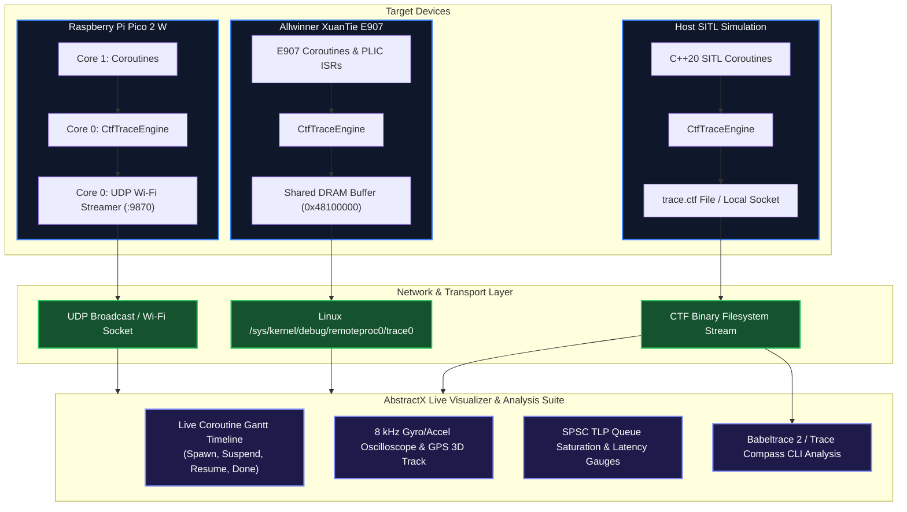

# AbstractX barectf Common Trace Format (CTF) & Live Visualizer Architecture

This document defines the **barectf-compatible Common Trace Format (CTF 1.8)** tracing subsystem and the **AbstractX Live Visualizer** architecture for real-time observability across all target platforms (Raspberry Pi Pico 2 W, XuanTie E907, ESP32-P4, and Host SITL).

---

## 1. System Architecture Overview



---

## 2. barectf Common Trace Format (CTF 1.8) Standard

Trace packets are formatted in accordance with the Common Trace Format (CTF 1.8) specification defined in [`trace/barectf_config.yaml`](file:///home/tcmichals/projects/AbstractX/trace/barectf_config.yaml):

### A. Packet Header (32 bytes)
Every trace packet begins with the standard CTF header:
```
 0                   1                   2                   3
 0 1 2 3 4 5 6 7 8 9 0 1 2 3 4 5 6 7 8 9 0 1 2 3 4 5 6 7 8 9 0 1
+-+-+-+-+-+-+-+-+-+-+-+-+-+-+-+-+-+-+-+-+-+-+-+-+-+-+-+-+-+-+-+-+
|                     Magic (0xC1FC1FC1)                        |
+-+-+-+-+-+-+-+-+-+-+-+-+-+-+-+-+-+-+-+-+-+-+-+-+-+-+-+-+-+-+-+-+
|   Stream ID   |                    Reserved                   |
+-+-+-+-+-+-+-+-+-+-+-+-+-+-+-+-+-+-+-+-+-+-+-+-+-+-+-+-+-+-+-+-+
|                      Packet Size (Bits)                       |
+-+-+-+-+-+-+-+-+-+-+-+-+-+-+-+-+-+-+-+-+-+-+-+-+-+-+-+-+-+-+-+-+
|                      Content Size (Bits)                      |
+-+-+-+-+-+-+-+-+-+-+-+-+-+-+-+-+-+-+-+-+-+-+-+-+-+-+-+-+-+-+-+-+
|                   Timestamp Begin (Microseconds)              |
|                                                               |
+-+-+-+-+-+-+-+-+-+-+-+-+-+-+-+-+-+-+-+-+-+-+-+-+-+-+-+-+-+-+-+-+
|                    Timestamp End (Microseconds)               |
|                                                               |
+-+-+-+-+-+-+-+-+-+-+-+-+-+-+-+-+-+-+-+-+-+-+-+-+-+-+-+-+-+-+-+-+
|                    Events Discarded Count                     |
+-+-+-+-+-+-+-+-+-+-+-+-+-+-+-+-+-+-+-+-+-+-+-+-+-+-+-+-+-+-+-+-+
```

### B. Event Streams

1. **Stream 0: Coroutines (`StreamId::Coroutine`)**:
   - `coro_state`: Tracks `task_id`, `handle_addr`, and state (`Spawn`, `Suspend`, `Resume`, `Done`) with suspend reason (`Timer`, `SPI`, `UART`, `Mailbox`, `Queue`).
2. **Stream 1: Telemetry (`StreamId::Telemetry`)**:
   - `imu_sample`: 8 kHz Gyro XYZ ($\text{dps} \times 10$), Accel XYZ ($g \times 1000$), Temperature ($^\circ\text{C} \times 100$).
   - `gps_fix`: Latitude/Longitude ($10^{-7}\ \text{deg}$), Altitude ($\text{mm}$), Ground Speed ($\text{mm/s}$), Satellites, Fix Type.
3. **Stream 2: HAL & TLP (`StreamId::HalTlp`)**:
   - `tlp_push` / `tlp_pop`: Tag, Channel, Virtual Address, Length DW.
   - `hal_io`: Peripheral ID, bytes transferred, duration, status code.

---

## 3. Multi-Target Transport Implementation

### A. Raspberry Pi Pico 2 W (UDP over Wi-Fi)
- **Core 0** runs the `pico_cyw43_arch` polling loop.
- Trace packets committed by the `CtfTraceEngine` are placed in the UDP transmit queue.
- Core 0 broadcasts packets over UDP to **Port 9870** (target broadcast `255.255.255.255`).

### B. XuanTie E907 (Shared DRAM Ring Carveout)
- Configured via `bsp/e907_ddr.ld` utilizing **512 KB SRAM A3** + **1 MB non-cacheable DRAM** at `0x48100000`.
- E907 writes trace packets continuously to the DRAM ring buffer.
- Linux kernel host reads trace stream via `/sys/kernel/debug/remoteproc/remoteproc0/trace0` or user-space `mmap()`.

### C. Host Workstation SITL
- Flushes packets directly to `build_host/trace.ctf` for immediate inspection with `babeltrace2`:
  ```bash
  babeltrace2 build_host/trace.ctf
  ```

---

## 4. AbstractX Live Visualizer Dashboard Features

The visualizer connects to UDP Port 9870 (or reads local CTF streams) to render:

1. **Live Coroutine Gantt Execution Chart**:
   - Horizontal bars representing each coroutine (`imu_task`, `gps_task`, `heartbeat_task`).
   - Color codes: **Green** (Running), **Yellow** (Suspended / Waiting on I/O), **Purple** (Yielded to Timer).
2. **Real-Time Sensor Oscilloscope**:
   - High-rate 8 kHz Accel/Gyro time series graphs.
   - 3D flight trajectory and orientation quaternion cube.
3. **Queue Saturation & Latency Gauges**:
   - Live watermark level for `g_sensor_ring` and `g_telemetry_ring`.
   - Dispatch latency histograms ($< 2\ \mu\text{s}$ target).
