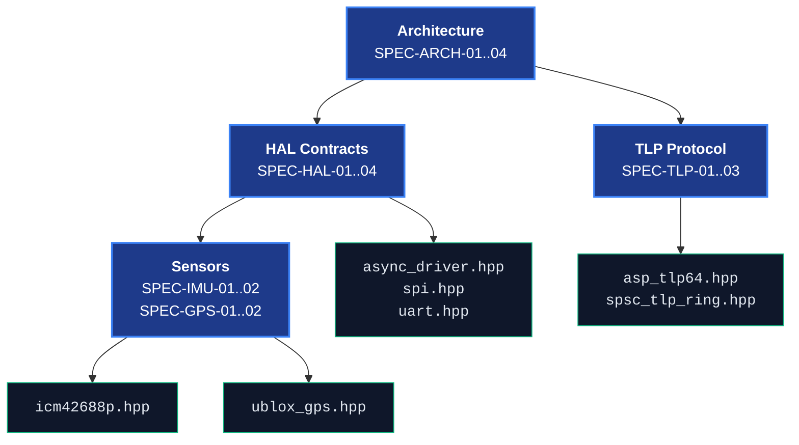

# AbstractX Design Specification & Requirements Matrix

This document is the **Single Source of Truth (SSOT)** for all architectural requirements, TLP packet definitions, HAL driver contracts, and sensor interfaces in AbstractX.

Each requirement carries a unique **Design ID (`[SPEC-*]`)** that is directly referenced by implementation files via `// @impl [SPEC-*]`.

---

## 1. System Architecture Specifications (`SPEC-ARCH`)

### `[SPEC-ARCH-01]` Split-Transaction Asynchronous I/O Pipeline
* **Requirement**: All physical peripheral interactions (SPI, UART, I2C, Timers) must be decoupled from the application thread using a split-transaction request/completion model.
* **Mechanism**: Input Queue (Request) $\rightarrow$ Hardware DMA / ISR $\rightarrow$ Output Queue (Completion) $\rightarrow$ Coroutine Resumption.
* **Implementation Target**: `include/abstractx/hal/async_driver.hpp`

### `[SPEC-ARCH-02]` Zero Dynamic Memory Allocation (0 B Heap)
* **Requirement**: No dynamic memory (`malloc`, `free`, `operator new`) is permitted in real-time execution paths.
* **Mechanism**: Coroutine frames draw from static atomic frame pools (`CoroutineStaticPool`), queues use fixed-capacity ETL rings (`etl::queue_spsc_isr`).
* **Implementation Target**: `include/asp_coro.hpp`, `include/abstractx/domain_dispatcher.hpp`

### `[SPEC-ARCH-03]` Universal Multi-Target Application Portability
* **Requirement**: Top-level flight control and telemetry logic (`FlightApp` / `inav-abstractx`) must compile unmodified across Linux SBCs, Raspberry Pi Pico 2 W, ESP32-P4, and Desktop SITL.
* **Implementation Target**: `examples/gps_imu_flight_node.cpp`, `apps/`

### `[SPEC-ARCH-04]` Heterogeneous Co-Processor Interconnect (E907 + Linux)
* **Requirement**: Allwinner XuanTie E907 operates as a dedicated I/O coprocessor servicing 8 kHz SPI DMA and GPS UART, delivering timestamped 64B TLPs into shared SRAM A3/C (`0x40000000`) for Linux `remoteproc` consumers.
* **Implementation Target**: `targets/allwinner_e907/`, `apps/e907_coprocessor/`

---

## 2. 64-Byte Transaction Layer Packet (TLP) Specifications (`SPEC-TLP`)

### `[SPEC-TLP-01]` 64-Byte Wire Format & Alignment
* **Requirement**: All inter-core and inter-process messages must strictly match the 64-byte `asp_tlp64_t` layout (`alignas(64)`).
* **Wire Fields**: `type` (1B), `tag` (1B), `channel` (1B), `length_dw` (2B), `target_address` (4B), `timestamp_ns` (8B), `payload` (32B).
* **Implementation Target**: `include/asp_tlp64.hpp`, `include/asp_tlp64.h`

### `[SPEC-TLP-02]` Memory-Mapped Virtual Addressing & Routing
* **Requirement**: Sensor and actuator requests must target virtual BAR memory regions (`IMU_BASE = 0x40000100`, `GPS_BASE = 0x40000300`), remaining transport-agnostic.
* **Implementation Target**: `include/pcie_bar_map.hpp`

### `[SPEC-TLP-03]` Lock-Free SPSC TLP Ring Transport
* **Requirement**: Inter-core and inter-domain FIFO queues must operate lock-free via single-producer single-consumer rings with atomic head/tail pointers.
* **Implementation Target**: `include/spsc_tlp_ring.hpp`

---

## 3. Hardware Abstraction Layer Specifications (`SPEC-HAL`)

### `[SPEC-HAL-01]` DMA/ISR Split-Queue Driver Base
* **Requirement**: `AsyncDriverBase<TReq, TRes, Depth>` must manage dual ETL `queue_spsc_isr` rings with nesting-aware `InterruptLock` masking.
* **Implementation Target**: `include/abstractx/hal/async_driver.hpp`

### `[SPEC-HAL-02]` Asynchronous SPI / Dual-SPI DMA Interface
* **Requirement**: `AsyncSpiDriver` must support single-channel and dual-channel high-speed SPI transactions with `co_await transfer_async()`.
* **Implementation Target**: `include/abstractx/hal/spi.hpp`

### `[SPEC-HAL-03]` Asynchronous UART Streaming & Framing Interface
* **Requirement**: `AsyncUartDriver` must provide interrupt/DMA driven non-blocking RX byte streaming and `co_await write_async()` packet ingestion.
* **Implementation Target**: `include/abstractx/hal/uart.hpp`

### `[SPEC-HAL-04]` Inter-Core Mailbox & Doorbell Interface
* **Requirement**: `AsyncMailboxDriver` must handle hardware cross-core doorbells (MSGBox on Allwinner, SIO on RP2350, IPC on ESP32-P4) with `co_await notify_async()`.
* **Implementation Target**: `include/abstractx/hal/mailbox.hpp`

---

## 4. Sensor Driver Specifications (`SPEC-IMU` & `SPEC-GPS`)

### `[SPEC-IMU-01]` ICM-42688-P 8 kHz SPI DMA Auto-Read
* **Requirement**: Read 15-byte burst (`Temp[1..2]`, `Accel_XYZ[3..8]`, `Gyro_XYZ[9..14]`) on `DRDY` edge, convert to float $g$ and $\text{deg/s}$, and emit `Tlp64::make_cpl_d(0x01, payload)`.
* **ODR & Scaling**: Gyro $\pm 2000\ \text{dps}$ ($16.4\ \text{LSB/dps}$), Accel $\pm 16g$ ($2048\ \text{LSB/g}$).
* **Implementation Target**: `include/abstractx/drivers/imu/icm42688p.hpp`

### `[SPEC-IMU-02]` ICM-42688-P Coroutine Awaiter
* **Requirement**: `co_await imu.next_sample_async()` suspends the calling task with zero CPU polling until the SPI DMA completes.
* **Implementation Target**: `include/abstractx/drivers/imu/icm42688p.hpp`

### `[SPEC-GPS-01]` U-Blox UBX-NAV-PVT Binary Parser
* **Requirement**: Zero-allocation streaming byte parser for UBX Class `0x01`, ID `0x07` (92-byte payload) with Fletcher-8 checksum verification.
* **Extracted Fields**: `lat_1e7`, `lon_1e7`, `alt_msl_mm`, `ground_speed_mm_s`, `heading_1e5`, `satellites`, `fix_type`.
* **Implementation Target**: `include/abstractx/drivers/gps/ublox_gps.hpp`

### `[SPEC-GPS-02]` U-Blox GPS Coroutine Awaiter & TLP Emission
* **Requirement**: `co_await gps.next_fix_async()` yields until a verified 3D fix frame is parsed, emitting `Tlp64::make_cpl_d(0x02, payload)`.
* **Implementation Target**: `include/abstractx/drivers/gps/ublox_gps.hpp`

---

## 5. Requirements Traceability Matrix

