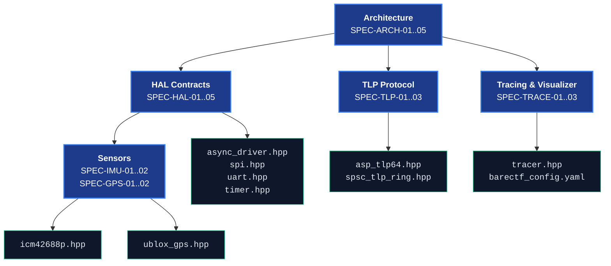

# AbstractX Design Specification & Requirements Matrix

This document is the **Single Source of Truth (SSOT)** for all architectural requirements, TLP packet definitions, HAL driver contracts, and sensor interfaces in AbstractX.

Each requirement carries a unique **Design ID (`[SPEC-*]`)** that is directly referenced by implementation files via `// @impl [SPEC-*]`.

---

## 1. System Architecture Specifications (`SPEC-ARCH`)

### `[SPEC-ARCH-01]` Split-Transaction Asynchronous I/O Pipeline
* **Requirement**: All physical peripheral interactions (SPI, UART, I2C, Timers) must be decoupled from the application thread using a split-transaction request/completion model.
* **Mechanism**: Input Queue (Request) $\rightarrow$ Hardware DMA / ISR $\rightarrow$ Output Queue (Completion) $\rightarrow$ Coroutine Resumption.
* **Implementation Target**: `include/abstractx/hal/async_driver.hpp`

### `[SPEC-ARCH-02]` Zero Dynamic Memory Allocation (0 B Heap)
* **Requirement**: No dynamic memory (`malloc`, `free`, `operator new`) is permitted in real-time execution paths.
* **Mechanism**: Coroutine frames draw from static atomic frame pools (`CoroutineStaticPool`), queues use fixed-capacity ETL rings (`etl::queue_spsc_isr`).
* **Implementation Target**: `include/asp_coro.hpp`, `include/abstractx/domain_dispatcher.hpp`

### `[SPEC-ARCH-03]` Universal Multi-Target Application Portability
* **Requirement**: Top-level flight control and telemetry logic (`FlightApp` / `inav-abstractx`) must compile unmodified across Linux SBCs, Raspberry Pi Pico 2 W, ESP32-P4, and Desktop SITL.
* **Implementation Target**: `examples/gps_imu_flight_node.cpp`, `apps/`

### `[SPEC-ARCH-04]` Heterogeneous Co-Processor Interconnect & Single-Core MPSC (E906 + Linux)
* **Requirement**: Allwinner XuanTie E906 operates as a dedicated I/O coprocessor servicing 8 kHz SPI DMA and GPS UART, delivering timestamped 64B TLPs into shared SRAM Space 0 (`0x3FFC8100`) for Linux `remoteproc` consumers.
* **Concurrency Model**: Single-core preemption. Multiple hardware PLIC ISRs (SPI DMA, UART RX, Timer, Mailbox Doorbell) and cooperative Coroutine tasks push into a unified wait-free Multi-Producer Single-Consumer (`MpscIsrQueue`) work queue.
* **Implementation Target**: `targets/allwinner_e906/`, `include/mpsc_isr_queue.hpp`, `apps/gps_imu_app/`

### `[SPEC-ARCH-05]` Dual-Core Asymmetric Multiprocessing (Pico 2 W / RP2350)
* **Requirement**: RP2350 separates I/O & wireless networking from flight coroutines across dual Cortex-M33 cores:
  - **Core 0**: Dedicated I/O, DMA, CYW43439 Wi-Fi/networking master, and SIO doorbell bridge.
  - **Core 1**: Dedicated real-time coroutine flight engine running 8 kHz attitude estimation and EKF.
* **Mechanism**: Dual lock-free `SpscTlpRing<64>` and RP2350 hardware SIO FIFOs (`pico/multicore.h`).
* **Implementation Target**: `apps/gps_imu_app/src/main.cpp`, `targets/pico2w_rp2350/`

### `[SPEC-ARCH-06]` Unified AbstractX Runtime API & Autonomous Domain Placement
* **Requirement**: Applications must interface with the framework exclusively through the unified `abstractx::` API (`init()`, `spawn()`, `step()`, `step_async()`, `run()`). The runtime must automatically determine target topology and assign `io_processor`, `trace_dispatcher`, and user coroutines to their optimal hardware execution domains (Core 0 vs Core 1 on dual-core MCU, E906 vs Linux on heterogeneous SoCs, or cooperative coroutine loop on SITL), guaranteeing 0 application `#ifdef`s.
* **Implementation Target**: `include/abstractx/abstractx.hpp`, `src/runtime.cpp`

### `[SPEC-ARCH-07]` Platform Topology Table & Studio Multi-Window Observability
* **Requirement**: AbstractX runtimes must encode and announce a standardized `PlatformTopologyTable` describing the exact silicon execution topology (e.g. `Linux_Standard_SITL`, `Linux_Host_E906`, `Linux_Host_E906_FPGA`, `RP2350_DualCore_Pico2W`, `ESP32P4_FreeRTOS`), active cores, interconnects, and hardware accelerators. The Observability Studio must render:
  1. **Window 1: Platform Topology & Interconnect Fabric** (Auto-detected silicon graph and SPSC ring saturations).
  2. **Window 2: Dual-Plane Timeline & Source Code Scanner** (Separation of I/O driver context from C++20 coroutines, with interactive source jumping to `__FILE__`: `__LINE__`).
  3. **Window 3: Per-Processor SPU/CPU & OS Process Utilization** (Tracking host Linux CPU% and external daemons, XuanTie E906 active vs WFI cycles, and FPGA logic LUT / DMA bandwidth).
* **Implementation Target**: `include/abstractx/platform_topology.hpp`, `docs/ABSTRACTX_PLATFORM_TOPOLOGY_AND_METRICS_SPEC.md`, `tools/visualizer/abstractx_studio.py`
* **Source Compatibility**: Legacy `Linux_Host_E907` and `Linux_Host_E907_FPGA` enum names MUST remain deprecated aliases of the corresponding E906 values; topology display strings MUST use the canonical E906 names.

---

## 2. 64-Byte Transaction Layer Packet (TLP) Specifications (`SPEC-TLP`)

### `[SPEC-TLP-01]` 64-Byte Wire Format & CTF 1.8 Standard Encapsulation
* **Requirement**: All inter-core, inter-process, and network messages must strictly match the 64-byte `asp_tlp64_t` layout (`alignas(64)`). All data payloads (telemetry, sensor frames, coroutine lifecycles, and HAL traces) must encapsulate standardized binary **Common Trace Format (CTF 1.8 / barectf)** event structures within the 40-byte TLP payload (`payload[40]`).
* **Wire Fields**: `type` (1B), `flags` (1B), `tag` (1B), `channel` (1B), `target_address` (4B), `length_dw` (2B), `sequence` (2B), `timestamp_ns` (8B), `payload` (40B CTF binary event), and a 4B transport-integrity footer. Trusted processor↔FPGA paths over SRAM, AXI, BRAM, or DDR MUST write the footer as zero and do not calculate CRC. External SPI/UART serial profiles MUST use that footer for IEEE 802.3 CRC32 over bytes 0..59.
* **Channel Routing**:
  - `Channel::Telemetry` (`0x02`): CTF Stream 1 (`ImuSamplePayload` 23B, `GpsFixPayload` 35B).
  - `Channel::FlightLog` / `Channel::Debug` (`0x03` / `0x04`): CTF Stream 0 (`CoroEventPayload` 17B), CTF Stream 2 (`HalIoPayload` 16B / `TlpTracePayload` 19B).
* **Implementation Target**: `include/asp_tlp64.hpp`, `include/asp_tlp64.h`

### `[SPEC-TLP-02]` Memory-Mapped Virtual Addressing & Routing
* **Requirement**: Sensor and actuator requests must target virtual BAR memory regions (`IMU_BASE = 0x40000100`, `GPS_BASE = 0x40000300`), remaining transport-agnostic.
* **Implementation Target**: `include/pcie_bar_map.hpp`

### `[SPEC-TLP-03]` Lock-Free SPSC & Wait-Free MPSC Ring Transport
* **Requirement**: Inter-core and inter-domain FIFO queues must operate lock-free via single-producer single-consumer rings (`SpscTlpRing<64>`) with atomic head/tail pointers. Intra-core and single-core coprocessor event queues must operate wait-free via multi-producer single-consumer queues (`MpscIsrQueue<T, Capacity>`) with hardware IRQ masking (`csrrci` on RV32 / `cpsid i` on Cortex-M).
* **Implementation Target**: `include/spsc_tlp_ring.hpp`, `include/mpsc_isr_queue.hpp`

### `[SPEC-TLP-04]` Multi-Register Burst Memory Operations
* **Requirement**: The TLP memory interface MUST support packed multi-register burst writes (`MemWrBurst`) and burst reads (`MemRdBurst`) packing up to 9 consecutive 32-bit registers (36 bytes payload) into a single 64-byte TLP with `length_dw = N (1..9)`. The receiving gateway (`asp_wishbone_master.sv`) MUST sequentially write/read consecutive memory-mapped Wishbone addresses starting at `target_address` without issuing separate 64-byte control frames.
* **Implementation Target**: `include/asp_tlp64.hpp`, `rtl/asp_wishbone_master.sv`

---

## 3. Hardware Abstraction Layer Specifications (`SPEC-HAL`)

### `[SPEC-HAL-01]` DMA/ISR Split-Queue Driver Base
* **Requirement**: `AsyncDriverBase<TReq, TRes, Depth>` must manage dual ETL `queue_spsc_isr` rings with nesting-aware `InterruptLock` masking.
* **Implementation Target**: `include/abstractx/hal/async_driver.hpp`

### `[SPEC-HAL-02]` Asynchronous SPI / Dual-SPI DMA Interface
* **Requirement**: `AsyncSpiDriver` must support single-channel and dual-channel high-speed SPI transactions with `co_await transfer_async()`.
* **Implementation Target**: `include/abstractx/hal/spi.hpp`

### `[SPEC-HAL-03]` Asynchronous UART Streaming & Framing Interface
* **Requirement**: `AsyncUartDriver` must provide interrupt/DMA driven non-blocking RX byte streaming and `co_await write_async()` packet ingestion.
* **Implementation Target**: `include/abstractx/hal/uart.hpp`

### `[SPEC-HAL-04]` Inter-Core Mailbox & Doorbell Interface
* **Requirement**: `AsyncMailboxDriver` must handle hardware cross-core doorbells (MSGBox on Allwinner, SIO on RP2350, IPC on ESP32-P4) with `co_await notify_async()`.
* **Implementation Target**: `include/abstractx/hal/mailbox.hpp`

### `[SPEC-HAL-05]` Asynchronous Timer & Alarm Engine
* **Requirement**: Timer delays, alarms, and periodic tasks must operate asynchronously through `AsyncTimerDriver` inheriting from `AsyncDriverBase<TimerRequest, TimerResult>`. Coroutines yield to the work queue and are awakened by hardware alarm ISRs, OS timer callbacks, or I/O processor queue completions. Coroutines never block or busy-spin on timers.
* **Mechanism**: Request Queue $\rightarrow$ Hardware Alarm / OS Timer Callback $\rightarrow$ Completion Queue $\rightarrow$ `IsrDispatcher::post(handle)`.
* **Implementation Target**: `include/abstractx/hal/timer.hpp`

---

## 4. Sensor Driver Specifications (`SPEC-IMU` & `SPEC-GPS`)

### `[SPEC-IMU-01]` ICM-42688-P 8 kHz SPI DMA Auto-Read & CTF TLP Emission
* **Requirement**: Read 15-byte burst (`Temp[1..2]`, `Accel_XYZ[3..8]`, `Gyro_XYZ[9..14]`) on `DRDY` edge, convert to engineering units, and format into a 23-byte CTF `ImuSamplePayload` encapsulated in `Tlp64::make_ctf(Channel::Telemetry, TLP_TAG_IMU, payload)`.
* **ODR & Scaling**: Gyro $\pm 2000\ \text{dps}$ ($16.4\ \text{LSB/dps}$), Accel $\pm 16g$ ($2048\ \text{LSB/g}$).
* **Implementation Target**: `include/abstractx/drivers/imu/icm42688p.hpp`

### `[SPEC-IMU-02]` ICM-42688-P Coroutine Awaiter
* **Requirement**: `co_await imu.next_sample_async()` suspends the calling task with zero CPU polling until the SPI DMA completes.
* **Implementation Target**: `include/abstractx/drivers/imu/icm42688p.hpp`

### `[SPEC-GPS-01]` U-Blox UBX-NAV-PVT Binary Parser & CTF TLP Emission
* **Requirement**: Zero-allocation streaming byte parser for UBX Class `0x01`, ID `0x07` (92-byte payload) with Fletcher-8 checksum verification, emitting a 35-byte CTF `GpsFixPayload` inside `Tlp64::make_ctf(Channel::Telemetry, TLP_TAG_GPS, payload)`.
* **Extracted Fields**: `lat_1e7`, `lon_1e7`, `alt_msl_mm`, `ground_speed_mm_s`, `heading_1e5`, `satellites`, `fix_type`, `itow_ms`.
* **Implementation Target**: `include/abstractx/drivers/gps/ublox_gps.hpp`

### `[SPEC-GPS-02]` U-Blox GPS Coroutine Awaiter & TLP Emission
* **Requirement**: `co_await gps.next_fix_async()` yields until a verified 3D fix frame is parsed, emitting `Tlp64` containing the full CTF navigation payload.
* **Implementation Target**: `include/abstractx/drivers/gps/ublox_gps.hpp`

---

## 5. Trace & Visualizer Specifications (`SPEC-TRACE`)

### `[SPEC-TRACE-01]` barectf Common Trace Format (CTF) Event Specification & TLP Carrier
* **Requirement**: System must emit binary CTF event packets conforming to `trace/barectf_config.yaml` (`magic = 0xC1FC1FC1`) capturing Coroutine lifecycles (`coro_state`), IMU bursts (`imu_sample`), GPS fixes (`gps_fix`), HAL driver I/O (`hal_io`), and TLP routing (`tlp_msg`), with individual CTF events directly transportable inside 64-byte `Tlp64` messages.
* **Implementation Target**: `include/abstractx/trace/tracer.hpp`, `trace/barectf_config.yaml`

### `[SPEC-TRACE-02]` Zero-Allocation Trace Buffer & Ring Engine
* **Requirement**: Tracing operations must incur 0 dynamic memory allocations and execute in $< 200\ \text{ns}$ per event using static circular packet buffers with automatic packet commit and overflow tracking.
* **Implementation Target**: `include/abstractx/trace/tracer.hpp`

### `[SPEC-TRACE-03]` Multi-Target Visualizer Transport
* **Requirement**: Trace packets must be transportable to the AbstractX Visualizer via:
  - **Pico 2 W**: Core 0 UDP Wi-Fi / socket stream (Port 9870) carrying 64-byte CTF-in-TLP frames.
  - **XuanTie E906**: Shared non-cacheable DRAM ring (`0x48100000`) & RemoteProc `trace0`.
  - **Host SITL**: CTF binary stream file and local loopback UDP.
* **Implementation Target**: `apps/gps_imu_app/src/main.cpp`, `apps/gps_imu_app/platforms/allwinner_e906/main.cpp`

### `[SPEC-TRACE-04]` Configurable Trace Dispatcher Coroutine & Startup Sinks
* **Requirement**: The coroutine engine MUST host a non-blocking `trace_dispatcher_task()` coroutine that flushes buffered CTF events into 64-byte TLPs based on watermark thresholds and periodic timers. The destination sink MUST be established at Dispatcher/Platform startup via `TraceDispatcherConfig` (supporting `None`, `Udp`, `File`, or `SharedSramRing`), never hardcoding the transport.
* **Implementation Target**: `include/abstractx/trace/tracer.hpp`, `include/abstractx/domain_dispatcher.hpp`, `include/abstractx/hal/platform.hpp`

### `[SPEC-TRACE-05]` Heterogeneous Coprocessor Trace Pipeline (E906 to Linux)
* **Requirement**: When `io_processor` executes on a coprocessor (Allwinner XuanTie E906 / RP2350 Core 0), trace TLPs must route through the shared SRAM ring (`0x40000000`) and trigger a hardware doorbell (`sun6i-msgbox` / SIO FIFO). The Linux host coroutine loop must execute a non-blocking receiver coroutine that drains the shared memory ring directly into the host UDP or file sink.
* **Implementation Target**: `targets/allwinner_e906/src/io_processor.cpp`, `targets/linux/src/io_processor.cpp`, `apps/gps_imu_app/src/main.cpp`

### `[SPEC-TRACE-06]` 1 KB Ping-Pong Buffer Architecture & Profile Configuration
* **Requirement**: The trace engine MUST support a dual-buffer (ping-pong) topology (producer fills buffer A while consumer transmits buffer B) with a standard 1,024-byte (1 KB) packet size. The memory profile MUST be configurable via `enum class BufferProfile` (`PingPong_1K_x2`, `Ring_1K_x4`, `Compact_512B_x2`, `Large_2K_x4`) to support ultra-constrained co-processors (Allwinner E906 / RP2350) and high-throughput SITL logging with 0 dynamic heap allocations.
* **Implementation Target**: `include/abstractx/trace/tracer.hpp`, `include/abstractx/abstractx.hpp`, `docs/HOW_TO_CTF_PING_PONG_TRACING.md`

### `[SPEC-ILA-01]` Decoupled Hardware ILA Trace Memory Pool & Non-Blocking DMA Reader
* **Requirement**: Hardware and software tracing must operate on a dedicated memory pool completely isolated from the primary 64-byte control TLP plane. The FPGA hardware ILA (`asp_ila_trace.sv`) MUST capture timestamped internal events into an on-chip dual-port Block RAM circular buffer without consuming TLP bus bandwidth. The egress DMA reader MUST stream accumulated ILA trace frames only when the primary control TLP egress channel is idle, or upon receiving an explicit host DMA pull request, guaranteeing 0 head-of-line blocking for flight-critical control packets.
* **Implementation Target**: `rtl/asp_ila_trace.sv`

---

## 6. Target Silicon Platform Specifications (`SPEC-TARGET`)

### `[SPEC-TARGET-01]` Trenz CYC1000 Intel Cyclone 10 LP Target Platform
* **Requirement**: AbstractX must support the Trenz Electronic CYC1000 board featuring the Intel/Altera Cyclone 10 LP (`10CL025YU256C8G`, 25K LEs, 66 M9K BRAMs). The top-level fabric must support the onboard 12.0 MHz oscillator, an Arduino MKR-compatible SPI slave header for host communication, a dedicated SPI master for an ICM-42688-P IMU, and 4 DShot/PWM motor pins with total fabric utilization $< 2,000$ LEs ($< 8\%$ of device capacity).
* **Implementation Target**: `docs/tier3_targets/hardware/CYC1000_PINOUT.md`

---

## 7. Requirements Traceability Matrix

```mermaid
graph TD
    SPEC_ARCH["<b>Architecture</b><br/>SPEC-ARCH-01..05"] --> SPEC_HAL["<b>HAL Contracts</b><br/>SPEC-HAL-01..05"]
    SPEC_ARCH --> SPEC_TLP["<b>TLP Protocol</b><br/>SPEC-TLP-01..03"]
    SPEC_HAL --> SPEC_SENSORS["<b>Sensors</b><br/>SPEC-IMU-01..02<br/>SPEC-GPS-01..02"]
    SPEC_ARCH --> SPEC_TRACE["<b>Tracing & Visualizer</b><br/>SPEC-TRACE-01..03"]
    
    SPEC_SENSORS --> CODE_IMU["<code>icm42688p.hpp</code>"]
    SPEC_SENSORS --> CODE_GPS["<code>ublox_gps.hpp</code>"]
    SPEC_HAL --> CODE_HAL["<code>async_driver.hpp</code><br/><code>spi.hpp</code><br/><code>uart.hpp</code><br/><code>timer.hpp</code>"]
    SPEC_TLP --> CODE_TLP["<code>asp_tlp64.hpp</code><br/><code>spsc_tlp_ring.hpp</code>"]
    SPEC_TRACE --> CODE_TRACE["<code>tracer.hpp</code><br/><code>barectf_config.yaml</code>"]
    
    classDef specBox fill:#1e3a8a,stroke:#3b82f6,stroke-width:2px,color:#ffffff;
    classDef codeBox fill:#0f172a,stroke:#10b981,stroke-width:1px,color:#e2e8f0;
    class SPEC_ARCH,SPEC_HAL,SPEC_TLP,SPEC_SENSORS,SPEC_TRACE specBox;
    class CODE_IMU,CODE_GPS,CODE_HAL,CODE_TLP,CODE_TRACE codeBox;
```

