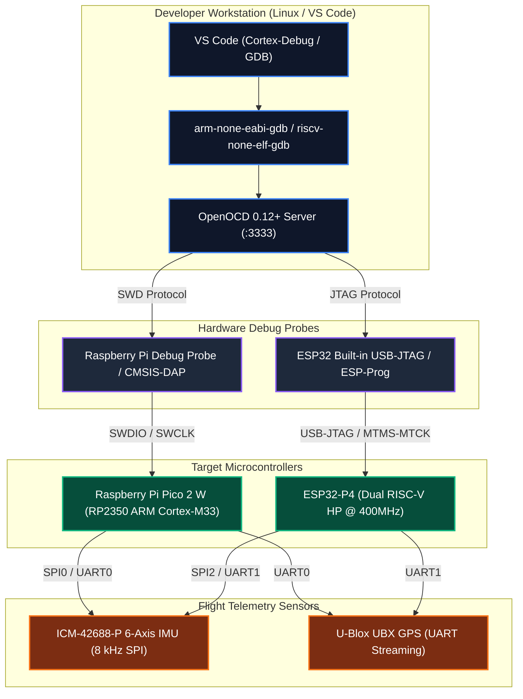

# Hardware Debugging Guide: Raspberry Pi Pico 2 W & ESP32-P4

This guide details how to wire, flash, and debug **Raspberry Pi Pico 2 W (RP2350)** and **ESP32-P4** boards using **VS Code**, **OpenOCD**, and hardware debug probes (SWD / JTAG), with connected **ICM-42688-P IMUs** and **U-Blox GPS** modules.

---

## 1. System Topology Overview



---

## 2. Raspberry Pi Pico 2 W (RP2350) Setup

### A. SWD Debug Port Pinout
Connect the **Raspberry Pi Debug Probe** (or any CMSIS-DAP / Picoprobe debugger) to the dedicated 3-pin debug header or SWD pads on the Pico 2 W:

| Debug Probe Pin | Pico 2 W Pin / Pad | Signal Description |
| :--- | :--- | :--- |
| **D (Yellow / Orange)** | `SWDIO` | Bidirectional Serial Wire Data |
| **G (Black)** | `GND` | Common Ground Reference |
| **C (White / Grey)** | `SWCLK` | Serial Wire Clock |

> [!IMPORTANT]
> The Pico 2 / Pico 2 W SWD debug header is the 3-pin JST-SH connector between the RP2350 SoC and the USB connector (or labelled `DEBUG` on the bottom edge).

---

### B. ICM-42688-P IMU & U-Blox GPS Wiring (Pico 2 W)

```
        Raspberry Pi Pico 2 W                    ICM-42688-P IMU (SPI0)
     +-------------------------+              +-------------------------+
     | 3V3(OUT) (Pin 36)       | ------------ | VDD / VDDIO             |
     | GND      (Pin 38 / Pin 3| ------------ | GND                     |
     | GPIO 18  (Pin 24, SCK)  | ------------ | SCLK / SCK              |
     | GPIO 19  (Pin 25, MOSI) | ------------ | SDI / MOSI              |
     | GPIO 16  (Pin 21, MISO) | ------------ | SDO / MISO              |
     | GPIO 17  (Pin 22, CSn)  | ------------ | CS                      |
     | GPIO 20  (Pin 26, INT1) | ------------ | INT1 (Data Ready)       |
     +-------------------------+              +-------------------------+

                                                 U-Blox UBX-NAV-PVT GPS
     +-------------------------+              +-------------------------+
     | GPIO 0   (Pin 1, UART0 TX) ---------- | RX                      |
     | GPIO 1   (Pin 2, UART0 RX) ---------- | TX                      |
     | 3V3(OUT) / GND          | ------------ | VCC / GND               |
     +-------------------------+              +-------------------------+
```

---

### C. Building & Flashing via OpenOCD

1. **Build the Firmware**:
   ```bash
   PICO_SDK_PATH=/home/tcmichals/.tools/pico-sdk \
   PICO_TOOLCHAIN_PATH=/home/tcmichals/.tools/gcc-arm-none-eabi \
   cmake -B build_pico2w -DABSTRACTX_TARGET=pico2w -DPICO_BOARD=pico2_w -DPICO_PLATFORM=rp2350-arm-s
   cmake --build build_pico2w -j$(nproc)
   ```

2. **Flash directly via SWD**:
   ```bash
   /home/tcmichals/.tools/openocd/bin/openocd \
     -s /home/tcmichals/.tools/openocd/openocd/scripts \
     -f interface/cmsis-dap.cfg \
     -f target/rp2350.cfg \
     -c "adapter speed 5000" \
     -c "program build_pico2w/apps/pico2w_companion/pico2w_companion.elf verify reset exit"
   ```

---

### D. VS Code One-Click Debugging (F5)

1. Open the project in VS Code.
2. Select **Run and Debug** (`Ctrl+Shift+D`).
3. Choose **`Pico 2 W: SWD Debug (Cortex-Debug)`** or **`Pico 2 W: SWD Debug (GDB / OpenOCD pipe)`**.
4. Press **`F5`**:
   - VS Code runs the pre-launch build task.
   - OpenOCD connects over CMSIS-DAP.
   - GDB loads symbols from `pico2w_companion.elf`, resets the RP2350, and breaks at `main()`.

---

## 3. ESP32-P4 Setup

### A. JTAG Debug Port (Built-in USB-JTAG / ESP-Prog)

The ESP32-P4 features **hardware USB-Serial-JTAG** built directly into the chip.

| Connection Type | Physical Connection | Notes |
| :--- | :--- | :--- |
| **Built-in USB-JTAG** | Native USB Port (D+/D- on GPIO 19/20) | Connect standard USB-C cable directly to PC. |
| **External ESP-Prog** | Dedicated 10-pin / 6-pin 1.27mm JTAG header | `MTMS` (GPIO 4), `MTDI` (GPIO 5), `MTCK` (GPIO 6), `MTDO` (GPIO 7). |

---

### B. ICM-42688-P IMU Wiring (ESP32-P4)

| ICM-42688-P Pin | ESP32-P4 Pin | Function |
| :--- | :--- | :--- |
| **VDD / VDDIO** | `3V3` | 3.3V Power |
| **GND** | `GND` | Ground |
| **SCLK** | `GPIO 10` | SPI2 SCK |
| **MOSI** | `GPIO 11` | SPI2 MOSI |
| **MISO** | `GPIO 12` | SPI2 MISO |
| **CS** | `GPIO 9` | SPI2 CS0 |
| **INT1** | `GPIO 8` | DRDY Falling/Rising Edge Interrupt |

---

### C. OpenOCD Server & GDB for ESP32-P4

1. **Launch OpenOCD**:
   ```bash
   openocd-esp32 -f board/esp32p4-builtin.cfg -c "adapter_khz 5000"
   ```
2. **Launch GDB Session**:
   ```bash
   /home/tcmichals/.tools/xpack-riscv-none-elf-gcc-15.2.0-1/bin/riscv-none-elf-gdb \
     build_esp32p4/apps/esp32p4_hub/esp32p4_hub.elf \
     -ex "target remote localhost:3333" \
     -ex "monitor reset halt"
   ```
3. **In VS Code**:
   - Select configuration: **`ESP32-P4: JTAG Debug (GDB / OpenOCD)`** and press **`F5`**.

---

## 4. Linux USB Permissions (udev Rules)

To allow non-root access to CMSIS-DAP and ESP USB-JTAG probes:

```bash
# /etc/udev/rules.d/99-hardware-debuggers.rules

# Raspberry Pi Debug Probe (CMSIS-DAP) / Picoprobe
SUBSYSTEM=="usb", ATTR{idVendor}=="2e8a", ATTR{idProduct}=="000c", MODE="0666", GROUP="plugdev"
SUBSYSTEM=="usb", ATTR{idVendor}=="2e8a", ATTR{idProduct}=="000a", MODE="0666", GROUP="plugdev"

# Espressif USB-JTAG / Serial
SUBSYSTEM=="usb", ATTR{idVendor}=="303a", ATTR{idProduct}=="1001", MODE="0666", GROUP="plugdev"
```

Reload udev rules:
```bash
sudo udevadm control --reload-rules && sudo udevadm trigger
```

---

## 5. Live Debugging Coroutines & Ring Buffers

### Inspecting SPSC TLP Rings
In the GDB / VS Code watch window, add:
- `g_telemetry_ring.size()` $\rightarrow$ Number of queued 64B packets.
- `imu_sample` $\rightarrow$ Live calibrated float values ($g$ on Accel XYZ, $\text{dps}$ on Gyro XYZ).
- `fix` $\rightarrow$ Live GPS latitude/longitude, altitude, ground speed, satellite count.

### Breaking on Coroutine Suspension / Resumption
Set a breakpoint at:
- `apps/pico2w_companion/main.cpp:39` (`ImuSample sample = co_await imu.next_sample_async();`)
- Step into `next_sample_async()` to observe the zero-allocation coroutine awaiter saving the handle and dispatching to SPI DMA!
