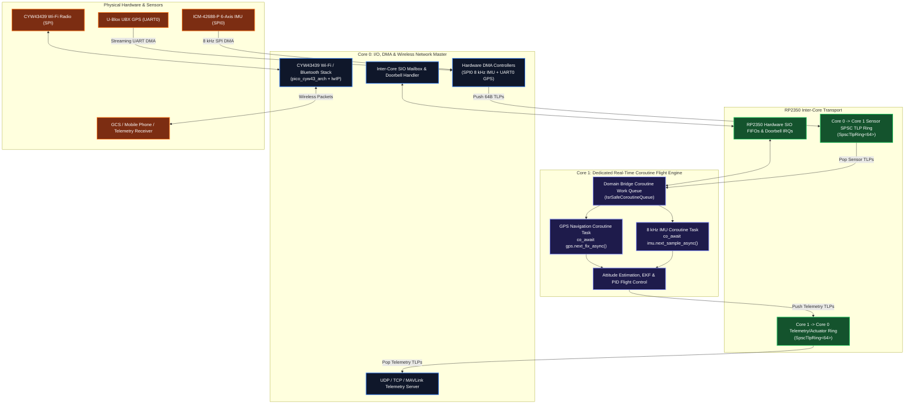

# Raspberry Pi Pico 2 W Dual-Core Architecture Specification

This document defines the **Asymmetric Multiprocessing (AMP)** architecture for the **Raspberry Pi Pico 2 W (RP2350 SoC)** in AbstractX and the INAV flight stack.

---

## 1. Core Allocation & Separation of Concerns

The RP2350 features **dual ARM Cortex-M33 cores** running at 150 MHz paired with an onboard **CYW43439** Wi-Fi 4 (802.11n) and Bluetooth 5.2 radio. To achieve hard real-time flight determinism while supporting wireless telemetry and high-speed sensors, the cores are strictly partitioned:

---

## 2. Detailed Responsibility Matrix

| Feature / Responsibility | **Core 0 (I/O & Network Master)** | **Core 1 (Coroutine Flight Engine)** |
| :--- | :--- | :--- |
| **Primary Role** | Hardware I/O, DMA, Wi-Fi networking, GCS telemetry | Real-time flight control, sensor fusion, coroutines |
| **Wi-Fi / Network Stack** | **Runs `pico_cyw43_arch`**, lwIP, DHCP, UDP broadcasts | **Zero network overhead** (100% isolated from Wi-Fi jitter) |
| **DMA & Peripheral ISRs** | Manages SPI0 DMA, UART0 DMA, PIO Dual-SPI, Timer Alarms | Consumes parsed events via lock-free SPSC rings |
| **Execution Paradigm** | Event-driven polling / ISR completion pipeline | C++20 Cooperative Coroutine Work Queue (`Dispatcher`) |
| **Flight Control & EKF** | None | **Runs 8 kHz PID loop, AHRS, Navigation state machine** |
| **Idle Behavior** | Polls network queues & services DMA interrupts | Sleeps in `__asm__ volatile("wfe")` when work queue is empty |

---

## 3. Inter-Core Data Flow (SIO + SPSC Ring)

### A. Sensor Ingestion Path (Core 0 $\rightarrow$ Core 1)
1. **SPI DMA** on Core 0 reads 15-byte burst from ICM-42688-P upon `DRDY` interrupt.
2. Core 0 formats a 64-byte completion packet (`Tlp64::make_cpl_d(0x01, payload)`) and pushes it into `g_sensor_ring`.
3. Core 0 writes a token to the RP2350 hardware SIO FIFO (`sio_hw->fifo_wr = 0x01`), triggering an SIO IRQ on Core 1.
4. Core 1 awakens, pops the TLP from `g_sensor_ring`, and resumes the waiting `imu_task` coroutine.

### B. Telemetry Broadcast Path (Core 1 $\rightarrow$ Core 0 $\rightarrow$ Wi-Fi)
1. Core 1 flight coroutines produce telemetry packets (attitude quaternion, GPS position, battery voltage).
2. Packets are pushed to `g_telemetry_ring`.
3. Core 0 pops packets during its network loop and broadcasts them via UDP / WebSocket to the ground station.

---

## 4. Why This Eliminates Flight Control Jitter
- Wireless stacks (Wi-Fi 802.11 beacons, ARP, DHCP, retransmissions) introduce non-deterministic latency spikes ranging from 2 ms to 50 ms.
- By pinning the wireless stack and DMA bus mastering entirely to **Core 0**, **Core 1** achieves **sub-microsecond jitter determinism** for flight attitude stabilization.
