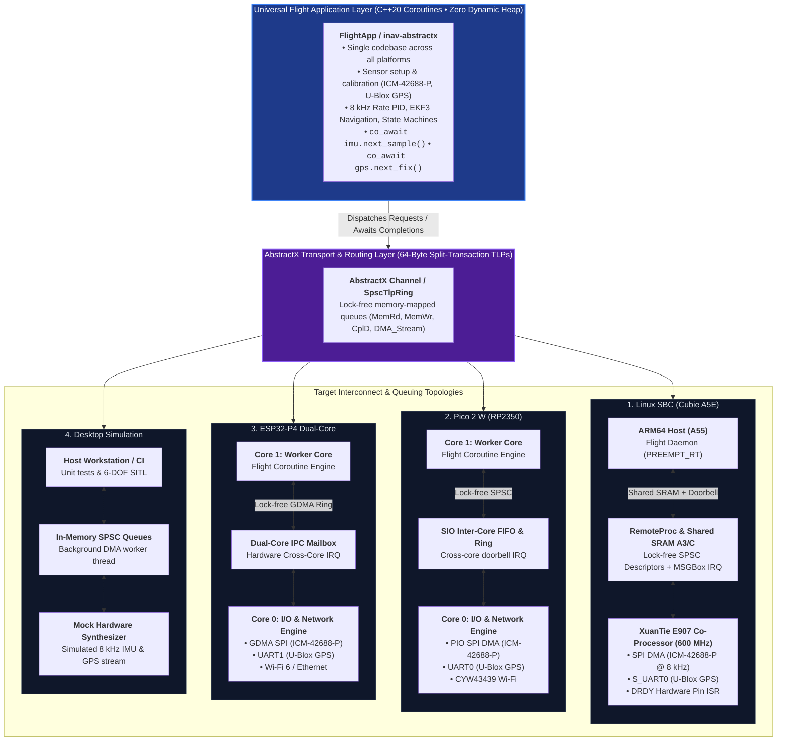

# Design Prompt: Markdown Drives the Code (Spec-Driven Architecture)

## 1. Core Principle: Single Source of Truth (SSOT)
In this repository, **Markdown documentation is the authoritative design specification that drives all code implementations.**

- **Architecture, protocols, hardware memory maps, and state machines are defined in Markdown first** using clean GitHub Markdown and Mermaid diagrams.
- **Source code (`.hpp`, `.cpp`, `.S`, `.sv`) must be lean, minimal, and free of essay-style duplicate comments.**
- Code comments should be strictly minimal (1–2 lines) and provide direct cross-reference links back to the authoritative Markdown document (e.g. `// Spec: docs/ARCHITECTURE.md#split-queue-model`).

---

## 2. Multi-Target Top-Level Application Architecture

---

## 3. Strict Development Rules for AI Agents & Developers

1. **Markdown First**:
   - Every new driver, peripheral contract, or transport queue must be documented in `docs/` before code modification.
2. **Minimal In-Code Comments**:
   - Avoid duplicate verbose comments in `.cpp` / `.hpp` files.
   - Use cross-reference markers: `// Spec: docs/<file>.md#<anchor>`.
3. **Zero Dynamic Allocation**:
   - All coroutine frames, TLP packets, and driver request/completion rings must allocate from static atomic pools (`CoroutineStaticPool`, `etl::queue_spsc_isr`).
4. **Split-Transaction Queue Contract**:
   - Every peripheral driver (UART, SPI, Timer, Mailbox) must expose an Input (Request) Queue and an Output (Completion) Queue with non-blocking C++20 awaiters.
5. **Universal Application Code**:
   - The top-level flight application (`inav-abstractx`) must remain 100% agnostic to whether the underlying execution domain is Linux userspace, Pico 2 W Core 1, or ESP32-P4 Core 1.
