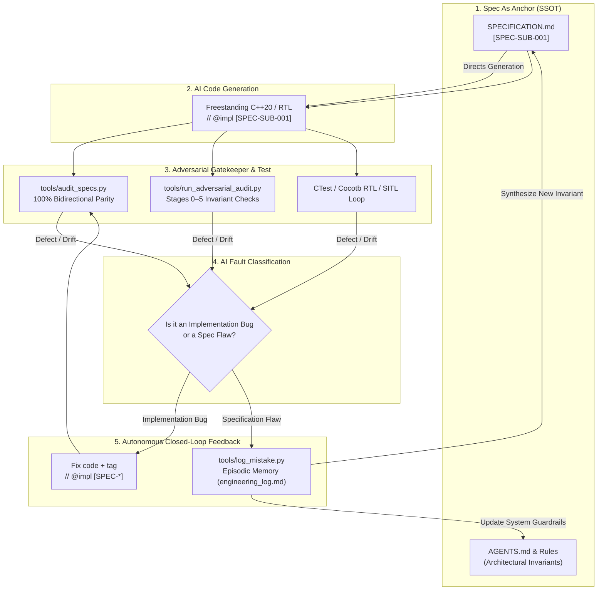
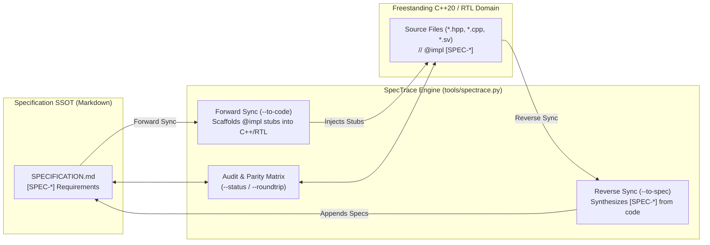

# SpecTrace: Autonomous Closed-Loop Architecture & Invariant Engineering

**SpecTrace** is the architectural framework governing development in AbstractX. It bridges high-assurance aerospace requirement traceability (DO-178C Level A / NASA NPR 7150.2) with modern AI agentic reflection (Verbal Reinforcement Learning / Reflexion).

---

## 1. The Core Problem: Why Traditional Rigor (NASA/DO-178C) Stalls

Traditional safety-critical engineering frameworks like **DO-178C**, **NASA Class A Flight Software**, and **ISO 26262 ASIL-D** mandate end-to-end traceability: every line of source code must trace to a low-level requirement, which traces to a high-level architecture requirement.

However, in practice, human-driven traceability suffers from a critical failure mode:
1. **The Static Spec Trap**: Specifications are authored in massive Word docs, IBM DOORS, or Polarion matrices. They are disconnected from the compiler.
2. **The Friction of Change (CCB Bottleneck)**: When developers uncover a silicon erratum, an interrupt race condition, or an architectural flaw during hardware testing, filing a change through a human Configuration Control Board (CCB) takes weeks.
3. **Specification Drift**: Under delivery pressure, engineers patch the code directly. The specification rots, becoming historical fiction rather than the Single Source of Truth (SSOT).

### Conversely: Why Naive AI Coding ("Vibe Coding") Fails

On the opposite extreme, naive AI code generation:
1. Fixates on local fixes in chat without global architectural memory.
2. Hallucinates dynamic heap allocations (`new`, `malloc`, `std::vector`) or blocking calls in freestanding hardirq contexts.
3. Repeats the exact same subtle architectural mistakes across sessions because context windows are ephemeral.

---

## 2. What SpecTrace Does: The Autonomous Closed Loop

**SpecTrace solves what NASA and DO-178C were missing:**
> It uses AI agents not just to write code, but to **audit requirements**, **classify defects**, **detect architectural flaws in the specification itself**, and **autonomously close the feedback loop** by updating the specifications and agent rules before committing code.



---

## 3. The 4 Operational Stages of SpecTrace

### Stage 1: Specification-First Anchoring (`[SPEC-*]`)
No C++ or RTL is written without a preceding Markdown specification.
* Every architectural constraint, register mapping, bus transaction, and coroutine lifecycle is defined in `SPECIFICATION.md` with a unique requirement tag (`[SPEC-<SUBSYSTEM>-<ID>]`).
* Invariants are phrased as formal system contracts (e.g., *"Drivers MUST NOT allocate heap; transactions return `coro::Task<bool>`"*).

### Stage 2: Grand Traceability (`// @impl [SPEC-*]`)
Every single implementation function, hardware abstraction, and state machine carries a comment tag linking it directly to the specification requirement:
```cpp
// @impl [SPEC-ROUTER-001] targets/allwinner_e906/src/rpmsg.cpp
coro::Task<bool> AspRouter::dispatch_tlp_async(const Tlp64& packet) {
    // Zero-heap, asynchronous dispatch into lock-free SPSC ring
    ...
}
```
Validation is completely automated:
```bash
python3 tools/audit_specs.py
```
* Fails if any spec tag exists without implementing code.
* Fails if any code tag references a non-existent spec requirement.

### Stage 3: Adversarial Invariant Auditing
An independent Critic persona evaluates code and specifications across 6 strict stages:
* **Stage 0: Specification SSOT Anti-Drift** (Validates markdown structure, Mermaid diagrams, formal requirement tags).
* **Stage 1: Freestanding C++20 & Hardirq Safety** (Ensures zero heap, no forbidden STL headers, zero ISR resumes).
* **Stage 2: Non-Blocking HAL Coroutines** (Ensures no synchronous delays, yields via `co_await`).
* **Stage 3: Subsystem Contracts** (Primary-Paced Channel pattern, zero modulus prescalers).
* **Stage 4: Hardware Interconnect & 64B TLP Wire Framing** (Static assertion of 64-byte alignment, posted write flushes).
* **Stage 5: Adversarial Gatekeeper** (Deduplication, severity ranking, pass/fail decision).

```bash
python3 tools/run_adversarial_audit.py --all
```

### Stage 4: Autonomous Closed-Loop Learning Gate
When a test fails, a bug is discovered, or an adversarial audit fails, SpecTrace categorizes the issue:

1. **Category A: Implementation Deviation**
   * *Diagnosis*: The specification was correct, but the AI or developer wrote code violating the spec.
   * *Resolution*: Correct the C++ code, ensure `// @impl` matches, and re-run audits.

2. **Category B: Specification Defect / Missing Invariant**
   * *Diagnosis*: The code obeyed the spec, but the spec failed to anticipate a hardware reality (e.g., DMA FIFO overrun on high-rate bursts, cache coherency between RISC-V and ARM, interrupt race).
   * *Resolution*:
     1. **Log in Episodic Memory**:
        ```bash
        python3 tools/log_mistake.py \
          --title "DMA FIFO overrun on 8kHz IMU burst" \
          --target "asp_router" \
          --spec "docs/DESIGN_SPECIFICATION.md" \
          --tag "SPEC-ROUTER-DMA-002" \
          --append
        ```
     2. **Update the Spec FIRST (`SPECIFICATION.md`)**: Add the missing hardware invariant or dataflow constraint.
     3. **Update Agent Rules (`AGENTS.md` / `.agents/rules/`)**: If the defect represents a class of architectural traps that future AI agents might repeat, add an explicit invariant rule.
     4. **Implement Code**: Implement the solution adhering to the updated spec.
     5. **Verify Zero Drift**: Run `audit_specs.py` and `run_adversarial_audit.py`.

### Stage 5: Full Round-Tripping (Bidirectional Spec <-> Code Synchronization)

What happens when engineers design in Markdown first, or write C++/RTL code first?

In traditional systems engineering, bidirectional synchronization is nonexistent: either code drifts from stale specs, or specs block developers from writing code. SpecTrace solves this with **Full Round-Tripping** orchestrated by `tools/spectrace.py`:



#### 1. Inspect Synchronization Status
Displays the real-time bidirectional matrix comparing requirements in `SPECIFICATION.md` against active code implementations:
```bash
python3 tools/spectrace.py --status
python3 tools/spectrace.py --spec apps/gps_imu_app/SPECIFICATION.md --status
```

#### 2. Forward Synchronization (Spec -> Code)
When new requirements are authored in Markdown, SpecTrace discovers their `* **Implementation Target**:` and automatically injects matching `// @impl [SPEC-*]` tags and function stubs into the target files:
```bash
# Preview code injections:
python3 tools/spectrace.py --to-code --dry-run

# Commit code injections:
python3 tools/spectrace.py --to-code --apply
```

#### 3. Reverse Synchronization (Code -> Spec)
When a programmer writes new C++ methods, device drivers, or register maps first, SpecTrace extracts their contracts, docstrings, and signatures, pushing formal requirement blocks back into `SPECIFICATION.md`:
```bash
# Preview spec additions:
python3 tools/spectrace.py --to-spec --dry-run

# Commit spec additions:
python3 tools/spectrace.py --to-spec --apply
```

#### 4. Full Two-Way Round-Trip Reconciliation
Reconciles both directions atomically in a single pass, ensuring 100% bidirectional parity across specifications and code:
```bash
python3 tools/spectrace.py --roundtrip --apply
```

---

## 4. Why AI Semantic Review Beats Traditional Static Analysis

Traditional code quality tools (Clang-Tidy, Cppcheck, SonarQube, Coverity) analyze **AST syntax and language grammar**. While necessary for catching null pointer dereferences or unused variables, static analysis is **architecturally blind**:

| Capability | Traditional Static Analysis (Linters) | Human Code Review | **SpecTrace AI Adversarial Review** |
| :--- | :--- | :--- | :--- |
| **Architectural Intent** | ❌ Blind to specifications and design patterns | ⚠️ Inconsistent; misses subtle edge cases | ✅ Compares code directly against `SPECIFICATION.md` |
| **Concurrency Invariants** | ❌ Checks syntax; cannot evaluate cooperative coroutine pacing | ⚠️ Hard to trace without dynamic execution | ✅ Audits primary-paced channels, zero spinloops, yield symmetry |
| **Cross-Layer Parity** | ❌ Operates inside a single translation unit | ⚠️ Difficult across heterogeneous CPU/FPGA code | ✅ Validates 64B TLP framing, CTF schemas, and bus flushes |
| **Bidirectional Sync** | ❌ Emits error messages only | ❌ Manual editing required | ✅ Autonomously pushes code back to spec (`--to-spec`) |
| **Episodic Learning** | ❌ Amnesic; flags the same error without learning | ⚠️ Knowledge trapped in reviewers' heads | ✅ Chronicles root causes into `engineering_log.md` |

---

## 5. Architectural Comparison Matrix

| Dimension | NASA / DO-178C Traditional | Traditional Static Analysis | Standard AI ("Vibe Coding") | **SpecTrace (AbstractX)** |
| :--- | :--- | :--- | :--- | :--- |
| **Source of Truth** | Word/DOORS documents (slow) | Language AST / Lint config | Ephemeral chat prompts | Markdown Specifications (`SPECIFICATION.md`) |
| **Semantic Review** | Human peer review committees | Regex / Syntax rules only | Agent reviews own code (echo chamber) | **Multi-Stage Adversarial Critic (`spectrace.py --audit`)** |
| **Traceability** | Manual compliance spreadsheets | Zero specification awareness | Zero traceability | **Automated `[SPEC-*]` $\leftrightarrow$ `// @impl` checks** |
| **Velocity** | Weeks/months per revision | Seconds, but shallow syntax | Seconds, but breaks architecture | **Seconds, with deep architectural verification** |
| **Round-Tripping** | ❌ None (Specs rot) | ❌ None | ❌ None | **✅ Full Two-Way Round-Trip (`spectrace.py --roundtrip`)** |
| **Defect Memory** | Static bug tracker (Jira) | None | Forgotten when context clears | **Episodic Learning (`engineering_log.md`)** |

---

## 6. Tooling Reference

* `tools/spectrace.py`: Master CLI for full round-trip synchronization, status reporting, and adversarial audits.
* `tools/sync_code_to_spec.py`: Reverse-sync engine pushing new C++/RTL functions and contracts back into specifications.
* `tools/audit_specs.py`: Bidirectional grand traceability checker.
* `tools/run_adversarial_audit.py`: 6-stage adversarial invariant analyzer.
* `tools/log_mistake.py`: Automated generator and logger for `engineering_log.md`.
* `tools/create_app_spec.py`: Scaffold new applications with compliant `SPECIFICATION.md`.
