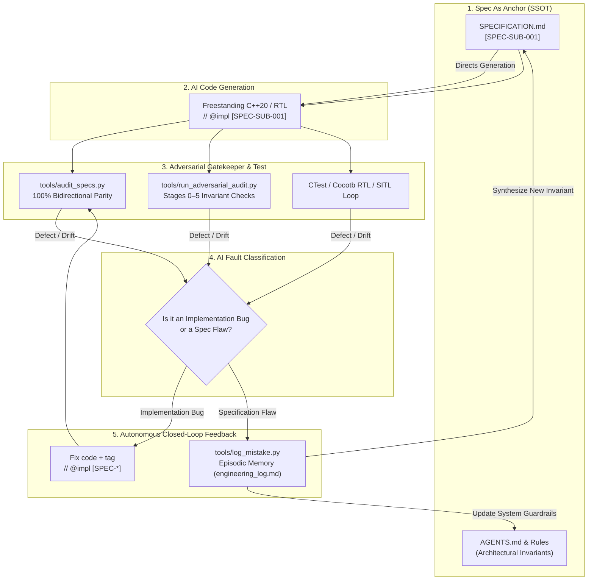
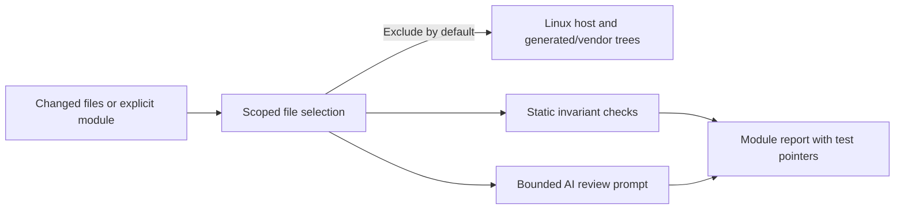
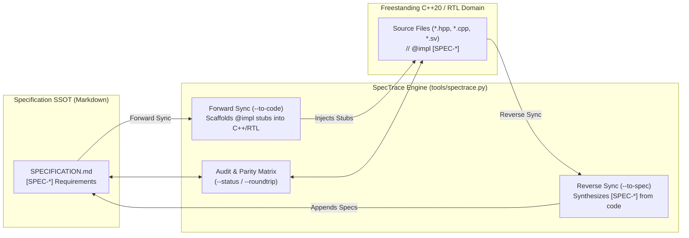

# SpecTrace: Autonomous Closed-Loop Architecture & Invariant Engineering

**SpecTrace** is the engineering-assurance framework governing development in AbstractX. It is inspired by high-assurance aerospace traceability practices, including DO-178C and NASA NPR 7150.2, and combines them with AI-assisted review and executable verification.

### `[SPEC-AUDIT-04]` Assurance Target and Certification Boundary
* AbstractX's target is an internal, evidence-backed engineering assurance
    profile: requirements are explicit and traceable, changes receive scoped
    review, and module verification results are reproducible.
* References to DO-178C Level A or NASA NPR 7150.2 describe the rigor that
    informs this process; they MUST NOT be represented as proof of compliance,
    approval, or certification. A successful SpecTrace audit is a project quality
    gate, not certification evidence by itself.
* AbstractX currently applies its own freestanding C++20 rules and may map
    selected MISRA C++ or CERT C++ guidance into future checks. ETL is an embedded
    C++ library used by the project, not a coding standard, and its use MUST NOT be
    presented as MISRA/CERT conformance. Any conformance claim requires naming the
    exact standard edition and adopted rules, using a suitable analyzer, and
    maintaining a documented deviation/waiver process.
* Any future certification objective MUST be established by the responsible
    system safety/certification authority and separately address applicable
    planning, independence, coverage, configuration management, tool qualification,
    and objective evidence requirements.

---

## 1. The Core Problem: Why Traditional Rigor (NASA/DO-178C) Stalls

Traditional safety-critical engineering frameworks like **DO-178C**, **NASA Class A Flight Software**, and **ISO 26262 ASIL-D** mandate end-to-end traceability: every line of source code must trace to a low-level requirement, which traces to a high-level architecture requirement.

However, in practice, human-driven traceability suffers from a critical failure mode:
1. **The Static Spec Trap**: Specifications are authored in massive Word docs, IBM DOORS, or Polarion matrices. They are disconnected from the compiler.
2. **The Friction of Change (CCB Bottleneck)**: When developers uncover a silicon erratum, an interrupt race condition, or an architectural flaw during hardware testing, filing a change through a human Configuration Control Board (CCB) takes weeks.
3. **Specification Drift**: Under delivery pressure, engineers patch the code directly. The specification rots, becoming historical fiction rather than the Single Source of Truth (SSOT).

### Conversely: Why Naive AI Coding ("Vibe Coding") Fails

On the opposite extreme, naive AI code generation:
1. Fixates on local fixes in chat without global architectural memory.
2. Hallucinates dynamic heap allocations (`new`, `malloc`, `std::vector`) or blocking calls in freestanding hardirq contexts.
3. Repeats the exact same subtle architectural mistakes across sessions because context windows are ephemeral.

---

## 2. What SpecTrace Does: The Autonomous Closed Loop

**SpecTrace solves what NASA and DO-178C were missing:**
> It uses AI agents not just to write code, but to **audit requirements**, **classify defects**, **detect architectural flaws in the specification itself**, and **autonomously close the feedback loop** by updating the specifications and agent rules before committing code.



---

## 3. The 4 Operational Stages of SpecTrace

### Stage 1: Specification-First Anchoring (`[SPEC-*]`)
No C++ or RTL is written without a preceding Markdown specification.
* Every architectural constraint, register mapping, bus transaction, and coroutine lifecycle is defined in `SPECIFICATION.md` with a unique requirement tag (`[SPEC-<SUBSYSTEM>-<ID>]`).
* Invariants are phrased as formal system contracts (e.g., *"Drivers MUST NOT allocate heap; transactions return `coro::Task<bool>`"*).

### Stage 2: Grand Traceability (`// @impl [SPEC-*]`)
Every single implementation function, hardware abstraction, and state machine carries a comment tag linking it directly to the specification requirement:
```cpp
// @impl [SPEC-ROUTER-001] targets/allwinner_e906/src/rpmsg.cpp
coro::Task<bool> AspRouter::dispatch_tlp_async(const Tlp64& packet) {
    // Zero-heap, asynchronous dispatch into lock-free SPSC ring
    ...
}
```
Validation is completely automated:
```bash
python3 tools/audit_specs.py
```
* Fails if any spec tag exists without implementing code.
* Fails if any code tag references a non-existent spec requirement.

### Stage 3: Adversarial Invariant Auditing
An independent Critic persona evaluates code and specifications across 6 strict stages:
* **Stage 0: Specification SSOT Anti-Drift** (Validates markdown structure, Mermaid diagrams, formal requirement tags).
* **Stage 1: Freestanding C++20 & Hardirq Safety** (Ensures zero heap, no forbidden STL headers, zero ISR resumes).
* **Stage 2: Non-Blocking HAL Coroutines** (Ensures no synchronous delays, yields via `co_await`).
* **Stage 3: Subsystem Contracts** (Primary-Paced Channel pattern, zero modulus prescalers).
* **Stage 4: Hardware Interconnect & 64B TLP Wire Framing** (Static assertion of 64-byte alignment, posted write flushes).
* **Stage 5: Adversarial Gatekeeper** (Deduplication, severity ranking, pass/fail decision).

```bash
python3 tools/run_adversarial_audit.py --all
```

### `[SPEC-AUDIT-01]` Module-Scoped Audit Inputs
* The default audit scope MUST be the current staged, unstaged, and untracked
    changes; it MUST NOT recursively audit unrelated targets or generated output.
* `--path <module>` MUST audit only the explicitly selected module path and its
    Markdown and production source files. `--related-path <path>` MAY be repeated
    to add associated tests or shared-interface contracts stored elsewhere. Linux
    host sources are excluded from default and `--all` scans; selecting
    `targets/linux` explicitly is the opt-in to audit that target.
* `--base-ref <ref>` MUST add the committed merge-base diff against `<ref>` to
    the working-tree changes. `--all` MUST remain an explicit sweep of maintained
    project modules and MUST prune build, vendor, and generated-output directories.
* Requirement-tag indexing MUST use maintained production source roots and MUST
    not load generated Buildroot/kernel/toolchain trees.

### `[SPEC-AUDIT-02]` Bounded AI Review Context
* The audit CLI MUST be able to emit an AI-review prompt containing the selected
    module scope, relevant spec/source/test paths, and review instructions for
    severity-ranked, evidence-backed findings. It MUST NOT claim that static
    checks prove correctness or replace module tests and human review.
* AI review MUST stay within the selected module unless cross-module interfaces
    are named as dependencies; unrelated Linux host code MUST NOT be pulled into
    the context by default.

### `[SPEC-AUDIT-03]` Foldable Audit Tool Sections
* The Python audit tool MUST group its CLI, scope selection, and invariant stages
    with named VS Code-recognized folding regions so maintainers can navigate each
    audit stage independently.

### `[SPEC-AUDIT-05]` Canonical Cross-Agent Review Command
* Copilot, Antigravity, and terminal users MUST share one repository command for
    the module review workflow: `python3 tools/spectrace.py --review`.
* The command MUST accept the module path, repeatable related test/contract paths,
    an optional Git base ref, and explicit full-sweep/Linux opt-ins. It MUST invoke
    the same scoped invariant auditor and preserve its exit status.
* The command MUST emit the bounded AI-review prompt by default; disabling the
    prompt MUST NOT skip static checks. Agent-specific prompts and rules MUST call
    this same command rather than implementing competing audit logic.



### Stage 4: Autonomous Closed-Loop Learning Gate
When a test fails, a bug is discovered, or an adversarial audit fails, SpecTrace categorizes the issue:

1. **Category A: Implementation Deviation**
   * *Diagnosis*: The specification was correct, but the AI or developer wrote code violating the spec.
   * *Resolution*: Correct the C++ code, ensure `// @impl` matches, and re-run audits.

2. **Category B: Specification Defect / Missing Invariant**
   * *Diagnosis*: The code obeyed the spec, but the spec failed to anticipate a hardware reality (e.g., DMA FIFO overrun on high-rate bursts, cache coherency between RISC-V and ARM, interrupt race).
   * *Resolution*:
     1. **Log in Episodic Memory**:
        ```bash
        python3 tools/log_mistake.py \
          --title "DMA FIFO overrun on 8kHz IMU burst" \
          --target "asp_router" \
          --spec "docs/DESIGN_SPECIFICATION.md" \
          --tag "SPEC-ROUTER-DMA-002" \
          --append
        ```
     2. **Update the Spec FIRST (`SPECIFICATION.md`)**: Add the missing hardware invariant or dataflow constraint.
     3. **Update Agent Rules (`AGENTS.md` / `.agents/rules/`)**: If the defect represents a class of architectural traps that future AI agents might repeat, add an explicit invariant rule.
     4. **Implement Code**: Implement the solution adhering to the updated spec.
     5. **Verify Zero Drift**: Run `audit_specs.py` and `run_adversarial_audit.py`.

### Stage 5: Full Round-Tripping (Bidirectional Spec <-> Code Synchronization)

What happens when engineers design in Markdown first, or write C++/RTL code first?

In traditional systems engineering, bidirectional synchronization is nonexistent: either code drifts from stale specs, or specs block developers from writing code. SpecTrace solves this with **Full Round-Tripping** orchestrated by `tools/spectrace.py`:



#### 1. Inspect Synchronization Status
Displays the real-time bidirectional matrix comparing requirements in `SPECIFICATION.md` against active code implementations:
```bash
python3 tools/spectrace.py --status
python3 tools/spectrace.py --spec apps/gps_imu_app/SPECIFICATION.md --status
```

#### 2. Forward Synchronization (Spec -> Code)
When new requirements are authored in Markdown, SpecTrace discovers their `* **Implementation Target**:` and automatically injects matching `// @impl [SPEC-*]` tags and function stubs into the target files:
```bash
# Preview code injections:
python3 tools/spectrace.py --to-code --dry-run

# Commit code injections:
python3 tools/spectrace.py --to-code --apply
```

#### 3. Reverse Synchronization (Code -> Spec)
When a programmer writes new C++ methods, device drivers, or register maps first, SpecTrace extracts their contracts, docstrings, and signatures, pushing formal requirement blocks back into `SPECIFICATION.md`:
```bash
# Preview spec additions:
python3 tools/spectrace.py --to-spec --dry-run

# Commit spec additions:
python3 tools/spectrace.py --to-spec --apply
```

#### 4. Full Two-Way Round-Trip Reconciliation
Reconciles both directions atomically in a single pass, ensuring 100% bidirectional parity across specifications and code:
```bash
python3 tools/spectrace.py --roundtrip --apply
```

---

## 4. Why AI Semantic Review Beats Traditional Static Analysis

Traditional code quality tools (Clang-Tidy, Cppcheck, SonarQube, Coverity) analyze **AST syntax and language grammar**. While necessary for catching null pointer dereferences or unused variables, static analysis is **architecturally blind**:

| Capability | Traditional Static Analysis (Linters) | Human Code Review | **SpecTrace AI Adversarial Review** |
| :--- | :--- | :--- | :--- |
| **Architectural Intent** | ❌ Blind to specifications and design patterns | ⚠️ Inconsistent; misses subtle edge cases | ✅ Compares code directly against `SPECIFICATION.md` |
| **Concurrency Invariants** | ❌ Checks syntax; cannot evaluate cooperative coroutine pacing | ⚠️ Hard to trace without dynamic execution | ✅ Audits primary-paced channels, zero spinloops, yield symmetry |
| **Cross-Layer Parity** | ❌ Operates inside a single translation unit | ⚠️ Difficult across heterogeneous CPU/FPGA code | ✅ Validates 64B TLP framing, CTF schemas, and bus flushes |
| **Bidirectional Sync** | ❌ Emits error messages only | ❌ Manual editing required | ✅ Autonomously pushes code back to spec (`--to-spec`) |
| **Episodic Learning** | ❌ Amnesic; flags the same error without learning | ⚠️ Knowledge trapped in reviewers' heads | ✅ Chronicles root causes into `engineering_log.md` |

---

## 5. Architectural Comparison Matrix

| Dimension | NASA / DO-178C Traditional | Traditional Static Analysis | Standard AI ("Vibe Coding") | **SpecTrace (AbstractX)** |
| :--- | :--- | :--- | :--- | :--- |
| **Source of Truth** | Word/DOORS documents (slow) | Language AST / Lint config | Ephemeral chat prompts | Markdown Specifications (`SPECIFICATION.md`) |
| **Semantic Review** | Human peer review committees | Regex / Syntax rules only | Agent reviews own code (echo chamber) | **Multi-Stage Adversarial Critic (`spectrace.py --audit`)** |
| **Traceability** | Manual compliance spreadsheets | Zero specification awareness | Zero traceability | **Automated `[SPEC-*]` $\leftrightarrow$ `// @impl` checks** |
| **Velocity** | Weeks/months per revision | Seconds, but shallow syntax | Seconds, but breaks architecture | **Seconds, with deep architectural verification** |
| **Round-Tripping** | ❌ None (Specs rot) | ❌ None | ❌ None | **✅ Full Two-Way Round-Trip (`spectrace.py --roundtrip`)** |
| **Defect Memory** | Static bug tracker (Jira) | None | Forgotten when context clears | **Episodic Learning (`engineering_log.md`)** |

---

## 6. Continuous SpecTrace Embedded Dashboard & Observability

Just as **Static Memory Footprint Tracking** (`tools/track_memory_footprint.py`) continuously monitors `.text`, `.rodata`, `.data`, and `.bss` allocations commit-by-commit to prevent RAM/Flash bloat, AbstractX applies this exact continuous tracking paradigm to **Specification Parity and Invariant Verification**:

```text
==============================================================================
 AbstractX SpecTrace Embedded Dashboard & Verification Matrix
==============================================================================
 Commit:  4a25c32 (main) - fix: finalize E906 and Zynq integration review
 Timestamp: 2026-10-09T15:45:47+00:00
------------------------------------------------------------------------------
 Specification Parity:    25 / 25 specs (100.0%) [● Stable]
 Adversarial Invariants:  8 / 8 passed [PASS] [● Stable]
 Test Suite Runtime:      235.1 ms (+25.8 ms vs prev)
 Dynamic Heap Budget:     0 B (Verified Freestanding)
------------------------------------------------------------------------------
 Trend Verdict:           STABLE - All invariants and specifications preserved (100% parity).
==============================================================================
```

### Answering: *"Are We Getting Better Over Time?"*
Executed via `python3 tools/track_quality_trends.py`, the embedded dashboard engine:
1. **Aggregates Specification Metrics**: Measures total requirements, implemented count, and drift count commit-over-commit.
2. **Measures Invariant Regressions & Execution Speed**: Runs the adversarial invariant test suite, recording test counts and suite runtime in milliseconds.
3. **Ingests Embedded Static Memory Metrics**: Ensures zero dynamic heap violations ($0\text{ B}$ heap) and SRAM/Flash boundaries across target ELF binaries.
4. **Maintains Historical Time Series**: Emits `tools/visualizer/quality_trends.json` for rendering in AbstractX Studio.
5. **Evaluates Trend Direction**: Automatically flags whether changes `IMPROVED`, remained `STABLE`, or `REGRESSED`.
6. **Maintains Living Git Profile**: Updates `docs/verification/RUNNING_PROFILE.md` with ASCII gauges and Mermaid charts.

---

## 7. Tooling Reference

* `tools/spectrace.py`: Master CLI for full round-trip synchronization, status reporting, and adversarial audits.
* `tools/track_quality_trends.py`: SpecTrace Continuous Quality & Embedded Observability Dashboard.
* `tools/track_memory_footprint.py`: Static RAM/Flash section footprint & zero-heap symbol auditor.
* `tools/sync_code_to_spec.py`: Reverse-sync engine pushing new C++/RTL functions and contracts back into specifications.
* `tools/audit_specs.py`: Bidirectional grand traceability checker.
* `tools/run_adversarial_audit.py`: 6-stage adversarial invariant analyzer.
* `tools/log_mistake.py`: Automated generator and logger for `engineering_log.md`.
* `tools/create_app_spec.py`: Scaffold new applications with compliant `SPECIFICATION.md`.

---

## 8. Architectural Positioning: HW/SW Co-Design & EDA Toolchains

Recent EDA initiatives (such as AMD Vivado AI research and Synopsys.ai Copilot) explore *"RAG-based knowledge bases to assist Agentic AI"* in digital hardware design. Commercial EDA tools excel at deep silicon compilation, technology mapping, timing closure, and hardware DRCs.

SpecTrace complements these EDA engines by addressing the critical **hardware/software systems boundary**:

1. **Deterministic Symbolically-Anchored Knowledge Base (SSOT / MBSE)**:
   Replaces fuzzy text chunking with structured, machine-parseable Markdown specifications (`[SPEC-*]`), memory maps, and register schemas that unify firmware and RTL.
2. **Bi-directional Requirement Traceability (RTM)**:
   Complies with DO-178C and DO-254 standards via `// @impl [SPEC-*]` source tags verified continuously across both C++20 software and SystemVerilog RTL by `tools/audit_specs.py`.
3. **Shift-Left Formal Policy Gating (SL-FPG)**:
   Catches interface drift, 0-heap violations, and 64B wire framing defects in < 250 ms before initiating synthesis or simulation runs.
4. **Reflexive Closed-Loop Learning (Actor-Critic-Chronicler)**:
   Enforces that specifications and episodic memory (`engineering_log.md`) are hardened *first* upon any silicon or interface defect.

*(For detailed architectural breakdown and comparison matrix, see [Deterministic HW/SW Co-Design: Structuring Knowledge Bases for Agentic AI in FPGA & Embedded Systems](./articles/AGENTIC_AI_AND_RAG_COMPARISON.md).)*

