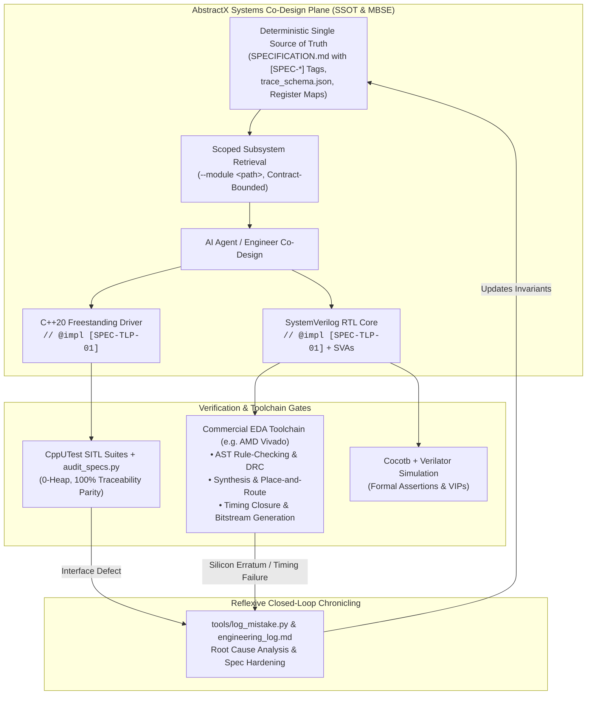

# Deterministic HW/SW Co-Design: Structuring Knowledge Bases for Agentic AI in FPGA & Embedded Systems

**Author:** AbstractX Engineering  
**Date:** October 2026  
**Audience:** Embedded Systems Engineers, FPGA RTL Designers, Systems Architects  

---

## Executive Summary

Recent industry presentations and technical papers across Electronic Design Automation (EDA)—including AMD Vivado research, Synopsys.ai Copilot, and academic symposia (DAC, DATE, ICCAD)—explore **"Retrieval-Augmented Generation (RAG) based knowledge bases to assist Agentic AI"** in hardware design and HDL generation.

AMD and major EDA vendors possess some of the world's finest compiler, formal verification, and silicon architects. In production environments, commercial EDA engines excel at:
* Deep hardware synthesis, technology mapping, and DSP/BRAM packing.
* Timing closure, clock-domain crossing (CDC) analysis, and physical place-and-route.
* Formal equivalence checking and hardware Design Rule Checks (DRC).

However, a fundamental challenge remains at the **hardware/software systems boundary**:
1. **The Representation Gap**: Standard document-level RAG retrieves text passages from reference manuals, but embedded architectures require deterministic, machine-enforceable contracts governing register bitfields, bus protocols, and memory layouts.
2. **The HW/SW Silo**: EDA tools optimize the silicon RTL, while embedded software teams write C++20 drivers, Linux device trees, and RTOS threads. Without a shared, traceable specification, interface drift between RTL and firmware is inevitable.
3. **Traceability Compliance**: Safety-critical standards (DO-254 for airborne hardware and DO-178C for flight software) mandate verifiable bi-directional requirement traceability from system design to lines of code and HDL.

**AbstractX and the SpecTrace framework address this exact systems boundary:** providing a **Deterministic Symbolically-Anchored Specification (SSOT / MBSE)**, **Bi-directional Requirement Traceability (RTM)**, and **Shift-Left Invariant Policy Gates** that unify synthesizable SystemVerilog with bare-metal C++20 coroutine drivers.

---

## 1. Architectural Synergy: EDA Silicon Synthesis + Systems HW/SW Traceability



---

## 2. Comparing Standard Vector RAG vs. Deterministic Structured RAG

| Architectural Dimension | Generic Document Vector RAG | Deterministic Structured SpecTrace | Industry & Aerospace Standards |
| :--- | :--- | :--- | :--- |
| **Knowledge Representation** | **Dense Vector Embeddings**<br>PDF chunks embedded via semantic vectors in Milvus, Chroma, or Pinecone. | **Symbolically-Anchored SSOT**<br>Machine-parseable Markdown specifications (`[SPEC-*]`), Mermaid sequence flows, and register JSON schemas. | **Model-Based Systems Engineering (MBSE)** & **Structured GraphRAG** |
| **Context Retrieval** | **Fuzzy Cosine Similarity**<br>Retrieves top-K semantic passages. Prone to boundary clipping across register bitfield tables and state machines. | **Keyed Subsystem Scoping**<br>Explicit scoping via `--module <path>` with bounded interface definitions and zero noise. | **Schema-Anchored Deterministic Retrieval** |
| **Requirement Verification** | **Open-Loop Prompting**<br>Generates code/RTL with no persistent link back to the requirement. | **Bi-directional Requirement Traceability (RTM)**<br>Every C++ function and SystemVerilog module embeds `// @impl [SPEC-*]`, validated via `audit_specs.py`. | **Bi-directional Requirement Traceability Matrix (DO-254 / DO-178C)** |
| **HW/SW Boundary** | **Siloed Generation**<br>RTL is generated in isolation from driver APIs, ring buffers, and interrupt topologies. | **Unified HW/SW Co-Design**<br>The same requirement tag governs the FPGA crossbar (`asp_router.sv`), the Linux UIO tree, and the C++20 coroutine driver. | **Symmetrical HW/SW Co-Design & Co-Verification** |
| **Safety Invariants** | **Post-Synthesis DRC Only**<br>Catches structural errors only after full multi-hour synthesis runs. | **Shift-Left Formal Policy Gating (SL-FPG)**<br>Sub-second static checks catch zero-heap violations, bus blocking, and framing errors in < 250 ms. | **Shift-Left Invariant Policy Gating** |
| **Episodic Learning** | **Stateless / Session-Bounded**<br>LLM context resets across chat turns; historical mistakes repeat. | **Reflexive Closed-Loop Chronicling**<br>`tools/log_mistake.py` records root causes into `engineering_log.md` and hardens `SPECIFICATION.md` *before* code fix. | **Reflexive Episodic Memory & Knowledge Base Hardening** |

---

## 3. Concrete Example: Symmetrical HW/SW Co-Design in AbstractX

A practical demonstration of this workflow in the AbstractX repository:

### 1. The Shared SSOT Requirement (`docs/DESIGN_SPECIFICATION.md`)
```markdown
### `[SPEC-TLP-01]` 64-Byte Wire Format & Parallel Channel Routing
All inter-core, processor-to-FPGA, and network messages must strictly match 
the 64-byte `asp_tlp64_t` layout (`alignas(64)`), routed by 8-bit Channel ID.
```

### 2. The Freestanding C++20 Driver (`include/asp_tlp64.hpp`)
```cpp
// @impl [SPEC-TLP-01] include/asp_tlp64.hpp
struct alignas(64) Tlp64 {
    asp_tlp64_t wire;
    // Zero-heap, strongly-typed packet encapsulation
};
```

### 3. The Synthesizable SystemVerilog RTL (`rtl/asp_router.sv`)
```systemverilog
// @impl [SPEC-TLP-01] rtl/asp_router.sv
module asp_router (
    input  wire         clk,
    input  wire         rst_n,
    input  wire [511:0] s_tlp_tdata, // 512-bit (64-byte) parallel vector
    ...
);

`ifndef SYNTHESIS
    // Formal SystemVerilog Assertion (SVA) verifying mutual exclusion
    property p_ingress_demux_mutual_exclusion;
        @(posedge clk) disable iff (!rst_n)
        (m_ctrl_tvalid + m_tel_tvalid + m_esc_tvalid) <= 1;
    endproperty
    assert property (p_ingress_demux_mutual_exclusion)
        else $error("[SVA-ROUTER-01] Multi-hot channel valid asserted!");
`endif
endmodule
```

### 4. Automated Dual-Plane Verification
* **Software**: CppUTest SITL test suites verify 0-byte dynamic memory allocation and coroutine packet handling.
* **Hardware**: Verilator + Cocotb testbenches simulate ingress routing, priority arbitration, and SVA assertions.
* **Traceability Gate**: `python3 tools/audit_specs.py` enforces 100% mutual bidirectional parity across both C++20 and SystemVerilog files:
  ```text
  SPEC-TLP-01 | COMPLETE | asp_tlp64.hpp:55, gps_imu_app/main.cpp:34, rtl/asp_router.sv:11
  Coverage: 100.0%
  ```

---

## 4. Conclusion

The future of AI in hardware and embedded systems is not about replacing deep synthesis tools like AMD Vivado with generic chat prompts. It is about **coupling the unmatched silicon synthesis and formal analysis of EDA toolchains with deterministic, traceable HW/SW specification frameworks**.

By replacing fuzzy vector chunking with structured, machine-parseable contracts (`[SPEC-*]`), engineering teams can leverage AI agents for rapid co-design while maintaining the zero-hallucination rigor demanded by aerospace and mission-critical systems.
