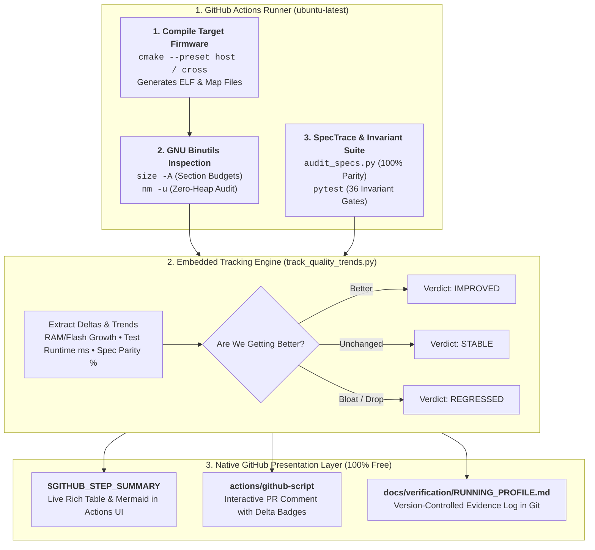
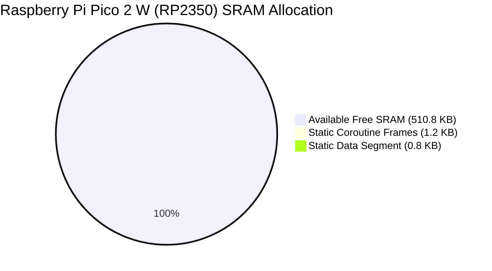

# Embedded Firmware Observability on a Budget: Tracking Memory & Traceability Using Pure GitHub

> **By Tim Michals & The AbstractX Team**  
> *Published in the AbstractX Engineering Series &bull; October 2026*

---

## 1. Embedded Observability for Teams on a Budget

For embedded systems developers building firmware for resource-constrained microcontrollers (like the **Raspberry Pi Pico 2 / RP2350**, **ESP32**, **STM32**, or bare-metal **RISC-V** cores), static RAM and Flash budgets are existential constraints. A hidden 2 KB buffer bloat in `.data` or an inadvertent dynamic heap allocation can silently brick an aerospace flight controller or trigger hard faults in the field.

To catch these issues early, many teams look into dedicated continuous memory observability platforms and cloud monitoring services. These tools can be useful, but for open-source projects, early-stage startups, and teams operating on a tight budget, adding external SaaS subscriptions isn't always practical or necessary. Managing external API keys, handling token expirations, and maintaining separate web dashboards outside your repository can introduce operational overhead when all you want is a fast, self-contained feedback loop.

In **AbstractX**, we asked a practical question:  
*How far can we get using only the built-in, free features already provided by Git and GitHub?*

It turns out you can build a comprehensive, automated firmware memory gate and requirement traceability system using tools you already have: standard GNU Binutils, Python, GitHub Actions Step Summaries, and native GitHub Script. This guide shares our recipe so any embedded project can set up self-contained memory and test tracking with zero extra cost.

---

## 2. Architecture Overview: Git as the Single Source of Truth

Rather than pushing metrics to an external server, our architecture treats **Git and GitHub Flavored Markdown** as the definitive database and presentation layer:



---

## 3. Step 1: Auditing Memory with GNU Binutils (`size` & `nm`)

Every C++ cross-compiler toolchain (`arm-none-eabi`, `riscv64-unknown-elf`, or host `gcc`) ships with the standard GNU Binutils suite. You do not need proprietary parsers to inspect firmware.

### A. Section Allocation via `size -A`
Running `size -A <binary.elf>` prints an exact breakdown of every static ELF segment:

```bash
$ size -A build_e906/apps/gps_imu_app/gps_imu_app
section                 size        addr
.text                 149800   1073741824
.data                   1992   1073891624
.bss                   88808   1073893616
.stack                 16384   1073982424
.trace_buffer           8192   1073998808
Total                 266350
```

In our Python helper (`tools/track_memory_footprint.py`), we aggregate these sections into physical device hardware buckets:
* **Physical SRAM**: `.bss` + `.data` + `.stack` + `.trace_buffer`
* **Physical Flash / ROM**: `.text` + `.rodata` + `.ARM.extab`

### B. Enforcing Freestanding Zero-Heap via `nm -u`
In bare-metal safety-critical flight code, `operator new` and `malloc()` are strictly prohibited. Instead of writing complex static analysis rules, we verify zero heap directly against the compiled binary symbol table using `nm -u` (which lists undefined symbols requiring dynamic runtime resolution):

```python
def audit_zero_heap(elf_path: Path):
    """Audits the ELF symbol table to verify zero heap dynamic allocations."""
    forbidden = ["malloc", "free", "_malloc_r", "_free_r", "calloc", "realloc", "_Znwm", "_Znam", "_ZdlPv"]
    cmd = ["nm", "-u", str(elf_path)]
    res = subprocess.run(cmd, stdout=subprocess.PIPE, text=True)
    for sym in forbidden:
        if sym in res.stdout:
            return False, f"Violation: Forbidden heap symbol '{sym}' referenced"
    return True, "Zero dynamic heap references (Verified)"
```

If an engineer introduces `std::vector` or `new MyClass()`, the symbol `_Znwm` appears in the binary and immediately fails the CI gate with an explicit line pointing to the offending target.

---

## 4. Step 2: Continuous Tracking & Answering "Are We Getting Better?"

Raw memory numbers are useful, but engineering leads need to know: **Are our commits making the firmware better, leaner, and faster, or are we experiencing architectural drift?**

Our script (`tools/track_quality_trends.py`) records snapshots into a versioned JSON history file (`quality_trends.json`) and calculates mathematical deltas:

1. **Specification Traceability Delta ($\Delta\%$ Requirement Parity)**: Compares current implementation tags against Markdown specifications.
2. **Invariant Test Health ($\Delta$ Passing Tests)**: Tracks the number of passing adversarial gates.
3. **Execution Duration Delta ($\Delta\text{ms}$)**: Measures test execution time in milliseconds to catch algorithm slowdowns.
4. **Memory Footprint Delta ($\Delta\text{KB}$)**: Measures RAM and Flash growth against physical hardware limits.

```python
def evaluate_progress(current, previous):
    if not previous:
        return {"verdict": "BASELINE", "summary": "Initial baseline established."}

    spec_delta = round(current["specs"]["coverage_pct"] - previous["specs"]["coverage_pct"], 1)
    test_delta = current["tests"]["passed"] - previous["tests"]["passed"]
    speed_delta = round(current["tests"]["duration_ms"] - previous["tests"]["duration_ms"], 1)

    if test_delta < 0 or spec_delta < 0:
        return {"verdict": "REGRESSED", "summary": f"Regression: {test_delta} tests dropped, {spec_delta}% spec drop."}
    if test_delta > 0 or spec_delta > 0 or speed_delta < -10.0:
        return {"verdict": "IMPROVED", "summary": f"Getting better: {speed_delta}ms faster, +{test_delta} tests."}

    return {"verdict": "STABLE", "summary": "All invariants and specifications preserved."}
```

---

## 5. Step 3: Native GitHub Step Summaries (`$GITHUB_STEP_SUMMARY`)

GitHub Actions includes a built-in feature that many teams overlook: **Job Summaries**.

By appending standard Markdown to the path pointed to by `$GITHUB_STEP_SUMMARY`, GitHub renders tables, badges, and even **interactive Mermaid charts** directly in the Actions run UI:

```python
summary_path = os.environ.get("GITHUB_STEP_SUMMARY")
if summary_path:
    with open(summary_path, "a", encoding="utf-8") as f:
        f.write("## 📊 AbstractX SpecTrace Embedded Observability & Quality Dashboard\n\n")
        f.write("| Metric | Current Status | Trend vs Previous |\n")
        f.write("| :--- | :--- | :--- |\n")
        f.write(f"| **Specification Parity** | **{s['implemented']}/{s['total']}** ({s['coverage_pct']}%) | `{eval_res['spec_delta']:+0.1f}%` |\n")
        f.write(f"| **Adversarial Invariants** | **{t['passed']}/{t['total']}** [{t['status']}] | `{eval_res['test_delta']:+d} tests` |\n")
        f.write(f"| **CppUTest SITL Mocks** | **{c['tests']} tests ({c['checks']} checks)** | 0 B Leaked |\n")
        f.write(f"| **Inter-Core Latency (Pico 2)** | **8–12 cycles (53–80 ns)** | SIO FIFO Ring |\n")
        f.write(f"| **Test Suite Runtime** | **{t['duration_ms']} ms** | `{eval_res['speed_delta_ms']:+0.1f} ms` |\n")
        f.write(f"| **Dynamic Heap Gate** | **0 B (Compliant)** | Verified Freestanding |\n")
```

When you click on the completed GitHub Action, you are greeted with a beautiful, formatted dashboard—no login to a third-party website required!

---

## 6. Step 4: Bot PR Delta Comments with `actions/github-script`

To give developers immediate feedback on Pull Requests, we want a bot comment that summarizes memory impact and test speed. 

Instead of configuring a paid GitHub Marketplace App or webhook bot, GitHub provides `actions/github-script`. It gives you authenticated access to the GitHub Octokit REST API with zero token management:

```yaml
- name: Native GitHub PR SpecTrace & Memory Dashboard Comment
  uses: actions/github-script@v7
  if: github.event_name == 'pull_request'
  with:
    script: |
      const fs = require('fs');
      const summaryFile = 'tools/visualizer/pr_comment.md';
      if (fs.existsSync(summaryFile)) {
        const body = fs.readFileSync(summaryFile, 'utf8');
        
        // 1. Check if the bot already commented on this PR
        const { data: comments } = await github.rest.issues.listComments({
          owner: context.repo.owner,
          repo: context.repo.repo,
          issue_number: context.issue.number,
        });
        const botComment = comments.find(c => 
          c.body.includes('AbstractX SpecTrace Embedded Dashboard & Quality Gate')
        );

        // 2. Update existing comment in-place (no comment spam!) or create a new one
        if (botComment) {
          await github.rest.issues.updateComment({
            owner: context.repo.owner,
            repo: context.repo.repo,
            comment_id: botComment.id,
            body: body
          });
        } else {
          await github.rest.issues.createComment({
            owner: context.repo.owner,
            repo: context.repo.repo,
            issue_number: context.issue.number,
            body: body
          });
        }
      }
```

Every time an engineer pushes a commit to their PR branch, the bot updates the single existing comment in place. The comment includes a **Mermaid pie chart** showing exact SRAM allocation:



---

## 7. Step 5: The Version-Controlled Running Profile

Finally, when code merges into `main`, where should historical evidence live?

In AbstractX, the workflow automatically updates `docs/verification/RUNNING_PROFILE.md` directly in Git. It generates:
* **ASCII Progress Gauges**: Visual bar meters (`[██████████░░] 84.2%`) representing memory and test health.
* **16-Example Concurrency Matrix**: Verifies that multi-rate sensor fusion, asymmetric multi-core TLP rings, and robot motion trajectories are passing without stack overflows.
* **Mermaid Runtime Trend Charts**: Tracking test suite execution duration across commits.

Because `RUNNING_PROFILE.md` is committed to the repository, you can:
* View it instantly from the GitHub repo homepage or Markdown browser.
* Use `git diff` to inspect memory impact between two release tags (`git diff v1.0..v1.1 docs/verification/RUNNING_PROFILE.md`).
* Audit compliance years later without relying on a third-party company's survival.

---

## 8. Putting It All Together: The 100% Free Workflow

Here is the complete GitHub Actions workflow (`.github/workflows/spectrace_dashboard.yml`) running this pipeline:

```yaml
name: AbstractX SpecTrace Embedded Dashboard & Quality Gate

on:
  push:
    branches: [main]
  pull_request:

permissions:
  contents: write      # Required to update RUNNING_PROFILE.md
  pull-requests: write # Required for native PR comments

jobs:
  spectrace-dashboard:
    name: SpecTrace Embedded Dashboard & Verification Matrix
    runs-on: ubuntu-latest

    steps:
      - name: Checkout Code
        uses: actions/checkout@v4
        with:
          submodules: recursive

      - name: Set up Build & Test Environment
        run: |
          sudo apt-get update
          sudo apt-get install -y cmake ninja-build python3-pip binutils
          python3 -m pip install pytest

      - name: Build Host Verification Binaries
        run: |
          cmake --preset host
          cmake --build --preset host --target gps_imu_app

      - name: SpecTrace Parity Audit (100% SSOT Requirement Gate)
        run: python3 tools/audit_specs.py

      - name: Adversarial Invariant Architecture Regression Suite
        run: pytest tests/test_adversarial_invariants.py

      - name: Static Memory Footprint & Zero-Heap Symbol Audit
        run: python3 tools/track_memory_footprint.py

      - name: SpecTrace Embedded Dashboard & Running Profile Engine
        run: python3 tools/track_quality_trends.py

      - name: Native GitHub PR SpecTrace & Memory Dashboard Comment
        uses: actions/github-script@v7
        if: github.event_name == 'pull_request'
        with:
          script: |
            // (Updates PR comment in-place using tools/visualizer/pr_comment.md)
```

---

## 9. Conclusion & Key Takeaways

By building on native Git and GitHub capabilities, the AbstractX project achieved:

1. **Zero Extra Cost**: Fully automated memory observability and traceability using standard GitHub free-tier minutes.
2. **Robust & Self-Contained CI**: Standard GNU tools (`size`, `nm`, `cmake`) run identically on developer laptops, Docker containers, and GitHub Actions runners without external dependencies.
3. **Permanent Version-Controlled Record**: All memory numbers, test speeds, and requirement parity metrics live directly alongside the code in Git history.
4. **Clean PR Review Experience**: Contributors get instant feedback with rich Mermaid charts and memory delta tables directly inside their Pull Request conversations.

For open-source projects, hardware hackers, and teams on a budget, **Git + GNU Binutils + GitHub Script provides everything you need to keep your firmware lean and verifiable.**
