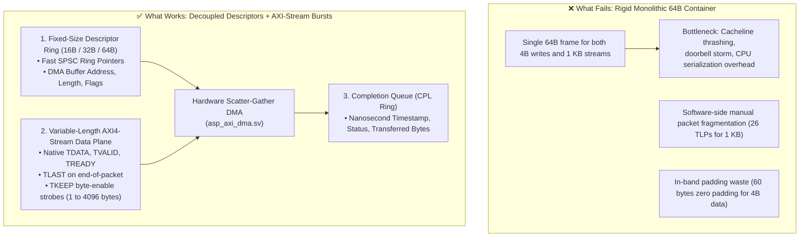

# Scaling Beyond Fixed TLPs: Lessons from Open-Source PCIe & AXI-Stream (Alex Forencich Patterns)

**Author:** AbstractX Engineering  
**Date:** October 2026  
**Reference Implementations:** [Alex Forencich `verilog-pcie`](https://github.com/alexforencich/verilog-pcie), [`verilog-axis`](https://github.com/alexforencich/verilog-axis), [`corundum`](https://github.com/corundum/corundum)  

---

## Executive Summary

A fixed 64-byte Transaction Layer Packet (TLP) is a common starting point in FPGA/SoC prototypes because it simplifies hardware switch fabric (`asp_router.sv`): with a fixed 512-bit width, crossbar routing requires no dynamic length parsing, no byte-boundary shift registers, and no fragmentation state machines.

However, as bus bandwidth and data complexity grow, **rigid fixed-length containers hit severe scaling walls**:
1. **Tiny Transfers (4-byte Register Writes)**: 93.75% of the 64-byte frame is empty padding, choking bus throughput and wasting cachelines.
2. **Bulk Streaming Transfers (Trace, Flash, Vision)**: When sending a 1,024-byte trace burst, the 40-byte payload limit forces software into 26 fragmented TLPs, creating heavy header serialization and ring pointer churn.

By studying open-source PCIe and Ethernet switch architectures—most notably **Alex Forencich’s** production-proven repositories (`verilog-pcie`, `verilog-axis`, and the 100G `corundum` NIC)—we can establish clear architectural rules for **what works, what fails, and how static audits should govern the bus**.

---

## 1. What Works vs. What Fails: The Architectural Matrix



### Comparative Breakdown

| Architectural Feature | Rigid Fixed 64B Container (Current Prototype) | Forencich PCIe / Corundum Architecture | Scalability Impact |
| :--- | :--- | :--- | :--- |
| **Control / Register I/O** | Full 64B TLP (60B overhead on a 4B write) | Immediate Data in 3-DW/4-DW Header or AXI-Lite write beat | **16x less bus overhead** for register accesses |
| **Bulk Streaming (Trace/Vision)** | Software slices buffer into 40B chunks; sends 26 separate TLPs for 1 KB | Single DMA Descriptor in ring; DMA bursts 1,024 bytes over AXI-Stream with `TLAST` | **26x fewer ring pointer updates**; zero CPU fragmentation |
| **FPGA Switch Complexity** | Minimal (single-cycle 512-bit crossbar, no length parsing) | Moderate (AXI-Stream arbiters handle `TLAST` and packet boundaries) | Requires packet-delimited arbiters (`axis_arb_mux.v`) |
| **Hardware Reassembly** | None (software must reconstruct multi-packet chunks) | Native (Scatter-Gather DMA hardware packs/unpacks buffers) | Zero CPU copy overhead |
| **Verification & VIPs** | Ad-hoc Cocotb packet drivers | `cocotbext-axi` and `cocotbext-pcie` cycle-accurate bus models | Proven, automated regression testbenches |

---

## 2. The 3 Architectural Lessons from Forencich's PCIe & Ethernet Stacks

### Lesson 1: Decouple the Descriptor Ring from the Data Plane
In Alex Forencich's `corundum` NIC:
* The **Descriptor Queue** is a circular ring of fixed-size records (32 bytes). Each descriptor contains:
  ```c
  struct dma_desc {
      uint64_t dma_addr;    // Physical memory or BRAM address
      uint32_t length;      // Exact byte count (1 to 65,535 bytes)
      uint16_t tag;         // Transaction correlation ID
      uint16_t flags;       // Interrupt enable, end-of-frame
  };
  ```
* The **Data Plane** does not care about the descriptor format: it moves data across a standard **AXI4-Stream** bus using `tdata`, `tkeep`, `tvalid`, `tready`, and `tlast`.

**Application to AbstractX:**  
The 64-byte `Tlp64` should be treated as the **Control & Descriptor Container**. When sending discrete IMU samples (23B) or GPS fixes (35B), it travels inline. When sending a 1 KB trace buffer or flash block, `Tlp64` acts as a **DMA Descriptor (`TlpType::DmaConfig = 0x11`)**, pointing to the BRAM/DRAM ring while the data bursts over AXI-Stream.

### Lesson 2: AXI-Stream Native Framing (`TLAST` + `TKEEP`)
Instead of forcing 512-bit parallel busses to always hold 64 valid bytes:
* Use `tlast` to signal the end of a variable-length burst.
* Use `tkeep` (byte enable strobe, 1 bit per byte) so odd-length packets (e.g. 15-byte IMU bursts or 92-byte GPS packets) do not require artificial padding or custom length decoders.
* Forencich's `verilog-axis` provides open-source, verified building blocks (`axis_fifo`, `axis_arb_mux`, `axis_switch`, `axis_async_fifo`) that handle cross-clock domain packet crossing cleanly.

### Lesson 3: Cycle-Accurate Cocotb Verification (`cocotbext-axi` & `cocotbext-pcie`)
Forencich created the standard Python verification extensions for Cocotb:
* `cocotbext-axi`: Simulates AXI4, AXI-Lite, and AXI-Stream master/slave interfaces with randomized ready/valid handshakes, backpressure, and pause states.
* `cocotbext-pcie`: Models PCIe Root Complexes, endpoints, and TLP generators.
* Integrating these into AbstractX's `sim/cocotb/` testbenches replaces ad-hoc Python bus helpers with industry-standard VIPs.

---

## 3. What the Adversarial Audit Must Catch (Audit Rules)

To prevent AI coding agents and human developers from introducing unscalable bus bottlenecks, our SpecTrace audit enforces the following rules:

### Rule 1: No Unsegmented Overruns into Fixed TLPs (`[SPEC-AUDIT-06]`)
* **What it catches**: Any C++ driver code attempting to push a buffer larger than `ASP_TLP64_PAYLOAD_SIZE` (40 bytes) into a single `Tlp64` container without multi-packet segmentation or DMA descriptor configuration.
* **Audit Enforcement**: `tools/run_adversarial_audit.py` Stage 4 scans for `Tlp64::make_raw(..., size > 40)` and flags an immediate invariant failure.

### Rule 2: Escalation to DMA Burst for Bulk Endpoints
* **What it catches**: Applications or drivers attempting to stream high-throughput data (> 128 bytes/sec or bulk blocks like 1 KB trace buffers) across raw single-TLP rings instead of configuring the AXI DMA engine (`asp_axi_dma.sv`).
* **Audit Enforcement**: Architectural audit checks that bulk trace sinks (`TraceDispatcherConfig`) and flash drivers declare a coherent DMA buffer contract.

### Rule 3: RTL Handshake & `TLAST` Liveness in SystemVerilog
* **What it catches**: SystemVerilog streaming modules that drop `tvalid` before `tready` is asserted, or omit `tlast` on packet completion.
* **Audit Enforcement**: Verified via formal SystemVerilog Assertions (`SVA`) and Cocotb regression suites before synthesis.

---

## 4. Concrete Roadmap for AbstractX Bus Evolution

1. **Phase 1 (Current / Stable)**: Fixed 64-byte `Tlp64` for control, register BAR access, discrete IMU/GPS telemetry, and low-latency doorbells.
2. **Phase 2 (Immediate Enhancement)**: Leverage Forencich's `axis_arb_mux` and `axis_fifo` patterns in `rtl/` for variable-length AXI-Stream bursts with `TLAST` and `TKEEP`.
3. **Phase 3 (Bulk Streaming)**: Formally adopt Corundum-style 32B/64B descriptor rings for bulk trace logging and camera/sensor DMA bypass.
