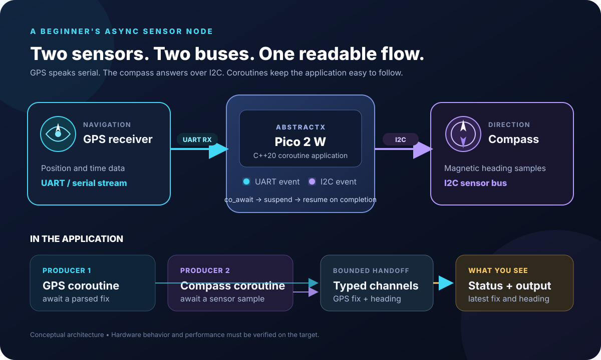
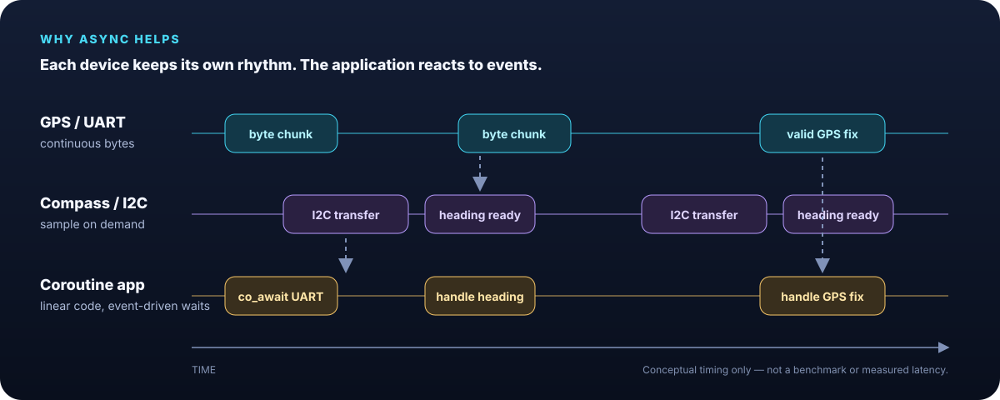
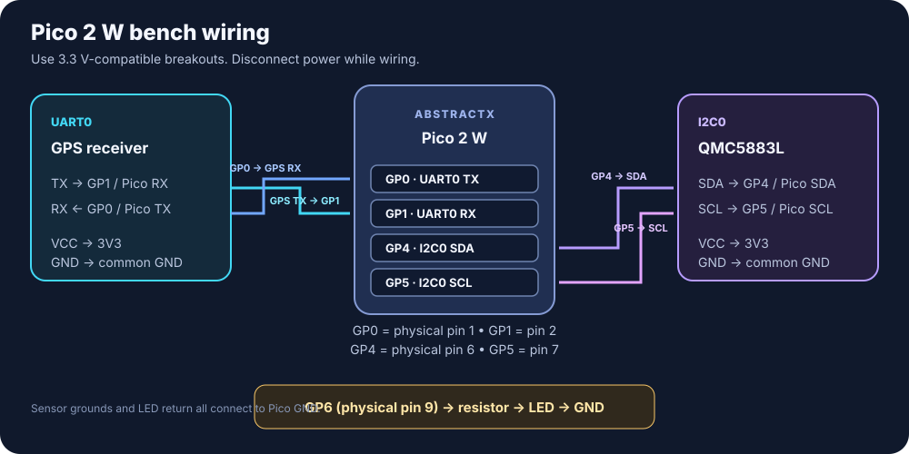

# Two Sensors. Two Buses. One Readable Flow.

## Build a GPS + compass sensor node with straight-line async on Pico 2 W

Your GPS is streaming bytes over UART. Your compass is answering reads over
I²C. They run at different rates—but your application does not need to become
a tangle of polling loops, callback chains, or hand-maintained states.

This project shows **straight-line async**: write the steps in the order a
person understands them, then let `co_await` suspend each operation until its
hardware event arrives. While one device is waiting, the other can keep making
progress. The payoff is code that stays easy to follow while the I/O is
asynchronous underneath.

The demo is deliberately small: GPS, compass, a status indicator, and a
readable output path. It is a hands-on way to see the AbstractX ideas that
matter in a real sensor node—independent bus activity, bounded data handoff,
and the requirements/audits that keep the implementation honest.

This article uses that sensor node to explain AbstractX's approach to
cooperative C++20 coroutines. The central idea is **straight-line async**:
application code reads top-to-bottom, while each `co_await` yields until a
hardware or timer event makes progress possible. GPS reception and compass
sampling can proceed independently without making the application bounce among
hand-maintained states and callbacks.

The article also places Protothreads and Pigweed in context: it describes an
engineering progression and different design choices, not a contest or a claim
that state machines are inherently wrong.

> **The one-line takeaway:** Write it linearly. Let events make it move.



*One application, two independent sensor paths, and a bounded handoff to the logic that uses each sample.*

> **Scope:** This is an architectural walkthrough, not a ready-to-flash
> standalone sample. The repository's [`gps_imu_app`](../../../apps/gps_imu_app/)
> already contains GPS/UART and magnetometer/I²C producer examples, but it is a
> larger reference application that also requires an SPI IMU and associated
> wiring. A minimal Pico 2 W GPS + I²C + LED app, its USB-console setup, and
> end-to-end hardware validation are follow-up work. See the
> [Pico 2 W target guide](../../../targets/pico2w_rp2350/HOWTO.md) for current
> target setup, and check its prerequisites before attempting a build.

## The example node

The interesting part is not just connecting two sensors. It is what happens
when they do not finish together:

```text
GPS UART:     bytes arrive ──> parse fix ───────────> publish GPS sample
Compass I²C:       start read ───────> sample ready ─> publish heading
App logic:    handle whichever sample is ready; never wait by spinning
```

Each coroutine describes one device's work. `co_await` marks a real suspension
point; it does not create a thread or make a blocking driver magically
asynchronous. The target driver must start the transfer and report completion
through its interrupt/DMA event path.



*Conceptual timing only—not a latency measurement or benchmark.*

Use a Pico 2 W, a UART GPS receiver, a QMC5883L magnetometer, and an external
LED with a current-limiting resistor. An external LED avoids confusion with
the Pico 2 W's wireless-controller-driven onboard LED.

| Device | AbstractX interface | Pico 2 W connection |
| --- | --- | --- |
| GPS TX → Pico RX | UART0 | GP1, physical pin 2 |
| GPS RX ← Pico TX | UART0 | GP0, physical pin 1 |
| QMC5883L SDA | I²C0 | GP4, physical pin 6 |
| QMC5883L SCL | I²C0 | GP5, physical pin 7 |
| GPS and compass power | — | Pico 3V3(OUT), physical pin 36; use 3.3 V-compatible boards |
| Common ground | — | Connect both sensors and LED return to Pico GND |
| External LED | GPIO | GP6, physical pin 9, through a suitable resistor |

The GPS UART and human-readable console are separate channels. Keep GPS on
UART0; configure a USB CDC console explicitly for logs in a runnable sample.
Do not put debug text on the GPS UART. Confirm the GPS module's voltage
requirements and the sensor breakout's I²C pull-ups before connecting power.



*The diagram shows GPIO numbers; use the pinout table above to find physical header pins. All devices must share ground.*

The QMC5883L driver is in
[`include/abstractx/drivers/mag/qmc5883l.hpp`](../../../include/abstractx/drivers/mag/qmc5883l.hpp),
and the GPS parser/driver is in
[`include/abstractx/drivers/gps/ublox_gps.hpp`](../../../include/abstractx/drivers/gps/ublox_gps.hpp).
The Pico target's peripheral pin assignments are documented in its
[hardware specification](../../../targets/pico2w_rp2350/SPECIFICATION.md).

## Protothreads: a useful previous generation

Protothreads made cooperative concurrency practical on small systems with
severe memory limits. They represent a task's continuation with compact,
explicit state, rather than allocating a full stack per task. This makes them
valuable on constrained platforms and an important part of AbstractX's
development history.

That compactness comes with a programming model to learn: a Protothread
typically advances through explicit yield points and continuation macros.
Local automatic variables cannot in general be treated as persistent task
state across a yield; state that must survive has to be stored deliberately.
As control flow grows, developers need to track both the task's logical state
and where execution will continue.

For example, the repository's
[`protothreads_walkthrough_async_serial.cpp`](../../../examples/protothreads_walkthrough_async_serial.cpp)
shows an interactive serial flow built around explicit asynchronous
continuations. It is useful historical context—not a bad approach, just a
different generation and tradeoff.

## The C++20 coroutine step

C++20 coroutines let the compiler represent suspension points directly in
ordinary-looking control flow. The `co_await` operator marks where a routine
can yield; the awaited operation determines what event makes it ready again.
This makes sequencing and local state easier to read than a hand-maintained
continuation, while retaining cooperative execution.

That is the point of **straight-line async**: asynchronous behavior does not
require application logic to be written as a sequence of scattered callback
transitions. The coroutine says what happens next in order; the event-driven
driver suspends and later makes it runnable again. This depends on a genuinely
non-blocking driver—putting `co_await` around a blocking transfer would not make
the I/O asynchronous.

In AbstractX, the intent is to pair that language feature with an event-driven
HAL, fixed-capacity data handoff, and an application runtime. The coroutine
syntax is not the differentiator by itself: other embedded frameworks,
including [Pigweed](https://github.com/pigweed-project/pigweed), also support
C++20 coroutine-based work. Pigweed is a broader embedded development
ecosystem; this article is not a feature-by-feature comparison. AbstractX's
focus here is its particular combination of HAL awaitables, cooperating
peripheral tasks, and bounded sensor-data flow.

The repository's GPS producer currently follows this shape:

```cpp
Task<void> gps_producer_task(UbloxGps& gps) {
    while (true) {
        GpsFix fix = co_await gps.next_fix_async();
        if (fix.valid) {
            g_gps_channel.try_push(fix);
        }
    }
}
```

The magnetometer producer runs independently, waiting between samples without
holding up GPS processing:

```cpp
Task<void> mag_producer_task(Qmc5883l& mag, hal::ITimer& timer) {
    while (true) {
        co_await timer.sleep_ms_async(20);
        MagSample sample = co_await mag.read_sample_async();
        if (sample.valid) {
            g_mag_channel.try_push(sample);
        }
    }
}
```

These examples are adapted from
[`apps/gps_imu_app/src/main.cpp`](../../../apps/gps_imu_app/src/main.cpp). They
show the producer shape; they are not a complete, standalone app. In
particular, bounded queue capacity forces an application to choose what to do
when a queue is full. Production code should check each `try_push()` result
and define an explicit drop, retry, or backpressure policy.

The LED is an output, not another sensor. A small status routine can wait for
the next GPS fix, update the latest application state, and set GP6 accordingly.
The GPIO operation itself is a short direct hardware action; it does not need
to be made asynchronous merely to use coroutines elsewhere. A separate
USB-serial console routine can report meaningful state without sharing the
GPS's UART.

The expected dataflow is:

```text
GPS UART ──await parsed fix──> GPS producer ──> bounded GPS channel ──┐
                                                                      ├─> status logic ──> LED
QMC5883L I²C ─await sample──> I²C producer ──> bounded sensor channel ┘
                                                                         └─> USB CDC diagnostics
```

Each producer advances at the rate of its own device. Status logic can combine
the most recent fix and sensor sample without a blocking read of one device
holding up the other. A real application still needs to define freshness,
invalid-data, queue-overflow, and reconnect behavior.

## What improves—and what does not

The benefit is primarily in application structure:

- **Readable suspension points:** `co_await` makes the place where a routine
  yields visible in normal C++ control flow.
- **Independent peripheral progress:** GPS input and I²C sampling can wait on
  their respective events rather than being advanced by a shared polling
  counter.
- **Typed handoff:** a bounded queue can pass a `GpsFix` or sensor sample to
  another routine without turning the application into a shared collection of
  mutable globals.
- **Explicit memory policy:** fixed-capacity queues bound their storage, but
  the application must still decide how to handle overflow.
- **A path to a larger dataflow:** the same pattern can later add an IMU,
  filtering, telemetry, or another target without making the first example a
  flight controller.

Coroutines do not automatically make I/O non-blocking, guarantee real-time
deadlines, remove every race, or eliminate heap allocation. Those properties
depend on the coroutine/task implementation, the awaited driver operation,
the scheduler, and the queue policy. They should be measured and verified on
the target; this article makes no latency or performance claim.

## Same idea, bigger system

This small walkthrough uses the Pico 2 W. On the Allwinner A5E, PREEMPT_RT
Linux is a strong host foundation; AbstractX builds on it by assigning
sensor-facing real-time I/O to the E906 coprocessor, with an FPGA fabric as an
additional option for hardware routing and offload.


The point is not “Linux versus AbstractX”: Linux stays in the system. The
interesting story is how the host, coprocessor, and optional fabric cooperate.
This article introduces that direction; target bring-up and measured
performance belong in a dedicated A5E demonstration.

## A balanced comparison

| Approach | What it contributes | What the example should make visible |
| --- | --- | --- |
| Protothreads | A compact cooperative model suited to constrained systems, with explicit continuation points | How state and resumption are represented and managed |
| C++20 coroutines | Language-supported suspension and resumption expressed with `co_await` | How peripheral awaits and normal control flow read together |
| AbstractX | Its HAL, runtime, and bounded sensor handoff around cooperative tasks | How independent device activity is connected into one application |
| Pigweed | A broader embedded development framework that also includes coroutine facilities | A relevant peer with different scope and design priorities, not a foil |

The point is not that the older approach is wrong or that the newer syntax
wins every comparison. Protothreads help explain the design constraints
AbstractX grew from; C++20 coroutines offer a more direct way to express the
next application model. AbstractX's value has to be demonstrated in the
peripheral contracts, dataflow, resource behavior, portability, and working
hardware—not inferred from syntax alone.

## Build, run, and debug

The focused GPS + compass walkthrough is **not yet a standalone firmware
target**. The existing `gps_imu_app` is a larger reference application: it also
initializes an SPI IMU and its hardware run therefore needs the additional IMU
connections listed in the
[Pico 2 W deployment guide](../../../apps/gps_imu_app/platforms/pico2w/HOWTO.md).
The commands below build and exercise that reference; they do not claim that
the GPS + compass-only node is ready to flash.

### Build the desktop reference

From the repository root, configure and compile the host target:

```bash
cmake --preset host
cmake --build build_host --target gps_imu_app -j$(nproc)
```

The host build of `gps_imu_app` was verified for this article. It checks that
the reference application compiles; it does not validate physical sensor
wiring or Pico peripheral timing.

### View telemetry in AbstractX Studio over UDP

Open two terminals. Start Studio first so it is listening on UDP port 9870:

```bash
python3 tools/visualizer/abstractx_studio.py --port 9870
```

Then run the host reference app:

```bash
./build_host/apps/gps_imu_app/gps_imu_app
```

On Linux, the reference app's telemetry destination defaults to
`127.0.0.1:9870`; Studio and the app must run on the same computer for this
default route. If Studio stays at **Waiting on UDP**, confirm both processes
are running, allow local UDP traffic through the firewall, and verify that no
other process is bound to port 9870. The Pico target sends telemetry as UDP
broadcast on port 9870, so run Studio on the same Wi-Fi network and allow the
broadcast through the host firewall. Do not assume the desktop loopback
address is reachable from the board.

To capture Studio views for the article, save original screenshots under
`assets/` and label whether each shows host simulation or physical hardware.
Screenshots make the telemetry visible; they are not timing evidence.

### Flash and debug the Pico reference

For the larger Pico `gps_imu_app`, use the Debug preset and the repository's
RP2350 SWD setup:

```bash
cmake --preset pico2w-debug -DWIFI_SSID="your-2.4GHz-network" -DWIFI_PASSWORD="your-password"
cmake --build build_pico2w_debug --target gps_imu_app -j$(nproc)
```

Connect an RP2350-compatible SWD probe, then use the repository's VS Code
**Pico 2 W: SWD Debug (Cortex-Debug)** launch configuration and press `F5`.
Set breakpoints in
[`apps/gps_imu_app/src/main.cpp`](../../../apps/gps_imu_app/src/main.cpp),
especially in the GPS producer, magnetometer producer, and fusion task. Inspect
whether each awaited operation completes before stepping past its
`co_await`. The full flashing, probe wiring, Wi-Fi setup, and troubleshooting
steps are in the [Pico deployment and debugging guide](../../../apps/gps_imu_app/platforms/pico2w/HOWTO.md).

## Where to go next

- [GPS and IMU reference application](../../../apps/gps_imu_app/README.md)
- [GPS and IMU application specification](../../../apps/gps_imu_app/SPECIFICATION.md)
- [Pico 2 W development guide](../../../targets/pico2w_rp2350/HOWTO.md)
- [Pico 2 W target specification](../../../targets/pico2w_rp2350/SPECIFICATION.md)
- [AbstractX's system invariants](../../tier1_vision/SYSTEM_INVARIANTS.md)
