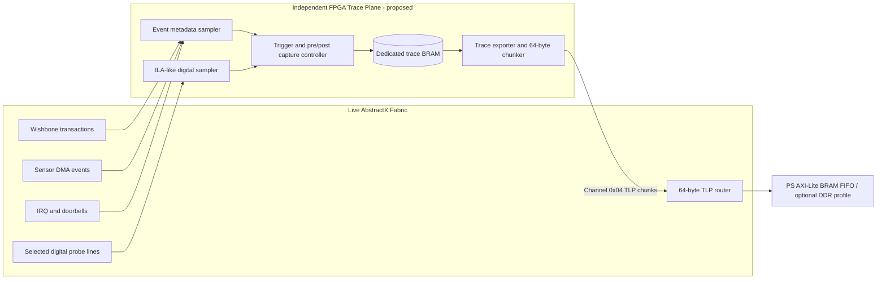

# AbstractX Switch Fabric Architecture (`asp-tlp-64b`)

This document defines the internal hardware architecture for the AbstractX switch fabric operating under the **PCIe-like 64-Byte TLP Profile (`asp-tlp-64b`)**.

---

## 1. Top-Level Topology & Data Flow

External transports (Dual-SPI, Single-SPI, DMA) act as **Translators** that serialize/deserialize fixed 64-byte TLPs between physical pins and the internal AXI-Stream / Wishbone switch fabric.

```
 +-------------------------------------------------------------------------+
 |                         ABSTRACTX SWITCH FABRIC                         |
 |                                                                         |
 |  External Transport             Fabric Hub / Router       Endpoints     |
 |  +------------------+           +------------------+   +--------------+ |
 |  | Dual-SPI / SPI   |  64B TLP  | AXI-Stream Hub   |   | Wishbone     | |
 |  | Translator Core  | --------> | (Channel/AXID    | ->| Master Gateway| |
 |  +------------------+  AXIS     |  Router)         |   +--------------+ |
 |                                 +------------------+   | IMU Auto-DMA | |
 |                                          |             | Core         | |
 |                                          |             +--------------+ |
 |                                          |             | UART ESC     | |
 |                                          v             | DMA Tunnel   | |
 |                                   Egress TLP FIFO      +--------------+ |
 +-------------------------------------------------------------------------+
```

---

## 2. Internal TLP Packet Routing Model

All endpoints and translators exchange data as **512-bit (64-byte) parallel vectors** accompanied by standard AXI-Stream control signals (`tvalid`, `tready`, `tlast`):

```
AXI-Stream TLP Seam:
- tdata[511:0]  : 64-Byte TLP Container Vector
- tvalid        : Valid TLP Beat
- tready        : Endpoint Backpressure
- tuser[63:0]   : Hardware Nanosecond Ingress Timestamp
```

### Channel Routing Mapping (`tdata[23:16]` - `Channel/AXID` Field)

| Channel ID | Endpoint Name | Description |
|---:|---|---|
| `0x01` | `CONTROL` / Wishbone Gateway | Transmits `MemRd` & `MemWr` TLPs to on-chip Wishbone bus targets |
| `0x02` | `TELEMETRY` / IMU Auto-DMA IP | Egress path for timestamped IMU telemetry stream TLPs |
| `0x03` | `FC_LOG` | High-rate flight log stream |
| `0x04` | `DEBUG_TRACE` | Logic analyzer trace stream |
| `0x05` | `ESC_SERIAL` | UART ESC tunnel (2-character idle / 40B full buffer flush) |

---

## 3. Core Endpoints & Gateways

### A. Dual-SPI Slave Translator
- Converts pin-level Dual-SPI clock and data signals into 64-byte parallel vectors.
- Enforces IEEE 802.3 CRC32 checking on incoming TLPs before forwarding to fabric.
- Drives FPGA `INT_REQ` pin high when the egress TLP FIFO contains ready responses (`CplD`, `DMA_Stream`).

### B. Wishbone Master Gateway
- Converts incoming `MemRd` and `MemWr` TLPs into standard Wishbone cycles (`CYC`, `STB`, `WE`, `ADR`, `DAT_I`, `DAT_O`, `ACK`).
- For `MemRd`: Performs Wishbone read cycle(s), builds a matching `CplD` TLP carrying the request's `Tag`, and routes it back to the egress TLP FIFO.

### C. IMU SPI Master & Auto-DMA Core
- Contains a dedicated SPI Master for external IMU sensor ICs.
- Triggered by external hardware interrupt line (`IMU_INT`).
- Instantly captures 64-bit nanosecond timer (`tuser`), executes pre-configured SPI burst read, packages sample into 64-byte `DMA_Stream` TLP, and emits to `Channel = 0x02`.

### D. UART ESC DMA Tunnel Engine
- Implements 2-character idle timeout (~20 bit times) + 40-byte full buffer trigger logic.
- Packages serial RX payload into 64-byte `DMA_Stream` TLP targeting `Channel = 0x05`.

---

## 4. Backpressure & Priority Arbitration

- **Control Priority**: `MemRd` / `MemWr` control TLPs (`Channel = 0x01`) receive highest priority in fabric crossbars to prevent register lockups during heavy telemetry streaming.
- **Valid-Ready Handshaking**: Every internal seam uses standard `tvalid`/`tready` backpressure to prevent packet loss under high host contention.

---

## 5. Zynq FPGA Trace Plane (Proposed, Not Yet Implemented)

The current RTL reserves channel `0x04` for `DEBUG_TRACE`, but it does not yet
contain a hardware trace-capture RAM or an ILA-style sampler. The
`abstractx-trace.dtbo` overlay currently supplies metadata only.

The proposed Zynq trace plane uses dedicated BRAM that is physically and
logically separate from the switch ingress/egress packet FIFOs:



Trace storage is record-oriented rather than constrained to one event per
64-byte switch TLP. A trace record or capture block MAY be larger than 64 bytes
and MAY contain:

- timestamped Wishbone/AXI/TLP metadata;
- sampled digital lines, state-machine states, IRQs, and trigger markers;
- pre-trigger and post-trigger sample windows similar to an ILA;
- overflow, wrap, trigger-position, and sample-period metadata.

Only export crosses the switch boundary: the exporter fragments the dedicated
trace memory into ordered 64-byte `DEBUG_TRACE` TLP chunks. This prevents trace
bursts from consuming the live switch packet FIFO and allows trace depth,
sample width, and record size to evolve independently.

This proposed PL trace plane is distinct from both existing software trace
implementations:

- C++ `CtfTraceEngine` uses its own 1 KiB ping-pong buffers in processor memory.
- Allwinner E906 remoteproc uses an E906-specific SRAM trace carveout and IPC;
  it is not part of the Zynq design.

Vivado ILA remains useful for JTAG laboratory debugging. The proposed capture
plane is an application-visible, scriptable equivalent intended for automated
SSH tests and field diagnostics; it does not replace Vivado ILA during timing
closure and low-level implementation debug.

### 5.1 Independent memory budgets

The two memory planes MUST remain independent:

| Plane | Default storage | Data unit | Backpressure policy |
|---|---:|---|---|
| Live switch packet plane | 8 KiB ingress + 8 KiB egress | Fixed 64-byte TLP | Never sacrificed for trace; deterministic control/sensor flow |
| Proposed trace plane | 64 KiB dedicated dual-port BRAM | Variable records and sample runs | May pause, wrap, or count drops without blocking live traffic |

On XC7Z020, the proposed 64 KiB trace store requires 15 BRAM36 blocks. Together
with the four BRAM36 blocks used by both live packet FIFOs, the default design
uses 19 of 140 BRAM36 blocks before other inferred memories (about 13.6% of the
device's BRAM block count). Synthesis utilization reports remain the authority
for final implemented usage.

### 5.2 Digital sampling and RLE

The proposed logic sampler captures a configurable vector of digital probes at
a fixed sample clock. Consecutive identical samples SHOULD be stored as one RLE
record containing the sample value and repeat count. Edge/event records carry a
timestamp delta and probe value. Trigger records mark the trigger position and
preserve configurable pre-trigger and post-trigger windows.

RLE affects only trace BRAM. Live 64-byte switch packets are never compressed.
If rapidly toggling probes defeat compression, the trace controller records raw
sample runs and applies a deterministic wrap/stop policy with overflow status.

### 5.3 Export and arbitration

Trace BRAM is a dual-port circular buffer: the sampler owns the write port and
the trace read-DMA owns the read port. The sampler commits aligned 256-byte
blocks only after all contained records are complete. The read-DMA therefore
fetches four 64-byte export units per block without racing a partially written
record.

The trace exporter fragments each committed 256-byte block into four ordered
64-byte channel-`0x04` TLPs and presents a proposed fourth egress input to
`asp_router`. The simple fixed-priority policy is:

1. Wishbone control completions;
2. real-time IMU/sensor telemetry;
3. ESC/serial traffic;
4. trace export.

The exporter holds `tvalid` and stable data until `tready`, exactly like other
AXI-Stream producers. If trace export is starved, records remain in trace BRAM
or the trace-only overflow counter advances; the live packet plane continues.

The final host transfer depends on the selected Zynq memory profile:

- **BRAM/AXI-Lite profile:** four 64-byte packets are drained through the packet
	port. This is deterministic and sufficient for bring-up, but CPU-mediated.
- **HP0/ACP DDR profile:** the DMA writer combines the four TLPs into one
	aligned 256-byte AXI burst, amortizing address and interrupt overhead.

The DMA block size is configurable between 64 bytes (one TLP, lowest latency)
and 256 bytes (four TLPs, highest efficiency). It MUST never change the logical
64-byte TLP format. Head/tail publication uses complete-block ownership, and
trace DMA completion may interrupt only after the entire selected block has
been transferred.
