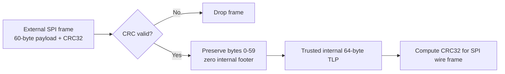

# AbstractX Universal 64-Byte TLP Bus Specification

**Document:** `docs/tier2_contracts/TLP_BUS_SPECIFICATION.md`  
**Status:** Authoritative Foundation (Tier 2 SSOT)  
**Consolidates:** `ASP_PROTOCOL.md`, `ASP_SPEC_DIRECTION.md`, `ASP_SPI_REGISTER_MAP.md`, `ASP_SPI_TRANSPORT.md`

---

## 1. Universal Data Plane: The 64-Byte TLP

AbstractX establishes a universal, symmetrical data plane across FPGAs, microcontrollers, and Linux hosts using fixed **64-byte Transaction Layer Packets (TLP)**:

```
 0                   1                   2                   3
 0 1 2 3 4 5 6 7 8 9 0 1 2 3 4 5 6 7 8 9 0 1 2 3 4 5 6 7 8 9 0 1
+-+-+-+-+-+-+-+-+-+-+-+-+-+-+-+-+-+-+-+-+-+-+-+-+-+-+-+-+-+-+-+-+
|  Packet Type  |     Flags     |      Tag       |    Channel    |  Byte 0..3 (Header)
+-+-+-+-+-+-+-+-+-+-+-+-+-+-+-+-+-+-+-+-+-+-+-+-+-+-+-+-+-+-+-+-+
|                      Target Address                           |  Byte 4..7 (Header)
+-+-+-+-+-+-+-+-+-+-+-+-+-+-+-+-+-+-+-+-+-+-+-+-+-+-+-+-+-+-+-+-+
|      Payload Length (DWORDs)  |          Sequence ID          |  Byte 8..11 (Header)
+-+-+-+-+-+-+-+-+-+-+-+-+-+-+-+-+-+-+-+-+-+-+-+-+-+-+-+-+-+-+-+-+
|               Hardware Timestamp Low (Nanoseconds)            |  Byte 12..15 (Header)
+-+-+-+-+-+-+-+-+-+-+-+-+-+-+-+-+-+-+-+-+-+-+-+-+-+-+-+-+-+-+-+-+
|               Hardware Timestamp High (Nanoseconds)           |  Byte 16..19 (Header)
+-+-+-+-+-+-+-+-+-+-+-+-+-+-+-+-+-+-+-+-+-+-+-+-+-+-+-+-+-+-+-+-+
|                                                               |  Byte 20..59 (Payload)
|               Binary CTF 1.8 Payload (40 Bytes)               |
|                                                               |
+-+-+-+-+-+-+-+-+-+-+-+-+-+-+-+-+-+-+-+-+-+-+-+-+-+-+-+-+-+-+-+-+
|              Transport Integrity / Reserved Footer           |  Byte 60..63 (Footer)
+-+-+-+-+-+-+-+-+-+-+-+-+-+-+-+-+-+-+-+-+-+-+-+-+-+-+-+-+-+-+-+-+
```

### 1.1 Transport integrity profiles

The 64-byte shape and field offsets never change: 20-byte header, 40-byte
payload, and a 4-byte footer. Footer semantics depend on the physical trust
boundary:

| Transport | Footer policy |
| :--- | :--- |
| Processor-local SPSC | Reserved and written as zero; no CRC calculation is required. |
| Processor-to-processor IPC in shared SRAM/DDR | Reserved and written as zero; IPC ownership/barrier rules are target-specific. |
| Processor-to-FPGA AXI, BRAM, HP/ACP DDR | Reserved and written as zero; FPGA memory/coherency rules are target-specific. |
| External SPI/Dual-SPI or UART/serial link | IEEE 802.3 CRC32 over bytes 0..59; receivers MUST reject a bad CRC before executing a request. |
| UDP/network export | Transport-profile decision; a sender claiming CRC protection MUST populate and verify the footer. |

Internal ownership barriers, FIFO handshakes, and DMA cache maintenance are
mandatory and are not replaced by CRC. The C ABI retains the member name
`crc32` for layout compatibility even when the trusted-internal profile writes
zero to that footer.

This table shares only the integrity-footer policy. It does not merge target
architectures: Allwinner E906 remoteproc IPC and Zynq PS↔PL AXI/BRAM transport
have separate memory maps, cache rules, drivers, and specifications.

### 1.2 TLP Packet Operations (`PacketType`)
* `0x01 MemRd`: Memory-Mapped Register Read Request.
* `0x02 MemWr`: Memory-Mapped Register Write Request.
* `0x03 CplD`: Completion with Data (Response to `MemRd`).
* `0x04 DMA_Stream`: Autonomous streaming data packet (e.g. IMU Auto-DMA sample).
* `0x05 DMA_Cfg`: Configuration packet for Auto-DMA hardware engines.

### 1.3 Channel Identifiers (`Channel`)
* `0x00`: System Management & BAR Registers.
* `0x01`: Flight Controller Core / Attitude Command.
* `0x02`: High-Rate Sensor Telemetry (IMU, Baro, Mag, GPS).
* `0x03`: Actuator Outputs (DShot, PWM, GPIO).

---

## 2. Wishbone Gateway & Register Address Map

The FPGA switch fabric decodes address ranges into Wishbone peripherals:

| Address Range | Block | Architectural Purpose |
| :--- | :--- | :--- |
| `0x40000000 - 0x40000014` | **System ID & Central Timer** | Device ID (`0xABF10164`), Monotonic 64-bit nanosecond timer. |
| `0x40000100 - 0x400001FF` | **IMU Auto-DMA Core** | Auto-DMA trigger config, SPI clock divisor, sample buffer. |
| `0x40000200 - 0x400002FF` | **DShot Motor Core** | 4-channel motor pulse width registers (1000–2000 µs / DShot300). |
| `0x40000300 - 0x40000310` | **PWM Receiver Decoder** | 4-channel input capture pulse width registers (1000–2000 µs). |
| `0x40000400 - 0x400004FF` | **NeoPixel Core** | WS2812B RGB dynamic animation & color registers. |

---

## 3. Physical Transport: Dual-SPI & Single-SPI Modes

* **Clock Speed**: Up to 50 MHz clocking.
* **Burst Commands**:
  * `0xA1 TLP_WRITE_BURST`: Followed by 64 bytes of outgoing TLP.
  * `0xA2 TLP_READ_BURST`: Followed by 64 bytes of incoming TLP clocked from FPGA FIFO.
* **Dual-SPI Pinout**: `MOSI` (IO0) and `MISO` (IO1) operate in parallel during data burst phases, doubling bus throughput to 100 Mbps at 50 MHz.

## 4. Requirement Traceability

### `[SPEC-TLP-CRC-01]` External SPI CRC and Internal Footer
* SPI/Dual-SPI ingress frames MUST carry the IEEE 802.3 CRC32 of wire bytes 0–59 in big-endian byte order at bytes 60–63. The receiver MUST validate the CRC before asserting the internal TLP valid signal.
* After successful validation, the receiver MUST pass bytes 0–59 unchanged and replace bytes 60–63 with zeroes, because CRC is limited to the external transport boundary and the internal TLP footer is reserved.
* SPI/Dual-SPI egress MUST compute the wire CRC over internal bytes 0–59 and transmit it in bytes 60–63, regardless of the internal reserved-footer value.


