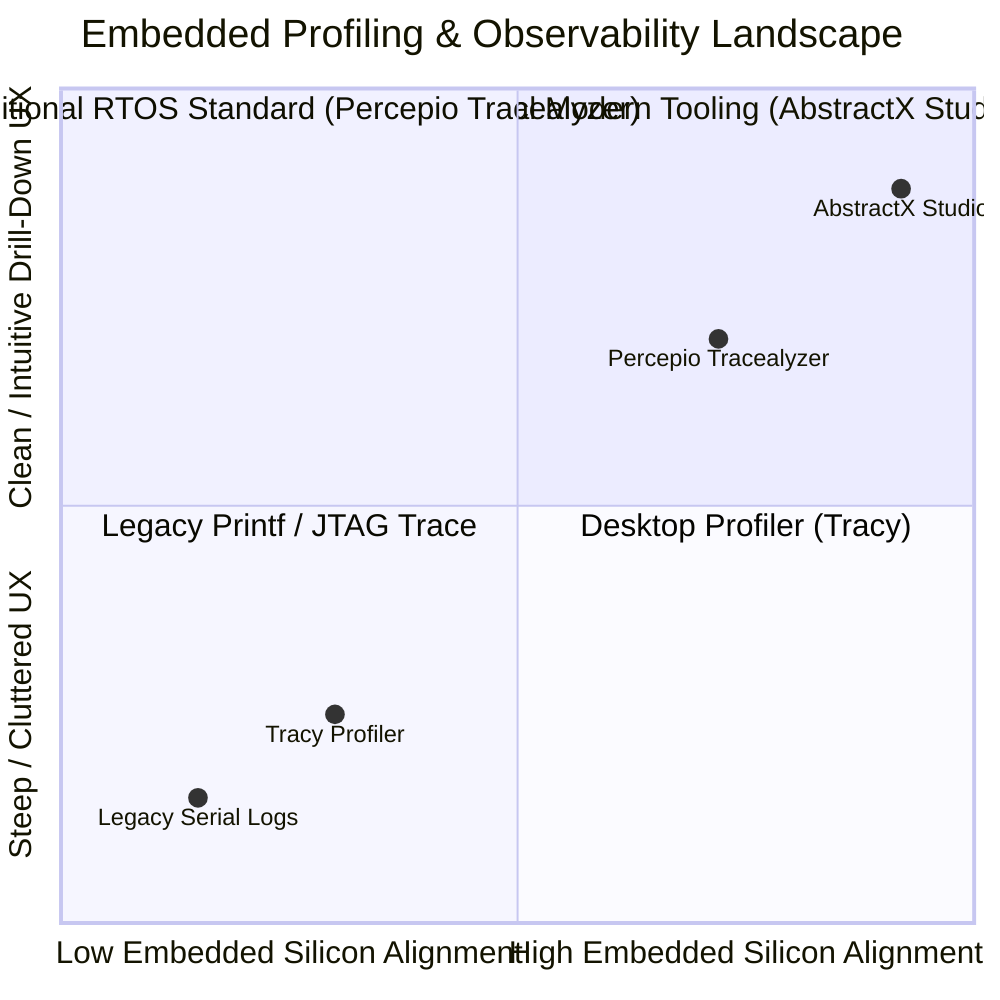

# Comparative Architectural Study: Tracy vs. Percepio Tracealyzer vs. AbstractX Studio

**Document Version:** 1.0.0  
**Context:** Real-Time Embedded Systems, Dual-Core Heterogeneous MCUs, FPGA Fabrics, and C++20 Stackless Coroutines  
**Target Repository:** AbstractX ([SPECIFICATION.md](tools/visualizer/SPECIFICATION.md))

---

## 1. Executive Summary & Comparative Matrix

Embedded firmware and hardware-software co-design developers have traditionally had to choose between two disparate profiling paradigms:
1. **Tracy Profiler**: Designed primarily for high-performance desktop C++ and game engines. While powered by Dear ImGui, its user experience for embedded systems is notoriously steep, cluttered, and overwhelming. It assumes deeply nested call stacks, dynamic heap allocations, and heavy streaming bandwidth.
2. **Percepio Tracealyzer**: The de facto RTOS (FreeRTOS, Zephyr, ThreadX) gold standard for embedded software. It excels at horizontal execution swimlanes, task states, queues, and causality. However, it is closed-source, commercially licensed, tied to traditional thread-based RTOS primitives, and lacks native awareness of C++20 stackless coroutines, FPGA AXI-Stream switch fabrics, or 64-byte PCIe TLP transports.
3. **AbstractX Studio**: A purpose-built, open, modern hardware-software observability workbench built on Python `imgui-bundle` (`Dear ImGui` + `ImPlot` + `HelloImGui`). It combines Tracealyzer's clean swimlane clarity and causality drill-down with Tracy's fluid vector plotting, while uniquely supporting **dual-core heterogeneous silicon, FPGA crossbar monitoring, freestanding C++20 zero-heap contracts, dynamic multi-window docking/decoupling, and decoupled user domain flight instruments**.

### Comprehensive Feature-by-Feature Matrix

| Architectural Feature | Tracy Profiler | Percepio Tracealyzer | AbstractX Studio | AbstractX Strategic Advantage |
| :--- | :--- | :--- | :--- | :--- |
| **Primary Execution Model** | OS Threads / Deep Callstacks | RTOS Tasks & ISRs | Heterogeneous Dual-Core + FPGA + C++20 Coroutines | Native understanding of stackless `co_await` suspensions |
| **Target Runtime Footprint** | Heavy (Needs target memory/TCP) | Moderate (Kernel trace ring) | **Zero Target Heap ($0\text{ B}$)** | Verified zero-heap Freestanding C++20 with MemBrowse |
| **Telemetry Transport** | Proprietary TCP streaming | Streaming buffer / Segger RTT | **64-Byte PCIe-style TLPs** over UDP/SRAM | Hardware DMA & FPGA AXI-Stream switch synthesizable |
| **UI Framework** | Custom C++ Dear ImGui | Proprietary desktop C# / Qt | Python `imgui-bundle` (`HelloImGui` + `ImPlot`) | Modular docking, Python plugin extensibility, zero compile delay |
| **Window Layout & Decoupling** | Fixed desktop layout | Multi-dock Qt panes | **Dynamic Multi-Windowing & Pop-Out** | Maximize/Restore buttons, 5 layout presets, floating OS viewports |
| **Execution Timeline View** | Multi-threaded nested zones | Horizontal Task/ISR Swimlanes | **4-Track Silicon Swimlanes** (Core 0, Core 1, SPU, ISRs) | Clear domain separation without nested callstack noise |
| **Deadline & Overrun Detection** | Manual zone timing inspect | Task deadline alerts | **Visual Overrun Alerting & Badges** | Red-accented overruns, margin metrics, and quick-jump actions |
| **Causality & Flow Chains** | Lock contention graphs | Predecessor / Successor chains | **Tracealyzer Causality Chain Flow** | Explains upstream trigger, active slice, and delayed successor |
| **Direct Source Inspection** | Built-in C++ source viewer | Line references | **Source Code & Hotspot Profiler** | Interactive C++ source viewer with line latencies & concurrency warnings |
| **Hardware Bus Inspection** | None (Software only) | Limited to generic I/O | **FPGA & Hardware Peripherals Inspector** | SPI0 Auto-DMA (10 MHz / 1.25 MB/s), AXI-Stream Crossbar (150 MHz / 13.3 ns) |
| **Line Chart Observability** | Basic frame/memory plots | User event line plots | **Synchronized Real-Time `ImPlot`** | Sub-microsecond task latencies & SPSC queue saturation |
| **Packet Protocol Inspection** | None | Raw hex or event log | **Live 64B TLP Packet Debugger** | 20B wire header decode, byte-level hex dump, IEEE CRC32 |
| **Memory Observability** | Dynamic `malloc`/`free` heap | Heap & stack usage | **MemBrowse Static Budgets** | ELF section analysis (.bss/.data) & zero-heap CI PR gating |
| **User Domain Decoupling** | None (Profiler only) | None (RTOS kernel only) | **6-Window Docking Suite** | Decouples low-level Core Studio from high-level User Instruments |

---

## 2. In-Depth Tool Breakdown

### 2.1 Tracy Profiler: Why It Felt Hard to Use

> [!WARNING]
> **The Tracy Usability Paradox**: Tracy is extraordinarily powerful for 120 FPS AAA desktop game engines, but its UI design translates poorly to bare-metal embedded firmware.

* **Information Overload**: Tracy displays every tiny function call as a nested rectangular slice. In an embedded loop running at 8 kHz, millions of micro-zones crowd the screen, creating visual clutter and microsecond-level noise.
* **Complex Keyboard & Mouse Navigation**: Panning and zooming in Tracy requires precise mouse wheel modifier keys, edge-dragging, and manual scale calibration. Firmware engineers frequently get lost in deep zoom levels.
* **Target Memory Requirements**: Tracy's on-device client library allocates dynamic ring buffers and maintains string tables in RAM. This directly violates AbstractX's **Freestanding C++20 Zero-Heap Invariant**.
* **Lack of Hardware Bus Context**: Tracy has no concept of FPGA AXI crossbars, DMA completions, or 64-byte packet framing.

### 2.2 Percepio Tracealyzer: The Embedded Benchmark

> [!NOTE]
> Tracealyzer succeeds because it mirrors how embedded systems engineers think: **Who ran? Why did it run? What interrupted it? Did it hit its deadline?**

* **Actor-Oriented Swimlanes**: Instead of call stacks, Tracealyzer allocates horizontal tracks to execution actors (Tasks, ISRs).
* **Causality Tracking**: If Task B woke up, Tracealyzer clearly draws the dependency link back to ISR A that pushed a semaphore or queue item.
* **Limitations**: Tracealyzer is an expensive commercial product. It does not understand modern C++20 coroutine state machines, cannot inspect FPGA hardware routing, and cannot render live application instruments (like a flight horizon or 3D wireframe) alongside the trace.

### 2.3 AbstractX Studio: The Best of Both Worlds

AbstractX Studio takes the best architectural patterns from Tracealyzer (swimlanes, microsecond time ruler, visual overruns, causality chains, root-cause diagnostics) and pairs them with modern interactive features:
1. **Four Silicon Swimlanes**: Core 0 (Linux / M33), Core 1 (Coroutine Engine), SPU (FPGA AXI-Stream Fabric), and Interrupts (PLIC & Doorbells).
2. **Issue Drill-Down Inspector**: Clicking any task slice immediately computes deadline margin, shows budget utilization %, displays the causality chain, diagnoses root cause, and highlights the C++ source code.
3. **Synchronized Real-Time Line Charts**: High-speed `ImPlot` multi-line graphs tracking task latencies and SPSC lock-free queue depths against deadline threshold lines.
4. **Source Code & Hotspot Profiler (Window 5)**: Live line-by-line latency badges, overrun warning banners, and concurrency diagnostics directly over the application and driver C++ source code.
5. **FPGA & Hardware Peripherals Inspector (Window 6)**: Live metrics for SPI0 Auto-DMA (10 MHz, 1.25 MB/s, 6.8% bus saturation), AXI-Stream TLP Crossbar (150 MHz, 13.3 ns zero-copy latency, 0 stalls), and 4-channel DShot600 motor generators.
6. **Dynamic Multi-Window Management**: Window maximize/restore buttons (`[⛶ Expand Window]` / `[🗗 Restore Panes]`), 5 workflow presets (`balanced`, `user_focus`, `core_focus`, `source_focus`, `fpga_focus`), and native multi-viewport pop-out (`enable_viewports = True`) for multi-monitor workstations.
7. **Zero-Heap Verification**: Integrates low-level TLP 64-byte bus debugging, CTF 1.8 schema decoding, and MemBrowse static memory tracking.

---

## 3. Evolutionary Feature Roadmap for AbstractX Studio

To ensure AbstractX Studio fulfills all desired features from both tools in a flexible, state-of-the-art manner:

```mermaid
flowchart LR
    subgraph STAGE1["Stage 1: Core Timeline & Windows (Implemented)"]
        SWIM["4 Silicon Swimlanes"]
        RULER["Microsecond Ruler & Zoom"]
        OVERRUN["Overrun Highlighting"]
        DRILL["Issue Drill-Down Inspector"]
        WIN_SRC["Source Hotspot Profiler"]
        WIN_FPGA["FPGA Peripherals Inspector"]
        DYN_WIN["Dynamic Docking & Decoupling"]
    end

    subgraph STAGE2["Stage 2: Advanced Diagnostics (In Progress)"]
        ARROWS["Causality Dependency Bezier Curves"]
        HISTO["Latency Distribution Histograms (ImPlot)"]
        STATES["Coroutine State Transitions (Suspended/Running)"]
        SYNC_SCRUB["Scrubber Line Chart Synchronization"]
    end

    subgraph STAGE3["Stage 3: Protocol & Replay (Next)"]
        REC_PLAY["Tracealyzer CTF Stream Recording & Replay"]
        DIFF["Commit-to-Commit Timing Regression Diff"]
        AI_DIAG["On-Device AI Diagnostics Assistant"]
    end

    STAGE1 --> STAGE2 --> STAGE3
```

1. **Causality Dependency Bezier Curves (Tracealyzer parity)**:
   - Draw curved dependency arrows directly on the canvas connecting the triggering ISR (`spi0_dma_tc_isr`) to the resumed coroutine (`imu_pipeline`) and the subsequent consumer (`attitude_ekf`).
2. **Task Latency Distribution Histograms (Tracy parity)**:
   - Use `implot.plot_histogram()` to show execution time distributions, immediately exposing timing jitter and tail latencies ($p_{95}, p_{99}$).
3. **Timeline Scrubber Synchronization**:
   - Dragging the timeline pan scrubber highlights the corresponding timestamp in the latency line charts and jumps to the matching row in the Simple Trace table.
4. **Static Ring Buffer High-Watermark Heatmaps**:
   - Render a continuous color gradient beneath the timeline showing `g_sensor_ring` and `g_telemetry_ring` fullness.
