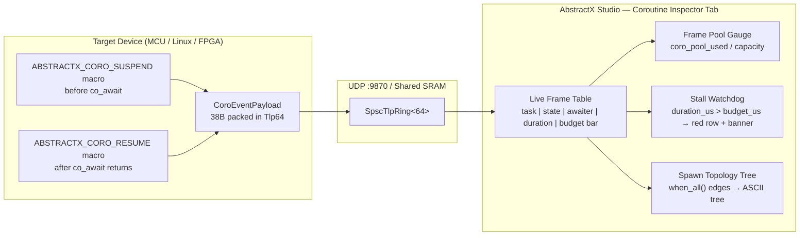

# Why C++20 Stackless Coroutines Replace RTOS Tasks in AbstractX

**Document Version:** 2.0.0
**Classification:** Tier 2 — Architectural Contract & Observability Methodology
**Target Repository:** AbstractX ([Visualizer Specification](../../tools/visualizer/SPECIFICATION.md))

> [!IMPORTANT]
> This document does **not** compare AbstractX to third-party commercial products.
> It explains the **execution model problem** that RTOS architectures impose on modern
> embedded hardware-software co-design, and documents how AbstractX resolves each
> failure mode natively using C++20 stackless coroutines, zero-heap static pools,
> and the AbstractX Studio Coroutine Inspector.

---

## 1. The Problem: What RTOS Task Models Cannot Express

Traditional RTOS architectures (FreeRTOS, Zephyr, ThreadX, CMSIS-RTOS) were designed
when embedded CPUs were single-core, memory-constrained, and peripherals were polled
or interrupt-driven through global callback tables.

They impose a **thread-of-control abstraction** that maps poorly to three realities of
modern heterogeneous hardware-software co-design:

### 1.1 RTOS Tasks Are Stack-Hungry and Heap-Coupled

Every RTOS task requires a dedicated call stack — typically 512 B to 4 KB per task.
With 8–16 concurrent tasks, that is 4–64 KB consumed in stack alone, before a single
application data structure is allocated.

Worse, RTOS APIs often assume dynamic heap allocation for task control blocks, queue
message buffers, and timer registrations. On a 256 KB MCU, this leaves inadequate
headroom for application state and is incompatible with freestanding C++ zero-heap invariants.

**AbstractX Resolution**: Every C++20 coroutine frame is bump-allocated once from
`g_coro_static_frame_pool` (a single flat `.bss` region). There are no per-task stacks.
The entire cooperative execution graph shares a single hardware call stack since exactly
one coroutine is active at any moment. This is mathematically verifiable at link time.

```
RTOS model (8 tasks × 2 KB stack):      16 KB stack + dynamic TCB heap
AbstractX model (8 coroutines):          ~7 KB frame pool + 0 B heap
```

### 1.2 RTOS Blocking Calls Are Invisible and Untrackable

When an RTOS task calls `xSemaphoreTake()` or `osDelay()`, it blocks silently.
The kernel moves it from the **Ready** queue to the **Blocked** queue. From the
developer's perspective, the task simply disappears from the timeline until the
blocking condition clears.

**What you cannot see with an RTOS**:
- *Why* the task is blocked (which ISR or DMA callback is expected to unblock it)
- Whether the expected callback will ever arrive (a missed ISR means eternal block)
- How long it has been blocked vs. its real-time budget

**AbstractX Resolution**: Every `co_await` suspension carries a compile-time string
token injected by `ABSTRACTX_CORO_SUSPEND(task_id, "imu_pipeline", "spi_ring.pop()")`.
The exact `co_await` expression is embedded in the CTF TLP telemetry stream before
the coroutine suspends. AbstractX Studio displays it live in the Coroutine Inspector:

```
#2: imu_pipeline   SUSPENDED   co_await spi_ring.pop()   42.1 µs / 150 µs budget
```

If `imu_pipeline` exceeds its 150 µs budget, the stall watchdog turns the row red
and fires a `CoroReason::BudgetExceeded` TLP event — without any kernel dependency.

### 1.3 RTOS ISR/Task Coupling Is Implicit and Error-Prone

In a typical RTOS pattern, an SPI DMA ISR calls `xSemaphoreGiveFromISR()` to unblock
a waiting task. This coupling is **invisible in the source code** and **fragile at runtime**:

- If the ISR misses or the DMA TC flag is not cleared, the task hangs forever.
- There is no compile-time or runtime check that the ISR and the task are correctly paired.
- Changing the ISR implementation can silently break the task without any type-safety.

**AbstractX Resolution**: The ISR/coroutine coupling is explicit and type-safe.
The `AsyncQueue<SensorSample, 64>` SPSC ring is the only rendezvous point.
The ISR pushes a `SensorSample` into the ring and the coroutine `co_await`s its
`pop()` awaitable. If the ISR never fires, the `pop()` awaitable never becomes ready,
and the stall watchdog detects the over-budget suspension in microseconds.

---

## 2. The Execution Model Vocabulary Shift

RTOS tooling assumes a **thread-centric vocabulary** that does not apply to AbstractX.
Every concept maps to a superior C++20-native equivalent:

| RTOS Concept | RTOS Problem | AbstractX C++20 Equivalent |
| :--- | :--- | :--- |
| `Task` (OS thread) | Needs dedicated call stack (512 B–4 KB) | `Task<void>` coroutine frame in `.bss` bump pool |
| `xSemaphoreTake()` | Blocks invisibly, reason unknown to debugger | `co_await async_queue.pop()` with named token |
| `osDelay(ms)` | Burns CPU cycles or relies on kernel tick | `co_await timer.sleep_ms_async(ms)` — zero polling |
| `xQueueSend()` | Dynamic message copy, heap coupling risk | `AsyncQueue<T, N>` zero-copy SPSC ring |
| `xTaskCreate()` | Runtime heap allocation of TCB + stack | `coro::Task<void>` — frame from static `.bss` pool |
| `vTaskSuspend()` | Opaque OS scheduler action | `co_await yield()` — explicit, cooperative, logged |
| `ISR wakes task` | Fragile semaphore coupling, type-unsafe | ISR pushes `AsyncQueue`, coroutine `pop()` awaiter |
| `Deadlock` | Task blocked on semaphore that never comes | Stall watchdog: `duration_us > budget_us` |
| `Task priority` | Global scheduler preemption hierarchy | Primary-paced channel: IMU DRDY is the physical clock |
| `vTaskGetRunTimeStats()` | Polling, not real-time, OS overhead | `ABSTRACTX_CORO_SUSPEND/RESUME` TLP stream |

---

## 3. The Four Coroutine Opacity Problems Solved by AbstractX Studio

C++20 coroutines are compiled into opaque compiler-generated state machines.
The compiler transforms every `co_await` into a state transition invisible to
standard debuggers and conventional profilers. AbstractX Studio's **Coroutine Inspector**
directly solves four specific blind spots:

### Problem 1: "Is this task suspended or dead?"

**RTOS approach**: Check the task state in the kernel's TCB list. Requires a JTAG
debugger attached and knowing which kernel TCB address corresponds to which task.

**AbstractX Studio solution**: The Coroutine Inspector table shows **every live frame**
in `g_coro_static_frame_pool` with its current state (`RUNNING` / `SUSPENDED` / `DONE`),
the exact `co_await` token it is suspended on, and how long it has been in that state.
No JTAG required. Data arrives over the same UDP :9870 telemetry channel as sensor data.

```
#4: sensor_fusion   SUSPENDED   co_await imu_chan.pop()   18.2 µs / 125 µs budget ✓
```

### Problem 2: "Why is this task not running?" (Missed ISR / Dropped DMA)

**RTOS approach**: This is the hardest class of embedded bug. The task is in
`Blocked` state but the kernel cannot tell you *which* event it is waiting for or
whether that event will ever arrive.

**AbstractX Studio solution**: The stall watchdog compares each coroutine's
`duration_in_state_us` against its per-awaiter `budget_us` threshold. When
`imu_pipeline` has been suspended for `>150 µs` waiting for `spi_ring.pop()`,
the entire row turns coral red and a banner fires:

```
STALL WATCHDOG: imu_pipeline — duration exceeds per-awaiter budget.
Possible missed ISR or dropped DMA callback.
```

The developer clicks the source link (`main.cpp:42`) and is taken directly to the
`co_await g_sensor_ring.pop()` line in the Source Code & RTL Inspector.

### Problem 3: "Who spawned this coroutine and what does it feed?"

**RTOS approach**: Task relationships exist only in the developer's head or external
documentation. The kernel has no concept of producer-consumer relationships between tasks.

**AbstractX Studio solution**: The **Spawn Topology Tree** renders the static
`coro::when_all()` structured-concurrency graph as a live ASCII tree with real-time
state colors:

```
app_main  [RUNNING]  1.2 ms
L- imu_pipeline   [SUSPENDED]  co_await spi_ring.pop()  42.1 us
   L- sensor_fusion  [SUSPENDED]  co_await imu_chan.pop()  18.2 us
L- mag_producer   [SUSPENDED]  co_await timer.sleep(20ms)  14.8 ms
L- telem_egress   [SUSPENDED]  co_await step_async()  2.1 ms
L- flight_monitor [SUSPENDED]  co_await timer.sleep(500ms)  480.3 ms
```

The tree shows that `imu_pipeline` is the upstream producer for `sensor_fusion`
via `AsyncQueue<ImuSample, 64>` — making the data-flow dependency explicit and visible.

### Problem 4: "Is the zero-heap invariant intact?"

**RTOS approach**: There is no answer. RTOS architectures inherently use dynamic
allocation for TCBs, queue buffers, and timer nodes. This question cannot be asked.

**AbstractX Studio solution**: The **Static Frame Pool Gauge** shows
`coro_pool_used_bytes / coro_pool_capacity_bytes` as a real-time progress bar with
an explicit `Zero-Heap Verified: 0 B dynamic allocation` badge. This is read directly
from `g_coro_static_pool_offset` (the bump-allocator's monotonic offset counter)
emitted in the telemetry stream. If a future code change accidentally introduces
`operator new`, the MemBrowse CI gate catches it at the ELF symbol level before
it reaches the device.

---

## 4. The AbstractX Coroutine Observability Architecture

### 4.1 Instrumentation: Zero-Cost Macros at Suspension Points

The `ABSTRACTX_CORO_*` macro family in [`include/abstractx/trace/coro_trace.hpp`](../../../include/abstractx/trace/coro_trace.hpp)
instruments every suspension point at the source code level with zero runtime overhead
when disabled:

```cpp
// In apps/gps_imu_app/src/main.cpp:
coro::Task<void> imu_pipeline() {
    ABSTRACTX_CORO_SPAWN(2, "imu_pipeline");
    while (true) {
        ABSTRACTX_CORO_SUSPEND(2, "imu_pipeline", "spi_ring.pop()");
        auto sample = co_await g_sensor_ring.pop();  // C++20 suspend point
        ABSTRACTX_CORO_RESUME(2, "imu_pipeline", "spi_ring.pop()");
        ABSTRACTX_CORO_BUDGET_US(2, "imu_pipeline", "spi_ring.pop()", 150, elapsed_us);

        attitude_ekf.update(sample.gyro, sample.accel);
    }
    ABSTRACTX_CORO_DONE(2, "imu_pipeline");
}
```

Each macro emits a `CoroEventPayload` (38 bytes) into the CTF TLP telemetry stream:

| Wire Field | Size | Content |
|:--|:--|:--|
| `event_id` | 1 B | Always `1` (coroutine lifecycle) |
| `timestamp_us` | 8 B | Hardware timestamp at suspension |
| `task_id` | 4 B | Coroutine slot index (1..N) |
| `handle_addr` | 4 B | Lower 32-bits of `coroutine_handle` |
| `state` | 1 B | `CoroState`: Spawn/Suspend/Resume/Done |
| `reason` | 1 B | `CoroReason`: Normal/BudgetExceeded/Deadlock |
| `coro_name` | 12 B | Null-terminated name (e.g. `"imu_pipeline"`) |
| `awaiter_token` | 16 B | Null-terminated token (e.g. `"spi_ring.pop()"`) |
| **Total** | **38 B** | Fits in 40-byte `ASP_TLP64_PAYLOAD_SIZE` |

### 4.2 Transport: 64-Byte TLP Wire Protocol

The 38-byte `CoroEventPayload` is wrapped in a `Tlp64` frame via `CtfTraceEngine::make_coro_tlp()`:

```
+--------+--------+--------+--------+----------+---------+---------------------+
|  Type  | Flags  |  Tag   |  Chan  | Target   | Seq#    | Timestamp ns        |
| 1 byte | 1 byte | 1 byte | 1 byte | 4 bytes  | 2 bytes | 8 bytes             |
|  0xC1  |  0x00  |  0x00  |  Debug |  0x0000  |  N      | now_us * 1000       |
+--------+--------+--------+--------+----------+---------+---------------------+
| CoroEventPayload (38 bytes, packed)                     | CRC32 (4 bytes)     |
| [event_id][timestamp_us][task_id][handle_addr]          |                     |
| [state][reason][coro_name[12]][awaiter_token[16]]        |                     |
+----------------------------------------------------------+---------------------+
```

### 4.3 Display: AbstractX Studio Coroutine Inspector Tab

The Studio's `_render_coroutine_inspector()` function decodes incoming `CoroEventPayload`
TLPs on every frame and updates the live Coroutine Inspector table. Three panels render
the decoded data:



---

## 5. Why This Architecture Is Superior to RTOS for AbstractX's Use Case

AbstractX targets **heterogeneous dual-core MCUs** running at 8 kHz primary control loops
with hardware FPGA Auto-DMA engines. RTOS architectures fail here in four ways:

### 5.1 No Kernel Tick Jitter

RTOS schedulers introduce a periodic preemption point at every kernel tick (typically 1 ms).
On an 8 kHz loop (125 µs period), a 1 ms kernel tick creates a **minimum 8× jitter** on
every primary control cycle. C++20 cooperative coroutines have **no preemption whatsoever**
— the scheduler only runs when a coroutine explicitly yields.

### 5.2 No Priority Inversion Risk

Classic RTOS priority inheritance is a well-documented source of hard-to-reproduce
timing bugs. AbstractX's cooperative execution model has no priorities, no priority
inversion, and no need for priority inheritance protocols.

### 5.3 The Primary-Paced Channel Pattern Replaces Tick Counters

AbstractX mandates the **Primary-Paced Channel Pattern** ([AGENTS.md §5](../../../AGENTS.md)):
the IMU DRDY hardware interrupt is the physical clock. Every control cycle starts when
`co_await g_imu_channel.pop()` returns — not when a kernel timer fires. Auxiliary sensors
(Magnetometer, GPS, Barometer) are drained non-blockingly with `try_pop()` on each tick.

This eliminates the RTOS anti-pattern of:
```cpp
// BANNED in AbstractX (AGENTS.md §5):
if (++counter % 80 == 0) {  // synthetic 50 Hz from 4000 Hz tick
    read_magnetometer();
}
```

### 5.4 The Zero-Heap Invariant Is Architecturally Enforced

RTOS kernels cannot enforce zero-heap. Their APIs require it (task creation, queue
allocation, timer registration). AbstractX's bump-allocator frame pool makes heap
allocation physically impossible during coroutine execution — the allocator is
monotonically increasing and there is no `free()`.

---

## 6. AbstractX Studio Observability Roadmap (Coroutine-First)

All future observability investment is framed around C++20 coroutine semantics,
not RTOS task concepts:

```mermaid
flowchart LR
    subgraph STAGE1["Stage 1 — Implemented"]
        CI["Coroutine Inspector Tab\n(Frame table, pool gauge,\nstall watchdog, topology tree)"]
        CORO["C++20 Coroutine Inspector\n(State machine & awaiters)"]
        FLOW["Flow Integrity\n(HoL matrix, transit delay,\npacing eye diagram)"]
        SRC["Source & RTL Inspector\n(C++ / SystemVerilog toggle)"]
    end

    subgraph STAGE2["Stage 2 — Next"]
        LIVE["Live co_await Token\nHistory Ring (64 entries)"]
        HIST["Per-Awaiter Latency\nHistogram (ImPlot p95/p99)"]
        STALL["Stall Root-Cause Modal\nfor Coroutine Inspector"]
        POOL["Frame Pool Watermark\nHistory Chart"]
    end

    subgraph STAGE3["Stage 3 — Future"]
        REPLAY["CTF Stream Recording\n& Offline Replay"]
        DIFF["Commit-to-Commit\nCoroutine Timing Diff"]
        SCRUB["Timeline Scrubber Sync\nacross all Inspector tabs"]
    end

    STAGE1 --> STAGE2 --> STAGE3
```



### Stage 2 Specifics

1. **Live `co_await` Token History Ring**: A scrolling circular buffer of the last 64
   suspension events per coroutine, showing the sequence of awaited resources with
   timestamps and durations. Instantly reveals patterns like "imu_pipeline alternates
   between spi_ring.pop() and yield() at exactly 8 kHz."

2. **Per-Awaiter Latency Histogram**: `implot.plot_histogram()` binned by awaiter token.
   Shows the real distribution of `spi_ring.pop()` wait times: nominal (≤150 µs),
   jitter (150–200 µs), and outlier stalls (>200 µs).

3. **Stall Root-Cause Modal for Coroutine Inspector**: When a stall watchdog fires,
   clicking the row opens a full causality modal: which ISR was supposed to fire,
   which DMA channel was involved, which SPSC ring is full, and a direct link to
   both the C++ coroutine source and the FPGA SystemVerilog RTL.

4. **Frame Pool High-Watermark Chart**: A rolling 30-second history of
   `coro_pool_used_bytes`, making it immediately visible if a code change caused
   frame pool growth (a leading indicator of memory pressure).
