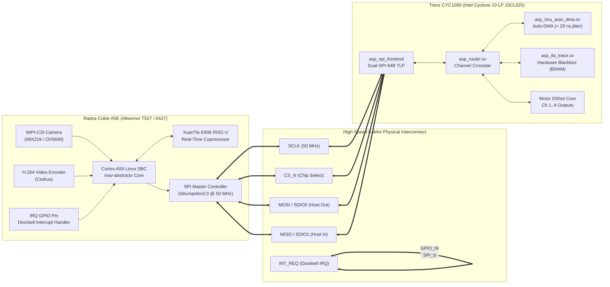

# Radxa Cubie A5E + Trenz CYC1000 Hardware Integration Guide

**Document:** `docs/tier3_targets/hardware/CUBIE_A5E_CYC1000_INTEGRATION.md`  
**Target Pair:** Radxa Cubie A5E (Allwinner T527/A527) + Trenz CYC1000 (Intel Cyclone 10 LP `10CL025`)  
**Status:** Approved Reference Design  

---

## 1. System Architecture Overview

The **Cubie A5E + CYC1000** pairing provides a world-class autonomous drone architecture:
* **Radxa Cubie A5E (Mission Computer & Vision)**:
  * 8x 64-bit ARM Cortex-A55 @ 1.8 GHz running Linux `PREEMPT_RT`.
  * MIPI-CSI camera interface for visual target tracking and optical flow.
  * Hardware Cedrus H.264/H.265 video recording to onboard eMMC/SD storage.
  * High-level INAV navigation, mission planning, and 4G/Wi-Fi telemetry.
* **Trenz CYC1000 (Hard Real-Time FPGA Gateway & Flight ILA)**:
  * Intel Cyclone 10 LP (`10CL025`, 25K LEs, 66 M9K Block RAMs).
  * Direct physical ICM-42688-P IMU SPI master with **Hardware Auto-DMA** (< 20 ns sampling jitter).
  * 4x DShot150/300/600 motor outputs and NeoPixel RGB status driver.
  * **Hardware ILA Trace Core (`asp_ila_trace.sv`)**: Autonomous cycle-accurate flight blackbox recorder in Block RAM/SDRAM with single-transfer DMA pull.



---

## 2. Physical Header Wiring Specification

Connect the **Cubie A5E 40-pin GPIO header** directly to the **CYC1000 Arduino MKR header**:

| Signal Name | Cubie A5E Pin (40-Pin Header) | CYC1000 Package Pin | CYC1000 MKR Pin | Function |
| :--- | :--- | :--- | :--- | :--- |
| **`SPI_SCLK`** | **Pin 23** (`SPI0_CLK` / `PI0`) | **Pin M1** | **D8** | High-speed SPI clock (Up to 50 MHz) |
| **`SPI_CS_N`** | **Pin 24** (`SPI0_CS` / `PI1`) | **Pin P1** | **D11** | Active-low chip select |
| **`SPI_MOSI`** | **Pin 19** (`SPI0_MOSI` / `PI2`) | **Pin N2** | **D10** | Data 0 (Host OUT / FPGA IN) |
| **`SPI_MISO`** | **Pin 21** (`SPI0_MISO` / `PI3`) | **Pin N1** | **D9** | Data 1 (Host IN / FPGA OUT) |
| **`INT_REQ`**  | **Pin 22** (`GPIO` / `PI4`) | **Pin L2** | **D7** | Doorbell IRQ (FPGA $\to$ A5E) |
| **`GND`**      | **Pin 6, 9, or 14** (Ground) | **GND Pins** | **GND** | Common ground reference |
| **`3.3V`**     | **Pin 1 or 17** (3.3V DC) | **VCC Pin** | **VCC** | Optional 3.3V supply (or USB powered)|

---

## 3. CYC1000 Peripheral Connections (Sensors & Actuators)

All physical flight hardware connects directly to the **CYC1000 headers**, isolating the noisy motor lines and timing-critical SPI sensors from the Linux host:

### A. ICM-42688-P IMU (External SPI Master)
* **`o_imu_sclk`** $\to$ **Pin B1 (D0)**
* **`o_imu_cs_n`** $\to$ **Pin C2 (D1)**
* **`o_imu_mosi`** $\to$ **Pin J1 (D2)**
* **`i_imu_miso`** $\to$ **Pin J2 (D3)**
* **`i_imu_int`**  $\to$ **Pin K1 (D4)** (DRDY hardware interrupt pin)

### B. Motor DShot Outputs (4 Channels)
* **Motor 1** $\to$ **Pin K2 (D5)**
* **Motor 2** $\to$ **Pin L1 (D6)**
* **Motor 3** $\to$ **Pin P2 (D12)**
* **Motor 4** $\to$ **Pin R1 (A0)**
* **NeoPixel Status LED** $\to$ **Pin T1 (A1)**

---

## 4. Flashing & Verification Workflow

### Step 1: Synthesize and Program the CYC1000 Bitstream
Compile `top_cyc1000.sv` using Intel Quartus Prime Lite or open-source flow, then flash the CYC1000 using `openFPGALoader`:
```bash
# Load directly into Cyclone 10 LP SRAM:
openFPGALoader -b cyc1000 build/cyc1000_abstractx.svf

# Or write permanently to onboard SPI flash:
openFPGALoader -b cyc1000 -f build/cyc1000_abstractx.rbf
```

### Step 2: Verify Heartbeat on CYC1000
* Observe onboard **LED 0 (Pin M6)**: It will blink steadily at **1.0 Hz**, confirming the FPGA clock and PLL are healthy.

### Step 3: Test from Cubie A5E Linux Host
On the Cubie A5E Linux terminal, verify communication over `/dev/spidev0.0`:
```bash
# Send 64-byte WHO_AM_I query:
python3 -c '
import spidev
spi = spidev.SpiDev()
spi.open(0, 0)
spi.max_speed_hz = 25000000
spi.mode = 0

# Command 0xA0: Read status vector
resp = spi.xfer2([0xA0, 0x00, 0x00, 0x00, 0x00])
print("FPGA Status:", [hex(b) for b in resp])
spi.close()
'
```

---

## 5. Architectural Benefits of this Configuration

1. **Complete Decoupling**: The Cubie A5E can run heavy OpenCV or YOLOv8 computer vision models on its 8 Cortex-A55 cores without ANY possibility of starving the motor PID loop or jittering the IMU.
2. **Cycle-Accurate Blackbox**: The `asp_ila_trace.sv` block inside the CYC1000 logs high-speed flight events into BRAM at hardware gate speed. The Cubie A5E pulls the whole buffer with one 64B command when writing Blackbox logs to disk.
3. **Budget & Weight**: The CYC1000 costs ~$35 and weighs less than 10 grams, giving you a full FPGA flight co-processor that pairs effortlessly with the Cubie A5E SBC.
