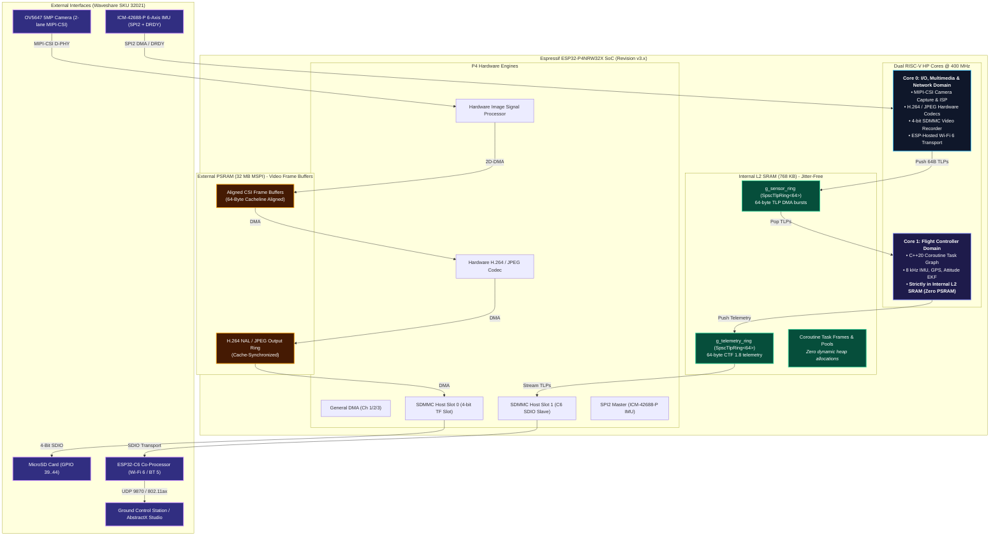

# Waveshare ESP32-P4-WiFi6 Target & Silicon Errata Specification

This document is the **authoritative hardware specification, silicon errata guide, and Video-to-SDCard DMA architecture** for the **Waveshare ESP32-P4-WiFi6 Development Board (SKU 32021)** running AbstractX.

---

## 1. Board & Silicon Architecture Overview

The **Waveshare ESP32-P4-WiFi6-KIT-A** (SKU: 32021) is a high-performance multimedia and robotics board combining the dual-core RISC-V ESP32-P4 SoC with an onboard ESP32-C6 Wi-Fi 6 / Bluetooth 5 co-processor, a 2-lane MIPI-CSI camera interface, and high-speed MicroSD storage.



---

## 2. Deep Dive: ESP32-P4 Silicon Errata & Workarounds

The production silicon on the Waveshare board is **ESP32-P4 Revision v3.x** (specifically `ESP32-P4NRW32X`). When streaming video, encoding H.264/JPEG, and recording to an SD card while running real-time flight loops, developers encounter five distinct silicon errata:

### Summary Matrix of ESP32-P4 Errata

| Erratum ID | Name / Description | Affected Silicon | Fixed In | AbstractX Required Workaround |
| :--- | :--- | :--- | :--- | :--- |
| **`[DMA-767]`** | **DMA Channel 0 Transaction ID Overlap** | v3.0 | v3.1 | **Never use DMA Channel 0** for video or frame copy. Route all video and SDMMC transfers strictly to **DMA Channels 1, 2, or 3**. |
| **`[MSPI-750]`** | **PSRAM Unaligned DMA Read Hazard** | v3.0 | v3.1 | All frame allocations in PSRAM must be **64-byte cacheline aligned** (`heap_caps_aligned_alloc(64, ...)`). Must call `esp_cache_msync()` before DMA reads. |
| **`[APM-560]`** | **Concurrent AHB Master Bus Stalls** | v3.0, v3.1 | v3.2 / IDF v5.4.1+ | Set `CONFIG_ESP_REV_MIN_FULL=300`. Keep real-time flight loop in **Internal L2 SRAM** so PSRAM bus stalls cannot stall the flight controller. |
| **`[SDMMC-SLOT]`** | **SDMMC Host Slot 0 vs Slot 1 Conflict** | All Revisions | Architecture | Explicitly bind MicroSD card to **`SDMMC_HOST_SLOT_0`** (GPIO 39..44). Reserve Slot 1 for ESP32-C6 Wi-Fi co-processor. |
| **`[MIPI-PWR]`** | **MIPI D-PHY LDO Rail Settle Glitch** | All Revisions | Board Design | Insert mandatory **10 ms settle delay** between enabling MIPI PHY power rails and initializing the CSI host. |

---

### Detailed Errata Analysis & Mitigation

#### 1. `[DMA-767]` DMA Channel 0 Transaction ID Overlap
* **The Root Cause**: On v3.0 silicon, AHB DMA Channel 0 shares its hardware transaction ID with the RMT peripheral inside the Access Permission Management (APM) block.
* **The Failure Mode**: In multi-threaded applications where peripheral transactions interleave, DMA transfers on Channel 0 encounter permission conflicts, causing silent transaction aborts or stalling the DMA channel indefinitely.
* **AbstractX Solution**:
  ```c
  // In ESP-IDF SPI & GDMA configuration:
  // Prohibit SPI_DMA_CH_AUTO if it picks Channel 0; lock to Channel 1 or 2
  spi_bus_config_t buscfg = {};
  // ...
  spi_bus_initialize(SPI2_HOST, &buscfg, SPI_DMA_CH1); // Explicitly Channel 1
  ```

#### 2. `[MSPI-750]` PSRAM Unaligned DMA Read Stale Data Hazard
* **The Root Cause**: When video frames in PSRAM are read by DMA immediately after being written by the CPU or ISP, if the transfer is unaligned or starts on a non-4-byte boundary, the MSPI address overlap detection logic fails and returns stale cached bytes.
* **The Failure Mode**: H.264 video streams recorded to the SD card produce macroblock corruption, missing keyframe slices, or corrupt JPEG headers.
* **AbstractX Solution**:
  ```c
  // 1. All video frame allocations must be 64-byte aligned in PSRAM:
  void* video_frame = heap_caps_aligned_alloc(
      64, 
      FRAME_SIZE_BYTES, 
      MALLOC_CAP_SPIRAM | MALLOC_CAP_DMA
  );

  // 2. Explicit cache writeback synchronization before handing buffer to SDMMC DMA:
  esp_cache_msync(
      video_frame, 
      FRAME_SIZE_BYTES, 
      ESP_CACHE_MSYNC_FLAG_DIR_C2M | ESP_CACHE_MSYNC_FLAG_UNALIGNED
  );
  ```

#### 3. `[APM-560]` Concurrent AHB Master Bus Stalls
* **The Root Cause**: When multiple internal bus masters (ISP 2D-DMA, H.264 encoder, SDMMC DMA, and Wi-Fi EMAC/SDIO) concurrently pull or push block data to PSRAM, an unauthorized transaction flag in the APM is improperly triggered and fails to mask downstream responses, stalling legitimate video stream data transfers.
* **The Failure Mode**: Intense video streaming to the SD card freezes the entire SoC if the real-time flight loop relies on PSRAM.
* **AbstractX Architectural Immunity**:
  AbstractX completely sidesteps this failure mode by **Memory Domain Isolation**:
  * **Core 1 Flight Loop**: Runs **100% out of on-chip L2 SRAM (768 KB)**. The C++20 task graph, SPSC ring buffers, attitude EKF matrices, and sensor drivers never make a single memory access to PSRAM.
  * **Result**: Even if the video pipeline and SD card controller saturate or temporarily stall the external PSRAM MSPI bus, **the 8 kHz IMU flight loop never experiences a single microsecond of jitter**.

---

## 3. Waveshare ESP32-P4-WiFi6 Pinout & Peripheral Mapping

### 1. SPI2 IMU Bus (ICM-42688-P 6-Axis Motion Sensor)
Connect to the 40-pin GPIO header:

| Signal | GPIO Pin | Function |
| :--- | :--- | :--- |
| `SPI2_SCK` | **GPIO 7** | SPI Clock (up to 24 MHz) |
| `SPI2_MOSI` | **GPIO 8** | Master Out Slave In |
| `SPI2_MISO` | **GPIO 9** | Master In Slave Out |
| `SPI2_CS` | **GPIO 10** | Hardware Chip Select (Active Low) |
| `IMU_DRDY` | **GPIO 6** | Rising Edge Interrupt (DIO pin trigger) |

### 2. MicroSD Card Interface (4-Bit SDMMC Slot 0)
The onboard TF card slot is routed directly to the P4 SDMMC host:

| Signal | GPIO Pin | SDMMC Slot 0 Assignment |
| :--- | :--- | :--- |
| `SD_CLK` | **GPIO 43** | Clock Line |
| `SD_CMD` | **GPIO 44** | Command / Response Line |
| `SD_D0` | **GPIO 39** | Data Line 0 |
| `SD_D1` | **GPIO 40** | Data Line 1 |
| `SD_D2` | **GPIO 41** | Data Line 2 |
| `SD_D3` | **GPIO 42** | Data Line 3 |

```c
// ESP-IDF SDMMC Slot 0 Initialization
sdmmc_host_t host = SDMMC_HOST_DEFAULT();
host.slot = SDMMC_HOST_SLOT_0; // Must explicitly target Slot 0

sdmmc_slot_config_t slot_config = SDMMC_SLOT_CONFIG_DEFAULT();
slot_config.width = 4;
slot_config.clk = GPIO_NUM_43;
slot_config.cmd = GPIO_NUM_44;
slot_config.d0  = GPIO_NUM_39;
slot_config.d1  = GPIO_NUM_40;
slot_config.d2  = GPIO_NUM_41;
slot_config.d3  = GPIO_NUM_42;
slot_config.flags |= SDMMC_SLOT_FLAG_INTERNAL_PULLUP;
```

### 3. ESP32-C6 Wi-Fi 6 Co-Processor Interface (SDIO Slot 1)
The onboard ESP32-C6 connects as an SDIO slave to the P4 host using **SDMMC Host Slot 1**, running `esp_hosted` or `esp_wifi_remote` firmware.

---

## 4. The Complete AbstractX Video-to-SDCard DMA Pipeline

AbstractX structures video streaming and telemetry logging as non-blocking, split-transaction coroutines:

```
┌────────────────────────────────────────────────────────────────────────┐
│                   CAMERA CAPTURE & ISP (CORE 0)                        │
│   • OV5647 5MP Camera via 2-lane MIPI-CSI (D-PHY 800 Mbps/lane)       │
│   • Hardware ISP generates YUV420 / RGB565 frames                      │
│   • 2D-DMA buffers frames into 64B-aligned PSRAM ping-pong buffers     │
└──────────────────────────────────┬─────────────────────────────────────┘
                                   │
                                   ▼
┌────────────────────────────────────────────────────────────────────────┐
│                   HARDWARE VIDEO ENCODER (CORE 0)                      │
│   • Hardware H.264 Baseline Profile encoder (or JPEG codec)            │
│   • Produces compressed NAL units in PSRAM                             │
│   • Calls esp_cache_msync() to flush dirty cachelines                  │
└──────────────────────────────────┬─────────────────────────────────────┘
                                   │
                                   ▼
┌────────────────────────────────────────────────────────────────────────┐
│              SPLIT-TRANSACTION SDMMC DMA RECORDER (CORE 0)             │
│   • Writes H.264 frames to /sdcard/flight_video.h264                   │
│   • SDMMC Slot 0 running in 4-bit mode @ 40 MHz                        │
│   • Synchronously multiplexed with 64-byte CTF 1.8 telemetry TLPs:     │
│       - /sdcard/flight_video.h264 (Raw H.264 video track)              │
│       - /sdcard/flight_telemetry.tlp (Binary CTF 1.8 TLP frames)       │
└────────────────────────────────────────────────────────────────────────┘
```

### Coroutine Multiplexing in AbstractX
Because both the IMU flight loop and the video logging engine use non-blocking split transactions:
```cpp
// Video Frame Recorder Coroutine Task (Core 0)
coro::Task<void> video_sd_recorder_task(CameraDriver& cam, SdCardDriver& sd) {
    while (true) {
        // 1. Non-blockingly await next hardware-encoded H.264 frame
        VideoFrame frame = co_await cam.next_encoded_frame_async();
        
        // 2. Cache-sync the 64-byte aligned PSRAM buffer (Workaround [MSPI-750])
        esp_cache_msync(frame.data, frame.length, ESP_CACHE_MSYNC_FLAG_DIR_C2M);
        
        // 3. Non-blockingly stream sectors to MicroSD card via SDMMC DMA
        co_await sd.write_sectors_async(frame.data, frame.length);
    }
}
```

---

## 5. Required ESP-IDF Configuration (`sdkconfig`)

To guarantee all hardware workarounds are enabled:

```ini
# Force minimum revision to v3.0 (enables native v3.x image processing & DMA paths)
CONFIG_ESP_REV_MIN_FULL=300

# Enable High-Performance PSRAM in Octal Mode
CONFIG_SPIRAM=y
CONFIG_SPIRAM_MODE_OCT=y
CONFIG_SPIRAM_SPEED_200M=y

# Enable APM Bus Stall Workaround (IDF v5.4.1+ / v6.0+)
CONFIG_ESP32P4_SELECT_APM_WORKAROUND=y

# Restrict GDMA to Channels 1-3 (Workaround [DMA-767])
CONFIG_GDMA_DISABLE_CHANNEL_0=y

# SDMMC Host Slot Configuration
CONFIG_SOC_SDMMC_NUM_SLOTS=2
```

---

## 6. Verification & Build Commands

1. **Set target**:
   ```bash
   idf.py set-target esp32p4
   ```
2. **Build AbstractX with Waveshare ESP32-P4-WiFi6 profile**:
   ```bash
   idf.py build
   ```
3. **Flash and Monitor**:
   ```bash
   idf.py -p /dev/ttyACM0 flash monitor
   ```
4. **Launch AbstractX Studio Ground Control**:
   ```bash
   python3 tools/visualizer/abstractx_studio.py --port 9870
   ```
