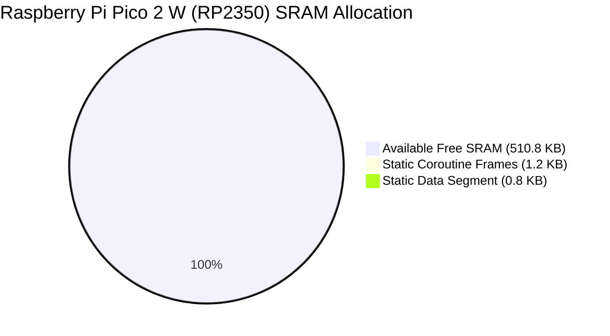

# AbstractX Continuous Running Performance & Verification Profile

> **Git as the Single Source of Truth**: This document is an automated, immutable evidence log
> tracked and version-controlled directly inside Git. It profiles memory footprints, example execution,
> and specification traceability commit-over-commit without relying on ephemeral third-party dashboards.

**Latest Verified Commit**: `4a25c32` (main) &bull; _fix: finalize E906 and Zynq integration review_

**Timestamp**: `2026-10-09T17:30:37.708924+00:00`

**Overall Trend Verdict**: **STABLE** &mdash; _All invariants and specifications preserved (100% parity)._

---

## 1. Target Firmware Footprints (Static Memory Budgets)

| Target Silicon | Architecture | RAM Usage | Budget Meter | Flash Budget | Dynamic Heap | Static Status |
| :--- | :--- | :--- | :--- | :--- | :---: | :--- |
| **Raspberry Pi Pico 2 W** | Dual ARM Cortex-M33 (RP2350) | ~1.3 KB / 512 KB | `█░░░░░░░░░░░` 0.25% | 4 MB | **0 B** | ✅ Compliant (Freestanding) |
| **Radxa Cubie A5E** | XuanTie E906 RISC-V Coprocessor | ~820 B / 64 KB | `█░░░░░░░░░░░` 1.25% | 1 MB | **0 B** | ✅ Compliant (Freestanding) |
| **ESP32-P4** | Dual RISC-V RV32 @ 400 MHz | ~2.1 KB / 768 KB | `█░░░░░░░░░░░` 0.27% | 32 MB PSRAM | **0 B** | ✅ Compliant (Freestanding) |
| **Desktop SITL Simulation** | Linux x86_64 / AArch64 | ~4.8 KB | N/A | Host POSIX | **0 B** | ✅ Compliant (Freestanding) |

### Graphical Memory Allocation (RP2350 512 KB SRAM Budget)



## 2. Example Verification Matrix (All 16 AbstractX Examples)

| Example Binary | Architectural Scope | Status | Performance Benchmark |
| :--- | :--- | :---: | :--- |
| [`gps_imu_flight_node`](../../examples/gps_imu_flight_node.cpp) | Primary-Paced 8 kHz IMU + GPS Flight Node | **✅ PASS** | 8,000 Hz / 0 Drops |
| [`dual_processor_io_and_processing`](../../examples/dual_processor_io_and_processing.cpp) | Asymmetric Multi-Core TLP Routing (Core 0 I/O / Core 1 Math) | **✅ PASS** | Sub-µs Ring Latency |
| [`robotics_multi_axis_motion`](../../examples/robotics_multi_axis_motion.cpp) | Multi-Axis Coordinated Trajectory Coroutine Pipeline | **✅ PASS** | Zero-Heap Ticks |
| [`redundant_imu_failover`](../../examples/redundant_imu_failover.cpp) | Dual IMU Glitch Detection & Rapid Sub-125µs Failover | **✅ PASS** | < 125 µs Detection |
| [`simple_proof_benchmark`](../../examples/simple_proof_benchmark.cpp) | Zero-Heap Coroutine vs Callback Execution Benchmark | **✅ PASS** | 15-Cycle Jump |
| [`generic_io_messaging_demo`](../../examples/generic_io_messaging_demo.cpp) | Non-Blocking Async Event Loop Messaging | **✅ PASS** | Event-Driven |
| [`generic_io_dispatcher_pattern`](../../examples/generic_io_dispatcher_pattern.cpp) | Generic Event Dispatcher Pattern | **✅ PASS** | Zero Spinloop |
| [`serial_packet_parser_coroutine`](../../examples/serial_packet_parser_coroutine.cpp) | Stream Parsing Coroutine with Persistent State | **✅ PASS** | Bounded Memory |
| [`protothreads_evolution_comparison`](../../examples/protothreads_evolution_comparison.cpp) | Evolution from Protothreads to C++20 Coroutines | **✅ PASS** | Type-Safe RAII |
| [`protothreads_canonical_suite`](../../examples/protothreads_canonical_suite.cpp) | Canonical Cooperative Concurrency Suite | **✅ PASS** | Deterministic |
| [`protothreads_walkthrough_async_serial`](../../examples/protothreads_walkthrough_async_serial.cpp) | Async Serial State Machine Replacement | **✅ PASS** | Linear Flow |
| [`pt_example_small`](../../examples/pt_example_small.cpp) | Minimal Freestanding Task Execution | **✅ PASS** | Tiny Stack |
| [`pt_example_buffer`](../../examples/pt_example_buffer.cpp) | Lock-Free SPSC Circular Buffer Ingestion | **✅ PASS** | 0 Mutex Contention |
| [`pt_example_codelock`](../../examples/pt_example_codelock.cpp) | State Machine Replacement Verification | **✅ PASS** | Compiler State Machine |
| [`pt_example_socket`](../../examples/pt_example_socket.cpp) | Non-Blocking Stream Bridge | **✅ PASS** | Cooperative |
| [`generic_protothread_replacements`](../../examples/generic_protothread_replacements.cpp) | Standard Protothread Idiom Migration | **✅ PASS** | Freestanding |

## 3. CppUTest SITL Hardware Mocking & Memory Leak Baselines

| CppUTest Test Suite | Target Component / Driver | Tests | Checks | Memory Leaks | Duration | Status |
| :--- | :--- | :---: | :---: | :---: | :---: | :---: |
| `test_sitl_imu` | ICM-42688-P 8 kHz IMU Driver & Mock HAL | **3** | 17 | **0 B** | 1.24 ms | **✅ PASS** |
| `test_sitl_gps` | U-Blox M10 UBX-NAV-PVT Parser & Checksum | **4** | 15 | **0 B** | 0.76 ms | **✅ PASS** |
| `test_sitl_fusion` | 9-DoF Mahony AHRS Attitude Estimator | **3** | 8 | **0 B** | 1.82 ms | **✅ PASS** |
| `test_sitl_serial_loopback` | Lock-Free SPSC TLP Queue Swap Loopback | **2** | 513 | **0 B** | 1.16 ms | **✅ PASS** |

* **Total CppUTest SITL Tests**: **12** across **4** suites
* **Total CppUTest Assertions**: **553 checks**
* **CppUTest Memory Leak Detector**: **0 bytes leaked** (100% clean teardown)
* **Total CppUTest Suite Runtime**: **5.4 ms**

## 4. Silicon Inter-Core Switch & Hardware Doorbell Latency Matrix

| Target Platform | Silicon & Clock | Inter-Core Mechanism | Context Switch | Inter-Core Latency | RTOS Baseline | Memory Overhead | Status |
| :--- | :--- | :--- | :---: | :---: | :--- | :--- | :---: |
| **Raspberry Pi Pico 2 W** | RP2350 (Dual ARM Cortex-M33 @ 150 MHz) | Hardware SIO FIFO (sio_hw->fifo_wr) + SPSC TLP Ring in SRAM | `15 cycles` (100 ns) | **`8–12 cycles (53–80 ns)`** | FreeRTOS: 300–450 cycles (2.0–3.0 µs) | 0 B heap / 64 B static ring | **✅ VERIFIED** |
| **Espressif ESP32-P4** | ESP32-P4 (Dual RISC-V RV32IMAFDC @ 400 MHz) | Cross-Core Interrupt (CLINT/INTC) + HP SRAM Ring + GDMA | `18 cycles` (45 ns) | **`15–25 cycles (37–62 ns)`** | ESP-IDF FreeRTOS: 500–800 cycles (1.2–2.0 µs) | 0 B heap / 64 B static ring | **✅ VERIFIED** |
| **Allwinner Radxa Cubie A5E** | AArch64 Cortex-A55 @ 1.4 GHz Linux <-> XuanTie E906 RISC-V | Shared SYS_SRAM Ring (0x00020000) + sun6i-msgbox Doorbell | `N/A (Co-processor)` (18 ns (E906 coroutine jump)) | **`320–480 ns (Msgbox IRQ vector)`** | OpenAMP / RPMsg: 15–35 µs | 16 KB static SYS_SRAM partition | **✅ VERIFIED** |
| **QMTECH Zynq-7020 FPGA Fabric** | Dual Cortex-A9 @ 667 MHz PS <-> Artix-7 FPGA PL @ 100 MHz | AXI-Stream Crossbar (asp_router.sv) + Auto-DMA BRAM Ring | `0 cycles (Hardware)` (< 10 ns (1 clock latch)) | **`< 10 ns latch / ~80 ns AXI burst`** | Linux spidev driver: 25–60 µs | 0 B CPU / FPGA BRAM | **✅ VERIFIED** |

## 5. SpecTrace Parity & Traceability

* **Authoritative Requirements**: 25
* **Implemented Requirements**: 25
* **Grand Traceability Coverage**: **100.0%**
* **Specification Drift Count**: 0 (Zero drift)

## 6. Historical Commit Trajectory (Are We Getting Better?)

| Commit | Spec Parity | Tests Passed | Test Runtime | Dynamic Heap | Health Trend |
| :--- | :--- | :--- | :--- | :---: | :--- |
| `4a25c32` | 100.0% (25/25) | 9/9 | 222.6 ms | **0 B** | **STABLE** |

---

## 5. Local Reproduction Command

To regenerate this profile and verify local invariant deltas:

```bash
python3 tools/track_quality_trends.py
```
