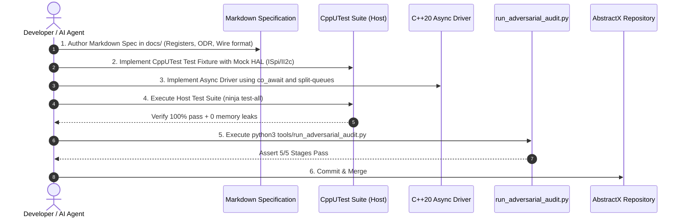

# AbstractX Quality Engineering Guide: Sashiko-Grade Adversarial Review & CppUTest Harness

**Version:** 1.0  
**Status:** Authoritative Engineering Guide  
**Cross-References:** [ABSTRACTX_DESIGN_GOALS.md](ABSTRACTX_DESIGN_GOALS.md) • [DESIGN_RULES.md](DESIGN_RULES.md) • [PROMPT_MARKDOWN_DRIVEN_ARCHITECTURE.md](PROMPT_MARKDOWN_DRIVEN_ARCHITECTURE.md)

---

## 1. Executive Summary & Problem Statement

AbstractX is built on a pure, symmetrical hardware-software co-design:
- **A sensor driver (e.g. ICM-42688-P IMU, Barometer, Magnetometer, GPS) is pure asynchronous logic.** It only requires an asynchronous bus transport (`ISpi`, `II2c`) with split-transaction request/completion queues, and a hardware event trigger (a GPIO DRDY interrupt or DMA completion).
- **The underlying transport is interchangeable:** Whether running on an Allwinner XuanTie E906 RISC-V coprocessor, a Raspberry Pi Pico 2 W (RP2350), an ESP32-P4, or fully offloaded into an FPGA auto-DMA hardware IP core (`asp_imu_auto_dma.sv`), the sensor coroutine and flight software execute the exact same linear awaitable sequence:
  ```cpp
  co_await imu.init_async();
  while (true) {
      ImuSample sample = co_await imu.next_sample_async();
      process_attitude(sample);
  }
  ```

### The AI Development Bottleneck
Despite comprehensive specifications in `docs/`, large language models (LLMs) repeatedly fail when asked in a single monolithic prompt to implement or refactor firmware drivers:
1. **Implicit Heap Allocations:** The AI introduces `std::vector`, heap `malloc`, or `<mutex>`, violating `-fno-exceptions`, `-fno-rtti`, and freestanding constraints ([Rule 4.1](ABSTRACTX_DESIGN_GOALS.md#41-freestanding-c-headers)).
2. **Synchronous Bus Fallbacks:** The AI generates blocking `_sync` methods, spin-loops, or busy-waits during device initialization, stalling the single-threaded cooperative event loop ([Rule 12](DESIGN_RULES.md#12-zero-synchronous-peripheral-io--awaitable-lifecycle-invariant)).
3. **ISR Concurrency & Lifetime Violations:** The AI calls `.resume()` directly inside an interrupt service routine ([Rule 4.2](ABSTRACTX_DESIGN_GOALS.md#42-no-resume-from-isr-or-worker-thread)), causing stack blowouts and race conditions, or fails to use `etl::queue_spsc_isr` with `InterruptLock` ([Rule 7](DESIGN_RULES.md#7-execution-domain-and-queue-safety-rules)).
4. **Wire Endianness & Slicing:** The AI forgets that ASP on the wire is strictly Big-Endian while host structs are native endian ([Rule 8](DESIGN_RULES.md#8-endianness-convention)).

This forced the maintainer to manually code-review every single line of code.

---

## 2. The Solution: Sashiko Decomposed Protocols + CppUTest Executable Grounding

To eliminate manual review fatigue and guarantee 100% bug-free implementations, AbstractX adopts a **two-pillar automated verification architecture** inspired by the Linux kernel **Sashiko-bot**:

```text
+---------------------------------------------------------------------------------------------+
|                                AbstractX Quality Gate Pipeline                              |
+---------------------------------------------------------------------------------------------+
                                               │
                                               ▼
               [ Pillar 1: CppUTest Test-Driven Development (TDD) ]
          • Before writing or modifying any driver code, the AI must
            read the CppUTest test suite and mock contracts.
          • The CppUTest test defines the unambiguous ground truth:
            mock register sequences, DRDY interrupts, and error states.
          • Tests run natively on host (`ABSTRACTX_TARGET=host`).
          • CppUTest MemoryLeakDetector asserts 0 bytes leaked.
                                               │
                                               ▼
               [ Pillar 2: 5-Stage Sashiko-Grade Adversarial Audit ]
          • The code diff is subjected to 5 distinct, isolated audit
            stages with zero tolerance for invariant violations:
            Stage 1: Zero-Heap & Freestanding Invariant Gate
            Stage 2: Non-Blocking HAL & Split-Transaction Gate
            Stage 3: ISR Domain & Coroutine Dispatcher Gate
            Stage 4: Hardware Endianness & Wire Framing Gate
            Stage 5: CppUTest Verification & Gatekeeper Verdict
                                               │
                                               ▼
                         [ Automated Merge / Commit Acceptance ]
```

---

## 3. Pillar 1: CppUTest as the Executable Hardware Contract

### Why CppUTest?
Conversational instructions in chat prompts are easily misinterpreted or forgotten. A **CppUTest test suite is executable, deterministic specification**:
- **MockSupport:** Using `CppUTestExt/MockSupport.h`, every hardware register write, SPI transfer, and GPIO interrupt can be strictly mocked:
  ```cpp
  mock().expectOneCall("spi_write_reg")
        .withParameter("reg", IcmRegs::PWR_MGMT0)
        .withParameter("val", 0x0F);
  ```
- **MemoryLeakDetector:** CppUTest automatically overrides `new`/`delete` on the host to catch any dynamic allocation leaks.
- **Closed-Loop AI Iteration:** The AI can compile and execute tests on the host (`ninja test-all`), parse failure reports, and self-correct without human intervention.

### Handling the ETL vs CppUTest Placement-New Conflict
As documented in `third_party/etl/docs/getting-started/setup.md`, CppUTest redefines `new`, which can conflict with ETL placement-new operators. In AbstractX, test translation units include ETL headers with CppUTest memory leak macros temporarily disabled around ETL includes:
```cpp
#include "CppUTest/TestHarness.h"
#undef new
#undef delete
#include <etl/queue_spsc_isr.h>
#include <etl/pool.h>
#include "CppUTest/MemoryLeakDetectorNewMacros.h"
```

---

## 4. Pillar 2: The 5-Stage Sashiko-Style Adversarial Audit

Modeled after the Linux kernel RemoteProc audit protocol, every pull request or code change is evaluated by `tools/run_adversarial_audit.py` across 5 independent stages:

### Stage 1: Zero-Heap & Freestanding Compiler Invariants
- **Objective:** Ensure all firmware code is 100% freestanding and strictly zero-allocation.
- **Invariants Checked:**
  - Forbidden headers: `<vector>`, `<string>`, `<list>`, `<map>`, `<thread>`, `<mutex>`, `<iostream>`.
  - Forbidden calls: `malloc()`, `free()`, unpooled `operator new`, `calloc()`.
  - Compiler flags: Must compile with `-fno-exceptions` and `-fno-rtti`.
  - Coroutine HALO: Coroutine frames must either be elided (HALO) or allocated via static pools (`etl::pool` or custom promise placement allocators).

### Stage 2: Non-Blocking HAL & Split-Transaction Lifecycle
- **Objective:** Guarantee that the cooperative single-threaded event loop is never blocked by peripheral I/O.
- **Invariants Checked:**
  - Forbidden calls in active runtime: `transfer_sync()`, `read_sync()`, `write_sync()`, `delay_ms()`, `usleep()`, `sleep()`.
  - All driver initialization must be async (`co_await dev.init_async()`).
  - All register accesses must return awaiters (`co_await dev.read_reg_async()`).
  - Driver architecture must use split-transaction Request and Completion queues.

### Stage 3: ISR Domain & Coroutine Dispatcher Boundary
- **Objective:** Eliminate stack blowouts, ISR priority inversions, and coroutine double-resumes.
- **Invariants Checked:**
  - Forbidden in ISR: Calling `.resume()` directly inside any ISR, signal handler, or worker thread.
  - Safe Queueing: Any queue written from an ISR must be `etl::queue_spsc_isr<T, N, abstractx::InterruptLock>`.
  - Sole Resumer: The main dispatch event loop (`abstractx::step()`) is the only context permitted to call `.resume()`.
  - Double-Resume Guards: Coroutine awaiters must verify that suspended handles cannot be resumed concurrently by both a timeout watchdog and a hardware completion event.

### Stage 4: Hardware Endianness, Alignment & Wire Framing
- **Objective:** Ensure end-to-end data integrity across MCU, FPGA, and Linux interconnects.
- **Invariants Checked:**
  - ASP wire protocol is strictly Big-Endian. Multi-byte header fields must use explicit `etl::endian` conversions or byte-swaps.
  - Struct Packing: All wire-format structs (TLP headers, CTF payloads) must use `[[gnu::packed]]` and fixed-width types (`uint8_t`, `uint16_t`, `uint32_t`, `uint64_t`). No architecture-dependent `int` or `long`.
  - Arithmetic Overflow: All ring buffer head/tail pointer arithmetic and slice lengths must be guarded against wraparound.

### Stage 5: CppUTest Mock Coverage & Gatekeeper
- **Objective:** Require executable verification before code approval.
- **Invariants Checked:**
  - Companion test suite exists in `tests/` or `sim/`.
  - 100% of CppUTest assertions pass.
  - Zero memory leaks detected by `MemoryLeakDetector`.
  - All mocked hardware expectations satisfied.

---

## 5. General Path: How to Add a New Sensor or Transport

When adding a new sensor (e.g. Barometer BMP388, Magnetometer BMM150) or a new transport (e.g. E906 SPI DMA, FPGA Auto-DMA bridge):



### Step 1: Document the Specification
Create or update a specification in `docs/` (e.g. `docs/BARO_BMP388_SPEC.md`). Define the register map, sampling rates, wire payload format, and timing requirements.

### Step 2: Write the CppUTest Fixture First
Write the unit test in `tests/drivers/test_bmp388.cpp` using `MockSpi` or `MockI2c`:
```cpp
TEST(Bmp388DriverGroup, InitAsyncConfiguresRegisters) {
    mock().expectOneCall("spi_write_reg").withParameter("reg", 0x1B).withParameter("val", 0x33);
    
    Bmp388 baro(mock_spi);
    bool ok = run_coro(baro.init_async());
    
    CHECK_TRUE(ok);
    mock().checkExpectations();
}
```

### Step 3: Implement the Async Driver
Implement the driver in `include/abstractx/drivers/baro/bmp388.hpp`. Use the reference template established in `include/abstractx/drivers/imu/icm42688p.hpp`:
- Only accept `hal::ISpi&` or `hal::II2c&` in constructor.
- Provide `read_reg_async()` and `write_reg_async()`.
- Implement `init_async()` returning `coro::Task<bool>`.
- Implement `next_sample_async()` returning an awaiter that submits an async bus request.

### Step 4: Run Host CppUTest Suite
Compile and run the host regression suite:
```bash
cmake -B build_host -DABSTRACTX_TARGET=host
cmake --build build_host --target test-all
ctest --test-dir build_host --output-on-failure
```

### Step 5: Run the Adversarial Audit Script
Run the automated multi-stage adversarial audit:
```bash
python3 tools/run_adversarial_audit.py
```
If any stage flags a violation (e.g. synchronous call, dynamic allocation, direct ISR resume), fix it before committing.

---

## 6. Summary Checklist for Developers and AI Agents

| Item | Requirement | Verification Method |
|---|---|---|
| **Specification** | Markdown spec in `docs/` with Mermaid flowcharts | `python3 tools/audit_specs.py` |
| **Freestanding** | 0 bytes dynamic heap allocation, `-fno-exceptions`, `-fno-rtti` | `tools/run_adversarial_audit.py` Stage 1 |
| **Non-Blocking** | 0 synchronous calls; all I/O awaitable (`co_await`) | `tools/run_adversarial_audit.py` Stage 2 |
| **ISR Safety** | No `.resume()` in ISR; `etl::queue_spsc_isr<T, N, InterruptLock>` | `tools/run_adversarial_audit.py` Stage 3 |
| **Wire Protocol** | 64-byte TLP, Big-Endian on wire, native in memory | `tools/run_adversarial_audit.py` Stage 4 |
| **Testing** | CppUTest test suite passing on host with 0 leaks | `ninja test-all` + Stage 5 |
