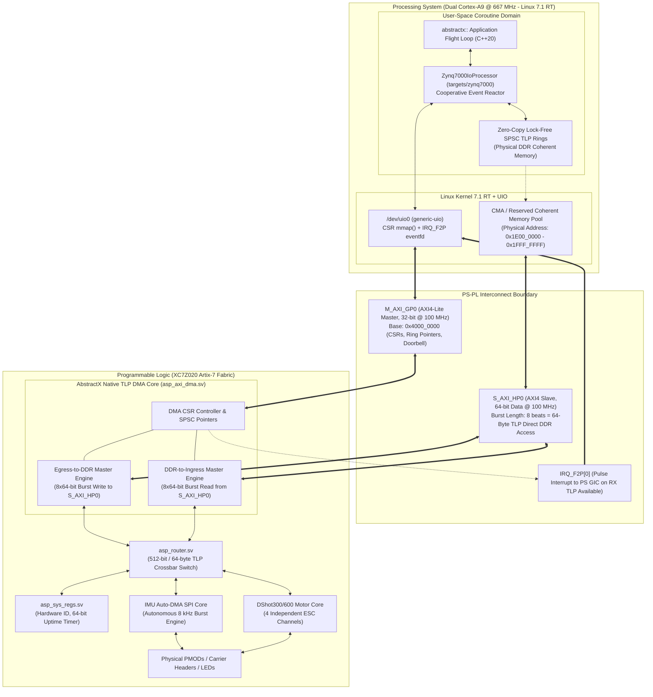

# AbstractX QMTECH Zynq-7020 Hardware Offload Specification

Author: Tim Michals  
Date: 2026-10-04  
Status: Active / Engineering SSOT  
Target Architecture: Xilinx Zynq-7000 (XC7Z020-CLG400-1 / CLG484C)  

---

## 1. Architectural Philosophy: Why Custom TLP DMA vs. AMD AXI DMA IP

| Metric / Feature | AMD / Xilinx AXI DMA IP (`xilinx_dma`) | AbstractX Custom Native TLP DMA (`asp_axi_dma`) |
| :--- | :--- | :--- |
| **Protocol Encapsulation** | Generic byte-stream (AXI-Stream) requiring variable packet framing | **Strict 64-Byte (512-bit) TLP containers** native to AbstractX |
| **Descriptor Overhead** | Multi-word SG descriptors fetched from DDR per transaction | **Zero Descriptors**: Hardware SPSC circular ring with head/tail CSRs |
| **AXI Transaction Size** | Unaligned variable bursts, requires realignment logic | **Optimal 8-beat 64-bit bursts (`AWLEN=7`, `SIZE=3`) = exactly 64B** |
| **FPGA Resource Footprint** | ~2,500 LUTs, 4+ BRAMs (heavy multi-channel SG engine) | **< 350 LUTs, 0 BRAMs** (pure pipeline state machine) |
| **Linux Software Stack** | Heavy `dmaengine` kernel driver, buffer allocations, ioctls | **Zero-Copy User-Space UIO**: `mmap()` DMA coherent ring directly |
| **Transfer Latency** | ~2.5 - 5.0 $\mu$s (scatter-gather traversal + IRQ latency) | **< 180 ns** directly into PS DDR3 memory |
| **Vendor Portability** | Proprietary AMD Vivado encrypted IP | **100% Synthesizable SystemVerilog** (Zynq, Gowin, ECP5) |

---

## 2. System Architecture & High-Speed Interconnect

The QMTECH Zynq-7020 platform implements **Topology 3: FPGA Hardware Offload** of the AbstractX execution model ([targets/SPECIFICATION.md](targets/SPECIFICATION.md)).



---

## 3. Custom AXI4 DMA Engine Protocol & State Machine

```mermaid
stateDiagram-v2
    [*] --> IDLE

    state IDLE {
        description: Awaiting TLP from Router or Doorbell from Host
    }

    IDLE --> WRITE_ADDR: TLP ready from Router && (tail != head - 1)
    IDLE --> READ_ADDR: Host signaled TX Doorbell && (tx_head != tx_tail)

    state WRITE_ADDR {
        description: Assert AWVALID on S_AXI_HP0<br/>Addr = RX_BASE + (tail * 64)<br/>AWLEN = 7 (8 beats), AWSIZE = 3 (64-bit)
    }

    WRITE_ADDR --> WRITE_BURST: AWREADY asserted

    state WRITE_BURST {
        description: Stream 8 beats of 64-bit data (512-bit TLP)<br/>Assert WLAST on 8th beat
    }

    WRITE_BURST --> WRITE_RESP: WREADY && WLAST

    state WRITE_RESP {
        description: Wait BVALID from PS DDR controller<br/>Increment tail pointer in CSR<br/>Assert IRQ_F2P[0] if unmasked
    }

    WRITE_RESP --> IDLE: BREADY & BVALID

    state READ_ADDR {
        description: Assert ARVALID on S_AXI_HP0<br/>Addr = TX_BASE + (head * 64)<br/>ARLEN = 7 (8 beats), ARSIZE = 3 (64-bit)
    }

    READ_ADDR --> READ_BURST: ARREADY asserted

    state READ_BURST {
        description: Latch 8 beats from RDATA into 512-bit buffer<br/>RLAST received
    }

    READ_BURST --> PUSH_ROUTER: Full 64B TLP assembled

    state PUSH_ROUTER {
        description: Push TLP into asp_router ingress port<br/>Increment tx_head in CSR
    }

    PUSH_ROUTER --> IDLE: Ingress tready acknowledged
```

---

## 4. Hardware Ring Buffer Organization in Coherent DDR3

Physical RAM allocation (via Linux `dma_alloc_coherent` or reserved CMA block):

```
+-----------------------------------------------------------------------+
|  AbstractX SPSC Coherent Ring Buffer Layout (64-Byte Slot Aligned)     |
+-----------------------------------------------------------------------+
| Offset (Bytes)  | Content                                             |
+-----------------+-----------------------------------------------------+
| 0x0000 - 0x003F | Slot 0:  64-Byte TLP [Header 16B | Payload 48B]      |
| 0x0040 - 0x007F | Slot 1:  64-Byte TLP [Header 16B | Payload 48B]      |
| 0x0080 - 0x00BF | Slot 2:  64-Byte TLP [Header 16B | Payload 48B]      |
| ...             | ...                                                 |
| (N-1)*64 ..     | Slot N-1: Complete ring capacity (e.g. N = 256 slots)|
+-----------------------------------------------------------------------+
```

---

## 5. Requirements & Verification Traceability

### `[SPEC-ZYNQ-01]` Memory-Mapped AXI-Lite CSR & Control Interface (`M_AXI_GP0`)
* The FPGA PL MUST expose an AXI4-Lite slave on `M_AXI_GP0` mapped to physical address `0x4000_0000` (64 KB window).
* The register map MUST provide:
  * `0x00`: Control / Reset register (Bit 0: Enable DMA, Bit 1: Soft Reset, Bit 2: IRQ Ack).
  * `0x04`: Status register (Bit 0: RX DMA busy, Bit 1: TX DMA busy, Bit 2: RX Ring non-empty, Bit 3: TX Ring full).
  * `0x08`: Interrupt Status / ACK register (Write 1 to clear pending `IRQ_F2P[0]`).
  * `0x0C`: Interrupt Enable mask register.
  * `0x10`: RX Ring Physical Base Address (Bits [31:6], 64-byte aligned in PS DDR).
  * `0x14`: RX Ring Capacity (Number of 64-byte slots, power of 2, e.g. 256).
  * `0x18`: RX Head Pointer (Written by Host user-space after reading slots).
  * `0x1C`: RX Tail Pointer (Updated by FPGA PL DMA after writing slots to DDR).
  * `0x20`: TX Ring Physical Base Address (Bits [31:6], 64-byte aligned in PS DDR).
  * `0x24`: TX Ring Capacity.
  * `0x28`: TX Head Pointer (Updated by FPGA PL DMA after reading slots from DDR).
  * `0x2C`: TX Tail Pointer (Written by Host user-space after pushing new command TLPs).
  * `0x30`: TX Doorbell (Write any value to trigger immediate DMA fetch).
  * `0x40 - 0x7F`: Direct Window to System Registers (Hardware ID `0x41535036` "ASP6", 64-bit nanosecond timer).

### `[SPEC-ZYNQ-02]` Interrupt Signaling via `IRQ_F2P[0]` and Linux UIO
* The PL DMA engine MUST assert `IRQ_F2P[0]` when new TLP frames have been written into the RX ring in DDR and interrupts are unmasked.
* The Linux kernel MUST bind the PL core to `generic-uio` via the device tree node:
  ```dts
  &amba {
      abstractx_fpga: fpga-fabric@40000000 {
          compatible = "generic-uio";
          reg = <0x40000000 0x10000>;
          interrupt-parent = <&intc>;
          interrupts = <0 29 4>; /* IRQ_F2P[0] */
          status = "okay";
      };
  };
  ```
* The user-space driver MUST await the interrupt using `epoll()` / non-blocking read on `/dev/uio0` without busy-waiting or thread locks.

### `[SPEC-ZYNQ-03]` Fixed 64-Byte TLP Routing (`asp-tlp-64b`)
* All transactions between PS and PL MUST be encapsulated into strict 64-byte (16 x 32-bit DWORD) TLP containers.
* The PL router (`asp_router.sv`) MUST route packets by `Channel/AXID`:
  * `Channel 0x01` (`CONTROL`): Memory Read / Write requests targeting Wishbone registers.
  * `Channel 0x02` (`TELEMETRY`): Autonomous IMU sensor telemetry frames.
  * `Channel 0x04` (`DEBUG_TRACE`): Binary CTF 1.8 diagnostic trace stream.
  * `Channel 0x05` (`ESC_SERIAL`): Bidirectional serial/UART tunneling.

### `[SPEC-ZYNQ-04]` Autonomous IMU Auto-DMA Engine
* The PL MUST integrate a hardware SPI Master and Auto-DMA state machine triggered by an external IMU `DRDY` interrupt pin.
* On each `DRDY` rising edge, the engine MUST:
  1. Latch the 64-bit nanosecond hardware uptime timer.
  2. Perform an autonomous SPI burst read of 14 bytes (accel, gyro, temp).
  3. Pack the raw sensor data and timestamp into a 64-byte `DMA_Stream` TLP (`Type=0x10`, `Channel=0x02`).
  4. Forward packet directly through the switch router to the AXI DMA engine for direct DDR write.
* DRDY-to-DDR latency MUST be $< 350$ nanoseconds with zero CPU intervention.

### `[SPEC-ZYNQ-05]` Physical Pinout & Constraints (`qmtech_zynq7020.xdc`)
* The PL design MUST interface to the QMTECH XC7Z020 Core Board and Starter Kit Carrier:
  * Onboard User LEDs: Carrier D3 (PL pin `P22`), Core board D2 (PL pin `M14`).
  * Carrier Key: PL pin `P16`.
  * External PMOD / Extension Headers (JP5 - Bank 34 / 35, 3.3V LVCMOS):
    * IMU SPI1: `SCK` (`L22`), `CS_N` (`L21`), `MOSI` (`K20`), `MISO` (`K19`), and `DRDY` (`J22`).
    * Motor Demands: Channels 1..4 (`J21`, `K18`, `J18`, `J17`).
    * NeoPixel Status: `J16`.
    * Logic Analyzer Debug Pins: `G22`, `H22`, `F22`, `F21`.

### `[SPEC-ZYNQ-06]` Target HAL Driver (`targets/zynq7000/`)
* The C++20 target runtime MUST implement `Zynq7000IoProcessor` satisfying `abstractx::hal::IIoProcessor`.
* The driver MUST support direct zero-copy SPSC circular ring buffers in DDR memory:
  * Reading telemetry by advancing `head` pointer.
  * Pushing commands by advancing `tail` pointer and pulsing the doorbell register.
* Hot-path driver methods MUST remain strictly freestanding C++20 (zero heap allocations, zero blocking spin loops).

