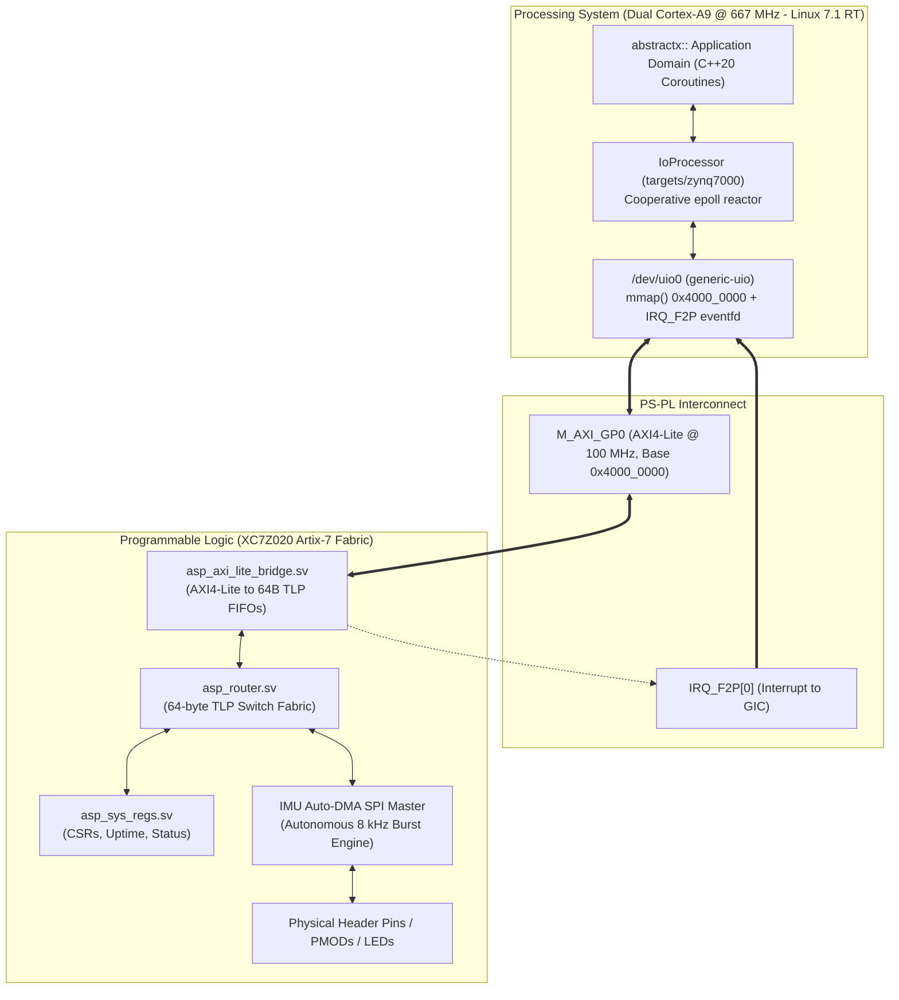

# AbstractX QMTECH Zynq-7020 Hardware Offload Specification

Author: Tim Michals  
Date: 2026-10-04  
Status: Draft / In-Progress  
Target Architecture: Xilinx Zynq-7000 (XC7Z020-CLG400-1)  

---

## 1. Architectural Overview & Topology

The QMTECH Zynq-7020 platform implements **Topology 3: FPGA Hardware Offload** of the AbstractX execution model ([targets/SPECIFICATION.md](targets/SPECIFICATION.md)).



---

## 2. Requirements & Verification Traceability

### [SPEC-ZYNQ-01] Memory-Mapped AXI-Lite CSR & TLP FIFO Interface
* The FPGA PL MUST expose an AXI4-Lite slave on `M_AXI_GP0` mapped to physical address `0x4000_0000` (64 KB window).
* The register map MUST provide:
  * `0x00`: Control / Reset register (Bit 0: Enable, Bit 1: Soft Reset, Bit 2: Clear Ingress FIFO, Bit 3: Clear Egress FIFO).
  * `0x04`: Status register (Bit 0: Egress non-empty, Bit 1: Egress full, Bit 2: Ingress ready, Bit 3: Ingress full).
  * `0x08`: Interrupt Status / ACK register (Write 1 to clear pending `IRQ_F2P[0]`).
  * `0x0C`: Interrupt Enable mask register.
  * `0x10`: Ingress TLP Data Port (Write 16 DWORDs = 64 bytes to push a TLP to PL).
  * `0x14`: Egress TLP Data Port (Read 16 DWORDs = 64 bytes to pop a TLP from PL).
  * `0x18`: Egress TLP Count (Number of complete 64-byte packets pending in egress FIFO).
  * `0x1C`: Ingress TLP Free Slots (Available 64-byte packet slots in ingress FIFO).
  * `0x40 - 0x7F`: Direct Window to System Registers (Hardware ID `0x41535036`, 64-bit nanosecond timer).

### [SPEC-ZYNQ-02] Interrupt Signaling via `IRQ_F2P[0]` and Linux UIO
* The PL bridge MUST assert `IRQ_F2P[0]` whenever the egress FIFO contains $\ge 1$ complete 64-byte TLP and interrupts are unmasked.
* The Linux kernel MUST bind the PL core to `generic-uio` via the device tree node:
  ```dts
  &amba {
      abstractx_fpga: fpga-fabric@40000000 {
          compatible = "generic-uio";
          reg = <0x40000000 0x10000>;
          interrupt-parent = <&intc>;
          interrupts = <0 29 4>; /* IRQ_F2P[0] */
          status = "okay";
      };
  };
  ```
* The user-space driver MUST await the interrupt using `epoll()` / non-blocking read on `/dev/uio0` without busy-waiting or thread locks.

### [SPEC-ZYNQ-03] Fixed 64-Byte TLP Routing (`asp-tlp-64b`)
* All transactions between PS and PL MUST be encapsulated into strict 64-byte (16 x 32-bit DWORD) TLP containers.
* The PL router (`asp_router.sv`) MUST route packets by `Channel/AXID`:
  * `Channel 0x01` (`CONTROL`): Memory Read / Write requests targeting Wishbone registers.
  * `Channel 0x02` (`TELEMETRY`): Autonomous IMU sensor telemetry frames.
  * `Channel 0x04` (`DEBUG_TRACE`): Binary CTF 1.8 diagnostic trace stream.
  * `Channel 0x05` (`ESC_SERIAL`): Bidirectional serial/UART tunneling.

### [SPEC-ZYNQ-04] Autonomous IMU Auto-DMA Engine
* The PL MUST integrate a hardware SPI Master and Auto-DMA state machine triggered by an external IMU `DRDY` interrupt pin.
* On each `DRDY` rising edge, the engine MUST:
  1. Latch the 64-bit nanosecond hardware uptime timer.
  2. Perform an autonomous SPI burst read of 14 bytes (accel, gyro, temp).
  3. Pack the raw sensor data and timestamp into a 64-byte `DMA_Stream` TLP (`Type=0x10`, `Channel=0x02`).
  4. Push the packet into the Egress FIFO and trigger `IRQ_F2P[0]`.
* DRDY-to-packet enqueue latency MUST be $< 500$ nanoseconds with zero CPU intervention.

### [SPEC-ZYNQ-05] Physical Pinout & Constraints (`qmtech_zynq7020.xdc`)
* The PL design MUST interface to the QMTECH XC7Z020 Core Board and Starter Kit Carrier:
  * Onboard User LEDs: Core board LED (PL pin `M14` / `M15`) for heartbeat and status.
  * External PMOD / Extension Headers (J10 / J11):
    * IMU SPI1: `SCK`, `MOSI`, `MISO`, `CS_N`, and `DRDY` input.
    * GPS UART: `RX`, `TX`.
    * PWM / DShot Motor Demands: 4 channels.
* All I/O banks MUST adhere to the board VCCIO voltage domains (3.3V LVCMOS).

### [SPEC-ZYNQ-06] Target HAL Driver (`targets/zynq7000/`)
* The C++20 target runtime MUST implement `Zynq7000IoProcessor` satisfying `abstractx::hal::IIoProcessor`.
* Hot-path driver methods MUST remain strictly freestanding C++20 (zero heap allocations, zero blocking spin loops).
* The driver MUST integrate seamlessly with the `abstractx::step()` cooperative dispatcher.
