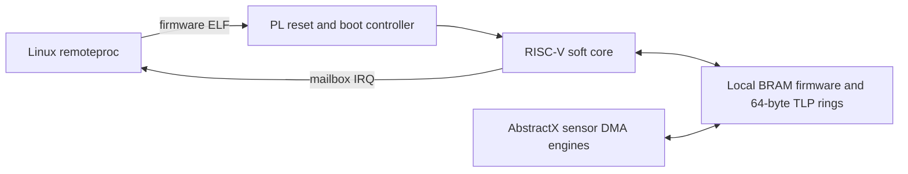

# AbstractX Zynq-7000 platform

Shared platform integration for Zynq-7000 boards. This directory is a peer of `hw/tang9k` and `hw/primer20k`.

```text
hw/zynq7000/
├── README.md
├── tools/setup_workspace.sh
├── buildroot_external/
│   └── configs/
├── qmtech_zynq7020/
└── alinx_ac7020c/
```

## Workspace setup

The setup tool locates or clones Buildroot, `linux-cubie`, and `u-boot-zynq`,
writes source overrides, and configures a dedicated Buildroot output workspace
for the selected board.

Linux and U-Boot are built out-of-tree under the Buildroot output directory.
The setup tool only configures that output tree; neither it nor Buildroot needs
`make clean` in the `linux-cubie` or `u-boot-zynq` source checkout.

Each board has an independent workspace and can be built without reconfiguring
or clearing another board's output:

| Board | Setup command | Buildroot workspace |
|---|---|---|
| QMTECH XC7Z020 | `./hw/zynq7000/tools/setup_workspace.sh qmtech-20` | `hw/zynq7000/bld.qmtech-20/` |
| ALINX AC7020C | `./hw/zynq7000/tools/setup_workspace.sh alinx-20` | `hw/zynq7000/bld.alinx-20/` |
| ALINX AC7010C | `./hw/zynq7000/tools/setup_workspace.sh alinx-10` | `hw/zynq7000/bld.alinx-10/` |

See [SPECIFICATION.md](SPECIFICATION.md) for shared package, GPIO, Wi-Fi, and
source-tree requirements; [DEVICE_TREE_CONFIGURATION.md](DEVICE_TREE_CONFIGURATION.md)
defines the common Linux/U-Boot device-tree and overlay contract.
The Buildroot images include `iw` and Python bindings for serial/async serial,
SPI, I²C, and GPIO events; the bindings do not replace the kernel and
device-tree setup needed to expose each hardware interface. The shared
`abstractx-buses` overlay exposes PS SPI1 as `/dev/spidev1.0` and I²C0 as
`/dev/i2c-0`; QSPI remains dedicated to boot flash.

## AbstractX IMU validation proof of concept

The detailed test contract is in
[`testApps/imu_backend_validation_poc/SPECIFICATION.md`](testApps/imu_backend_validation_poc/SPECIFICATION.md).
The goal is to run the same ICM-42688-P validation suite through either
Linux GPIO-event → spidev acquisition or AbstractX PL DRDY → SPI → Auto-DMA.
The test app and hardware routing are under development; no speed claims are
made until both real paths have produced comparable board measurements.

```bash
./hw/zynq7000/tools/setup_workspace.sh qmtech-20
./hw/zynq7000/tools/setup_workspace.sh alinx-20
```

Board wrappers configure the corresponding dedicated workspace:

```bash
./hw/zynq7000/qmtech_zynq7020/tools/setup_workspace.sh
./hw/zynq7000/alinx_ac7020c/tools/setup_workspace.sh
```

## Build images

```bash
make -C hw/zynq7000/bld.qmtech-20 -j$(nproc)
make -C hw/zynq7000/bld.alinx-20 -j$(nproc)
make -C hw/zynq7000/bld.alinx-10 -j$(nproc)
```

Each workspace uses the shared external tree but selects its own Linux DTB and
U-Boot board target.

## ALINX Vivado/XSA

The ALINX target is standalone. Generate its hardware platform with:

```bash
make -C hw/zynq7000/alinx_ac7020c xsa
make -C hw/zynq7000/alinx_ac7020c ps-init
```

The first command generates XPR, bitstream and XSA. The second extracts the XSA's exact `ps7_init_gpl.c` into the sibling `u-boot-zynq` board directory.

Generated Vivado and Buildroot outputs are ignored; Tcl, XDC, specifications, READMEs and Buildroot defconfigs are source-controlled.

## Optional PL soft-core remoteproc example

A future demonstration may place a third-party RISC-V soft core in Zynq PL and
manage its firmware lifecycle from Linux remoteproc. Vivado does not provide a
drop-in AbstractX RISC-V/remoteproc subsystem: the design must integrate and
license a selected soft core, then provide a Linux platform remoteproc driver.

The recommended first example is BRAM-only:



The example requires a firmware resource table, deterministic reset/boot-vector
control, BRAM address translation, mailbox/doorbell interrupts, a dedicated
Zynq PL remoteproc driver, and crash/stop handling. It is independent of the
Allwinner E906 target and cannot reuse that target's driver or memory map.

If a later soft-core design accesses PS DDR, it must select one memory profile
from [SPEC-ZYNQ-PLATFORM-09](SPECIFICATION.md#spec-zynq-platform-09-bram-first-packet-storage-and-explicit-ddr-modes):

- HP0 with noncached/kernel-DMA memory and explicit `dma_sync_*` ownership.
- ACP with correct coherent AXI attributes and kernel-managed cacheable memory.

BRAM remains preferred for the initial demonstration because it avoids DDR
cache coherency and is ample for the 8 KiB packet-ring requirement.
