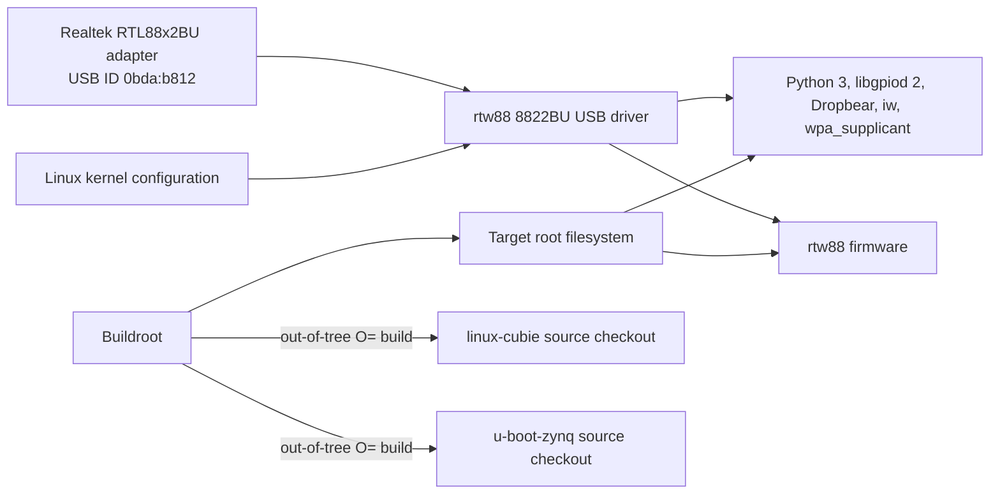

# AbstractX Zynq-7000 Shared Platform Specification

Author: AbstractX Engineering
Date: 2026-10-06
Status: Active
Applies to: QMTECH XC7Z020, ALINX AC7010C, and ALINX AC7020C

## Scope

This specification defines shared Linux userspace packages, Wi-Fi support, and
Buildroot source-tree behavior for the Zynq-7000 board configurations. Board
memory maps, pin assignments, and FPGA integration remain defined by each
board's own specification.

## Requirements

### [SPEC-ZYNQ-PLATFORM-01] Shared Buildroot userspace

Every supported Zynq-7000 board defconfig MUST enable Buildroot's
`BR2_PACKAGE_LIBGPIOD2` and `BR2_PACKAGE_LIBGPIOD2_TOOLS` for GPIO userspace,
as well as Python 3, Dropbear, `iw`, and `wpa_supplicant` with nl80211 support.

### [SPEC-ZYNQ-PLATFORM-02] RTL88x2BU USB Wi-Fi adapter

Every supported Zynq-7000 board MUST build the in-tree Linux `rtw88` 8822BU
USB driver for USB ID `0bda:b812` and install its `rtw88/rtw8822b_fw.bin`
firmware in the target root filesystem. The kernel driver MUST be enabled
through a shared Linux configuration fragment, and its firmware MUST be
selected from Buildroot's `linux-firmware` package.

### [SPEC-ZYNQ-PLATFORM-03] Buildroot source-tree isolation

Buildroot MUST use the `linux-cubie` and `u-boot-zynq` checkouts as local source
overrides while keeping generated kernel and U-Boot build output in the
Buildroot output tree. Configuring or building a board MUST NOT run `make
clean` in either source checkout or require either checkout to be clean.

### [SPEC-ZYNQ-PLATFORM-04] GPIO character-device support

Every supported Zynq-7000 Linux kernel MUST enable `CONFIG_GPIOLIB` and
`CONFIG_GPIO_CDEV`, exposing GPIO controllers through `/dev/gpiochipN` for
libgpiod 2 userspace tools.

## Verification

Each supported defconfig MUST contain the userspace and firmware package
selections above, including both libgpiod package symbols, and reference the
shared Linux configuration fragment. The fragment MUST enable
`CONFIG_RTW88_8822BU`, `CONFIG_GPIOLIB`, and `CONFIG_GPIO_CDEV`. Buildroot's
`O=` output directory MUST remain separate from the Linux and U-Boot source
directories.
