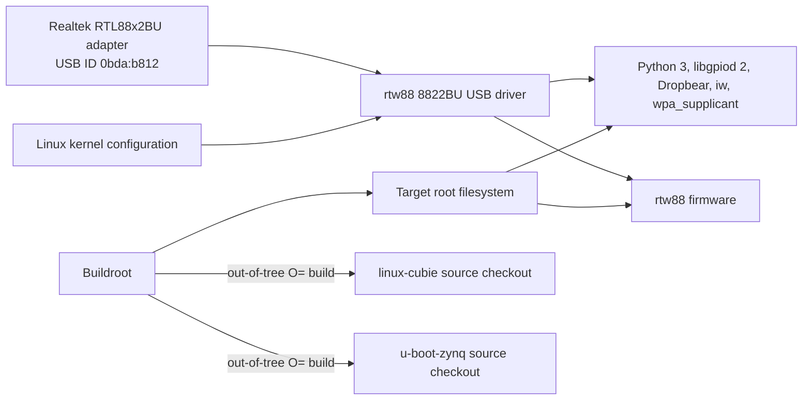

# AbstractX Zynq-7000 Shared Platform Specification

Author: AbstractX Engineering
Date: 2026-10-06
Status: Active
Applies to: QMTECH XC7Z020, ALINX AC7010C, and ALINX AC7020C

## Scope

This specification defines shared Linux userspace packages, Wi-Fi support, and
Buildroot source-tree behavior for the Zynq-7000 board configurations. Board
memory maps, pin assignments, and FPGA integration remain defined by each
board's own specification.

## Requirements

### [SPEC-ZYNQ-PLATFORM-01] Shared Buildroot userspace

Every supported Zynq-7000 board defconfig MUST enable Buildroot's
`BR2_PACKAGE_LIBGPIOD2` and `BR2_PACKAGE_LIBGPIOD2_TOOLS` for GPIO userspace,
Python 3, Dropbear, `iw`, and `wpa_supplicant` with nl80211 support. Python
hardware-access packages MUST include pyserial, asyncio support for pyserial,
spidev, smbus2, and python-gpiod for timestamped Linux userspace interrupt
events in the Zynq IMU backend validation proof of concept.

These packages provide userspace APIs but MUST NOT be treated as enabling
hardware interfaces by themselves. Serial, SPI, and I²C device nodes must be
exposed by the relevant kernel drivers and board device tree.

### [SPEC-ZYNQ-PLATFORM-06] Shared PS SPI and I²C bus exposure

The QMTECH XC7Z020, ALINX AC7010C, and ALINX AC7020C Linux device trees MUST
enable PS I²C0 on MIO14/MIO15 and PS SPI1 on MIO10/MIO11/MIO12 with chip select
on MIO13. The board hardware routes these pins for the shared bus assignment.
The kernel MUST enable the Cadence SPI and I²C controllers, `SPI_SPIDEV`,
`I2C_CHARDEV`, and the existing GPIO character device support. The SPI device
tree MUST expose the ICM-42688-P to userspace through spidev using its truthful
`invensense,icm42688` compatible. The in-kernel IIO SPI driver MUST NOT claim
that endpoint. QSPI remains dedicated to boot flash and MUST NOT be treated as
the general-purpose `spidev` bus.

### [SPEC-ZYNQ-PLATFORM-02] RTL88x2BU USB Wi-Fi adapter

Every supported Zynq-7000 board MUST build the in-tree Linux `rtw88` 8822BU
USB driver for USB ID `0bda:b812` and install its `rtw88/rtw8822b_fw.bin`
firmware in the target root filesystem. The kernel driver MUST be enabled
through the shared Linux platform configuration fragment, and its firmware MUST be
selected from Buildroot's `linux-firmware` package.

### [SPEC-ZYNQ-PLATFORM-03] Buildroot source-tree isolation

Buildroot MUST use the `linux-cubie` and `u-boot-zynq` checkouts as local source
overrides while keeping generated kernel and U-Boot build output in the
Buildroot output tree. Configuring or building a board MUST NOT run `make
clean` in either source checkout or require either checkout to be clean. Every
Zynq defconfig MUST select custom Linux 7.1 headers to match the pinned
`cubie-linux-7.1` kernel revision.

### [SPEC-ZYNQ-PLATFORM-04] GPIO character-device support

Every supported Zynq-7000 Linux kernel MUST enable `CONFIG_GPIOLIB` and
`CONFIG_GPIO_CDEV`, exposing GPIO controllers through `/dev/gpiochipN` for
libgpiod 2 userspace tools.

### [SPEC-ZYNQ-PLATFORM-05] Board-compatible overlay defaults

The generated `/boot/config.txt` MUST keep every board PS-only by default and
MUST NOT apply an AbstractX PL overlay before its matching bitstream is loaded.
External automation MAY load a bitstream through Linux FPGA Manager and then
apply its compatibility-matched UIO/trace overlay. A deployment MUST unbind
drivers and remove the previous overlay before changing bitstreams, or reboot
to recover the PS-only baseline. The image-generation step MUST fail for an
unknown board DTB rather than silently selecting an incompatible configuration.

### [SPEC-ZYNQ-PLATFORM-07] Executable Buildroot hooks

Every script configured as a Buildroot post-build or post-image hook MUST be
stored as an executable regular file in source control so Buildroot can invoke
it directly in a fresh checkout. Repository verification MUST reject a
configured hook that lacks any execute bit.

### [SPEC-ZYNQ-PLATFORM-08] Shared fully preemptible realtime kernel

Every Zynq-7000 Buildroot defconfig MUST consume the shared Linux platform
configuration fragment. That fragment MUST select the fully preemptible
PREEMPT_RT model, forced IRQ-threading support, high-resolution timers, and
PREEMPT_RT softirq synchronization. Specifically, the effective kernel
configuration MUST contain `CONFIG_PREEMPT_RT=y`,
`CONFIG_PREEMPT_RT_NEEDS_BH_LOCK=y`, `CONFIG_IRQ_FORCED_THREADING=y`, and
`CONFIG_HIGH_RES_TIMERS=y`. The softirq synchronization option intentionally
restores per-CPU bottom-half locking semantics while softirq execution is
preemptible under PREEMPT_RT.

### [SPEC-ZYNQ-PLATFORM-09] BRAM-first packet storage and explicit DDR modes

The XC7Z020 provides 140 36-Kibit block RAMs (4.9 Mibit, 630 KiB raw total).
The default bring-up transport MUST use two 128-slot, 64-byte packet FIFOs in
PL BRAM: 8 KiB ingress and 8 KiB egress. Each FIFO consumes two BRAM36 blocks,
so both directions consume four of 140 blocks before synthesis overhead. The
trusted AXI/BRAM path uses the internal TLP integrity profile with a zero footer.

Larger designs MAY select one of two separately identified DDR modes:

1. **HP non-coherent mode:** PL uses `S_AXI_HP0`; memory MUST come from a kernel
    DMA allocation or a `no-map` reserved region exposed noncached. Cached CPU
    mappings require the appropriate `dma_sync_*_for_cpu/device()` operations at
    every ownership transfer. Ordinary cached `/dev/mem` mappings are forbidden.
2. **ACP coherent mode:** PL uses `S_AXI_ACP` with correct coherent/shareable
    AXI attributes and a kernel-managed DMA buffer. ACP cache snooping does not
    replace release/acquire ring ownership barriers. The current DMA RTL lacks
    the ACP cache/ID attributes and MUST NOT be described as ACP-coherent.

Bitstream and device-tree compatibility metadata MUST identify BRAM, HP, or ACP
mode; software MUST NOT infer or switch the memory model silently.

### [SPEC-ZYNQ-PLATFORM-10] CppUTest target library

Every supported Zynq Buildroot defconfig MUST select the external
`BR2_PACKAGE_CPPUTEST` package pinned to CppUTest v4.0. The package MUST install
CppUTest and CppUTestExt headers/libraries into staging for target test linking;
it MUST NOT alias the unrelated cpptest or Google Highway libraries.

### [SPEC-ZYNQ-PLATFORM-11] Runtime bitstream loading

Every supported Zynq Buildroot image MUST include `xilinx-fpgautil` so external
automation can SSH into a PS-only system, load a selected bitstream through
Linux FPGA Manager, apply its matching device-tree overlay, run tests, and
collect results without changing the base boot image.

## Verification

Each supported defconfig MUST contain the userspace and firmware package
selections above, including both libgpiod package symbols, and reference the
shared Linux platform configuration fragment. The fragment MUST enable
`CONFIG_RTW88_8822BU`, `CONFIG_GPIOLIB`, and `CONFIG_GPIO_CDEV`. Every Zynq
defconfig MUST select `BR2_PACKAGE_HOST_LINUX_HEADERS_CUSTOM_7_1=y`. Buildroot's
`O=` output directory MUST remain separate from the Linux and U-Boot source
directories. The image-generation step MUST select overlay settings from the
configured board DTB and reject unknown board DTBs. Each supported defconfig
MUST also resolve the Python serial, async-serial, SPI, I²C, and GPIO-event
package symbols.
Each board device tree MUST expose I²C0 and SPI1 on the specified MIO pins, and
the merged kernel configuration MUST enable both controllers and `SPI_SPIDEV`.
The selected SPI1 device MUST identify as `invensense,icm42688` and bind to
spidev. Every post-build and post-image script referenced by a supported
defconfig MUST be verified as executable. Every Zynq defconfig MUST reference
the shared kernel fragment, and its effective kernel configuration MUST retain
all four realtime options required by `[SPEC-ZYNQ-PLATFORM-08]`.
The shared BRAM transport configuration MUST synthesize 128 ingress and 128
egress slots, and every Zynq defconfig MUST select `BR2_PACKAGE_CPPUTEST=y`.
Every Zynq defconfig MUST also select `BR2_PACKAGE_XILINX_FPGAUTIL=y`.
