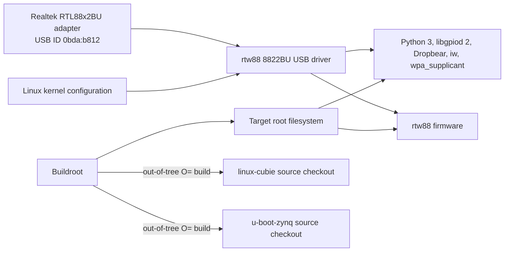

# AbstractX Zynq-7000 Shared Platform Specification

Author: AbstractX Engineering
Date: 2026-10-06
Status: Active
Applies to: QMTECH XC7Z020, ALINX AC7010C, and ALINX AC7020C

## Scope

This specification defines shared Linux userspace packages, Wi-Fi support, and
Buildroot source-tree behavior for the Zynq-7000 board configurations. Board
memory maps, pin assignments, and FPGA integration remain defined by each
board's own specification.

## Requirements

### [SPEC-ZYNQ-PLATFORM-01] Shared Buildroot userspace

Every supported Zynq-7000 board defconfig MUST enable Buildroot's
`BR2_PACKAGE_LIBGPIOD2` and `BR2_PACKAGE_LIBGPIOD2_TOOLS` for GPIO userspace,
Python 3, Dropbear, `iw`, and `wpa_supplicant` with nl80211 support. Python
hardware-access packages MUST include pyserial, asyncio support for pyserial,
spidev, smbus2, and python-gpiod for timestamped Linux userspace interrupt
events in the Zynq IMU backend validation proof of concept.

These packages provide userspace APIs but MUST NOT be treated as enabling
hardware interfaces by themselves. Serial, SPI, and I²C device nodes must be
exposed by the relevant kernel drivers and board device tree.

### [SPEC-ZYNQ-PLATFORM-06] Shared PS SPI and I²C bus exposure

The QMTECH XC7Z020, ALINX AC7010C, and ALINX AC7020C Linux device trees MUST
enable PS I²C0 on MIO14/MIO15 and PS SPI1 on MIO10/MIO11/MIO12 with chip select
on MIO13. The board hardware routes these pins for the shared bus assignment.
The kernel MUST enable the Cadence SPI and I²C controllers, `SPI_SPIDEV`,
`I2C_CHARDEV`, and the existing GPIO character device support. The SPI device
tree MUST expose the ICM-42688-P to userspace through spidev using its truthful
`invensense,icm42688` compatible. The in-kernel IIO SPI driver MUST NOT claim
that endpoint. QSPI remains dedicated to boot flash and MUST NOT be treated as
the general-purpose `spidev` bus.

### [SPEC-ZYNQ-PLATFORM-02] RTL88x2BU USB Wi-Fi adapter

Every supported Zynq-7000 board MUST build the in-tree Linux `rtw88` 8822BU
USB driver for USB ID `0bda:b812` and install its `rtw88/rtw8822b_fw.bin`
firmware in the target root filesystem. The kernel driver MUST be enabled
through the shared Linux platform configuration fragment, and its firmware MUST be
selected from Buildroot's `linux-firmware` package.

### [SPEC-ZYNQ-PLATFORM-03] Buildroot source-tree isolation

Buildroot MUST use the `linux-cubie` and `u-boot-zynq` checkouts as local source
overrides while keeping generated kernel and U-Boot build output in the
Buildroot output tree. Configuring or building a board MUST NOT run `make
clean` in either source checkout or require either checkout to be clean.

### [SPEC-ZYNQ-PLATFORM-04] GPIO character-device support

Every supported Zynq-7000 Linux kernel MUST enable `CONFIG_GPIOLIB` and
`CONFIG_GPIO_CDEV`, exposing GPIO controllers through `/dev/gpiochipN` for
libgpiod 2 userspace tools.

### [SPEC-ZYNQ-PLATFORM-05] Board-compatible overlay defaults

The generated `/boot/config.txt` MUST enable AbstractX UIO/trace overlays only
for a board configuration whose selected bitstream implements the overlay ABI.
The QMTECH configuration supports the shared TLP/DMA overlays. ALINX AC7010C
and AC7020C images MUST default to no AbstractX overlays because their current
baseline bitstreams do not implement the shared TLP/DMA hardware. An ALINX
deployment MAY opt in only after selecting a bitstream that implements the
shared ABI. The image-generation step MUST fail for an unknown board DTB
rather than silently selecting an incompatible overlay configuration.

## Verification

Each supported defconfig MUST contain the userspace and firmware package
selections above, including both libgpiod package symbols, and reference the
shared Linux platform configuration fragment. The fragment MUST enable
`CONFIG_RTW88_8822BU`, `CONFIG_GPIOLIB`, and `CONFIG_GPIO_CDEV`. Buildroot's
`O=` output directory MUST remain separate from the Linux and U-Boot source
directories. The image-generation step MUST select overlay settings from the
configured board DTB and reject unknown board DTBs. Each supported defconfig
MUST also resolve the Python serial, async-serial, SPI, I²C, and GPIO-event
package symbols.
Each board device tree MUST expose I²C0 and SPI1 on the specified MIO pins, and
the merged kernel configuration MUST enable both controllers and `SPI_SPIDEV`.
The selected SPI1 device MUST identify as `invensense,icm42688` and bind to
spidev.
