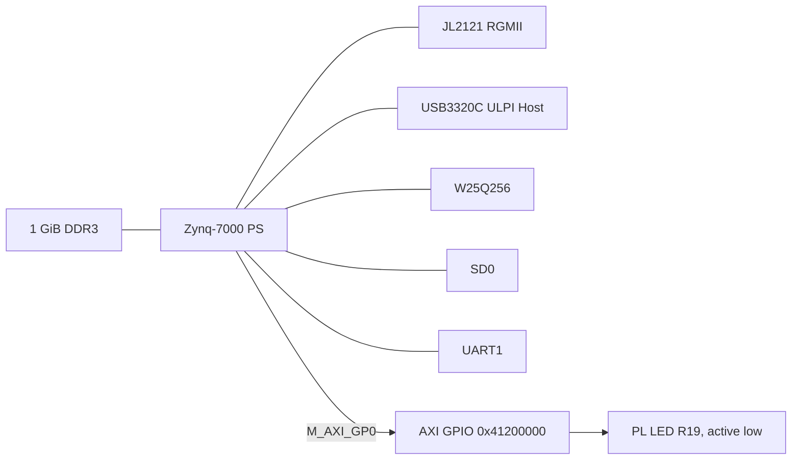

# AbstractX ALINX AC7020C Hardware Target Specification

Author: Tim Michals  
Date: 2026-10-06  
Status: Board-support baseline  
Target: ALINX AC7020C, XC7Z020-2CLG400I

## Scope

This target owns reproducible Zynq PS boot hardware and a one-bit PL AXI GPIO for board bring-up. It intentionally excludes HDMI. Full AbstractX TLP DMA/router integration is a subsequent stage governed by the shared Zynq fabric requirements.

## Requirements

### [SPEC-AC7020C-01] Standalone reproducible hardware

The AbstractX target MUST regenerate its XPR, bitstream and XSA from files within `hw/zynq7000/alinx_ac7020c`; it MUST NOT require a sibling ALINX repository at build time.

### [SPEC-AC7020C-02] Processing-system clock and memory

The PS input clock MUST be 33.333333 MHz. DDR MUST use the `MT41J256M16 RE-125` compatible preset for U7/U8 `H5TQ4G63AFR-PBI`, 32-bit bus, 533.333333 MHz, and expose 1 GiB through address `0x3fffffff`.

### [SPEC-AC7020C-03] Boot and communication peripherals

The PS MUST enable QSPI on MIO1..6, GEM0 RGMII on MIO16..27 with MDIO on MIO52..53, USB0 ULPI on MIO28..39 with active-low reset on MIO46, SD0 on MIO40..45 with card detect on MIO47, and UART1 on MIO48..49.

### [SPEC-AC7020C-04] Voltage standards and USB PHY

PS MIO bank 0 MUST be 3.3 V and bank 1 MUST be 1.8 V. Linux MUST describe the USB3320C as `usb-nop-xceiv`, active-low reset on MIO46, and USB0 host mode; software MUST NOT attempt to override PS bank voltage.

### [SPEC-AC7020C-05] Board LEDs

The PS LED on MIO0 and PL LED on package pin R19 are active low. The baseline PL design MUST expose a one-bit AXI GPIO at `0x41200000` controlling R19, defaulting off.

### [SPEC-AC7020C-06] Bootloader initialization

FSBL or U-Boot SPL MUST initialize PS/DDR using files generated from this target's XSA. Another board's `ps7_init_gpl.c` MUST NOT be used for release hardware.

### [SPEC-AC7020C-07] External software trees

The target-owned out-of-tree Buildroot configuration MUST consume `linux-cubie` and `u-boot-zynq` through local source overrides, while permitting those repositories to remain independently buildable.

## Verification

Linux MUST compile `xilinx/zynq-ac7020c.dtb`. U-Boot MUST compile `ac7020c_defconfig` and `zynq-ac7020c.dtb`. Release readiness additionally requires physical DDR, USB, Ethernet, SD, QSPI and LED tests.
