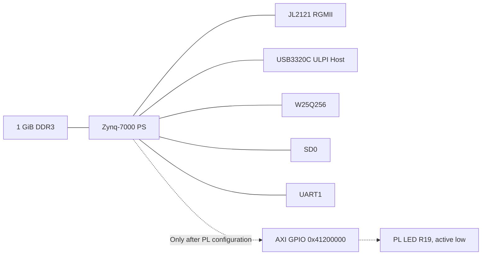

# AbstractX ALINX AC7020C Hardware Target Specification

Author: Tim Michals  
Date: 2026-10-06  
Status: Board-support baseline  
Target: ALINX AC7020C, XC7Z020-2CLG400I

## Scope

This target owns reproducible Zynq PS boot hardware and a one-bit PL AXI GPIO for board bring-up. It intentionally excludes HDMI. Full AbstractX TLP DMA/router integration is a subsequent stage governed by the shared Zynq fabric requirements.

## Requirements

### [SPEC-AC7020C-01] Standalone reproducible hardware

The AbstractX target MUST regenerate its XPR, bitstream and XSA from files within `hw/zynq7000/alinx_ac7020c`; it MUST NOT require a sibling ALINX repository at build time.

### [SPEC-AC7020C-02] Processing-system clock and memory

The PS input clock MUST be 33.333333 MHz. DDR MUST use the `MT41J256M16 RE-125` compatible preset for U7/U8 `H5TQ4G63AFR-PBI`, 32-bit bus, 533.333333 MHz, and expose 1 GiB through address `0x3fffffff`.

### [SPEC-AC7020C-03] Boot and communication peripherals

The PS MUST enable QSPI on MIO1..6, GEM0 RGMII on MIO16..27 with MDIO on MIO52..53, USB0 ULPI on MIO28..39 with active-low reset on MIO46, SD0 on MIO40..45 with card detect on MIO47, and UART1 on MIO48..49.

### [SPEC-AC7020C-04] Voltage standards and USB PHY

PS MIO bank 0 MUST be 3.3 V and bank 1 MUST be 1.8 V. Linux MUST describe the USB3320C as `usb-nop-xceiv`, active-low reset on MIO46, and USB0 host mode; software MUST NOT attempt to override PS bank voltage.

### [SPEC-AC7020C-05] Board LEDs

The PS LED on MIO0 and PL LED on package pin R19 are active low. The baseline PL design MUST expose a one-bit AXI GPIO at `0x41200000` controlling R19, defaulting off.

### [SPEC-AC7020C-06] Bootloader initialization

FSBL or U-Boot SPL MUST initialize PS/DDR using files generated from this target's XSA. Another board's `ps7_init_gpl.c` MUST NOT be used for release hardware.

### [SPEC-AC7020C-07] External software trees

The target-owned out-of-tree Buildroot configuration MUST consume `linux-cubie` and `u-boot-zynq` through local source overrides, while permitting those repositories to remain independently buildable.

### [SPEC-AC7020C-08] Linux revision and GPIO tools

The ALINX AC7020C Buildroot defconfig MUST pin the Linux source revision and
custom kernel headers to `cubie-linux-7.1` and Linux 7.1 respectively. It MUST
enable Buildroot's Linux GPIO tools and the BusyBox-alternative package view so
the kernel GPIO utility is explicitly selectable. The shared kernel fragment
MUST enable `CONFIG_GPIOLIB` and `CONFIG_GPIO_CDEV`.

### [SPEC-AC7020C-09] PS-only base device tree

The default Buildroot image uses U-Boot SPL without loading an FPGA bitstream.
Its `zynq-ac7020c.dtb` MUST therefore describe only physically available PS
devices and MUST NOT instantiate the PL AXI GPIO at `0x41200000`, its PL LED,
or force an FPGA fabric clock. PL devices MUST be introduced only after a
matching bitstream is loaded, through a bitstream-specific device-tree overlay
or a boot image that explicitly couples the bitstream and device tree.

### [SPEC-AC7020C-10] Built-in SD root filesystem

The Buildroot SD-card image stores `/` as an ext4 filesystem on partition 2.
The Linux kernel MUST build ext4 and its journal support into the kernel image,
not as modules, because no module can be loaded before the root filesystem is
mounted. MMC block and SDHCI support MUST likewise remain built-in.

## Verification

Linux MUST compile a PS-only `xilinx/zynq-ac7020c.dtb`. U-Boot MUST compile `ac7020c_defconfig` and `zynq-ac7020c.dtb`. The saved Buildroot configuration MUST retain the Linux 7.1 revision/header selections and Linux GPIO tool selection. The generated base DTB MUST contain no `gpio@41200000` node before PL configuration. The effective kernel configuration MUST contain `CONFIG_EXT4_FS=y`, `CONFIG_JBD2=y`, `CONFIG_MMC_BLOCK=y`, and `CONFIG_MMC_SDHCI=y`. Release readiness additionally requires physical DDR, USB, Ethernet, SD, QSPI and LED tests.
