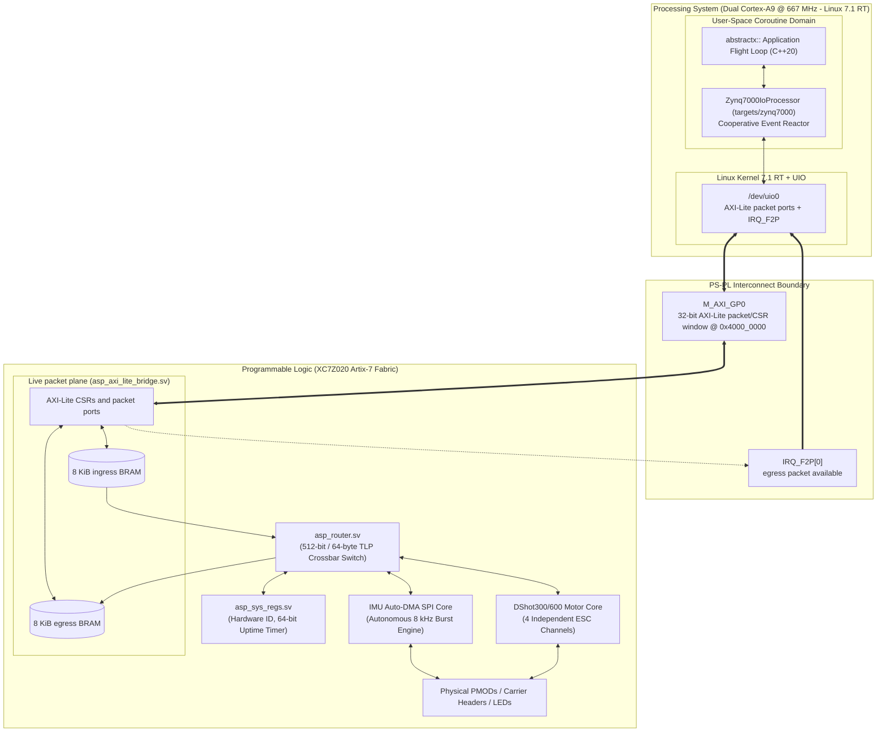
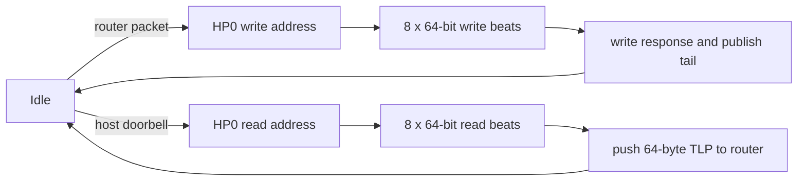

# AbstractX QMTECH Zynq-7020 Hardware Offload Specification

Author: Tim Michals  
Date: 2026-10-04  
Status: Specified; RTL present; board validation pending
Target Architecture: Xilinx Zynq-7000 (XC7Z020-CLG400-1 / CLG484C)  

---

## 1. Architectural Philosophy: BRAM First, DDR When Capacity Requires It

| Metric / Feature | Default AXI-Lite BRAM profile | Optional AbstractX DDR profile (`asp_axi_dma`) |
| :--- | :--- | :--- |
| **Packet shape** | Fixed 64-byte TLP | Fixed 64-byte TLP |
| **Storage** | 128-slot ingress + 128-slot egress BRAM FIFOs | SPSC rings in PS DDR |
| **Capacity** | 8 KiB each direction | Selected by reserved/kernel DMA allocation |
| **Cache contract** | None; memory resides in PL BRAM | HP0 noncoherent or future ACP coherent profile |
| **Complexity** | AXI-Lite packet ports and IRQ | AXI burst master, ring ownership, and DMA mapping |
| **Use** | Default bring-up and current board top | Larger future workloads only |

---

## 2. System Architecture & High-Speed Interconnect

The QMTECH Zynq-7020 platform implements FPGA hardware offload using the default
BRAM packet profile. The cross-target execution model remains defined by
[`targets/SPECIFICATION.md`](../../../targets/SPECIFICATION.md).



---

## 3. Optional DDR DMA Profile

The following state machine applies only to an optional HP0 DDR bitstream. It
is not instantiated by the default BRAM board top.



---

## 4. Packet storage modes

### 4.1 Default BRAM mode

The XC7Z020 contains 140 BRAM36 blocks (4.9 Mibit / 630 KiB raw). QMTECH
bring-up MUST use `asp_axi_lite_bridge` with 128 ingress and 128 egress slots:

```text
Ingress: 128 × 64 B = 8 KiB = 2 BRAM36
Egress:  128 × 64 B = 8 KiB = 2 BRAM36
Total:                  16 KiB = 4 / 140 BRAM36 blocks
```

Packets retain the canonical 20-byte header, 40-byte payload, and 4-byte
reserved footer. The footer is zero because GP0/BRAM is a trusted internal
processor↔FPGA path. FIFO valid/ready handshakes and IRQ ownership provide
integrity; no CRC is required.

### 4.2 Optional DDR mode

The DDR ring ABI remains available for payloads that outgrow BRAM, but the
bitstream/overlay MUST identify one explicit mode:

- `S_AXI_HP0`: non-coherent; use noncached reserved memory or kernel DMA APIs
  with `dma_sync_*` ownership transitions.
- `S_AXI_ACP`: coherent/cache-snooped only after the DMA master implements the
  required ACP AXI attributes and buffers are kernel managed.

The following layout applies to either DDR mode; it is not the default bring-up
configuration:

```
+-----------------------------------------------------------------------+
|  AbstractX SPSC DDR Ring Buffer Layout (64-Byte Slot Aligned)          |
+-----------------------------------------------------------------------+
| Offset (Bytes)  | Content                                             |
+-----------------+-----------------------------------------------------+
| 0x0000 - 0x003F | Slot 0: TLP [Header 20B | Payload 40B | Footer 4B]   |
| 0x0040 - 0x007F | Slot 1: TLP [Header 20B | Payload 40B | Footer 4B]   |
| 0x0080 - 0x00BF | Slot 2: TLP [Header 20B | Payload 40B | Footer 4B]   |
| ...             | ...                                                 |
| (N-1)*64 ..     | Slot N-1: Complete ring capacity (e.g. N = 256 slots)|
+-----------------------------------------------------------------------+
```

---

## 5. Requirements & Verification Traceability

### `[SPEC-ZYNQ-01]` Memory-Mapped AXI-Lite CSR & Control Interface (`M_AXI_GP0`)
* The FPGA PL MUST expose an AXI4-Lite slave on `M_AXI_GP0` mapped to physical address `0x4000_0000` (64 KB window).
* The default BRAM profile MUST instantiate 128 ingress and 128 egress 64-byte
  packet slots. DDR ring-base/head/tail registers below apply only to an HP/ACP
  DDR profile and MUST be absent or read as zero in BRAM mode.
* The BRAM register map MUST provide:
  * `0x00`: Control register.
  * `0x04`: FIFO status register.
  * `0x08`: Interrupt Status / ACK register (Write 1 to clear pending `IRQ_F2P[0]`).
  * `0x0C`: Interrupt Enable mask register.
  * `0x10`: ingress DWORD port; 16 writes commit one 64-byte packet.
  * `0x14`: egress DWORD port; 16 reads consume one 64-byte packet.
  * `0x18`: egress packet count.
  * `0x1C`: ingress free-slot count.
  * `0x40`: hardware ID `0x41535036` (`ASP6`).
* Optional DDR profiles define their ring-base/head/tail map in a separate
  bitstream/overlay compatibility contract.

### `[SPEC-ZYNQ-02]` Interrupt Signaling via `IRQ_F2P[0]` and Linux UIO
* The BRAM bridge MUST assert `IRQ_F2P[0]` when an egress TLP is available and
  interrupts are unmasked. Optional DDR profiles assert it after publishing a
  completed DDR slot.
* The Linux kernel MUST bind the PL core to `generic-uio` via the device tree node:
  ```dts
  &amba {
      abstractx_fpga: fpga-fabric@40000000 {
          compatible = "generic-uio";
          reg = <0x40000000 0x10000>;
          interrupt-parent = <&intc>;
          interrupts = <0 29 4>; /* IRQ_F2P[0] */
          status = "okay";
      };
  };
  ```
* The user-space driver MUST await the interrupt using `epoll()` / non-blocking read on `/dev/uio0` without busy-waiting or thread locks.

### `[SPEC-ZYNQ-03]` Fixed 64-Byte TLP Routing (`asp-tlp-64b`)
* All transactions between PS and PL MUST be encapsulated into strict 64-byte (16 x 32-bit DWORD) TLP containers.
* The PL router (`asp_router.sv`) MUST route packets by `Channel/AXID`:
  * `Channel 0x01` (`CONTROL`): Memory Read / Write requests targeting Wishbone registers.
  * `Channel 0x02` (`TELEMETRY`): Autonomous IMU sensor telemetry frames.
  * `Channel 0x04` (`DEBUG_TRACE`): Binary CTF 1.8 diagnostic trace stream.
  * `Channel 0x05` (`ESC_SERIAL`): Bidirectional serial/UART tunneling.

### `[SPEC-ZYNQ-04]` Autonomous IMU Auto-DMA & Direct SPI Engine
* The PL MUST integrate a hardware SPI Master and Auto-DMA state machine mapped to Wishbone base `0x4000_0100`:
  * `0x4000_0100` (`IMU_REG_CTRL`):
    * Bit 0 (`auto_dma_en`): Write `1` to **start** continuous autonomous DRDY auto-DMA; write `0` to **stop** auto-DMA mode.
    * Bit 1 (`direct_spi_trig`): Self-clearing single SPI transfer trigger pulse.
    * Bit 2 (`int_polarity`): Hardware DRDY interrupt polarity (`1` = active-high rising edge, `0` = active-low falling edge).
    * Bit 3 (`direct_spi_rw`): Manual SPI transfer direction (`0` = Read, `1` = Write).
  * `0x4000_0104` (`IMU_REG_ADDR`): Target IMU register offset (e.g. `0x75` WHO_AM_I, `0x4E` PWR_MGMT0, `0x1D` TEMP_DATA1).
  * `0x4000_0108` (`IMU_REG_LEN`): Payload transfer length in bytes (`1` for single register, `14` for the full temperature/6-axis sample from `0x1D` through `0x2A`; the SPI command byte is additional).
  * `0x4000_010C` (`IMU_REG_WDATA`): Data word to shift out over MOSI during manual register write.
  * `0x4000_0110` (`IMU_REG_RDATA`): Captured data word from MISO during manual register read.
  * `0x4000_0114 - 0x4000_0118`: 64-bit nanosecond timestamp latched at the start of the last SPI transfer (high word then low word).
  * `0x4000_011C` (`IMU_REG_STATUS`): Bit 0 direct-transfer busy, bit 1 direct-transfer done (write-one-to-clear), bit 2 Auto-DMA enabled, bit 3 SPI engine busy.
  * `0x4000_0120 - 0x4000_012C` (`IMU_REG_DATA0..3`): Four read-only words containing the most-significant-byte-first payload from the latest direct SPI read. The final word contains two payload bytes in bits 31:16 and zeroes in bits 15:0.
  * `0x4000_0130 - 0x4000_0134` (`IMU_REG_END_TIME_HI/LO`): 64-bit nanosecond timestamp captured after the final SPI bit and chip-select deassertion.
  * `0x4000_0138` (`IMU_REG_SPI_HALF_PERIOD`): SPI half-period in 100 MHz PL clock cycles; the SPI engine MUST use the configured value for both direct and Auto-DMA transfers.
  * `0x4000_013C` (`IMU_REG_DRDY_OVERRUN_COUNT`): Read-only 32-bit counter incremented for each active-polarity DRDY edge received while the Auto-DMA engine is not idle; the counter wraps modulo 2^32.
  * The SPI master MUST implement mode 0 (CPOL=0, CPHA=0): SCLK idles low, MOSI is stable before each rising edge, MISO is sampled on each rising edge, and MOSI changes on falling edges. Chip select MUST remain asserted across the command and complete payload.
* **Mode A (Direct Host Register Access)**:
  * When `direct_spi_trig` is pulsed, the engine performs a single transaction (read or write) and returns directly to `IDLE` without generating TLP stream packets.
  * The engine clears `done` when a request is accepted, asserts `busy` during transfer, and sets `done` only after payload and completion timestamp are committed and chip-select is deasserted.
  * Direct-read data remains available in `IMU_REG_DATA0..3` until the next direct read. Software MUST use the bounded busy/done handshake and MUST NOT infer completion from the self-clearing trigger or a changed sensor value.
* **Mode B (Autonomous 8 kHz DRDY Auto-DMA)**:
  * When `auto_dma_en` is `1`, each `DRDY` edge autonomously:
    1. Latches the 64-bit nanosecond hardware uptime timer.
    2. Performs an autonomous SPI burst read of `burst_len` bytes (default 14 bytes beginning at `TEMP_DATA1` register `0x1D`: temperature, accel, gyro).
    3. Packs raw sensor data, 16-bit sequence, DRDY/start timestamp, and SPI completion timestamp into a 64-byte `DMA_Stream` TLP (`Type=0x10`, `Channel=0x02`).
     4. Forwards the packet through the switch router to the BRAM egress FIFO;
       an optional DDR profile may instead forward it to the DDR DMA engine.
  * The 16-bit sample sequence MUST be assigned at each accepted DRDY edge and advance for every later DRDY edge while Auto-DMA is enabled, including edges received while the engine is busy. Busy edges increment `IMU_REG_DRDY_OVERRUN_COUNT`; the resulting sequence gaps let software account for samples that could not be acquired.
  * Software MUST snapshot the overrun counter before arming Auto-DMA and after stopping it, and report the modulo-2^32 delta. The counter is diagnostic and MUST NOT be interpreted as a count of records lost specifically to host packet-buffer exhaustion.
  * The TLP layout MUST retain the 14 sensor payload bytes in DW5–DW8, the DRDY/start timestamp in DW3–DW4, and the completion timestamp in DW9–DW10; sequence and padding fields MUST follow `hw/zynq7000/testApps/imu_backend_validation_poc/SPECIFICATION.md`.
  * The TLP stream valid signal MUST remain asserted with stable frame data until a valid/ready handshake occurs; a ready signal without valid MUST NOT consume or discard a frame.
* Writing `auto_dma_en = 0` MUST immediately halt autonomous triggering and place the engine in idle state; the status busy bit MUST remain asserted until the in-flight Auto-DMA transfer is aborted and chip select is deasserted.
* DRDY-to-packet-commit latency is a board-validation metric and MUST NOT be
  published as measured until captured on the synthesized QMTECH bitstream.
* The default burst address MUST be `0x1D`; a 14-byte read beginning at `0x1F` omits temperature and does not match the shared ICM-42688-P sample parser.

### `[SPEC-ZYNQ-06]` Nanosecond Monotonic Hardware Timer
* The top-level 64-bit uptime counter MUST represent elapsed nanoseconds, not PL clock cycles. Its update rate MUST derive from `CLK_FREQ_HZ`, preserving fractional nanoseconds when the clock period is not an integer number of nanoseconds.
* At the default 100 MHz PL clock, the counter MUST advance by 10 ns per clock cycle. All IMU start/end timestamps sourced from this counter MUST use the same nanosecond timebase.
* Implementation target: `hw/zynq7000/qmtech_zynq7020/rtl/top_qmtech_zynq7020.sv`.

### `[SPEC-ZYNQ-05]` Physical Pinout & Constraints (`constraints/qmtech_zynq7020.xdc`)
* The PL design MUST interface to the QMTECH XC7Z020 Core Board and Starter Kit Carrier:
  * Onboard User LEDs: Carrier D3 (PL pin `P22`), Core board D2 (PL pin `M14`).
  * Carrier Key: PL pin `P16`.
  * External PMOD / Extension Headers (JP5 - Bank 34 / 35, 3.3V LVCMOS):
    * IMU SPI1: `SCK` (`L22`), `CS_N` (`L21`), `MOSI` (`K20`), `MISO` (`K19`), and `DRDY` (`J22`).
    * Motor Demands: Channels 1..4 (`J21`, `K18`, `J18`, `J17`).
    * NeoPixel Status: `J16`.
    * Logic Analyzer Debug Pins: `G22`, `H22`, `F22`, `F21`.

  <a id="qmtech-fpga-spi-wiring"></a>
  #### Canonical QMTECH FPGA SPI/DRDY wiring

  This is the wiring contract for the FPGA-driven ICM-42688-P test. The
  signal names are the `top_qmtech_zynq7020` ports and the identifiers in
  parentheses are Zynq package pins constrained by
  `constraints/qmtech_zynq7020.xdc`.

  ```mermaid
  flowchart LR
    subgraph Q[QMTECH XC7Z020 · JP5 · 3.3 V LVCMOS]
      V33[3V3]
      GND[GND]
      SCLK[o_imu_sclk · L22]
      CS[o_imu_cs_n · L21]
      MOSI[o_imu_mosi · K20]
      MISO[i_imu_miso · K19]
      DRDY[i_imu_int · J22]
    end

    subgraph I[ICM-42688-P breakout]
      VIN[3V3 / VDDIO]
      IGND[GND]
      ISCLK[SCLK]
      ICS[CS_N]
      ISDI[SDI / MOSI]
      ISDO[SDO / MISO]
      IINT[INT1 / DRDY]
    end

    V33 --- VIN
    GND --- IGND
    SCLK --> ISCLK
    CS --> ICS
    MOSI --> ISDI
    ISDO --> MISO
    IINT --> DRDY
  ```

  | QMTECH JP5 signal | Zynq package pin | Sensor connection | Direction at PL |
  |---|---:|---|---|
  | `3V3` | — | Breakout `3V3`/`VDDIO` | Power |
  | `GND` | — | Breakout `GND` | Power return |
  | `o_imu_sclk` | `L22` | `SCLK` | Output |
  | `o_imu_cs_n` | `L21` | `CS_N` | Output, active low |
  | `o_imu_mosi` | `K20` | `SDI`/`MOSI` | Output |
  | `i_imu_miso` | `K19` | `SDO`/`MISO` | Input |
  | `i_imu_int` | `J22` | `INT1`/`DRDY` | Input |

  The sensor breakout MUST be 3.3 V logic compatible. Power-pin positions depend
  on the carrier/header orientation and MUST be checked against the QMTECH board
  silkscreen before power is applied. This wiring is dedicated to the PL SPI/DRDY
  engine.

  <a id="qmtech-linux-i2c-wiring"></a>
  #### Canonical QMTECH Linux PS-I2C wiring

  Linux uses the Cadence PS I²C0 controller exposed as `/dev/i2c-0`. This is a
  second physical wiring mode and MUST NOT be connected simultaneously with the
  FPGA SPI outputs above. The local repository does not contain a QMTECH carrier
  schematic, so connections are identified by the carrier signal labels
  `MIO14`/`MIO15`; connector position numbers MUST NOT be inferred.

  ```mermaid
  flowchart LR
    subgraph Q[QMTECH PS header signals]
      V33[3V3]
      GND[GND]
      SCL[MIO14 · I2C0 SCL]
      SDA[MIO15 · I2C0 SDA]
    end

    subgraph I[ICM-42688-P breakout in I²C mode]
      VIN[3V3 / VDDIO]
      IGND[GND]
      ISCL[SCL]
      ISDA[SDA]
      CS[CS_N tied high]
      AD0[AP_AD0 selects 0x68 or 0x69]
    end

    V33 --- VIN
    GND --- IGND
    SCL --- ISCL
    SDA --- ISDA
    V33 --- CS
  ```

  | QMTECH signal label | Sensor connection | Purpose |
  |---|---|---|
  | `3V3` | Breakout `3V3`/`VDDIO` and `CS_N` | Power and I²C-mode selection |
  | `GND` | Breakout `GND` | Power return |
  | `MIO14` | `SCL` | PS I²C0 clock |
  | `MIO15` | `SDA` | PS I²C0 data |
  | `GND` or `3V3` | `AP_AD0` | Select address `0x68` or `0x69` |

  SCL and SDA require external pull-ups to 3.3 V; use the breakout's fitted
  pull-ups or add one pull-up pair, but do not populate duplicate strong pull-up
  networks. A Linux-direct DRDY GPIO is intentionally not assigned here because
  its QMTECH carrier routing has not been verified. Linux I²C testing MUST poll
  until that interrupt pin is verified and added to this contract.

### `[SPEC-ZYNQ-06]` Target HAL Driver (`targets/zynq7000/`)
* The C++20 target runtime MUST implement `Zynq7000IoProcessor` satisfying `abstractx::hal::IIoProcessor`.
* The driver MUST support the active bitstream memory profile:
  * BRAM mode moves exactly 16 DWORDs through the ingress/egress packet ports.
  * Optional DDR mode uses the profile's ring head/tail ownership contract.
* Hot-path driver methods MUST remain strictly freestanding C++20 (zero heap allocations, zero blocking spin loops).
