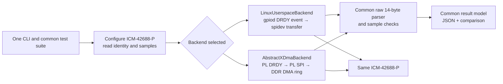

# Zynq ICM-42688-P Backend Validation Proof of Concept

**Location:** `hw/zynq7000/testApps/imu_backend_validation_poc/`
**Status:** Specification-first proof of concept
**Purpose:** Compare Linux interrupt-driven SPI acquisition with AbstractX FPGA
DRDY-triggered SPI and Auto-DMA using one IMU workload and one test suite.

This document is authoritative for the proof-of-concept test application and
the additional FPGA/DMA data contract it needs. It supplements
`hw/zynq7000/SPECIFICATION.md` and
`hw/zynq7000/qmtech_zynq7020/SPECIFICATION.md`.

## 1. Objective and scope

The experiment answers a concrete question:

> With the same ICM-42688-P, output data rate, sample format, and workload,
> what correctness, sample loss, end-to-end availability, throughput, and CPU
> cost result when Linux handles each data-ready interrupt and starts an SPI
> transfer, compared with AbstractX handling DRDY, SPI, and DMA in the FPGA?

The two paths deliberately differ below the test-suite boundary:

1. **Linux userspace path:** the OS delivers each sensor DRDY edge to the test
   process. The process then requests the 14-byte sensor burst through
   `/dev/spidev1.0`. Linux and the Zynq PS Cadence SPI controller execute each
   transaction.
2. **AbstractX FPGA path:** the sensor DRDY edge triggers the PL SPI engine.
   The PL reads the same 14-byte burst, packages the data and sequence/timing
   metadata, and the PL DMA engine writes the TLP into a DDR ring. Linux wakes
   the process for DMA-ring work; it does not issue one SPI transaction per
   sample.

The shared top-level suite owns sensor setup, identity checks, payload parsing,
sample validation, workload length, pass/fail decisions, and result reporting.
Only the backend adapter differs. It MUST NOT select a different IMU, register
configuration, payload interpretation, test order, or correctness rule.

The first milestone targets the QMTECH XC7Z020 bitstream containing
`asp_imu_auto_dma`. The ALINX AC7010C and AC7020C images expose the common PS
userspace bus but their current baseline bitstreams do not implement the
AbstractX PL/DMA ABI; they are not valid two-backend targets until a compatible
bitstream is installed.

## 2. Test application architecture



The common suite calls a backend contract with these operations:

* `open()` — open the selected devices, validate configuration, and check
  AbstractX hardware identity for the PL backend.
* `read_register(address)` and `write_register(address, value)` — configure and
  verify the same sensor registers through either implementation.
* `start_samples()` — arm Linux GPIO-event/SPI acquisition or initialize the
  PL DMA ring and enable FPGA Auto-DMA.
* `next_sample(timeout)` — return a common record containing the raw 14-byte
  payload, event/sample sequence, source timestamp metadata, and host-arrival
  timestamp.
* `stop_samples()` and `close()` — stop PL Auto-DMA, disable/ack interrupts,
  and release all resources, including on error.

`run_suite(backend, options)` is the only implementation of ordered test cases,
sample decoding, data-integrity checks, accounting, timing, and JSON reporting.
Backend classes implement transport only. The app is Python 3 so that both
Linux `spidev` and `gpiod` interfaces and the UIO DMA mapping can be exercised
by the same top-level program.

## 3. Hardware and device assumptions

### 3.1 Linux userspace backend

* PS SPI1 uses MIO10–MIO12 for SCLK/MOSI/MISO and MIO13 for chip-select.
* The selected sensor node uses the truthful `invensense,icm42688` compatible
  and binds to spidev; the in-kernel IIO SPI driver MUST NOT claim it.
* The test opens `/dev/spidev1.0`, configures SPI mode 0, MSB-first, 8-bit
  words, and the requested rate.
* The ICM-42688-P DRDY signal MUST also be connected to an available PS GPIO
  input. The GPIO chip and line offset are explicit command-line inputs until
  a verified shared board pin assignment is recorded. The test uses libgpiod
  edge events and records kernel event sequence numbers/timestamps.
* For every accepted rising-edge event, the userspace process issues one
  command-plus-data transfer. Gaps in GPIO event sequence numbers count as
  missed events; the process MUST NOT silently treat a later sample as the
  missing one.

### 3.2 AbstractX FPGA Auto-DMA backend

* Initial support is limited to a QMTECH bitstream with the AbstractX fabric,
  the PL IMU SPI engine, an active DRDY input, and the shared UIO/DMA ABI.
* The PL pins remain those defined in the QMTECH specification: SCK L22,
  CS_N L21, MOSI K20, MISO K19, and DRDY J22.
* The runner configures the sensor through the PL direct-register path, then
  enables the PL DRDY Auto-DMA mode. During collection, the FPGA—not a Linux
  userspace SPI transaction—reads each sample.
* The runner consumes TLP records from the RX DMA ring and tracks hardware
  sample sequence numbers. Sequence gaps and PL busy-edge overruns are reported;
  malformed TLPs fail the run. Ring-full observations are reported separately
  and are not treated as a direct count of lost samples.
* The RX DMA ring is the reserved 32 MiB region at physical
  `0x1E000000`. The UIO device exposes map 0 for the 64 KiB CSR window and map
  1 for the reserved DMA window. Both mappings MUST use the UIO noncached
  mapping policy. The app MUST NOT use an ordinary cached `/dev/mem` mapping
  or assume the Zynq HP DMA path is cache coherent.
* Ring capacity is in 64-byte TLP slots. The consumer copies each record before
  advancing the hardware RX head, and it MUST bounds-check the ring index and
  TLP length.

### 3.3 Exclusive SPI ownership and physical routing

Only one SPI master may drive the ICM-42688-P at a time. Backend runs are
separate invocations; the user selects/wires the requested route between runs
unless a verified hardware mux is later added. DRDY may fan out to PL and PS
GPIO inputs, which are inputs only. The runner MUST never start Linux SPI and
PL SPI concurrently. Board-specific DRDY GPIO routing and the safe PS/PL SPI
selection method are recorded as hardware setup metadata and remain a
bring-up checklist item until verified on the board.

## 4. Common sensor protocol and setup

### 4.1 SPI wire contract

* Mode 0: `CPOL=0`, `CPHA=0`.
* MSB first; 8 bits per word.
* Requested rate defaults to 10 MHz, MUST be at least 100 kHz, and MUST be no
  greater than 24 MHz.
* `WHO_AM_I` is register `0x75`; expected device value is `0x47`.
* A sample burst starts at `TEMP_DATA1` register `0x1D`. The SPI command byte
  is `0x9D`; the following 14 bytes, registers `0x1D` through `0x2A`, are the
  raw temperature, acceleration X/Y/Z, and gyroscope X/Y/Z fields.
* Both backends deliver exactly the 14 payload bytes, excluding the SPI
  command/dummy byte, in the same bus order.
* Requested and known effective bus frequencies are recorded. Results MUST
  disclose when controller divider quantization prevents equal effective SPI
  clock rates; the comparator MUST warn and MUST NOT label a raw ratio as a
  like-for-like speed winner in that case.

### 4.2 Identical sensor configuration

The common suite writes these values in the same order through both backends:

| Register | Address | Value | Meaning |
|---|---:|---:|---|
| `PWR_MGMT0` | `0x4E` | `0x0F` | Low-noise accelerometer and gyroscope |
| `GYRO_CONFIG0` | `0x4F` | `0x03` | 8 kHz ODR, ±2000 dps |
| `ACCEL_CONFIG0` | `0x50` | `0x03` | 8 kHz ODR, ±16 g |
| `INT_CONFIG` | `0x14` | `0x12` | Push-pull, active-high, pulsed interrupt |
| `INT_SOURCE0` | `0x65` | `0x08` | Route UI data-ready to INT1 |

Both runs use the same stabilization delay, sample count/duration, warm-up
policy, and parser. No per-sample initialization writes are permitted.
This POC's common register values fix the ODR at 8 kHz; a run requesting a
different ODR is rejected rather than reporting a workload the sensor was not
configured to produce.

### 4.3 Shared payload parser

The parser accepts exactly 14 bytes and interprets seven signed big-endian
16-bit values:

1. temperature, raw bytes 0–1;
2. accelerometer X/Y/Z, raw bytes 2–7;
3. gyroscope X/Y/Z, raw bytes 8–13.

It applies the same unit conversions in both modes: temperature
`raw / 132.48 + 25 °C`, acceleration `raw / 2048 g`, and gyroscope
`raw / 16.4 degrees/second`, matching the existing ICM-42688-P driver
configuration. The parser rejects a short/long buffer and reports conversion
results; it MUST NOT reject a valid stationary sample merely because any axis
is zero.

## 5. Test cases and acceptance

Both backends run these cases in this order:

1. **Preflight**
   * Open the selected real backend; no mock fallback is allowed.
   * Verify SPI mode/rate inputs and required files/permissions.
   * For AbstractX, require CSR hardware ID `0x41535036` (`ASP6`), a valid
     `uio` IRQ, both expected UIO maps, and a usable DMA ring.
   * Require the Linux GPIO chip/line in userspace mode and verify that rising
     edge events can be requested.
2. **Sensor identity**
   * Read register `0x75` through the chosen backend and require `0x47`.
3. **Common configuration**
   * Apply the register table above and perform the same stabilization wait.
4. **Single-sample smoke check**
   * Start the selected collection path, receive one sample, require a valid
     event/sequence record and 14-byte payload, and decode it with the shared
     parser.
5. **Repeated run**
   * Discard the same configurable warm-up count (default 100), then run for
     the configured fixed wall-clock duration (default 10 seconds).
   * Expected data-ready events are derived from the configured ODR and run
     duration; a fixed received-sample count MUST NOT hide missed events.
   * The Linux backend pairs one GPIO edge with one SPI transfer.
   * The AbstractX backend consumes Auto-DMA TLPs generated from DRDY edges.
   * Count expected, received, invalid, sequence-gap, and PL busy-edge overrun
     samples independently; the Linux backend reports the PL-only counter as
     unavailable rather than substituting a success-shaped zero.
6. **Shutdown**
   * Stop Auto-DMA, drain/ack pending UIO interrupts, close GPIO/SPI/UIO
     handles, and leave the sensor in the documented safe state.
   * Shutdown MUST run on success, assertion failure, timeout, and exception.

The correctness acceptance criteria are: expected sensor ID, valid common
configuration transactions, payload length and byte order, parsed sample
count, explicit loss accounting, no malformed TLPs, and clean shutdown. A
performance threshold is not a pass/fail criterion; measured outcomes are
reported without assuming which backend wins.

## 6. Metrics and interpretation

Every result includes:

* backend (`linux-userspace` or `abstractx-auto-dma`), board, bitstream/revision,
  sensor ID, requested/effective SPI clock when known, SPI mode, ODR,
  configuration values, sample range, duration, and run timestamps;
* expected event count, received sample count, invalid records, missing
  sequence count, GPIO event sequence gaps, PL busy-edge overruns, DMA-ring
  full observations, records drained but not yet parsed at shutdown, and
  transfer/timeout errors;
* samples per second, process user/system CPU time, wall-clock duration, and
  per-sample latency distributions (minimum, mean, median, p95, p99, maximum);
* Linux event-to-data latency using the GPIO event's kernel monotonic timestamp
  through completed userspace SPI read;
* FPGA DRDY-to-SPI-complete latency using the PL start/end timestamps carried
  in each DMA sample, plus separate host IRQ-to-record-consumption time.

Clock-domain values MUST be labeled. Linux monotonic event timestamps and PL
timer timestamps MUST NOT be subtracted from each other unless a documented
clock synchronization/calibration step has been performed. The report MUST
show absolute values for both paths before any relative comparison. It MUST
warn when effective SPI clocks or sensor configurations differ.

The test compares interrupt-driven software acquisition against autonomous
FPGA acquisition, not merely one SPI ioctl against one MMIO call. Results MUST
not be generalized to another board, bitstream, kernel, sensor, or wiring
without rerunning the test and recording that configuration.

## 7. AbstractX CSR, DMA-ring, and sample record contract

### 7.1 UIO maps and ring ownership

The AbstractX UIO platform resource list MUST expose:

| UIO map | Physical range | Size | Role |
|---|---:|---:|---|
| 0 | `0x40000000` | `0x10000` | AbstractX CSR/Wishbone registers |
| 1 | `0x1E000000` | `0x02000000` | Reserved uncached DMA ring region |

The ring consists of 64-byte slots. The app sets RX base, capacity, and head
before enabling DMA; the FPGA owns writes at the tail, and userspace owns
advancing the head after copying each complete slot. The DMA engine leaves one
slot empty to distinguish full from empty. The consumer MUST drain records
before acknowledging/re-enabling the level-triggered UIO interrupt.
The initial ring capacity is 256 slots (16 KiB) even though the reserved UIO
map is 32 MiB; the rest remains reserved for future ring sizing. The app MUST
set its head to the current hardware tail before starting a new run, preserving
the monotonically advancing hardware tail and avoiding stale slots.

### 7.2 IMU registers needed by both backend adapters

The IMU Wishbone block is based at `0x40000100`:

| Offset | Name | Access and meaning |
|---:|---|---|
| `0x00` | `CTRL` | bit 0 Auto-DMA enable; bit 1 direct trigger; bit 2 DRDY polarity; bit 3 direct read/write |
| `0x04` | `ADDR` | ICM register address |
| `0x08` | `LEN` | payload bytes, 1–14 |
| `0x0C` | `WDATA` | direct register write value |
| `0x10` | `RDATA` | first word from a direct read |
| `0x14` | `START_TIME_HI` | direct/Auto-DMA transfer start timestamp high word |
| `0x18` | `START_TIME_LO` | start timestamp low word |
| `0x1C` | `STATUS` | bit 0 direct busy; bit 1 direct done (write-one-to-clear); bit 2 Auto-DMA active; bit 3 SPI engine busy |
| `0x20`–`0x2C` | `DATA0`–`DATA3` | most-significant-byte-first direct payload, final two bytes in high half of `DATA3` |
| `0x30` | `END_TIME_HI` | direct transfer completion timestamp high word |
| `0x34` | `END_TIME_LO` | direct transfer completion timestamp low word |
| `0x38` | `SPI_HALF_PERIOD` | PL SPI half-period in 100 MHz fabric clock cycles |
| `0x3C` | `DRDY_OVERRUN_COUNT` | Read-only count of active-polarity DRDY edges received while the Auto-DMA engine is busy |

For the PL backend, the requested frequency is converted to
`ceil(100 MHz / (2 * requested_hz))` fabric cycles per half-period, bounded to
at least two cycles. The result MUST be read back and reported as the effective
PL clock (`100 MHz / (2 * half_period)`). Linux reports the requested rate and
the best available controller-reported/electrically measured rate; if none is
available, `effective_spi_hz` MUST be null and its rate source MUST say so,
rather than reporting a requested value as a measured clock.

The direct path is used for common configuration and identity reads before
Auto-DMA starts. The engine clears `done` when it accepts a direct request,
sets `busy` while executing it, and sets `done` only after the final SPI bit,
chip-select deassertion, payload registers, and completion timestamp are
committed. Direct status/payload remain stable until another direct request.
The adapter waits for `done` with a bounded timeout; it MUST NOT infer
completion from the self-clearing trigger bit or sensor data changing.

The default Auto-DMA burst MUST start at `0x1D` and read 14 payload bytes. The
DRDY timestamp is captured before the SPI burst and the completion timestamp
after it. Each emitted record carries both timestamps so FPGA service latency
can be measured without mixing clock domains.
Stopping Auto-DMA disables new triggers, aborts any in-flight Auto-DMA
transaction, deasserts chip select, and clears bit 3 only after the engine is
idle. A direct host transaction is allowed to finish normally.
The PL sample sequence is assigned at each DRDY edge and advances even when a
later edge arrives while the engine is busy. Busy edges increment the
32-bit `DRDY_OVERRUN_COUNT`; software snapshots it before start and after stop
and reports its modulo-2^32 delta. This counter identifies edges not serviced
by the IMU engine, not specifically records rejected by the DDR ring.

### 7.3 64-byte Auto-DMA TLP format

The AXI DMA engine writes 64-bit beats to little-endian DDR. Therefore each
8-byte ring beat is byte-reversed relative to the ASP big-endian stream. The
backend MUST normalize each beat into ASP wire order before parsing; it MUST
NOT assume the mapped memory bytes are already stream-order bytes.

After normalization, the record format is:

| DWORDs | Contents |
|---|---|
| DW0 | type `0x10`, flags `0`, tag `0`, channel `0x02` |
| DW1 | IMU Wishbone base `0x40000100` |
| DW2 | payload length `4` DWORDs; low 16 bits are the 16-bit sample sequence |
| DW3–DW4 | 64-bit DRDY/start timestamp |
| DW5–DW8 | 14 raw sample bytes in wire order, then two zero pad bytes |
| DW9–DW10 | 64-bit SPI completion timestamp |
| DW11–DW14 | zero padding |
| DW15 | CRC/reserved word as defined by the current transport ABI |

The parser validates frame length, type, channel, target, payload length, and
padding before returning the sample. A sequence counter wraps modulo 2^16;
the consumer computes forward gaps modulo that width and distinguishes an
expected wrap from loss.

## 8. CLI and result-file contract

Initial interface:

```text
python3 run_imu_validation.py --backend linux-userspace \
    --duration-seconds 10 --warmup 100 --odr-hz 8000 --speed-hz 10000000 \
    --gpiochip /dev/gpiochip0 --gpio-line <verified-offset> \
    --json linux-userspace.json

python3 run_imu_validation.py --backend abstractx-auto-dma \
    --duration-seconds 10 --warmup 100 --odr-hz 8000 --speed-hz 10000000 \
    --uio /dev/uio0 --json abstractx-auto-dma.json

python3 run_imu_validation.py --compare linux-userspace.json abstractx-auto-dma.json
```

The JSON format is versioned and includes common test settings, board and
software/bitstream identifiers, per-case pass/fail, loss counters, raw timing
samples or a lossless equivalent, summary statistics, and clock-domain
metadata. The comparator rejects malformed/version-unknown files and incompatible
sensor/configuration/workload fields. Differing known effective SPI rates
produce a prominent comparability warning and suppress a winner claim.

Invalid arguments, missing permissions/devices, bad sensor identity, malformed
TLP, timeout, dropped samples beyond explicitly reported losses, and cleanup
failure MUST be reported to stderr with a nonzero process exit code. No
hardware error may trigger a mock or success-shaped fallback.

## 9. Automated test requirements

Host tests use Python's standard `unittest` runner and injected fake backends;
they never open real hardware. They MUST verify:

* both selected backends traverse the same common case sequence and parser;
* WHO_AM_I mismatch, SPI errors, short payloads, malformed TLPs, sequence gaps,
  timeouts, and cleanup-on-exception are handled explicitly;
* signed big-endian sample parsing and unit conversions with known vectors;
* percentile/throughput calculations against deterministic timing vectors;
* incompatible JSON files are rejected and mismatched effective SPI rates warn;
* DMA ring wrap, full/empty, sample sequence wrap, and UIO TLP byte order.

On-target integration tests MUST use actual GPIO, SPI, UIO, and DMA mappings.
They MUST NOT substitute fakes or treat unavailable hardware as a skip/pass.

## 10. Traceability and article

Requirements in this specification use `[SPEC-ZYNQ-IMU-POC-*]` identifiers.
Implementation files MUST carry:

```text
# @impl [SPEC-ZYNQ-IMU-POC-XX] hw/zynq7000/testApps/imu_backend_validation_poc/<file>
```

RTL changes use the corresponding `// @impl` tag. The application is Python;
it does not add C++ to the portable AbstractX flight application.

### `[SPEC-ZYNQ-IMU-POC-01]` Same top-level test suite

Both backend choices MUST execute the same ordered cases, sensor setup,
parser, loss accounting, pass/fail decisions, and report generator.

### `[SPEC-ZYNQ-IMU-POC-02]` Linux interrupt-to-SPI backend

The Linux backend MUST obtain DRDY events from libgpiod and, for every
accepted event, read the same 14-byte sample through PS SPI1 `/dev/spidev1.0`.
It MUST record GPIO event sequence/timestamp data and SPI transfer failures.

### `[SPEC-ZYNQ-IMU-POC-03]` AbstractX autonomous backend

The PL backend MUST configure the same sensor, arm the PL DRDY input, start
hardware SPI Auto-DMA, and consume resulting TLPs through the UIO CSR and DMA
maps. Per-sample SPI transactions MUST NOT be issued by the Linux test process.
It MUST snapshot and report the DRDY busy-edge overrun counter before and
after acquisition.

### `[SPEC-ZYNQ-IMU-POC-04]` Identical sensor and payload semantics

Both paths MUST use ICM-42688-P identity `0x47`, the same register setup and
ODR, and the same 14-byte payload beginning at `0x1D`; both MUST use one common
parser and correctness rules.

### `[SPEC-ZYNQ-IMU-POC-05]` Safe ring/interrupt ownership

The PL backend MUST configure the reserved noncached DMA ring before enabling
Auto-DMA, copy complete records before releasing slots, detect gaps/overruns,
ack UIO IRQs correctly, report records drained but not yet parsed at shutdown,
and stop PL acquisition on every exit path.

### `[SPEC-ZYNQ-IMU-POC-06]` Comparable metrics

Results MUST report throughput, sample loss, process CPU cost, Linux
event-to-data latency, FPGA DRDY-to-SPI-complete latency, and host record
consumption latency with distinct clock-domain labels. Comparisons MUST disclose
effective bus-rate differences and MUST NOT assert an unmeasured winner.

### `[SPEC-ZYNQ-IMU-POC-07]` Automated verification

Standard-library host unit tests MUST exercise common suite logic, backend
failure paths, sample/TLP parsing, ring accounting, and report comparison.
Hardware integration failures MUST be explicit and nonzero.

### `[SPEC-ZYNQ-IMU-POC-08]` Evidence-based article

An accompanying article MUST be written after both real backend runs exist. It
MUST document wiring, board/kernel/bitstream revisions, setup, workload, raw
measurements, comparison limitations, and results; it MUST not assert a winner
from simulation or unit-test data.
