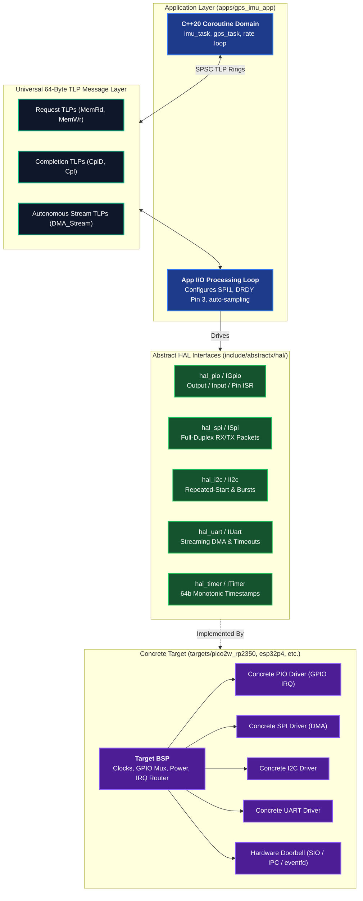
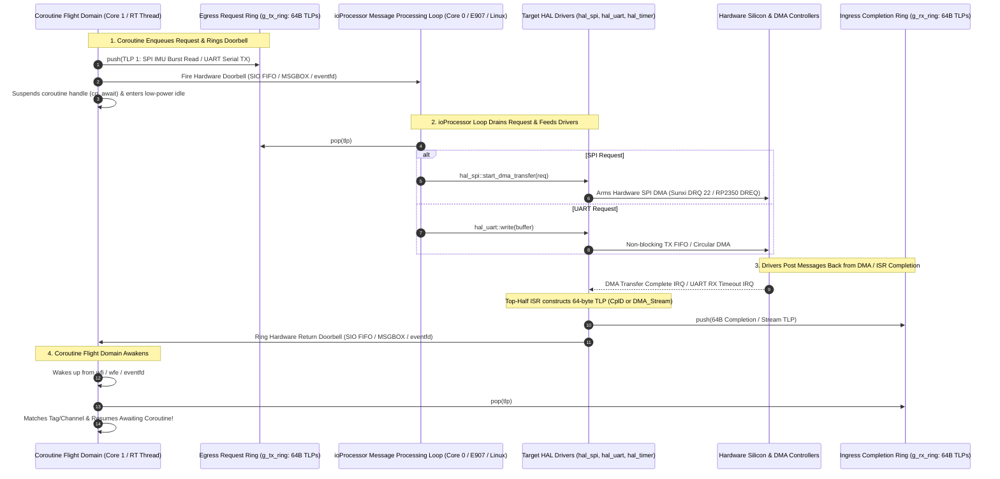
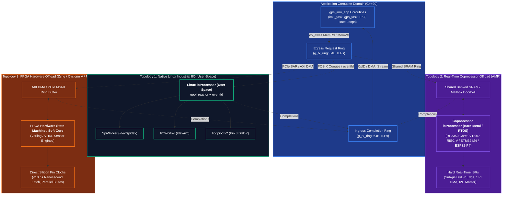
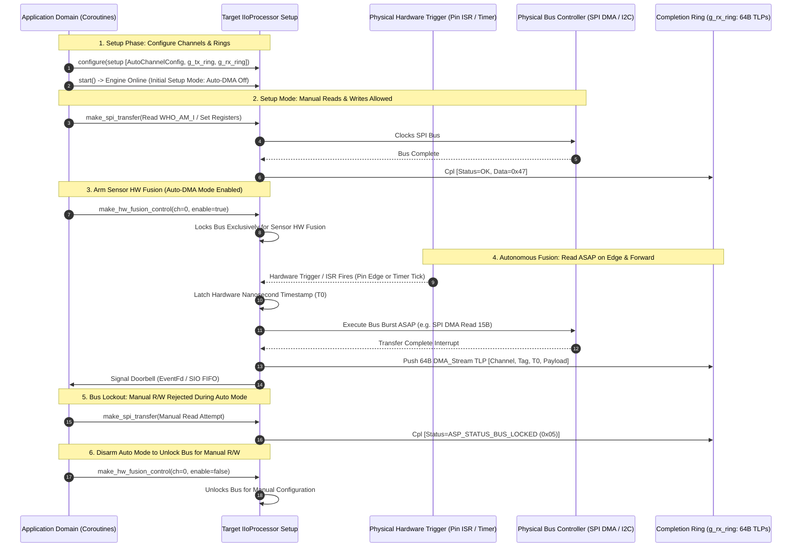
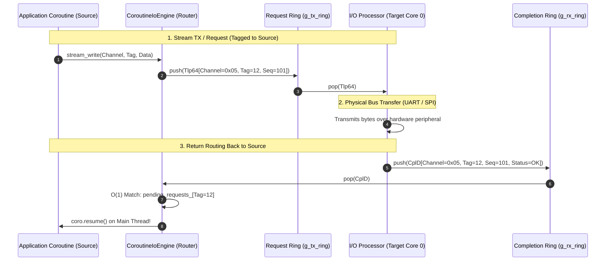

# AbstractX Target Architecture, HAL & TLP Wire Specification

This document is the **authoritative specification** for the `targets/` directory in AbstractX. It defines:
1. What a Target is and how execution domains are partitioned.
2. The concrete C++ **Hardware Abstraction Layer (HAL)** interfaces (`hal_pio`, `hal_spi`, `hal_i2c`, `hal_uart`, `hal_timer`, `hal_mailbox`).
3. The normative **TLP Wire Protocol & API** for each HAL peripheral (mapping split-transaction PCIe-like 64-byte TLPs to physical hardware operations).

---

## 1. Architectural Role of a Target

In AbstractX, an **Application** (`apps/<app_name>/`) contains high-level logic (coroutines and application I/O loops) and is **100% hardware-agnostic**.

A **Target** (`targets/<target_name>/`) represents a concrete hardware silicon platform (or simulation environment). The Target is responsible for:
1. **Board Support Package (BSP)**: Initializing silicon clocks, power domains, pin multiplexing, interrupt controllers, and bus peripherals.
2. **HAL Driver Implementations**: Providing concrete implementations of the abstract HAL interfaces (`hal_pio`, `hal_spi`, `hal_i2c`, `hal_uart`, `hal_timer`).
3. **Execution Domain Bootstrap**: Launching the dedicated Coroutine Domain (Core 1 / Flight Thread) and the dedicated I/O Domain (Core 0 / ISRs / Background Workers).
4. **Inter-Domain Bridge**: Providing the physical doorbell and memory barrier mechanisms to coordinate lock-free SPSC rings across cores or threads.



---

## 2. Execution Domain Partitioning

Every target must enforce strict **Execution Domain Separation**:

| Domain | Typical Location | Execution Characteristics | Safety Invariants |
| :--- | :--- | :--- | :--- |
| **Coroutine Domain** | Core 1 (Dual-Core MCU) or Real-Time Host Thread (Linux) | Cooperative C++20 coroutines, attitude filters, rate loops, state machines. | **Sole context that calls `.resume()`.** Never executes blocking I/O calls or physical bus polling loops. |
| **I/O Domain** | Core 0 (Dual-Core MCU), Hardware ISRs, or POSIX Worker Threads (Linux) | Hardware DMA interrupts, peripheral register clocking, Wi-Fi/network servicing. | **NEVER calls `.resume()`.** Communicates strictly by pushing completions/packets into SPSC rings and triggering doorbells. |

> [!IMPORTANT]
> **Rule 4.2 Violation Rejection**: Any code in `targets/` where an ISR or background worker invokes `coroutine_handle::resume()` directly is strictly prohibited. Doing so causes cross-core race conditions, memory corruption, and cache thrashing.

### 2.1 Replacing `isr_dispatcher`: The Unified `ioProcessor` IP Core (Linux, E907, Pico 2)

A foundational architectural principle of AbstractX is that **all target platforms—Linux Host/SBC, Allwinner XuanTie E907, and Raspberry Pi Pico 2 W (RP2350)—execute the EXACT SAME I/O Processor (`ioProcessor`) IP block**.

#### 2.1.1 Why the Unified `ioProcessor` Replaces `isr_dispatcher`
In legacy embedded designs, an `isr_dispatcher` pattern was frequently attempted: hardware ISRs attempted to resume coroutine handles directly (`handle.resume()`) or maintain ad-hoc priority queues of coroutine continuation pointers inside interrupt contexts. This legacy model suffers from fatal flaws:
1. **Stack & Memory Corruption**: Top-half ISRs executing on an interrupt stack cannot safely resume C++20 coroutine frames allocated in user or thread space without triggering stack overflow, priority inversion, or re-entrancy deadlocks.
2. **Cross-Core Race Conditions**: On dual-core microcontrollers (RP2350 Core 0 / Core 1) or asymmetric multiprocessing (Linux ARM A55 + E907 RISC-V), having ISRs resume coroutines across cores causes severe cache thrashing, pipeline stalls, and data races.
3. **Loss of Portability**: Each silicon target would require its own custom interrupt dispatcher semantics, breaking the portability of flight applications.

In AbstractX, the legacy `isr_dispatcher` is **completely eliminated and replaced** by the unified **`ioProcessor` IP Core**:

| Dimension | Legacy `isr_dispatcher` (Obsolete) | Unified `ioProcessor` IP Core (Mandatory) |
| :--- | :--- | :--- |
| **Component Name** | Silicon-specific ISR dispatcher | Uniform `ioProcessor` (`targets/<target>/src/io_processor.cpp`) |
| **C++ Interface** | Ad-hoc per platform | Universal `abstractx::hal::IIoProcessor` (`include/abstractx/hal/io_processor.hpp`) |
| **Universal Factory** | None | `abstractx::hal::get_target_io_processor()` |
| **Domain Decoupling** | ISRs touch coroutine pointers | Decoupled 64-byte TLP lock-free SPSC rings + hardware doorbells |
| **Top-Half Action** | Attempts to resume coroutines directly (Rule 4.2 violation) | Strictly pushes 64-byte TLP into ingress ring & fires hardware doorbell |
| **Sensor HW Fusion** | CPU wakes on every byte/ISR | Autonomous Auto-DMA Engine: hardware trigger directly clocks bus via DMA |
| **Bus Contention** | Undefined / Coroutines clash on bus | Hardware Bus Lockout: `ASP_STATUS_BUS_LOCKED` (0x05) error response |

#### 2.1.2 Platform Instantiation of the Unified IP
Every target instantiates this identical IP core using its platform-native event pump and hardware doorbell:

| Target Silicon | Implementation File | Concrete Class | I/O Pump Mechanism | Hardware Doorbell | Idle Power State |
| :--- | :--- | :--- | :--- | :--- | :--- |
| **Linux Target** | `targets/linux/src/io_processor.cpp` | `LinuxIoProcessor` | POSIX `epoll` reactor + worker threads | `eventfd` | `epoll_wait` sleep |
| **Allwinner E907** | `targets/allwinner_e907/src/io_processor.cpp` | `E907IoProcessor` | Sunxi DMA Engine + PLIC/CLINT ISRs | Hardware `MSGBOX` (IRQ 48/147) | `__asm__ volatile("wfi")` |
| **Pico 2 W (RP2350)** | `targets/pico2w_rp2350/src/io_processor.cpp` | `PicoIoProcessor` | RP2350 DMA Channels + DREQ/GPIO ISRs | Hardware SIO FIFO (`sio_hw->fifo_wr`) | `__asm__ volatile("wfe")` |

#### 2.1.3 The Message Processing Loop & Driver Message Posting
The dedicated I/O core (Linux worker thread, E907 RISC-V core, or RP2350 Core 0) executes the **Message Processing Loop** (`ioProcessor::run()` or non-blocking `ioProcessor::step()`). All physical hardware drivers hook directly into this message pipeline:



#### 2.1.4 Core Invariants of the Unified `ioProcessor`:
1. **Identical Name, Interface, and Factory**:
   - Every target keeps the same filename: `src/io_processor.cpp`.
   - Every target implements `abstractx::hal::IIoProcessor`.
   - Every target provides the global factory `abstractx::hal::get_target_io_processor()`.
2. **Unified Driver Message Routing**:
   - Drivers NEVER interact with coroutine state directly.
   - All drivers post transaction completions, received streaming data, and hardware errors back as 64-byte TLPs into `ingress_rx_ring`.
3. **Autonomous Sensor HW Fusion (Auto-DMA Engine)**:
   - When configured with `AutoChannelConfig`, a physical pin interrupt (e.g. Pin 3 / GP20 DRDY) causes the `ioProcessor` to trigger a hardware DMA burst read immediately without software polling.
   - On completion, it autonomously formats a `DMA_Stream` TLP with a 64-bit nanosecond timestamp, pushes it into `ingress_rx_ring`, and rings the doorbell.
4. **Deterministic Bus Lockout**:
   - While an Auto-DMA channel is active on a bus, any manual coroutine request attempting to touch that bus is rejected immediately with `ASP_STATUS_BUS_LOCKED` (0x05) to prevent bus collisions and latency spikes.
5. **Zero Polling / Zero Busy-Wait**:
   - 100% ISR and DMA driven. The `ioProcessor` loop enters `wfi` (E907), `__wfe()` (RP2350), or `epoll_wait()` (Linux) when idle.

### 2.2 Industrial IIO Paradigm & Relocatable I/O Processing (Linux / Coprocessor / FPGA)

AbstractX is designed around the principles of an **Industrial I/O (IIO)** subsystem—the standard Linux kernel model for high-speed ADCs, DACs, IMUs, accelerometers, gyroscopes, magnetometers, and environmental sensors. In traditional Linux IIO, sensors are partitioned into:
1. **Triggered Streaming Buffer (`/dev/iio:deviceX`)**: Continuous high-speed acquisition triggered by physical hardware events (such as IMU `DRDY` interrupt pins or hardware timer ticks) and stamped with hardware timestamps.
2. **Synchronous Control Plane (`sysfs`)**: Discrete attribute configuration (ranges, filter bandwidths, sampling rates, calibrations).

AbstractX adapts this industrial model into a **split-transaction, 64-byte TLP architecture** with zero dynamic allocations, zero kernel context-switching overhead, and sub-microsecond latency. Crucially, **because the interface between the Application Coroutine Domain and the I/O Processing Domain is a decoupled 64-byte TLP stream (`spsc_tlp_ring`), the entire `ioProcessor` engine can be relocated across three distinct physical architectures without modifying a single line of application code**:



#### Comparison of Deployment Topologies:

| Feature | Topology 1: Native Linux IIO | Topology 2: Coprocessor Offload (AMP) | Topology 3: FPGA Hardware Offload |
| :--- | :--- | :--- | :--- |
| **I/O Engine Execution** | Linux User-Space Reactor (`targets/linux/`) | Dedicated Coprocessor (`pico2w_rp2350`, `allwinner_e907`, `esp32p4`) | FPGA Logic Fabric / Soft-Core (Zynq, Cyclone V, PCIe) |
| **Typical Silicon** | Standard Linux SBC (CM4, BeagleBone, x86_64 SITL) | Heterogeneous SoCs (Cortex-A7 + E907, A53 + M4/M7, RP2350) | FPGA SoC (Zynq-7000 / UltraScale+, Cyclone V, PCIe Add-in Card) |
| **Transport Medium** | POSIX `eventfd` + `etl::queue_spsc_isr` | Shared Banked SRAM / Hardware Mailbox FIFO | AXI DMA / PCIe BAR Memory Window (`pcie_bar_map.hpp`) |
| **DRDY Latency & Jitter** | ~5–25 µs (Kernel TTY / gpiod epoll jitter) | **Deterministic sub-microsecond (&lt; 500 ns)** | **Zero-jitter hardware clock (&lt; 10 ns)** |
| **Bus Parallelism** | Worker threads (`SpiWorker`, `I2cWorker`) | Hardware DMA channels running independently | Fully parallel FPGA hardware state machines |
| **Host CPU Utilization** | Low (non-blocking `epoll`) | **Near zero** (Linux only handles processed TLP streams) | **Near zero** (Direct PCIe/AXI bus mastering into RAM) |
| **Application Code Changes** | **0 lines** (Standard C++20 Coroutine Ring) | **0 lines** (Standard C++20 Coroutine Ring) | **0 lines** (Standard C++20 Coroutine Ring) |

---

### 2.3 Sensor HW Fusion API & Auto-DMA Trigger Engine

Like an FPGA hardware state machine, the target `IIoProcessor` (`include/abstractx/hal/io_processor.hpp`) operates an autonomous **Sensor HW Fusion Engine**. It completely decouples the physical hardware trigger and bus polling sequence from application coroutines:



#### Core Operational Invariants of the Sensor HW Fusion API:

1. **Dual Trigger Support (Physical ISR vs. Auto-Trigger)**:
   - **Physical ISR Trigger (`TriggerMode::GpioEdge`)**:
     - Configured to fire on hardware pin transitions: positive/rising edge, negative/falling edge, or both.
     - Ideal for event-driven sensors with physical Data-Ready interrupt lines (e.g. IMU `DRDY`, optical encoder index pulses, external strobe signals).
     - On Linux: Configured via `libgpiod` v2 edge detection.
     - On RP2350 (Pico 2 W): Configured via hardware GPIO IRQs or PIO state machine input flags.
     - On FPGA: Bound directly to physical I/O pads.
   - **Periodic Auto-Trigger (`TriggerMode::Timer`)**:
     - Configured with a microsecond interval (`timer_period_us`) to autonomously trigger continuous polling at fixed frequencies (e.g. 100 Hz barometer sampling or 1 kHz ADC sweeps).
     - Driven by hardware monotonic timers (`timerfd` on Linux, hardware alarm on RP2350, or hardware counter in FPGA).

2. **ASAP Autonomous Read & Forward**:
   - When triggered, the engine **immediately** initiates the configured bus burst transfer (e.g. 15-byte SPI DMA burst) without notifying the application or waiting for a coroutine request.
   - The hardware latches the exact nanosecond interrupt timestamp $T_0$ at the trigger transition edge.
   - Upon DMA completion, the acquired payload is packaged directly into a 64-byte `DMA_Stream` TLP stamped with $T_0$ and pushed into `g_rx_ring`.
   - The inter-core/inter-thread doorbell is signaled, awakening the flight task directly with fresh, timestamped data (zero queue round-trips).

3. **Setup Mode vs. Fusion Active Mode**:
   - **Setup Mode (`auto_mode == false`)**:
     - Hardware triggers and DMA channels are disarmed.
     - Manual reads and writes (`MemRd`, `MemWr`, `make_spi_transfer`) are **fully permitted**.
     - The application reads `WHO_AM_I`, verifies chip communication, programs full-scale ranges and filter cutoffs, performs zero-rate calibrations, and configures the Sensor HW Fusion parameters via `make_hw_fusion_setup()`.
   - **Fusion Active Mode (`auto_mode == true`)**:
     - Armed via TLP control packet `make_hw_fusion_control(ch, enable=true)`.
     - The physical bus is **LOCKED** exclusively for the autonomous engine.

4. **Bus Lockout Protection Invariant**:
   - Once in Auto/DMA mode, **manual reads and rewrites CANNOT happen** on the bound bus.
   - Any manual transfer request sent over `g_tx_ring` while the bus is locked is **immediately rejected** with completion status `ASP_STATUS_BUS_LOCKED` (`0x05`). This prevents physical bus collisions, CS glitching, and FIFO desynchronization.
   - To perform manual reads or writes (e.g., dynamic sensitivity adjustment, in-flight diagnostics, or sensor re-calibration), the application **must first turn off auto-mode** via `make_hw_fusion_control(ch, enable=false)`.
   - Once disarmed, the bus is unlocked for manual transactions. When configuration completes, the application re-enables auto-mode.

---

### 2.4 Strict Hardware Invariant: 100% ISR and DMA Based (Zero Polling / Zero Hard Loops)

> [!CAUTION]
> **Zero Polling & Zero Busy-Wait Invariant**:
> Every hardware peripheral in AbstractX (`hal_spi`, `hal_uart`, `hal_timer`, `hal_pio`, `hal_mailbox`) **MUST be 100% ISR-driven or DMA-based**.
>
> 1. **SPI**: High-speed transfers must use hardware DMA channels (e.g. Sunxi DMAC DRQ 22 on Allwinner E907, RP2350 DMA with `spi_get_dreq` on Pico 2). Manual byte-by-byte FIFO polling loops (`while (!(SPI_ISR & TC))`) are **strictly prohibited**.
> 2. **UART**: Serial transmission and reception must be completely non-blocking. Transmit uses TX FIFO empty interrupts or DMA TX; receive uses circular DMA or Receiver Timeout (RTO) interrupts (`IIR == 0x0C`) draining into lock-free SPSC rings. Busy loops (`while (!(UART_LSR & TX_EMPTY))`) are **strictly prohibited**.
> 3. **Timer & Delays**: Waiting must be asynchronous (`co_await timer.sleep_ms_async(...)`) using hardware timer interrupts (`MTIP` / alarms) to resume coroutines. Spinning loops (`while ((now - start) < delay) { asm("nop"); }`) are **strictly prohibited**.
> 4. **CPU Idle State**: When no coroutines are ready and no I/O is pending, the CPU core **must execute low-power wait-for-interrupt/event instructions** (`wfi` on RISC-V XuanTie E907, `__wfe()` on ARM Cortex-M33 RP2350), never an active spinning loop.

---


## 3. Peripheral TLP Protocol & Wire API

> [!NOTE]
> **The Core Purpose of TLP: Messages for TX, RX, and IOCTL**
> In AbstractX, 64-byte Transaction Layer Packets (`Tlp64`) are used strictly for **three categories of runtime messages**:
> 1. **TX Messages**: Egress data streams dispatched from the Application Coroutine Domain to physical hardware (e.g. UART serial packets, SPI TX packet bursts, DShot motor commands).
> 2. **RX Messages**: Ingress data streams delivered from physical hardware to the Application Coroutine Domain (e.g. autonomous 8 kHz IMU `DMA_Stream`, UBX GPS navigation fixes, UART RX stream chunks).
> 3. **IOCTL Messages**: Input/Output Control commands issued dynamically to configure, control, or query peripheral status at runtime across execution domains (e.g. dynamic baud rate reconfiguration, changing IMU gyro/accel full-scale ranges, arming/disarming auto-DMA, flushing serial buffers). Every IOCTL is split-transaction and correlated via `Tag` with a `Cpl` (Status ACK) or `CplD` (Response Data) return packet.

AbstractX bridges application coroutines to hardware peripherals via **PCIe-like 64-Byte Transaction Layer Packets (`asp_tlp64`)**. All multibyte header fields are **Big-Endian** on the wire.

### Universal 64-Byte TLP Container Layout
```
 0                   1                   2                   3
 0 1 2 3 4 5 6 7 8 9 0 1 2 3 4 5 6 7 8 9 0 1 2 3 4 5 6 7 8 9 0 1
+-+-+-+-+-+-+-+-+-+-+-+-+-+-+-+-+-+-+-+-+-+-+-+-+-+-+-+-+-+-+-+-+
|     Type      |     Flags     |      Tag      |    Channel    | DW0 (Header)
+-+-+-+-+-+-+-+-+-+-+-+-+-+-+-+-+-+-+-+-+-+-+-+-+-+-+-+-+-+-+-+-+
|                     Target Address (32-bit)                   | DW1 (Header)
+-+-+-+-+-+-+-+-+-+-+-+-+-+-+-+-+-+-+-+-+-+-+-+-+-+-+-+-+-+-+-+-+
|       Length (in DW)          |       Sequence Number         | DW2 (Header)
+-+-+-+-+-+-+-+-+-+-+-+-+-+-+-+-+-+-+-+-+-+-+-+-+-+-+-+-+-+-+-+-+
|                Hardware Timestamp High (32-bit)               | DW3 (Header)
+-+-+-+-+-+-+-+-+-+-+-+-+-+-+-+-+-+-+-+-+-+-+-+-+-+-+-+-+-+-+-+-+
|                Hardware Timestamp Low (32-bit)                | DW4 (Header)
+-+-+-+-+-+-+-+-+-+-+-+-+-+-+-+-+-+-+-+-+-+-+-+-+-+-+-+-+-+-+-+-+
|                                                               | DW5..DW14
|                  Data Payload (40 Bytes)                      | (Payload)
|                                                               |
+-+-+-+-+-+-+-+-+-+-+-+-+-+-+-+-+-+-+-+-+-+-+-+-+-+-+-+-+-+-+-+-+
|                    Packet CRC32 / Checksum                    | DW15 (Footer)
+-+-+-+-+-+-+-+-+-+-+-+-+-+-+-+-+-+-+-+-+-+-+-+-+-+-+-+-+-+-+-+-+
```

---

### 3.1 `hal_pio` (Programmable Pin I/O & Interrupt Engine)
* **Virtual Address Base**: `0x40000800` (`ASP_ADDR_GPIO_BASE`)
* **Channel**: `0x08` (`ASP_CHANNEL_GPIO_BRIDGE` / `Channel::GpioBridge`)
* **Purpose**: Allows the application/coroutine domain to configure any pin as **Output**, **Input**, or **Hardware Interrupt (ISR)**, and perform atomic **Set**, **Xor** (Toggle), and **Clear** operations over 64-byte TLP messages.

#### 3.1.1 PIO Virtual Register Map:
| Offset | Register Name | Type | Command | Description |
|---|---|---|---|---|
| `0x00` | `ASP_GPIO_REG_CONFIG` | `MemWr` | `ASP_GPIO_CMD_CONFIG` (0x01) | Configures pin direction & pull:<br>`pin`: Pin number (0..63)<br>`mode`: `0=Input`, `1=Output`, `2=Alternate`, `3=Analog`<br>`pull_edge`: `0=None`, `1=PullUp`, `2=PullDown` |
| `0x04` | `ASP_GPIO_REG_WRITE`  | `MemWr` | `ASP_GPIO_CMD_WRITE` (0x02)  | Direct pin output write:<br>`pin`: Pin number<br>`value`: `0=Low`, `1=High` |
| `0x08` | `ASP_GPIO_REG_SET`    | `MemWr` | `ASP_GPIO_CMD_SET` (0x03)    | **Atomic Bit SET (Drive HIGH)**:<br>`pin`: Target pin index<br>`mask`: Optional 32-bit pin bitmask for single-cycle atomic port set |
| `0x0C` | `ASP_GPIO_REG_CLR`    | `MemWr` | `ASP_GPIO_CMD_CLR` (0x04)    | **Atomic Bit CLEAR (Drive LOW)**:<br>`pin`: Target pin index<br>`mask`: Optional 32-bit pin bitmask for single-cycle atomic port clear |
| `0x10` | `ASP_GPIO_REG_XOR`    | `MemWr` | `ASP_GPIO_CMD_XOR` (0x05)    | **Atomic Bit XOR (Toggle Output)**:<br>`pin`: Target pin index<br>`mask`: Optional 32-bit pin bitmask for single-cycle atomic port invert |
| `0x14` | `ASP_GPIO_REG_READ`   | `MemRd` | `ASP_GPIO_CMD_READ` (0x06)   | Synchronous/Asynchronous pin read:<br>Returns `Cpl` with `level=0/1`, full `mask_state`, and 64-bit nanosecond timestamp |
| `0x18` | `ASP_GPIO_REG_IRQ_CFG`| `MemWr` | `ASP_GPIO_CMD_IRQ_ATTACH` (0x07)| **Edge ISR Trigger Attach**:<br>`pin`: Target interrupt pin<br>`pull_edge`: `1=Positive/Rising`, `2=Negative/Falling`, `3=Both Edges` |
| `0x1C` | `ASP_GPIO_REG_IRQ_STATUS`| `MemRd/Wr` | `0x08` | Read pending IRQ status or acknowledge edge event |

#### 3.1.2 64-Byte GPIO TLP Wire Layouts:

##### GPIO Request Payload (`asp_tlp_gpio_req_header_t`):
```
Byte 0      : uint8_t  cmd        (1=CONFIG, 2=WRITE, 3=SET, 4=CLR, 5=XOR, 6=READ, 7=IRQ_ATTACH)
Byte 1      : uint8_t  pin        (Physical pin index 0..63)
Byte 2      : uint8_t  mode       (0=Input, 1=Output)
Byte 3      : uint8_t  pull_edge  (0=None, 1=PullUp/PosEdge, 2=PullDown/NegEdge, 3=Both)
Bytes 4..7  : uint32_t mask       (32-bit pin bitmask for multi-pin atomic Set/Clear/Xor)
Bytes 8..11 : uint32_t value      (Level / initial state)
Bytes 12..43: Reserved / padding
```

##### GPIO Completion Payload (`asp_tlp_gpio_cpl_header_t`):
```
Byte 0      : uint8_t  status         (0=Ok, non-zero=Error)
Byte 1      : uint8_t  pin            (Physical pin index)
Byte 2      : uint8_t  level          (Current pin level: 0=Low, 1=High)
Byte 3      : uint8_t  edge_detected  (0=None, 1=Positive/Rising, 2=Negative/Falling)
Bytes 4..7  : uint32_t mask_state     (32-bit port level snapshot)
Bytes 8..15 : uint64_t timestamp_ns   (64-bit nanosecond hardware timestamp)
Bytes 16..43: Reserved / padding
```

#### 3.1.3 Asynchronous Ingress Pin Interrupt Event TLP (`DMA_Stream` / `CH_EVENT`):
When a configured GPIO edge ISR (Positive, Negative, or Both) fires on hardware:
1. **Top-Half ISR Latches Timestamp**: The physical ISR (`fc_gpio_drdy_isr()` on E907, `gpio_set_irq_enabled_with_callback()` on RP2350) reads the hardware monotonic timer (`time_us_64() * 1000ULL` on RP2350, `rdcycle()` on E907) at the microsecond/nanosecond edge transition.
2. **Generates Event TLP**: Constructs a 64-byte event TLP:
   - `Type`: `0x02` (`MemWrite` / `StreamTx`) or `0x10` (`DMA_Stream`)
   - `Channel`: `0x08` (`ASP_CHANNEL_GPIO_BRIDGE`)
   - `Target Address`: `0x4000081C` (`ASP_GPIO_REG_IRQ_STATUS`)
   - `Timestamp`: Latched 64-bit nanosecond timestamp
   - `Payload`: Populated with `asp_tlp_gpio_cpl_header_t` (`pin`, `level`, `edge_detected=1/2`, `timestamp_ns`).
3. **Pushes to Ring Buffer & Rings Doorbell**: Pushes directly into `ingress_rx_ring` and fires the hardware doorbell (`sio_hw->fifo_wr` on RP2350, `MSGBOX` channel 0 on E907) to wake up the Flight/Coroutine domain.
4. **Zero Polling & Zero Coroutine Invocation**: The top-half ISR **never calls `.resume()`** and never executes a busy loop. It halts or exits immediately, allowing idle cores to enter `wfe` or `wfi`.

---

### 3.2 `hal_spi` (High-Speed Full-Duplex / Half-Duplex Packet Engine)
* **Virtual Address Base**: `0x40000180` (`PCIE_BAR_SPI_BASE`)
* **Standard Alignment**: Aligned directly with **INAV `spiTransfer()`** and Linux **`struct spi_ioc_transfer`**.
* **Supported Modes**:
  1. **Full-Duplex Packet Transfer**: Simultaneously transmits `tx_data` while capturing `rx_data` into the TLP payload.
  2. **Half-Duplex Write Burst**: Transmits `tx_data` (e.g. sensor register configuration) with no read bytes.
  3. **Half-Duplex Read Burst**: Transmits dummy bytes while capturing `rx_data` (e.g. multi-byte IMU burst read).

#### SPI Protocol Operation Flags (DW0 `Flags`):
* `0x01` (`ASP_SPI_FLAG_AUTO_CS`): Assert Chip Select before packet, deassert immediately after transfer.
* `0x02` (`ASP_SPI_FLAG_HOLD_CS`): Keep Chip Select asserted for multi-packet chains (> 36 bytes).
* `0x04` (`ASP_SPI_FLAG_FULL_DUPLEX`): Full-duplex simultaneous TX/RX.
* `0x08` (`ASP_SPI_FLAG_DUAL_SPI`): Dual-SPI mode (2 bits per clock).
* `0x10` (`ASP_SPI_FLAG_MANUAL_CS`): Manual CS handling via GPIO.

#### Dynamic Clock Speed IOCTL (`REG_SPI_CFG = 0x40000180`):
Many sensors (e.g. ICM-42688-P, MPU6000, Flash memory) must initialize at slow clock speeds ($\le 1\ \text{MHz}$) before switching to maximum speed (10–24 MHz) for flight:
* `Type`: `0x02` (`MemWr`)
* `Target Address`: `0x40000180` (`REG_SPI_CFG`)
* `Payload[0..3]`: Target frequency in Hz (32-bit uint, e.g. `20'000'000`)
* `Payload[4]`: SPI Mode (0..3)
* I/O Processor calls `hal_spi.set_frequency(frequency_hz)` and returns `Cpl` ACK.

#### Detailed 64-Byte SPI Request Packet Layout (`MemWr` / `MemRd`):
```
 0                   1                   2                   3
 0 1 2 3 4 5 6 7 8 9 0 1 2 3 4 5 6 7 8 9 0 1 2 3 4 5 6 7 8 9 0 1
+-+-+-+-+-+-+-+-+-+-+-+-+-+-+-+-+-+-+-+-+-+-+-+-+-+-+-+-+-+-+-+-+
|  Type (0x02)  |   Flags (CS)  |      Tag      |Channel (0x01) | DW0 (Header)
+-+-+-+-+-+-+-+-+-+-+-+-+-+-+-+-+-+-+-+-+-+-+-+-+-+-+-+-+-+-+-+-+
|          Target Address = 0x40000188 (REG_SPI_XFER)           | DW1 (Header)
+-+-+-+-+-+-+-+-+-+-+-+-+-+-+-+-+-+-+-+-+-+-+-+-+-+-+-+-+-+-+-+-+
|       Length (in DW)          |       Sequence Number         | DW2 (Header)
+-+-+-+-+-+-+-+-+-+-+-+-+-+-+-+-+-+-+-+-+-+-+-+-+-+-+-+-+-+-+-+-+
|                 Hardware Timestamp (64-bit)                   | DW3..DW4
+-+-+-+-+-+-+-+-+-+-+-+-+-+-+-+-+-+-+-+-+-+-+-+-+-+-+-+-+-+-+-+-+
|    Bus ID     |    CS Pin     |    TX Len     |    RX Len     | DW5 (SPI Req Header)
+-+-+-+-+-+-+-+-+-+-+-+-+-+-+-+-+-+-+-+-+-+-+-+-+-+-+-+-+-+-+-+-+
|                                                               | DW6..DW14
|            TX Data Payload (up to 36 Bytes)                   | (Payload Bytes 4..39)
|                                                               |
+-+-+-+-+-+-+-+-+-+-+-+-+-+-+-+-+-+-+-+-+-+-+-+-+-+-+-+-+-+-+-+-+
|                    Packet CRC32 / Checksum                    | DW15 (Footer)
+-+-+-+-+-+-+-+-+-+-+-+-+-+-+-+-+-+-+-+-+-+-+-+-+-+-+-+-+-+-+-+-+
```

#### Detailed 64-Byte SPI Completion Packet Layout (`CplD` / `Cpl`):
```
 0                   1                   2                   3
 0 1 2 3 4 5 6 7 8 9 0 1 2 3 4 5 6 7 8 9 0 1 2 3 4 5 6 7 8 9 0 1
+-+-+-+-+-+-+-+-+-+-+-+-+-+-+-+-+-+-+-+-+-+-+-+-+-+-+-+-+-+-+-+-+
|  Type (0x03)  |  Status Error |      Tag      |Channel (0x01) | DW0 (Header)
+-+-+-+-+-+-+-+-+-+-+-+-+-+-+-+-+-+-+-+-+-+-+-+-+-+-+-+-+-+-+-+-+
|          Target Address = 0x40000188 (REG_SPI_XFER)           | DW1 (Header)
+-+-+-+-+-+-+-+-+-+-+-+-+-+-+-+-+-+-+-+-+-+-+-+-+-+-+-+-+-+-+-+-+
|       Length (in DW)          |       Sequence Number         | DW2 (Header)
+-+-+-+-+-+-+-+-+-+-+-+-+-+-+-+-+-+-+-+-+-+-+-+-+-+-+-+-+-+-+-+-+
|         Nanosecond Hardware Completion Timestamp (64-bit)     | DW3..DW4
+-+-+-+-+-+-+-+-+-+-+-+-+-+-+-+-+-+-+-+-+-+-+-+-+-+-+-+-+-+-+-+-+
|    Status     |  Transferred  |       Bus Duration (µs)       | DW5 (SPI Cpl Header)
+-+-+-+-+-+-+-+-+-+-+-+-+-+-+-+-+-+-+-+-+-+-+-+-+-+-+-+-+-+-+-+-+
|                                                               | DW6..DW14
|          RX Data Payload (up to 36 Received Bytes)            | (Payload Bytes 4..39)
|                                                               |
+-+-+-+-+-+-+-+-+-+-+-+-+-+-+-+-+-+-+-+-+-+-+-+-+-+-+-+-+-+-+-+-+
|                    Packet CRC32 / Checksum                    | DW15 (Footer)
+-+-+-+-+-+-+-+-+-+-+-+-+-+-+-+-+-+-+-+-+-+-+-+-+-+-+-+-+-+-+-+-+
```

#### SPI HAL Callback Lifecycle:
1. `ioProcessor` pops `Tlp64` request from `g_tx_ring`, decodes `bus_id`, `cs_pin`, `tx_data`, `rx_len`.
2. `ioProcessor` constructs `SpiRequest` and sets `on_tx_complete` and `on_rx_complete` delegates (or unified `callback`).
3. Concrete HAL executes transfer via hardware DMA (Channel TX + Channel RX).
4. On DMA interrupt, HAL calls `notify_rx_completion(result)` / `notify_tx_completion(result)`.
5. The callback builds `Tlp64::make_spi_cpl(...)` with received bytes and duration, pushes to `g_rx_ring`, and triggers the inter-core doorbell!

---

### 3.3 `hal_i2c` (Repeated-Start & Register Packet Engine)
* **Virtual Address Base**: `0x40000380` (`PCIE_BAR_I2C_BASE`)
* **Standard Alignment**: Aligned with **INAV `busWriteRegister` / `busReadRegisterBuffer`** and Linux **`i2c_rdwr_ioctl_data`**.

#### I2C Protocol Operation Flags (DW0 `Flags`):
* `0x01` (`ASP_I2C_FLAG_USE_REG`): Sub-address register offset is present.
* `0x02` (`ASP_I2C_FLAG_REPEATED_START`): Combined write-then-read without releasing bus (standard sensor read).
* `0x04` (`ASP_I2C_FLAG_HOLD_BUS`): Do not emit STOP condition at packet completion.
* `0x08` (`ASP_I2C_FLAG_10BIT`): 10-bit slave address mode.
* `0x10` (`ASP_I2C_FLAG_16BIT_REG`): 16-bit register offset mode.

#### Dynamic Clock Speed IOCTL (`REG_I2C_CFG = 0x40000380`):
* `Type`: `0x02` (`MemWr`)
* `Target Address`: `0x40000380` (`REG_I2C_CFG`)
* `Payload[0..3]`: Target frequency in Hz (`100'000`, `400'000`, `1'000'000`)
* `Payload[4]`: Speed mode enum (0=100k, 1=400k, 2=1M)
* I/O Processor calls `hal_i2c.set_frequency(frequency_hz)` and returns `Cpl` ACK.

#### Detailed 64-Byte I2C Request Packet Layout (`MemRd` / `MemWr`):
```
 0                   1                   2                   3
 0 1 2 3 4 5 6 7 8 9 0 1 2 3 4 5 6 7 8 9 0 1 2 3 4 5 6 7 8 9 0 1
+-+-+-+-+-+-+-+-+-+-+-+-+-+-+-+-+-+-+-+-+-+-+-+-+-+-+-+-+-+-+-+-+
|  Type (0x01)  |  Flags (R-St) |      Tag      |Channel (0x01) | DW0 (Header)
+-+-+-+-+-+-+-+-+-+-+-+-+-+-+-+-+-+-+-+-+-+-+-+-+-+-+-+-+-+-+-+-+
|          Target Address = 0x40000388 (REG_I2C_XFER)           | DW1 (Header)
+-+-+-+-+-+-+-+-+-+-+-+-+-+-+-+-+-+-+-+-+-+-+-+-+-+-+-+-+-+-+-+-+
|       Length (in DW)          |       Sequence Number         | DW2 (Header)
+-+-+-+-+-+-+-+-+-+-+-+-+-+-+-+-+-+-+-+-+-+-+-+-+-+-+-+-+-+-+-+-+
|                 Hardware Timestamp (64-bit)                   | DW3..DW4
+-+-+-+-+-+-+-+-+-+-+-+-+-+-+-+-+-+-+-+-+-+-+-+-+-+-+-+-+-+-+-+-+
|    Bus ID     |  Slave Addr   |  Reg Offset   |   Sub-Flags   | DW5 (I2C Req Header)
+-+-+-+-+-+-+-+-+-+-+-+-+-+-+-+-+-+-+-+-+-+-+-+-+-+-+-+-+-+-+-+-+
|    TX Len     |    RX Len     |            Reserved           | DW6 (Lengths)
+-+-+-+-+-+-+-+-+-+-+-+-+-+-+-+-+-+-+-+-+-+-+-+-+-+-+-+-+-+-+-+-+
|                                                               | DW7..DW14
|          TX Data Payload (up to 32 Bytes for Writes)          | (Payload Bytes 8..39)
|                                                               |
+-+-+-+-+-+-+-+-+-+-+-+-+-+-+-+-+-+-+-+-+-+-+-+-+-+-+-+-+-+-+-+-+
|                    Packet CRC32 / Checksum                    | DW15 (Footer)
+-+-+-+-+-+-+-+-+-+-+-+-+-+-+-+-+-+-+-+-+-+-+-+-+-+-+-+-+-+-+-+-+
```

#### Detailed 64-Byte I2C Completion Packet Layout (`CplD` / `Cpl`):
```
 0                   1                   2                   3
 0 1 2 3 4 5 6 7 8 9 0 1 2 3 4 5 6 7 8 9 0 1 2 3 4 5 6 7 8 9 0 1
+-+-+-+-+-+-+-+-+-+-+-+-+-+-+-+-+-+-+-+-+-+-+-+-+-+-+-+-+-+-+-+-+
|  Type (0x03)  |  Status Error |      Tag      |Channel (0x01) | DW0 (Header)
+-+-+-+-+-+-+-+-+-+-+-+-+-+-+-+-+-+-+-+-+-+-+-+-+-+-+-+-+-+-+-+-+
|          Target Address = 0x40000388 (REG_I2C_XFER)           | DW1 (Header)
+-+-+-+-+-+-+-+-+-+-+-+-+-+-+-+-+-+-+-+-+-+-+-+-+-+-+-+-+-+-+-+-+
|       Length (in DW)          |       Sequence Number         | DW2 (Header)
+-+-+-+-+-+-+-+-+-+-+-+-+-+-+-+-+-+-+-+-+-+-+-+-+-+-+-+-+-+-+-+-+
|         Nanosecond Hardware Completion Timestamp (64-bit)     | DW3..DW4
+-+-+-+-+-+-+-+-+-+-+-+-+-+-+-+-+-+-+-+-+-+-+-+-+-+-+-+-+-+-+-+-+
|    Status     |  Transferred  |       Bus Duration (µs)       | DW5 (I2C Cpl Header)
+-+-+-+-+-+-+-+-+-+-+-+-+-+-+-+-+-+-+-+-+-+-+-+-+-+-+-+-+-+-+-+-+
|                                                               | DW6..DW14
|          RX Data Payload (up to 36 Received Bytes)            | (Payload Bytes 4..39)
|                                                               |
+-+-+-+-+-+-+-+-+-+-+-+-+-+-+-+-+-+-+-+-+-+-+-+-+-+-+-+-+-+-+-+-+
|                    Packet CRC32 / Checksum                    | DW15 (Footer)
+-+-+-+-+-+-+-+-+-+-+-+-+-+-+-+-+-+-+-+-+-+-+-+-+-+-+-+-+-+-+-+-+
```

#### I2C Operations & HAL Callback Flow:
1. **Combined Write-then-Read (Repeated Start)**:
   - Request: `Type = 0x01` (`MemRd`), `Flags = USE_REG | REPEATED_START`.
   - `ioProcessor` configures `I2cRequest`: sets `slave_addr`, `register_offset`, `repeated_start = true`, `rx_len`.
   - Hardware sequence: `START` $\rightarrow$ Slave Addr (W) $\rightarrow$ Reg Offset $\rightarrow$ `REPEATED START` $\rightarrow$ Slave Addr (R) $\rightarrow$ Read $N$ bytes $\rightarrow$ `STOP`.
   - When RX DMA or ISR completes, HAL calls `notify_rx_completion(result)`.
   - Callback constructs `Tlp64::make_i2c_cpl(tag, status, rx_data, duration_us)`, pushes to `g_rx_ring`, and triggers doorbell.
2. **Write Register Burst**:
   - Request: `Type = 0x02` (`MemWr`), `Flags = USE_REG`.
   - Hardware sequence: `START` $\rightarrow$ Slave Addr (W) $\rightarrow$ Reg Offset $\rightarrow$ Write Payload bytes $\rightarrow$ `STOP`.
   - When TX completes, HAL calls `notify_tx_completion(result)`.
   - Callback constructs `Tlp64` completion status ACK, pushes to `g_rx_ring`, and triggers doorbell.
3. **Error Handling & NACKs**:
   - If slave fails to acknowledge address or data, HAL immediately reports `I2cStatus::NackAddress` or `I2cStatus::NackData` via the callback.
   - The completion TLP sets `Flags = 1` and `cpl_header()->status = NackAddress`, allowing the coroutine to detect and recover from hardware errors.

---

### 3.4 `hal_uart` (Serial Streaming & ESC Tunnel Engine)
* **Virtual Address Base**: `0x40000500` (`PCIE_BAR_SERIAL_BASE`)
* **Flush Policy**: Dual-trigger flush policy:
  1. **Full Buffer Trigger**: Emits TLP immediately when 40 bytes accumulate in RX FIFO.
  2. **2-Character Idle Timeout Trigger**: Emits accumulated bytes when RX line is idle for 2 character times (~173 µs @ 115,200 baud).

#### Dynamic Baud Rate IOCTL (`REG_UART_CFG = 0x40000500`):
Devices like GPS or companion radios boot at default rates (9,600 or 115,200 baud) and must switch to high rates (921,600 baud) during active flight:
* `Type`: `0x02` (`MemWr`)
* `Target Address`: `0x40000500` (`REG_UART_CFG`)
* `Payload[0..3]`: Target baud rate (32-bit uint, e.g. `921'600`)
* `Payload[4]`: Parity (0=None, 1=Even, 2=Odd)
* `Payload[5]`: Stop bits (1 or 2)
* I/O Processor calls `hal_uart.set_baud_rate(baud_rate)` and returns `Cpl` ACK.

#### Asynchronous Ingress Serial Stream (`DMA_Stream`):
* `Type`: `0x10` (`DMA_Stream`)
* `Channel`: `0x05` (`CH_SERIAL_TUNNEL`)
* `Length DW`: Ceiling(received bytes / 4)
* `Timestamp`: Nanosecond timestamp of the last received character
* `Payload (DW5..DW14)`: Received serial bytes (zero-padded to 40 bytes)

---

### 3.5 Stream-Like TX/RX Protocol & Source Return Routing

For high-throughput continuous streams (UART serial, SPI packet streams, telemetry streaming, multi-axis motor commands), AbstractX provides a **Stream-Like TX/RX API** with deterministic **Source Return Routing**:



#### A. Source Routing Mechanism (How the TLP Returns to the Originator)
1. **Channel Identification (`Channel` in DW0)**:
   - Identifies the logical stream plane or destination subsystem (e.g. `0x02` Telemetry, `0x05` Serial Tunnel, `0x06` SPI Packet).
   - Autonomous ingress streams (`Type = 0x10 DMA_Stream`) are matched directly to registered channel awaiters (`stream_awaiters_[channel]`) in $O(1)$ time.
2. **Tag Correlation (`Tag` in DW0)**:
   - For any transaction expecting a response, acknowledgement, or returned RX buffer, the source allocates a non-zero tag (`1..255`) via `allocate_tag()`.
   - The I/O Processor **MUST preserve and copy the exact `Tag`, `Channel`, and `Sequence`** into the return packet (`Type = 0x03 CplD` or `Type = 0x04 Cpl`).
   - When the completion arrives in the ingress ring, the Router looks up `pending_requests_[tag]` in $O(1)$ (direct array lookup in 2–5 ns), writes the result to the awaiter's frame storage, and resumes the exact source coroutine on the main thread.
   - **Zero Thread Hopping**: The I/O processor never calls `.resume()`. The return routing is purely lock-free and resolved on the main reactor thread.

#### B. Stream-Like C++ API Usage

```cpp
// 1. Continuous Stream Ingress (RX Stream)
Task<void> serial_rx_stream_task(CoroutineIoEngine& io) {
    while (true) {
        // Awaits next incoming serial packet routed to Channel::EscSerial
        Tlp64 packet = co_await io.async_await_stream(Channel::EscSerial);
        process_incoming_bytes(packet.payload(), packet.length_bytes());
    }
}

// 2. Stream Egress with Tagged Completion / Credit (TX Stream)
Task<bool> serial_tx_stream_task(CoroutineIoEngine& io, std::span<const uint8_t> data) {
    // Splits large buffer into 40-byte streaming TLPs, routing completions back to caller
    uint16_t seq = 0;
    for (size_t offset = 0; offset < data.size(); offset += 40) {
        size_t chunk_len = std::min(data.size() - offset, size_t(40));
        Tlp64 tlp = Tlp64::make_stream_tx(Channel::EscSerial, seq++, data.subspan(offset, chunk_len));
        
        // Pushes packet and awaits completion routed back via Tag
        Tlp64 cpl = co_await io.async_request(tlp);
        if (cpl.is_error()) return false;
    }
    co_return true;
}
```

---

## 4. Generic Hardware Setup & Pin Configuration APIs (Non-TLP Direct Calls)

> [!IMPORTANT]
> **Architectural Separation: Setup APIs vs Runtime TLP Messaging**
> - **Hardware Setup (Non-TLP)**: Initializing peripheral buses, configuring GPIO pin modes (Input, Output, ISR), setting up pull-up/down resistors, and attaching interrupt callbacks is **NOT performed via TLP packets**. Instead, the application's `io_processor` or target bootstrap invokes **direct, strongly-typed C++ HAL APIs**. This ensures zero packet overhead, compile-time validation, and immediate hardware pin configuration.
> - **Runtime Data Flow (TLP Packets)**: Once peripherals are configured, active runtime data operations (requesting sensor readings, full-duplex packet bursts, 8 kHz auto-sampling streams, and serial tunneling) operate exclusively via **64-byte TLP messages** across lock-free SPSC rings.

Every target implementation under `targets/<target_name>/src/` must implement the following generic C++ setup and runtime interfaces:

### 4.1 Pin Configuration & GPIO Interface (`IGpio` / `hal_pio`)
* **Header**: [`include/abstractx/hal/gpio.hpp`](file:///home/tcmichals/ssdData/projects/home/AbstractX/include/abstractx/hal/gpio.hpp)
* **Design**: Direct C++ API to configure any pin as **Output**, **Input**, or **Hardware Interrupt (ISR)**:
```cpp
class IGpio {
public:
    virtual ~IGpio() = default;
    virtual void configure_pin(uint32_t pin, PinMode mode, PinPull pull = PinPull::None) = 0;
    virtual void write_pin(uint32_t pin, bool level) = 0;
    virtual void toggle_pin(uint32_t pin) = 0;
    virtual bool read_pin(uint32_t pin) = 0;
    virtual bool configure_interrupt(uint32_t pin, EdgeTrigger trigger, GpioInterruptHandler handler, void* context) = 0;
    virtual void enable_interrupt(uint32_t pin, bool enable) = 0;
};
```

### 4.2 SPI Interface (`ISpi` / `AsyncSpiDriver`)
* **Header**: [`include/abstractx/hal/spi.hpp`](file:///home/tcmichals/ssdData/projects/home/AbstractX/include/abstractx/hal/spi.hpp)
```cpp
class ISpi {
public:
    virtual bool init(const SpiConfig& config) = 0;
    virtual void select(bool active) = 0;
    virtual uint8_t transfer_byte(uint8_t tx) = 0;
    virtual bool transfer_sync(std::span<const uint8_t> tx_data, std::span<uint8_t> rx_data) = 0;
    virtual AsyncTransferAwaiter transfer_async(std::span<const uint8_t> tx, std::span<uint8_t> rx) noexcept = 0;
};
```

### 4.3 I2C Interface (`II2c` / `AsyncI2cDriver`)
* **Header**: [`include/abstractx/hal/i2c.hpp`](file:///home/tcmichals/ssdData/projects/home/AbstractX/include/abstractx/hal/i2c.hpp)
```cpp
class II2c {
public:
    virtual bool init(const I2cConfig& config) = 0;
    virtual bool write_read_sync(uint8_t slave_addr, std::span<const uint8_t> tx, std::span<uint8_t> rx) = 0;
    virtual bool write_sync(uint8_t slave_addr, std::span<const uint8_t> tx) = 0;
    virtual bool read_sync(uint8_t slave_addr, std::span<uint8_t> rx) = 0;
    virtual AsyncI2cAwaiter transfer_async(uint8_t slave_addr, std::span<const uint8_t> tx, std::span<uint8_t> rx) noexcept = 0;
};
```

### 4.4 UART Interface (`IUart` / `AsyncUartDriver`)
* **Header**: [`include/abstractx/hal/uart.hpp`](file:///home/tcmichals/ssdData/projects/home/AbstractX/include/abstractx/hal/uart.hpp)
```cpp
class IUart {
public:
    virtual bool init(uint32_t baud_rate) = 0;
    virtual void putc(uint8_t c) = 0;
    virtual void puts(const char* s) = 0;
    virtual bool read_byte(uint8_t& out_byte) = 0;
    virtual bool write_bytes(std::span<const uint8_t> data) = 0;
};
```

### 4.5 Monotonic Timer Interface (`ITimer`)
* **Header**: [`include/abstractx/hal/timer.hpp`](file:///home/tcmichals/ssdData/projects/home/AbstractX/include/abstractx/hal/timer.hpp)
```cpp
class ITimer {
public:
    virtual uint64_t get_time_ns() = 0;
    virtual uint32_t get_time_ms() = 0;
    virtual void delay_us(uint32_t us) = 0;
    virtual AsyncSleepAwaiter sleep_ms_async(uint32_t ms) = 0;
};
```

---

## 5. Target Platform Bootstrap Interface

Every target provides a platform bootstrap singleton:

```cpp
namespace abstractx::targets {

class TargetPlatform {
public:
    static bool init();
    static hal::ISpi&   get_spi(uint8_t bus_index);
    static hal::IGpio&  get_gpio();
    static hal::II2c&   get_i2c(uint8_t bus_index);
    static hal::IUart&  get_uart(uint8_t uart_index);
    static hal::ITimer& get_timer();

    using CoroutineEntryFn = void (*)();
    static bool launch_coroutine_domain(CoroutineEntryFn entry);
    static void signal_doorbell();
};

} // namespace abstractx::targets
```

---

## 6. Target Directory Layout Standard

```
targets/<target_name>/
├── SPECIFICATION.md             # [REQUIRED] Authoritative target specification (pins, APIs, memory map)
├── CMakeLists.txt               # Target library build configuration
├── include/                     # Target-specific headers & BSP definitions
│   └── target_<name>.hpp
└── src/
    ├── target_bsp.cpp           # Clocks, GPIO pin mux, core bootstrap
    ├── hal_gpio.cpp             # Concrete IGpio implementation (Pin IRQ)
    ├── hal_spi.cpp              # Concrete ISpi implementation (DMA)
    ├── hal_i2c.cpp              # Concrete II2c implementation (Repeated Start)
    ├── hal_uart.cpp             # Concrete IUart implementation
    └── hal_timer.cpp            # Concrete ITimer & monotonic nanosecond counter
```
