# Allwinner XuanTie E907 RISC-V Target Specification

This document is the **authoritative hardware and BSP specification** for the **Allwinner XuanTie E907 RISC-V Co-Processor** target (`targets/allwinner_e907/`). It provides the exact register maps, Sunxi DMA channel configurations, PLIC interrupt wiring, and `ioProcessor` IP architecture required for AbstractX firmware.

---

## 1. Target Overview & Silicon Architecture

* **Core**: Alibaba T-Head XuanTie E907 (RV32IMAFCP, 32-bit RISC-V @ 200 MHz with FPU & DSP)
* **Architectural Counter**: Fixed 24.0 MHz Oscillator (`TICKS_PER_US = 24ULL`, readable via `rdcycle`/`rdcycleh`)
* **Memory Architecture**:
  * **ITCM**: Instruction Tightly-Coupled Memory for zero-wait-state interrupt service routines (`.fastcode`)
  * **DTCM**: Data Tightly-Coupled Memory
  * **Shared SRAM / DRAM**: Inter-core SPSC ring buffers (`g_tx_ring`, `g_rx_ring`)
* **Inter-Core Hardware Doorbell**: Sunxi Hardware Message Box (`MSGBOX` Base: `0x03003000`, PLIC IRQ 48)

```mermaid
graph TD
    subgraph E907["Allwinner XuanTie E907: Dedicated ioProcessor Domain (E907IoProcessor)"]
        E907_BSP["E907 BSP Init (CCU, PMP, PLIC)"]
        E907_IOPROC["<b>ioProcessor Message Processing Loop</b><br/>(E907IoProcessor : IIoProcessor)"]
        E907_DMA["Sunxi DMA Controller (16 Ch, LLI Descriptors)"]
        E907_SPI["SPI0 DMA Bus Master (DRQ 22)"]
        E907_UART["UART2 DMA / Non-blocking FIFO (DRQ 16)"]
        E907_Doorbell["MSGBOX Doorbell IRQ Handler (IRQ 48)"]
        E907_IOPROC --> E907_DMA
        E907_IOPROC --> E907_SPI
        E907_IOPROC --> E907_UART
        E907_IOPROC --> E907_Doorbell
    end

    subgraph LinuxHost["Linux Host Domain (Cortex-A55 / A523 / A53)"]
        Host_Sched["C++20 Coroutine Dispatcher"]
        Host_Tasks["Flight Coroutines (imu_task, gps_task, EKF)"]
    end

    subgraph SharedMem["Shared SRAM / DRAM (Cache-Line Aligned)"]
        TxRing["g_tx_ring (SpscTlpRing&lt;64&gt;)<br/>Linux Host -> E907 (Requests / IOCTL)"]
        RxRing["g_rx_ring (SpscTlpRing&lt;64&gt;)<br/>E907 -> Linux Host (Completions & Auto DMA_Stream)"]
    end

    subgraph MSGBOX["Sunxi MSGBOX Hardware"]
        DoorbellHW["Hardware Mailbox Registers (0x03003000)"]
    end

    Host_Tasks -->|Pushes Requests| TxRing
    TxRing -->|Pops Requests| E907_IOPROC
    E907_SPI -->|Posts Completions & Streams| RxRing
    E907_UART -->|Posts Completions| RxRing
    RxRing -->|Pops TLPs| Host_Sched
    Host_Tasks -->|Rings MSGBOX Doorbell| DoorbellHW
    DoorbellHW <--> E907_Doorbell

    classDef e907 fill:#0f172a,stroke:#3b82f6,stroke-width:2px,color:#ffffff;
    classDef host fill:#1e1b4b,stroke:#818cf8,stroke-width:2px,color:#ffffff;
    classDef sram fill:#14532d,stroke:#22c55e,stroke-width:2px,color:#ffffff;
    classDef mb fill:#7c2d12,stroke:#f97316,stroke-width:2px,color:#ffffff;

    class E907_BSP,E907_IOPROC,E907_DMA,E907_SPI,E907_UART,E907_Doorbell e907;
    class Host_Sched,Host_Tasks host;
    class TxRing,RxRing sram;
    class DoorbellHW mb;
```



---

## 2. Replacing `isr_dispatcher`: The Unified `ioProcessor` IP

Just like Linux and Raspberry Pi Pico 2 W, the Allwinner E907 target adheres to the **exact same `ioProcessor` architecture** (`abstractx::hal::IIoProcessor`):

1. **Rejection of `isr_dispatcher`**: Top-half hardware ISRs on E907 (PLIC IRQ 64 DMA, IRQ 82 DRDY, IRQ 48 MSGBOX, CLINT MTIP Timer) **NEVER resume coroutine handles directly**. They do not touch C++20 coroutine state.
2. **Dedicated Message Processing Loop**: The E907 core runs `E907IoProcessor::run()` or `step()`. It pulls 64-byte request TLPs from `g_tx_ring`, calls into the non-blocking HAL drivers (`hal_spi`, `hal_uart`, `hal_timer`), and dispatches operations.
3. **Drivers Post Messages Back**: When drivers complete their asynchronous transfers, they format 64-byte completion TLPs (`CplD`, `Cpl`, or `DMA_Stream`), push them directly into `g_rx_ring`, and write to `MSGBOX` channel 0 to fire the doorbell interrupt to the Linux host.
4. **Autonomous Sensor HW Fusion (Auto-DMA Engine)**: In Auto-DMA mode, Pin DRDY interrupts (PLIC IRQ 82) directly trigger SPI0 Sunxi DMA burst reads without CPU intervention. Once complete, the DMA ISR pushes the 64-byte `DMA_Stream` TLP and rings the MSGBOX doorbell.
5. **Bus Lockout Invariant**: When Auto-DMA is active, manual coroutine requests to SPI0 are rejected with `ASP_STATUS_BUS_LOCKED` (0x05).
6. **Zero Busy-Waiting**: When idle, the E907 core executes `__asm__ volatile("wfi")` to halt execution until the next hardware interrupt arrives.

---

## 3. Hardware Peripheral & Interrupt Assignments

| Peripheral | Base Address | PLIC IRQ | DRQ Mapping | Architectural Function |
| :--- | :--- | :--- | :--- | :--- |
| **Sunxi DMA Controller** | `0x03002000` | **64** (`DMA_E907`) | N/A | 16-Channel DMA Engine with LLI chaining |
| **SPI0 (IMU Sensor Bus)** | `0x04025000` | **54** (`SPI0`) | **22** (`DRQ_SPI0`) | 10–20 MHz Full-Duplex DMA Master to ICM-42688-P |
| **TWI0 (I2C Sensor Bus)** | `0x02502000` | **26** (`TWI0`) | N/A | Fast Mode (400 kHz) Repeated-Start Master with zero-polling FSM |
| **UART2 (GPS / Telemetry)** | `0x02500800` | **36** (`UART2`) | **16** (`DRQ_UART2`) | Non-blocking streaming serial (115200–921600 baud) |
| **UART0 (Debug Console)** | `0x02500000` | **34** (`UART0`) | **14** (`DRQ_UART0`) | Diagnostic console output |
| **MSGBOX (Hardware Doorbell)**| `0x03003000` | **48** (`MSGBOX`) | N/A | Inter-core hardware doorbell between Host and E907 |
| **GPIO DRDY / PIO** | `0x02000000` | **82** (`GPIO_DRDY`) | N/A | PIO controller with atomic Set/Xor/Clear, edge ISR (pos/neg) |
| **CLINT Timer** | Internal CSR | **7** (`MTIP`) | N/A | Monotonic 24 MHz counter with `mtimecmp` alarm |

---

### 3.1 Allwinner PIO Controller & TLP Integration (`hal_pio.cpp`)
* **Base Address**: `0x02000000` (Main PIO Controller, Ports PB-PK) and `0x07022000` (R_PIO, Ports PL, PM)
* **Pin Configuration**:
  - `Pn_CFG` (offset `0x00 + n * 0x24`): Pin Function (0=Input, 1=Output, Alternate)
  - `Pn_PULL` (offset `0x1C + n * 0x24`): Pull-up / Pull-down control
* **Single-Cycle Output Operations via TLP**:
  - **Set (Drive HIGH)**: `PC_DATA_REG |= (1U << pin);`
  - **Clear (Drive LOW)**: `PC_DATA_REG &= ~(1U << pin);`
  - **Xor (Toggle State)**: `PC_DATA_REG ^= (1U << pin);`
* **Edge Interrupts (Pos / Neg)**:
  - Configured via `Pn_INT_CFG` (0=Positive/Rising edge, 1=Negative/Falling edge, 2=High level, 3=Low level, 4=Both edges)
  - When edge occurs: PLIC IRQ 82 (`fc_gpio_drdy_isr()`) fires.
  - Latches 64-bit nanosecond cycle count via `rdcycle()`.
  - Pushes `make_gpio_event()` TLP into `ingress_rx_ring`.
  - Signals `MSGBOX` channel 0 doorbell (`0x03003000`) to wake Linux Host.
  - Zero busy-waiting; returns immediately.

---

## 4. Sunxi DMA Controller Recipe (`dma.cpp`)

The Allwinner Sunxi DMA engine uses hardware Linked-List Item (`DmaLli`) descriptors:

```cpp
struct alignas(64) DmaLli {
    uint32_t cfg;        // Channel configuration (DRQ, width, burst, mode)
    uint32_t src;        // Source physical address
    uint32_t dst;        // Destination physical address
    uint32_t len;        // Transfer length in bytes
    uint32_t para;       // Clock / wait parameters
    uint32_t p_lli_next; // Physical pointer to next descriptor (0xFFFFF800 = end of list)
};
```

### Full-Duplex DMA Transfer Configuration:
* **RX Channel (SPI0 -> Memory)**:
  * `src`: `0x04025000 + 0x300` (`SPI0_RXD_8`)
  * `dst`: Physical buffer in DTCM / SRAM
  * `cfg`: `SRC_DRQ(22) | SRC_MODE(IO) | DST_DRQ(1) | DST_MODE(LINEAR) | WIDTH(8BIT) | BURST(1)`
* **TX Channel (Memory -> SPI0)**:
  * `src`: Physical buffer in DTCM / SRAM
  * `dst`: `0x04025000 + 0x200` (`SPI0_TXD_8`)
  * `cfg`: `SRC_DRQ(1) | SRC_MODE(LINEAR) | DST_DRQ(22) | DST_MODE(IO) | WIDTH(8BIT) | BURST(1)`
* **Start Transfer**:
  * Set `DMA_ENABLE_REG(ch) = 1`
  * Enable interrupt: `DMA_IRQ_EN_REG |= (1 << (ch * 2))` (Half and Full complete)

---

## 5. Execution Workflow Contract

1. **Host Posts Request**:
   - Linux coroutines push a 64-byte TLP to `g_tx_ring` in shared SRAM and write to `MSGBOX` register `0x03003000`.
2. **E907 Awakens & Drains**:
   - MSGBOX interrupt (PLIC 48) awakens E907 from `wfi`.
   - `E907IoProcessor::step()` pops the request and feeds it to the target driver.
3. **Drivers Post Completions**:
   - When SPI DMA completes (PLIC 64), the ISR formats a 64-byte `CplD` TLP, pushes it into `g_rx_ring`, and writes to MSGBOX channel 0.
4. **Host Awakens**:
   - The Linux host receives the MSGBOX interrupt via kernel driver / eventfd, pops the TLP from `g_rx_ring`, and resumes the awaiting coroutine!
