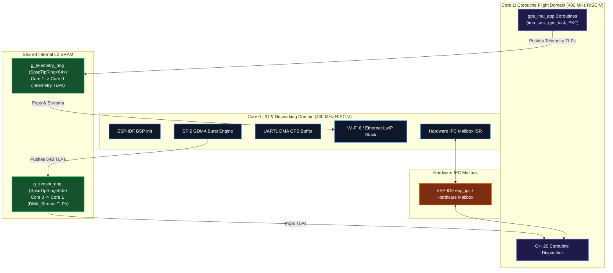

# Espressif ESP32-P4 Target Specification

This document is the **authoritative hardware and BSP specification** for the **Espressif ESP32-P4** target (`targets/esp32p4/`). It provides the exact pin mappings, ESP-IDF APIs, GDMA recipes, and IPC doorbell wiring required for AI agents and developers to implement the target HAL.

---

## 1. Target Overview & Silicon Architecture

* **SoC**: Espressif ESP32-P4 (Dual 32-bit RISC-V High-Performance Cores @ 400 MHz)
* **Low-Power Core**: Single 32-bit RISC-V LP Core @ 40 MHz
* **Memory**: 768 KB on-chip L2 SRAM + up to 32 MB high-speed PSRAM
* **DMA Subsystem**: General Direct Memory Access (GDMA) supporting zero-copy 2D/burst operations
* **Networking**: Wi-Fi 6 (via companion radio / 802.11ax), 10/100 Ethernet MAC, Bluetooth 5



---

## 2. Hardware Pinout & Peripheral Assignments

| Peripheral | Signal | ESP32-P4 Pin (GPIO) | Architectural Function |
| :--- | :--- | :--- | :--- |
| **SPI2 (IMU Bus)** | `SPI2_SCK` | **GPIO 7** | SPI Serial Clock to ICM-42688-P (up to 24 MHz) |
| | `SPI2_MOSI` | **GPIO 8** | Master Out Slave In |
| | `SPI2_MISO` | **GPIO 9** | Master In Slave Out |
| | `SPI2_CS` | **GPIO 10** | Active-Low Hardware Chip Select |
| **IMU Interrupt** | `IMU_DRDY` | **GPIO 6** / **Pin 3** | Data-Ready Rising Edge Interrupt from IMU |
| **UART1 (GPS Bus)**| `UART1_TX` | **GPIO 11** | Transmits configuration commands to GPS |
| | `UART1_RX` | **GPIO 12** | Receives UBX binary frames (115200–921600 baud) |

---

## 3. ESP-IDF API Recipe for HAL Implementations

When implementing HAL drivers under `targets/esp32p4/src/`, AI agents must use standard **ESP-IDF (v5.x+)** APIs:

### 3.1 SPI Master & GDMA Burst (`hal_spi.cpp`)
* **Header**: `#include "driver/spi_master.h"`
* **Bus Initialization**:
  ```c
  spi_bus_config_t buscfg = {};
  buscfg.mosi_io_num = 8;
  buscfg.miso_io_num = 9;
  buscfg.sclk_io_num = 7;
  buscfg.quadwp_io_num = -1;
  buscfg.quadhd_io_num = -1;
  buscfg.max_transfer_sz = 4096;
  spi_bus_initialize(SPI2_HOST, &buscfg, SPI_DMA_CH_AUTO);
  ```
* **Device Interface & Mode 3**:
  ```c
  spi_device_interface_config_t devcfg = {};
  devcfg.clock_speed_hz = 12 * 1000 * 1000; // 12 MHz
  devcfg.mode = 3;                          // CPOL=1, CPHA=1 for ICM-42688-P
  devcfg.spics_io_num = 10;
  devcfg.queue_size = 8;
  spi_bus_add_device(SPI2_HOST, &devcfg, &spi_handle);
  ```

### 3.2 GPIO & Interrupt Controller (`hal_gpio.cpp`)
* **Header**: `#include "driver/gpio.h"`
* **Configuration**:
  ```c
  gpio_config_t io_conf = {};
  io_conf.intr_type = GPIO_INTR_POSEDGE; // Rising edge for DRDY
  io_conf.pin_bit_mask = (1ULL << 6);    // GPIO 6
  io_conf.mode = GPIO_MODE_INPUT;
  io_conf.pull_down_en = GPIO_PULLDOWN_ENABLE;
  gpio_config(&io_conf);

  gpio_install_isr_service(0);
  gpio_isr_handler_add(GPIO_NUM_6, target_gpio_isr_handler, nullptr);
  ```

### 3.3 UART Streaming (`hal_uart.cpp`)
* **Header**: `#include "driver/uart.h"`
* **Initialization**:
  ```c
  uart_config_t uart_config = {
      .baud_rate = 115200,
      .data_bits = UART_DATA_8_BITS,
      .parity    = UART_PARITY_DISABLE,
      .stop_bits = UART_STOP_BITS_1,
      .flow_ctrl = UART_HW_FLOWCTRL_DISABLE
  };
  uart_param_config(UART_NUM_1, &uart_config);
  uart_set_pin(UART_NUM_1, 11, 12, UART_PIN_NO_CHANGE, UART_PIN_NO_CHANGE);
  uart_driver_install(UART_NUM_1, 2048, 0, 0, NULL, 0);
  ```

### 3.4 Monotonic Hardware Timer (`hal_timer.cpp`)
* **Header**: `#include "esp_timer.h"`
* **Timestamping**:
  ```c
  uint64_t get_time_ns() {
      return esp_timer_get_time() * 1000ULL; // Microseconds to Nanoseconds
  }
  ```

### 3.5 Inter-Core Doorbell
* **Header**: `#include "esp_ipc.h"` or FreeRTOS task notification across pinned cores (`xTaskNotifyFromISR`).

---

## 4. Build & Flash Instructions

Using the ESP-IDF toolchain:
```bash
idf.py set-target esp32p4
idf.py build
idf.py -p /dev/ttyUSB0 flash monitor
```
