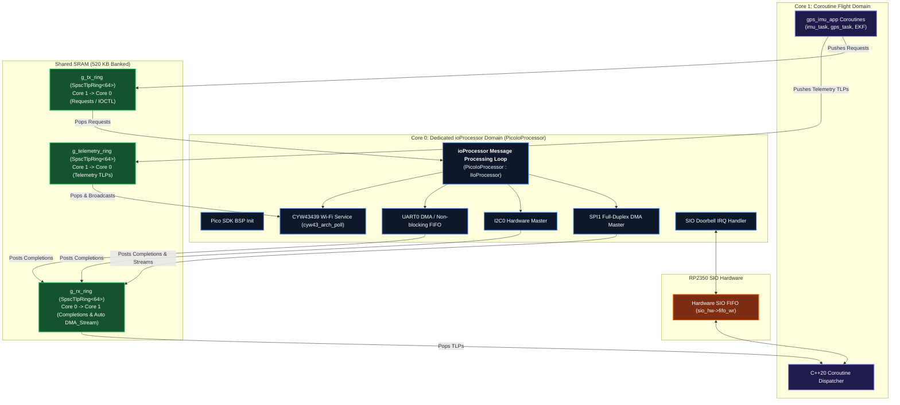

# Raspberry Pi Pico 2 W (RP2350) Target Specification

This document is the **authoritative hardware and BSP specification** for the **Raspberry Pi Pico 2 W (RP2350 SoC)** target (`targets/pico2w_rp2350/`). It provides the exact pin mappings, Pico SDK APIs, DMA channel recipes, and interrupt wiring required for AI agents and developers to implement the target HAL.

---

## 1. Target Overview & Silicon Architecture

* **SoC**: Raspberry Pi RP2350 (Dual ARM Cortex-M33 @ 150 MHz with DSP & FPU)
* **Wireless**: Infineon CYW43439 (Wi-Fi 4 802.11n + Bluetooth 5.2) connected via internal SPI/PIO
* **SRAM**: 520 KB on-chip SRAM in 10 banked stripes (ideal for lock-free multi-core SPSC rings)
* **Flash**: 4 MB QSPI Flash



### 1.1 The Unified `ioProcessor` IP on Core 0 (Replacing `isr_dispatcher`)

Just like the Linux and Allwinner E907 targets, the Raspberry Pi Pico 2 W target adheres to the **exact same `ioProcessor` architecture** (`abstractx::hal::IIoProcessor`). 

1. **Rejection of `isr_dispatcher`**: Top-half hardware ISRs on Core 0 (SPI DMA, UART, GPIO DRDY, Timer) **NEVER resume coroutine handles directly**. They do not touch C++20 coroutine state.
2. **Dedicated Message Processing Loop**: Core 0 runs `PicoIoProcessor::run()` or `step()`. It pulls 64-byte request TLPs from `g_tx_ring`, calls into the non-blocking HAL drivers (`hal_spi`, `hal_uart`, `hal_i2c`), and services the CYW43 Wi-Fi stack.
3. **Drivers Post Messages Back**: When drivers complete their asynchronous transfers, they format 64-byte completion TLPs (`CplD`, `Cpl`, or `DMA_Stream`), push them directly into `g_rx_ring`, and write to `sio_hw->fifo_wr = 1` to signal Core 1.
4. **Autonomous Sensor HW Fusion**: In Auto-DMA mode, Pin 3 / GP20 DRDY interrupts directly trigger SPI1 DMA bursts without CPU intervention. Once complete, the DMA ISR pushes the 64-byte `DMA_Stream` TLP and rings the SIO doorbell.
5. **Bus Lockout Invariant**: When Auto-DMA is active, manual coroutine requests to SPI1 are rejected with `ASP_STATUS_BUS_LOCKED` (0x05).
6. **Zero Busy-Waiting**: When idle, Core 0 executes `__wfe()` to save power until the next hardware interrupt arrives.

---

## 2. Hardware Pinout & Peripheral Assignments

The Pico 2 W HAL assigns hardware peripherals to the following GPIO pins:

| Peripheral | Signal | Pico 2 W Pin (GPIO) | Architectural Function |
| :--- | :--- | :--- | :--- |
| **SPI1 (IMU Bus)** | `SPI1_SCK` | **GP10** (Pin 14) | SPI Serial Clock to ICM-42688-P (10–20 MHz) |
| | `SPI1_TX` (MOSI) | **GP11** (Pin 15) | Master Out Slave In |
| | `SPI1_RX` (MISO) | **GP12** (Pin 16) | Master In Slave Out |
| | `SPI1_CS_N` | **GP13** (Pin 17) | Active-Low Hardware Chip Select |
| **IMU Interrupt** | `IMU_DRDY` | **GP20** (Pin 26) / **Pin 3** | Data-Ready Rising Edge Interrupt from IMU |
| **I2C0 (Sensor Bus)**| `I2C0_SDA` | **GP4** (Pin 6) | I2C Serial Data (Barometer / Magnetometer) |
| | `I2C0_SCL` | **GP5** (Pin 7) | I2C Serial Clock (400 kHz Fast Mode) |
| **UART0 (GPS Bus)**| `UART0_TX` | **GP0** (Pin 1) | Transmits configuration commands to GPS |
| | `UART0_RX` | **GP1** (Pin 2) | Receives UBX binary frames (115200–921600 baud) |
| **CYW43 Wi-Fi** | Internal | **Internal WL_REG_ON** | Managed exclusively by `pico_cyw43_arch` on Core 0 |

---

## 3. Pico SDK API Recipe for HAL Implementations

When implementing HAL drivers under `targets/pico2w_rp2350/src/`, AI agents must use standard **Pico C/C++ SDK** APIs:

### 3.1 SPI Master & Full-Duplex DMA Burst (`hal_spi.cpp`)
* **Headers**: `#include "hardware/spi.h"` and `#include "hardware/dma.h"`
* **Initialization**:
  ```c
  spi_init(spi1, config.frequency_hz);
  spi_set_format(spi1, 8, SPI_CPOL_1, SPI_CPHA_1, SPI_MSB_FIRST); // Mode 3 for ICM-42688-P
  gpio_set_function(10, GPIO_FUNC_SPI); // SCK
  gpio_set_function(11, GPIO_FUNC_SPI); // MOSI
  gpio_set_function(12, GPIO_FUNC_SPI); // MISO
  gpio_init(13);                        // CS
  gpio_set_dir(13, GPIO_OUT);
  gpio_put(13, 1);
  ```
* **Full-Duplex DMA Channel Setup (INAV/Linux Style)**:
  ```c
  int rx_chan = dma_claim_unused_channel(true);
  int tx_chan = dma_claim_unused_channel(true);

  // Configure RX DMA
  dma_channel_config c_rx = dma_channel_get_default_config(rx_chan);
  channel_config_set_transfer_data_size(&c_rx, DMA_SIZE_8);
  channel_config_set_dreq(&c_rx, spi_get_dreq(spi1, false)); // false = RX
  channel_config_set_read_increment(&c_rx, false);
  channel_config_set_write_increment(&c_rx, true);
  dma_channel_configure(rx_chan, &c_rx, rx_buffer, &spi_get_hw(spi1)->dr, len, false);

  // Configure TX DMA
  dma_channel_config c_tx = dma_channel_get_default_config(tx_chan);
  channel_config_set_transfer_data_size(&c_tx, DMA_SIZE_8);
  channel_config_set_dreq(&c_tx, spi_get_dreq(spi1, true)); // true = TX
  channel_config_set_read_increment(&c_tx, true);
  channel_config_set_write_increment(&c_tx, false);
  dma_channel_configure(tx_chan, &c_tx, &spi_get_hw(spi1)->dr, tx_buffer, len, false);

  // Trigger simultaneous transfer
  dma_start_channel_mask((1u << rx_chan) | (1u << tx_chan));
  ```

### 3.2 I2C Repeated-Start Master (`hal_i2c.cpp`)
* **Header**: `#include "hardware/i2c.h"`
* **Initialization**:
  ```c
  i2c_init(i2c0, 400 * 1000); // 400 kHz Fast Mode
  gpio_set_function(4, GPIO_FUNC_I2C);
  gpio_set_function(5, GPIO_FUNC_I2C);
  gpio_pull_up(4);
  gpio_pull_up(5);
  ```
* **Repeated-Start Transfer (`write_read_sync`)**:
  ```c
  // Write register offset without issuing STOP, then read data
  i2c_write_blocking(i2c0, slave_addr, tx_data, tx_len, true);  // true = Repeated Start (no STOP)
  i2c_read_blocking(i2c0, slave_addr, rx_data, rx_len, false);  // false = Emit STOP
  ```

### 3.3 GPIO & Pin Interrupt Controller (`hal_gpio.cpp`)
* **Headers**: `#include "hardware/gpio.h"`, `#include "hardware/irq.h"`, `#include "hardware/structs/sio.h"`
* **Pin Configuration (Output / Input)**:
  ```c
  gpio_init(pin);
  if (mode == PinMode::Output) {
      gpio_set_dir(pin, GPIO_OUT);
  } else {
      gpio_set_dir(pin, GPIO_IN);
      if (pull == PinPull::PullUp) gpio_pull_up(pin);
      else if (pull == PinPull::PullDown) gpio_pull_down(pin);
  }
  ```
* **Single-Cycle Atomic Output Operations (Set, Xor, Clear) via SIO Hardware**:
  RP2350 provides dedicated single-cycle hardware atomic registers in the Single-cycle IO (SIO) block:
  ```c
  // Atomic SET (drive HIGH)
  sio_hw->gpio_set = (1u << pin);

  // Atomic CLEAR (drive LOW)
  sio_hw->gpio_clr = (1u << pin);

  // Atomic XOR (toggle state)
  sio_hw->gpio_togl = (1u << pin);
  ```
* **Attaching Edge ISRs (Positive / Rising, Negative / Falling, Both)**:
  ```c
  uint32_t event_mask = 0;
  if (trigger == EdgeTrigger::Rising)  event_mask = GPIO_IRQ_EDGE_RISE;
  if (trigger == EdgeTrigger::Falling) event_mask = GPIO_IRQ_EDGE_FALL;
  if (trigger == EdgeTrigger::Both)    event_mask = GPIO_IRQ_EDGE_RISE | GPIO_IRQ_EDGE_FALL;

  gpio_set_irq_enabled_with_callback(pin, event_mask, true, &target_gpio_irq_handler);
  ```
* **Ingress TLP Event Generation in Top-Half ISR**:
  When an edge occurs, the top-half ISR:
  1. Captures monotonic nanoseconds: `uint64_t ts_ns = time_us_64() * 1000ULL;`
  2. Constructs a 64-byte `ASP_CHANNEL_GPIO_BRIDGE` event TLP (`Tlp64::make_gpio_event(pin, level, edge, ts_ns)`).
  3. Pushes into `ingress_rx_ring`.
  4. Rings SIO FIFO doorbell: `sio_hw->fifo_wr = 0x01;` to wake Core 1.
  5. Zero polling / zero coroutine calls in top-half ISR!

### 3.4 UART Streaming (`hal_uart.cpp`)
* **Header**: `#include "hardware/uart.h"`
* **Initialization**:
  ```c
  uart_init(uart0, baud_rate);
  gpio_set_function(0, GPIO_FUNC_UART); // TX
  gpio_set_function(1, GPIO_FUNC_UART); // RX
  uart_set_hw_flow(uart0, false, false);
  uart_set_format(uart0, 8, 1, UART_PARITY_NONE);
  ```

### 3.5 Monotonic Hardware Timer (`hal_timer.cpp`)
* **Header**: `#include "hardware/timer.h"`
* **Timestamping**:
  ```c
  uint64_t get_time_ns() {
      return time_us_64() * 1000ULL; // Microseconds to Nanoseconds
  }
  ```

### 3.6 Inter-Core Multicore Launch & SIO Doorbell
* **Headers**: `#include "pico/multicore.h"` and `#include "hardware/sync.h"`
* **Launching Core 1**:
  ```c
  multicore_launch_core1(core1_coroutine_entry);
  ```
* **Signaling Inter-Core Doorbell**:
  ```c
  sio_hw->fifo_wr = 0x01; // Non-blocking hardware SIO FIFO write
  ```

---

## 4. Execution Workflow & Step-by-Step Contract

### 4.1 IMU Auto-Sample Pipeline
1. **ICM-42688-P asserts `DRDY` (GP20 / Pin 3)**:
   - Hardware triggers GPIO interrupt on Core 0.
   - Core 0 ISR latches `uint64_t timestamp_ns = hal::get_timer().get_time_ns()`.
2. **Core 0 Triggers Full-Duplex DMA Burst**:
   - Asserts CS (`GP13 = 0`).
   - Starts simultaneous 15-byte SPI1 TX/RX DMA burst (`TEMP_DATA1` through `GYRO_DATA_Z0`).
3. **DMA Completion ISR**:
   - De-asserts CS (`GP13 = 1`).
   - Formats a 64-byte `DMA_Stream` TLP (`Channel = 0x02`, `Tag = 0x01`, latched `timestamp_ns`, 15-byte payload).
   - Enqueues into `g_sensor_ring.push_from_isr(tlp)`.
   - Writes to SIO FIFO (`sio_hw->fifo_wr = 1`) to awaken Core 1.
4. **Core 1 Awakening & Coroutine Execution**:
   - SIO FIFO interrupt awakens Core 1 from `__wfe()`.
   - Core 1 pops the TLP from `g_sensor_ring`, matches the awaiting coroutine, and resumes `imu_task`.

---

## 5. Build & Target Artifacts

Compiling for Pico 2 W generates the deployable UF2 binary:
```bash
cmake --preset pico2w
cmake --build build_pico2w
# Generates build_pico2w/apps/gps_imu_app/gps_imu_app.uf2
```
To flash, hold the **BOOTSEL** button on the Pico 2 W, connect USB, and copy `gps_imu_app.uf2` to the `RPI-RP2` volume.
