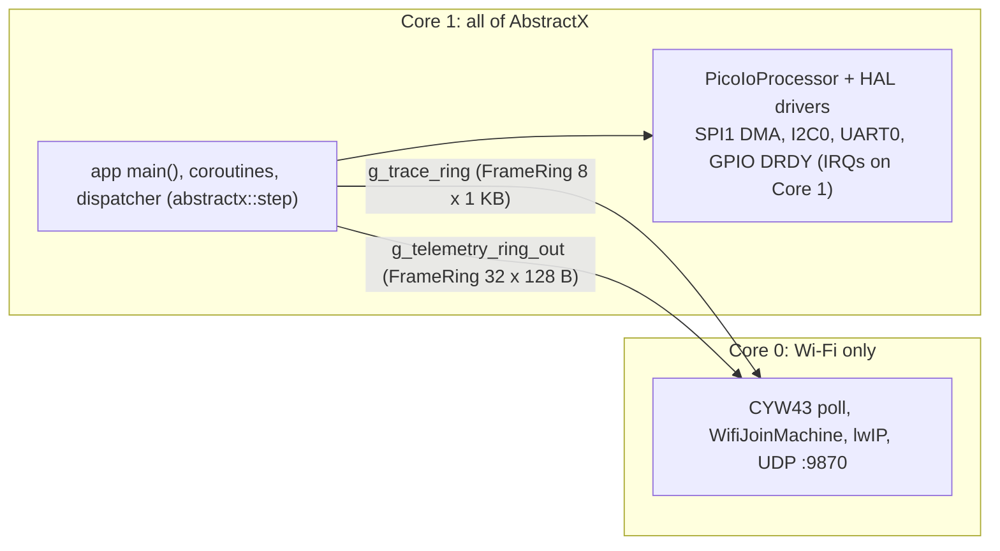

# Raspberry Pi Pico 2 W (RP2350) Target Specification

This document is the **authoritative hardware and BSP specification** for the **Raspberry Pi Pico 2 W (RP2350 SoC)** target (`targets/pico2w_rp2350/`). It provides the exact pin mappings, Pico SDK APIs, DMA channel recipes, and interrupt wiring required for AI agents and developers to implement the target HAL.

---

## 1. Target Overview & Silicon Architecture

* **SoC**: Raspberry Pi RP2350 (Dual ARM Cortex-M33 @ 150 MHz with DSP & FPU)
* **Wireless**: Infineon CYW43439 (Wi-Fi 4 802.11n + Bluetooth 5.2) connected via internal SPI/PIO
* **SRAM**: 520 KB on-chip SRAM in 10 banked stripes (ideal for lock-free multi-core SPSC rings)
* **Flash**: 4 MB QSPI Flash


```mermaid
graph LR
    subgraph Core1["Core 1: all of AbstractX"]
        C1_App["app main(), coroutines, dispatcher (abstractx::step)"]
        C1_IO["PicoIoProcessor + HAL drivers<br/>SPI1 DMA, I2C0, UART0, GPIO DRDY (IRQs on Core 1)"]
        C1_App --> C1_IO
    end
    subgraph Core0["Core 0: Wi-Fi only"]
        C0_Net["CYW43 poll, WifiJoinMachine, lwIP, UDP :9870"]
    end
    C1_App -->|"g_trace_ring (FrameRing 8 x 1 KB)"| C0_Net
    C1_App -->|"g_telemetry_ring_out (FrameRing 32 x 128 B)"| C0_Net
```

The core split is `[SPEC-PICO-CORE-01]` (section 4) and `[SPEC-ARCH-05]`
(`docs/DESIGN_SPECIFICATION.md`). Until 2026-11-03 this section described Core 0 as the I/O
processor with request/completion rings and an SIO FIFO doorbell to Core 1; that design was never
running (Core 1 was not launched) and is superseded.

### 1.1 The `ioProcessor` on Core 1

1. **ISRs never resume coroutines**: SPI DMA, UART, GPIO DRDY and I2C interrupts (all on Core 1)
   push completions into queues; only `abstractx::step()` resumes handles.
2. **Same core, no doorbell**: the I/O processor and the dispatcher share Core 1, so completions do
   not cross cores and `notify_host()` does nothing; the interrupt wakes `__wfe()`.
3. **Autonomous Sensor HW Fusion**: in Auto-DMA mode the GP20 DRDY interrupt starts the SPI1 DMA
   burst; the DMA ISR pushes the 64-byte `DMA_Stream` TLP. (Not delivering samples on 2026-11-03:
   all IMU samples took the polled path; see TODO.md.)
4. **Bus Lockout Invariant**: while Auto-DMA is active, manual SPI1 requests are rejected with
   `ASP_STATUS_BUS_LOCKED` (0x05).

---

## 2. Hardware Pinout & Peripheral Assignments

The Pico 2 W HAL assigns hardware peripherals to the following GPIO pins:

| Peripheral | Signal | Pico 2 W Pin (GPIO) | Architectural Function |
| :--- | :--- | :--- | :--- |
| **SPI1 (IMU Bus)** | `SPI1_SCK` | **GP10** (Pin 14) | SPI Serial Clock to ICM-42688-P (10–20 MHz) |
| | `SPI1_TX` (MOSI) | **GP11** (Pin 15) | Master Out Slave In |
| | `SPI1_RX` (MISO) | **GP12** (Pin 16) | Master In Slave Out |
| | `SPI1_CS_N` | **GP13** (Pin 17) | Active-Low Hardware Chip Select |
| **IMU Interrupt** | `IMU_DRDY` | **GP20** (Pin 26) / **Pin 3** | Data-Ready Rising Edge Interrupt from IMU |
| **I2C0 (Sensor Bus)**| `I2C0_SDA` | **GP4** (Pin 6) | I2C Serial Data (Barometer / Magnetometer) |
| | `I2C0_SCL` | **GP5** (Pin 7) | I2C Serial Clock (400 kHz Fast Mode) |
| **UART0 (GPS Bus)**| `UART0_TX` | **GP0** (Pin 1) | Transmits configuration commands to GPS |
| | `UART0_RX` | **GP1** (Pin 2) | Receives UBX binary frames (115200–921600 baud) |
| **UART1 (Console)**| `UART1_TX` | **GP8** (Pin 11) | `printf` / stdio text console, 115200 8N1 ([SPEC-PICO-HAL-03]) |
| | `UART1_RX` | **GP9** (Pin 12) | Console input |
| **CYW43 Wi-Fi** | Internal | **Internal WL_REG_ON** | Managed exclusively by `pico_cyw43_arch` on Core 0 |

---

## 3. Pico SDK API Recipe for HAL Implementations

When implementing HAL drivers under `targets/pico2w_rp2350/src/`, AI agents must use standard **Pico C/C++ SDK** APIs:

### 3.1 SPI Master & Full-Duplex DMA Burst (`hal_spi.cpp`)
* **Headers**: `#include "hardware/spi.h"` and `#include "hardware/dma.h"`
* **Initialization**:
  ```c
  spi_init(spi1, config.frequency_hz);
  spi_set_format(spi1, 8, SPI_CPOL_1, SPI_CPHA_1, SPI_MSB_FIRST); // Mode 3 for ICM-42688-P
  gpio_set_function(10, GPIO_FUNC_SPI); // SCK
  gpio_set_function(11, GPIO_FUNC_SPI); // MOSI
  gpio_set_function(12, GPIO_FUNC_SPI); // MISO
  gpio_init(13);                        // CS
  gpio_set_dir(13, GPIO_OUT);
  gpio_put(13, 1);
  ```
* **Full-Duplex DMA Channel Setup (INAV/Linux Style)**:
  ```c
  int rx_chan = dma_claim_unused_channel(true);
  int tx_chan = dma_claim_unused_channel(true);

  // Configure RX DMA
  dma_channel_config c_rx = dma_channel_get_default_config(rx_chan);
  channel_config_set_transfer_data_size(&c_rx, DMA_SIZE_8);
  channel_config_set_dreq(&c_rx, spi_get_dreq(spi1, false)); // false = RX
  channel_config_set_read_increment(&c_rx, false);
  channel_config_set_write_increment(&c_rx, true);
  dma_channel_configure(rx_chan, &c_rx, rx_buffer, &spi_get_hw(spi1)->dr, len, false);

  // Configure TX DMA
  dma_channel_config c_tx = dma_channel_get_default_config(tx_chan);
  channel_config_set_transfer_data_size(&c_tx, DMA_SIZE_8);
  channel_config_set_dreq(&c_tx, spi_get_dreq(spi1, true)); // true = TX
  channel_config_set_read_increment(&c_tx, true);
  channel_config_set_write_increment(&c_tx, false);
  dma_channel_configure(tx_chan, &c_tx, &spi_get_hw(spi1)->dr, tx_buffer, len, false);

  // Trigger simultaneous transfer
  dma_start_channel_mask((1u << rx_chan) | (1u << tx_chan));
  ```

### 3.2 I2C Repeated-Start Master (`hal_i2c.cpp`)
* **Header**: `#include "hardware/i2c.h"`
* **Initialization**:
  ```c
  i2c_init(i2c0, 400 * 1000); // 400 kHz Fast Mode
  gpio_set_function(4, GPIO_FUNC_I2C);
  gpio_set_function(5, GPIO_FUNC_I2C);
  gpio_pull_up(4);
  gpio_pull_up(5);
  ```
* **Repeated-Start Transfer (`write_read_sync`)**:
  ```c
  // Write register offset without issuing STOP, then read data
  i2c_write_blocking(i2c0, slave_addr, tx_data, tx_len, true);  // true = Repeated Start (no STOP)
  i2c_read_blocking(i2c0, slave_addr, rx_data, rx_len, false);  // false = Emit STOP
  ```

### 3.3 GPIO & Pin Interrupt Controller (`hal_gpio.cpp`)
* **Headers**: `#include "hardware/gpio.h"`, `#include "hardware/irq.h"`, `#include "hardware/structs/sio.h"`
* **Pin Configuration (Output / Input)**:
  ```c
  gpio_init(pin);
  if (mode == PinMode::Output) {
      gpio_set_dir(pin, GPIO_OUT);
  } else {
      gpio_set_dir(pin, GPIO_IN);
      if (pull == PinPull::PullUp) gpio_pull_up(pin);
      else if (pull == PinPull::PullDown) gpio_pull_down(pin);
  }
  ```
* **Single-Cycle Atomic Output Operations (Set, Xor, Clear) via SIO Hardware**:
  RP2350 provides dedicated single-cycle hardware atomic registers in the Single-cycle IO (SIO) block:
  ```c
  // Atomic SET (drive HIGH)
  sio_hw->gpio_set = (1u << pin);

  // Atomic CLEAR (drive LOW)
  sio_hw->gpio_clr = (1u << pin);

  // Atomic XOR (toggle state)
  sio_hw->gpio_togl = (1u << pin);
  ```
* **Attaching Edge ISRs (Positive / Rising, Negative / Falling, Both)**:
  ```c
  uint32_t event_mask = 0;
  if (trigger == EdgeTrigger::Rising)  event_mask = GPIO_IRQ_EDGE_RISE;
  if (trigger == EdgeTrigger::Falling) event_mask = GPIO_IRQ_EDGE_FALL;
  if (trigger == EdgeTrigger::Both)    event_mask = GPIO_IRQ_EDGE_RISE | GPIO_IRQ_EDGE_FALL;

  gpio_set_irq_enabled_with_callback(pin, event_mask, true, &target_gpio_irq_handler);
  ```
* **Ingress TLP Event Generation in Top-Half ISR**:
  When an edge occurs, the top-half ISR:
  1. Captures monotonic nanoseconds: `uint64_t ts_ns = time_us_64() * 1000ULL;`
  2. Constructs a 64-byte `ASP_CHANNEL_GPIO_BRIDGE` event TLP (`Tlp64::make_gpio_event(pin, level, edge, ts_ns)`).
  3. Pushes into `ingress_rx_ring`.
  4. Rings SIO FIFO doorbell: `sio_hw->fifo_wr = 0x01;` to wake Core 1.
  5. Zero polling / zero coroutine calls in top-half ISR!

### 3.4 UART Streaming (`hal_uart.cpp`)
* **Header**: `#include "hardware/uart.h"`
* **Initialization**:
  ```c
  uart_init(uart0, baud_rate);
  gpio_set_function(0, GPIO_FUNC_UART); // TX
  gpio_set_function(1, GPIO_FUNC_UART); // RX
  uart_set_hw_flow(uart0, false, false);
  uart_set_format(uart0, 8, 1, UART_PARITY_NONE);
  ```

### 3.5 Monotonic Hardware Timer (`hal_timer.cpp`)
* **Header**: `#include "hardware/timer.h"`
* **Timestamping**:
  ```c
  uint64_t get_time_ns() {
      return time_us_64() * 1000ULL; // Microseconds to Nanoseconds
  }
  ```

### 3.6 Inter-Core Multicore Launch & SIO Doorbell
* **Headers**: `#include "pico/multicore.h"` and `#include "hardware/sync.h"`
* **Launching Core 1**:
  ```c
  multicore_launch_core1(core1_coroutine_entry);
  ```
* **Signaling Inter-Core Doorbell**:
  ```c
  sio_hw->fifo_wr = 0x01; // Non-blocking hardware SIO FIFO write
  ```

### [SPEC-PICO-TRACE-01] Zero-Copy Trace & Telemetry over UDP
The Pico side of `[SPEC-TRACE-07]` (`docs/DESIGN_SPECIFICATION.md`): the trace
packet buffer **is** the lwIP pbuf that gets transmitted, so no memcpy happens
between the trace engine and the Wi-Fi driver.
* **Goal**: zero memory copies between the trace engine and the lwIP UDP network stack on Pico 2 W.
* **acquire**: `pbuf_alloc(PBUF_TRANSPORT, max_bytes, PBUF_POOL)` from the static
  `memp` pool. `PBUF_POOL_BUFSIZE` (lwIP default ≈ `TCP_MSS` + headers ≈ 1.5 KB
  with `TCP_MSS = 1460` in `include/lwipopts.h`) MUST hold one full packet plus
  UDP/IP/link headers, so the payload is a single contiguous pbuf (`p->next == NULL`;
  otherwise treat as acquire failure). Returns `p->payload` as the span.
* **commit**: `pbuf_realloc(p, used)`, `udp_sendto(pcb, p, &dest, 9870)`, `pbuf_free(p)`.
  lwIP holds its own reference until the frame leaves the CYW43 driver.
* **Not allowed**: `PBUF_RAM` (lwIP heap, `MEM_SIZE`) and `PBUF_REF` over a
  static trace buffer (the buffer could be reused while a frame is still queued
  for ARP or the driver). The current `platform_send_telemetry()` uses
  `PBUF_RAM` + `memcpy` and must be replaced.
* **Pool sizing**: `PBUF_POOL_SIZE` (24 today) is shared with RX; reserve at
  least 2 for trace so a full pool drops trace, not network RX. Trace never
  blocks: on acquire failure events are counted as discarded.
* **Context**: lwIP calls (`pbuf_alloc`, `udp_sendto`) run only on Core 0, which owns lwIP and
  `cyw43_arch_poll()` (`pico_cyw43_arch_lwip_poll` is not thread-safe). Since 2026-11-03 trace
  frames are produced on Core 1 into a frame ring and sent by Core 0 (`[SPEC-PICO-CORE-01]`);
  `PicoUdpTraceTransport` is kept for a single-core build and its host test.
* **Static Pool Elision**: When `platform_trace_transport()` provides this native
  zero-copy transport, `ABSTRACTX_STATIC_TRACE_PACKETS = 0` elides the fallback
  static trace pool on Pico 2 W (`[SPEC-TRACE-07]`).
* **Refines**: `[SPEC-TRACE-07]`
* **Method**: `Test`
* **Verified by**: `host-tests` (`sim/test_pico_zero_copy_trace.cpp`: pointer identity and single-pbuf invariants), `memory-footprint` (0 `_Unwind_*` symbols in Pico ELF)
* **Implementation Target**: `targets/pico2w_rp2350/include/hal/pico_trace_transport.hpp`, `targets/pico2w_rp2350/src/hal_platform.cpp`, `cmake/toolchains/arm-none-eabi.cmake`

### [SPEC-PICO-HAL-01] SPI / I2C / Timer Completion, SPI Mode and Interrupt-Driven I2C
The Pico side of `[SPEC-HAL-01]` (`docs/DESIGN_SPECIFICATION.md`).
* **Goal**: every async request on Pico 2 W completes exactly once, with its own result, and the
  bus is configured the way the caller asked.
* **Requirement (one start per completion)**: the SPI DMA completion, the I2C interrupt and the
  timer alarm callback complete the finished request with `push_completion_from_isr(active_req_,
  result)` and then call `set_hardware_idle_from_isr()` **only**. That call already pops and starts
  the next queued request; popping and starting another one afterwards overwrites `active_req_`
  and loses a completion. If `add_alarm_in_us` returns `< 0` (no hardware alarm available),
  `PicoTimer::start_hardware_transfer_from_isr` completes immediately with `TimerStatus::Error`
  and calls `set_hardware_idle_from_isr()`. `PicoIoBackend` submits both SPI and I2C transfers
  asynchronously through `PicoSpi::submit_request` and ` get_pico_i2c().submit_request`, and
  `PicoUart::write_byte` guards its FIFO-or-queue decision with `InterruptGuard` so `UART0_IRQ`
  cannot reorder bytes.
* **Requirement (SPI mode)**: `PicoSpi::init` programs CPOL/CPHA from `SpiConfig::mode`
  (Mode0 = CPOL0/CPHA0 ... Mode3 = CPOL1/CPHA1) with `spi_set_format`. The RP2350 PL022 only
  shifts MSB first (Pico SDK `spi_set_format` asserts `SPI_MSB_FIRST`), so `lsb_first = true` is
  refused: `init` returns `false` without touching the bus.
* **Requirement (I2C interrupt state machine)**: `PicoI2c` runs an async request entirely from the
  `I2C0_IRQ` handler, which `init` installs once. Start: disable, program `IC_TAR`, enable, unmask
  `TX_EMPTY`, `RX_FULL`, `STOP_DET`, `TX_ABRT` (`IC_TX_TL = IC_RX_TL = 0` from `i2c_init`). The
  handler queues one `IC_DATA_CMD` word per byte: the `tx_data` bytes, then one read command per
  `rx_data` byte (`RESTART` on the first read after a write, `STOP` on the last word), never more
  read commands in flight than the 16-entry RX FIFO holds; it drains `IC_DATA_CMD` into `rx_data`
  on `RX_FULL` and masks `TX_EMPTY` once every word is queued. The request completes on
  `STOP_DET` (status `Ok`) or `TX_ABRT` (`ABRT_7B_ADDR_NOACK` -> `NackAddress`,
  `ABRT_TXDATA_NOACK` -> `NackData`, anything else -> `BusError`, `transferred_bytes = 0`); the
  handler then masks all I2C interrupts, clears `TX_ABRT` / `STOP_DET` and completes as above.
  Register usage follows the Pico SDK `i2c_write_blocking_internal` /
  `i2c_read_blocking_internal` (`src/rp2_common/hardware_i2c/i2c.c`).
* **Not yet covered**: no bus timeout (a slave holding SCL low leaves the request pending); not
  run on hardware.
* **Refines**: `[SPEC-HAL-01]`, `[SPEC-HAL-02]`
* **Method**: `Inspection` (cross-build only; no Pico host test harness or board run yet)
* **Verified by**: `memory-footprint` (Pico cross-build `cmake --build build_pico2w`), `board-bringup` (not run)
* **Implementation Target**: `targets/pico2w_rp2350/src/hal_spi.cpp`, `targets/pico2w_rp2350/src/hal_i2c.cpp`, `targets/pico2w_rp2350/include/abstractx_pico.hpp`

---

## 4. Execution Workflow & Step-by-Step Contract

### [SPEC-PICO-HAL-02] GPIO-Edge Auto Channel: One GPIO Callback, Wired Chip Select Only
* **Why**: the pico-sdk keeps one GPIO interrupt callback per core, and the last
  `gpio_set_irq_enabled_with_callback` wins. Until 2026-10-30 the I/O back end registered its own
  callback for DRDY, so either DRDY or every `PicoGpio` pin interrupt was silently lost. The back
  end also used GP13 for every channel whatever its `cs_pin` said.
* **Requirement**: a `GpioEdge` channel arms its pin through `hal::get_gpio().configure_interrupt()`
  (`PicoGpio`'s per-pin table, the only SDK callback). The handler runs on Core 0, stamps the edge
  with `now_ns()` and calls `IoEngine::on_trigger`; it never resumes a coroutine.
* **Requirement**: `PicoSpi` drives one chip select (GP13, `cs_pin` 0). A SPI channel with another
  `cs_pin` is refused by `init_channel` instead of reading the wrong device.
* **Requirement** (2026-11-03): there is exactly one `PicoSpi` for SPI1 (`hal::get_pico_spi()`,
  the instance behind `get_spi_driver()`). The I/O back end submits auto-channel transfers to that
  instance; it never owns a second one. `PicoSpi::init()` on a second instance returns `false`
  and leaves the first one in charge. **Why**: the DMA interrupt delivers completions to one
  registered instance. The back end had its own `PicoSpi`; the IMU driver's later `init()` took
  the registration, so every auto-DMA transfer completed on the wrong instance, its job never
  finished and `g_sensor_ring` stayed empty (found on the board 2026-11-03).
* **Verified by**: `host-tests` (build only on the host), `board-bringup` (DRDY edges counted on
  GP20; auto-DMA TLPs reach `g_sensor_ring`; IMU rate equals the configured ODR)
* **Implementation Target**: `targets/pico2w_rp2350/src/io_processor.cpp`, `targets/pico2w_rp2350/src/hal_spi.cpp`, `targets/pico2w_rp2350/src/hal_platform.cpp`

### [SPEC-PICO-HAL-03] Text Console on UART1, GPS Owns UART0
* **Why**: the pico-sdk default stdio UART is UART0 on GP0/GP1, which is also the GPS bus
  (`PicoUart`). Until 2026-11-03 every `printf` was transmitted into the GPS receiver's RX pin,
  and a console probe could not be wired without disconnecting the GPS.
* **Requirement**: stdio uses UART1, TX on GP8 (pin 11), RX on GP9 (pin 12), 115200 8N1
  (`PICO_DEFAULT_UART=1`, `PICO_DEFAULT_UART_TX_PIN=8`, `PICO_DEFAULT_UART_RX_PIN=9` on
  `abstractx_target_pico2w`). UART0 (GP0/GP1) carries only GPS traffic.
* **Verified by**: `board-bringup` (over SWD: UART1 enabled at 115200 and GP8/GP9 muxed to UART;
  UART0 transmits no console text)
* **Implementation Target**: `targets/pico2w_rp2350/CMakeLists.txt`

### [SPEC-PICO-NET-01] Non-Blocking Wi-Fi Join with Retry; LED Shows Link State
* **Why**: until 2026-11-03 `platform_init()` made one blocking 15 s
  `cyw43_arch_wifi_connect_timeout_ms()` call and never tried again. On the bench
  (NETGEAR69, WPA2, correct password) it joined on 1 of 3 boots (`CYW43_LINK_BADAUTH`
  once, `link fail` once), so one failed join left the board offline until reset and
  boot stalled for 15 s. The on-board LED (CYW43 `WL_GPIO0`, not RP2350 GPIO 25)
  was never driven, so link state was invisible without a console.
* **Requirement**: the Core 0 Wi-Fi loop starts the join with `cyw43_arch_wifi_connect_async()`
  and returns. The Core 0 Wi-Fi loop (`[SPEC-PICO-CORE-01]`) feeds
  `cyw43_tcpip_link_status()` to `WifiJoinMachine` (`include/hal/wifi_join.hpp`, no
  pico-sdk dependency) at most every 100 ms and applies its actions:
  * a negative status (`FAIL`, `NONET`, `BADAUTH`), or no `UP` within 20 s of starting an
    attempt, leaves the network (`cyw43_wifi_leave`) and starts a new attempt after 2 s;
  * a link that drops from `UP` (status `DOWN` or negative) is treated the same way;
  * attempts never stop while credentials are compiled in.
* **Requirement**: LED (`cyw43_arch_gpio_put(CYW43_WL_GPIO_LED_PIN, ...)`): on while the
  link is `UP`, toggles every 500 ms while joining or waiting to retry, off when Wi-Fi is
  not running. The LED is written only when its state changes.
* **Requirement**: nothing in the join path blocks; log lines (`printf`) are emitted only on
  state changes (joined, attempt failed, link lost).
* **Method**: `Test`
* **Verified by**: `host-tests` (`sim/test_pico_wifi_join.cpp`: join, each failure status,
  attempt timeout, link loss, poll rate limit, LED blink, `uint32_t` ms wraparound),
  `board-bringup` (console over UART1 across repeated SWD resets; LED observed)
* **Implementation Target**: `targets/pico2w_rp2350/include/hal/wifi_join.hpp`,
  `targets/pico2w_rp2350/src/hal_platform.cpp`

### [SPEC-PICO-CORE-01] Core 1 Runs AbstractX, Core 0 Runs Only Wi-Fi
* **Why**: see `[SPEC-ARCH-05]` (`docs/DESIGN_SPECIFICATION.md`).
* **Boot**: the target links with `-Wl,--wrap=main`. The SDK starts `__wrap_main` on Core 0, which
  calls `stdio_init_all()` (UART1 console, both cores print through the SDK stdout mutex), starts
  Core 1 with `multicore_launch_core1_with_stack()` on a 16 KB static stack, then runs the Wi-Fi
  loop and never returns. Core 1 calls the application's `main()` (`__real_main`), so the
  application, `abstractx::init()` and every driver `init` run on Core 1 and their interrupts are
  enabled on Core 1. Applications are unchanged (no `#ifdef`).
* **Core 0 loop**: `cyw43_arch_init()`, STA mode, `WifiJoinMachine` (`[SPEC-PICO-NET-01]`), drain
  the frame rings, `cyw43_arch_wait_for_work_until()` (at most 1 ms). Nothing else.
* **Crossing** (`include/hal/frame_ring.hpp`, `FrameRing<SlotBytes, Slots>`): single producer
  (Core 1, thread context only, never an ISR), single consumer (Core 0). The producer writes a
  slot in place (`acquire` / `commit`); `commit` publishes with a release store of `head` and
  `__sev()` wakes Core 0; the consumer reads with an acquire load, sends, then releases the slot
  with a release store of `tail`. A full ring drops the frame and counts it; it never blocks
  Core 1. Two rings, because the tracer holds its buffer across many events while telemetry
  sends one frame at a time:
  * trace: 8 slots x 1024 B (`platform_trace_transport()`), filled in place by the tracer;
  * telemetry: 32 slots x 128 B (`platform_send_telemetry()`, one frame per slot; the caller's
    buffer is copied into the slot, the same one copy the old pbuf path made).
* **Zero copy on Core 0** (`[SPEC-ARCH-08]`): Core 0 wraps the slot in a `PBUF_REF` pbuf (no
  copy) and calls `udp_sendto()` to 255.255.255.255:9870; the slot is released after
  `udp_sendto()` returns (lwIP copies `PBUF_REF` data if it has to queue it). Frames produced
  before the link is up are dropped and released, so the rings never stall.
* **Doorbell**: the I/O processor's `notify_host()` no longer writes the SIO FIFO (its reader was
  Core 1 under the old plan); completions and the dispatcher are on the same core, so the
  interrupt itself wakes `wfe`.
* **Method**: `Test`
* **Verified by**: `host-tests` (`sim/test_pico_frame_ring.cpp`: two threads, order and content,
  full-ring drops, wraparound, 100000 frames), `thread-sanitizer` (same test under TSan),
  `boundary-race-review` (ring indices), `board-bringup` (both cores' PCs sampled over SWD: Core 0
  only in CYW43/lwIP/loop code, Core 1 in AbstractX; IMU rate with Wi-Fi joined; UDP :9870 count)
* **Implementation Target**: `targets/pico2w_rp2350/src/hal_platform.cpp`,
  `targets/pico2w_rp2350/include/hal/frame_ring.hpp`, `targets/pico2w_rp2350/CMakeLists.txt`,
  `targets/pico2w_rp2350/src/io_processor.cpp`

### 4.1 IMU Auto-Sample Pipeline
1. **ICM-42688-P asserts `DRDY` (GP20 / Pin 3)**:
   - Hardware triggers GPIO interrupt on Core 0.
   - Core 0 ISR latches `uint64_t timestamp_ns = hal::get_timer().get_time_ns()`.
2. **Core 0 Triggers Full-Duplex DMA Burst**:
   - Asserts CS (`GP13 = 0`).
   - Starts simultaneous 15-byte SPI1 TX/RX DMA burst (`TEMP_DATA1` through `GYRO_DATA_Z0`).
3. **DMA Completion ISR**:
   - De-asserts CS (`GP13 = 1`).
   - Formats a 64-byte `DMA_Stream` TLP (`Channel = 0x02`, `Tag = 0x01`, latched `timestamp_ns`, 15-byte payload).
   - Enqueues into `g_sensor_ring.push_from_isr(tlp)`.
   - Writes to SIO FIFO (`sio_hw->fifo_wr = 1`) to awaken Core 1.
4. **Core 1 Awakening & Coroutine Execution**:
   - SIO FIFO interrupt awakens Core 1 from `__wfe()`.
   - Core 1 pops the TLP from `g_sensor_ring`, matches the awaiting coroutine, and resumes `imu_task`.

---

## 5. Build & Target Artifacts

Compiling for Pico 2 W generates the deployable UF2 binary:
```bash
cmake --preset pico2w
cmake --build build_pico2w
# Generates build_pico2w/apps/gps_imu_app/gps_imu_app.uf2
```
To flash, hold the **BOOTSEL** button on the Pico 2 W, connect USB, and copy `gps_imu_app.uf2` to the `RPI-RP2` volume.
