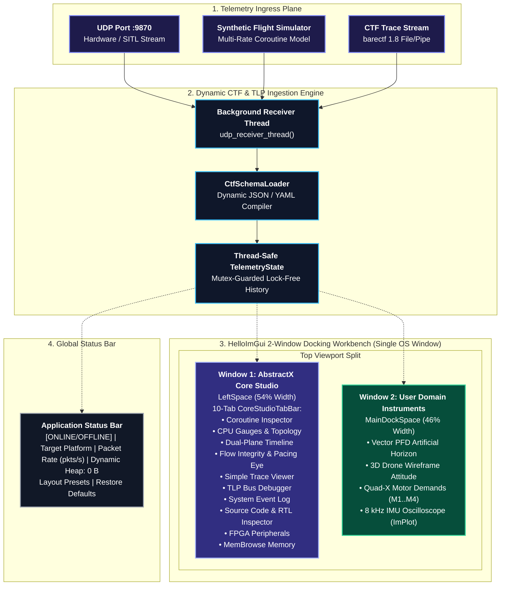

# AbstractX Visualizer Studio Specification (`tools/visualizer`)

This document is the **authoritative architectural design specification** for the **AbstractX Visualizer Studio (`tools/visualizer/`)**. It specifies the multi-window HelloImGui docking workbench, the separation between the **AbstractX Core Studio** and **User Domain Instruments**, the 64-byte TLP bus inspection and header decoding pipelines, the dynamic CTF 1.8 schema engine, the core-and-plugin extensibility SDK, and the MemBrowse zero-heap continuous memory observability model.

---

## 1. Studio Overview & Objectives

The AbstractX Visualizer Studio is a real-time hardware-software co-design observability workbench built in Python using **`imgui-bundle`** (`Dear ImGui` + `ImPlot` + `HelloImGui`). It provides:
1. **Architectural Decoupling**: A clean, physical separation between the low-level **AbstractX Core Studio** (Silicon CPU cores, timeline, SPSC rings, memory budgets, flow integrity, RTL inspection) and high-level **User Domain Instruments** (PFD, 3D attitude wireframe, motor demands, real-time sensor graphs).
2. **Single-Window Internal Docking** (`enable_viewports = False` by default): Rock-solid cross-platform stability across Linux (X11, Wayland) and Windows. Individual windows can be torn off into floating viewports on demand, with a prominent **Pop In (Dock to Studio)** button to return.
3. **Hardware-Level TLP Bus Inspection**: Dedicated live stream table and byte-level breakdown of 64-byte PCIe-style Transaction Layer Packets (`asp_tlp64_t`), including 20-byte wire header extraction and color-coded hex inspection with IEEE 802.3 CRC32 verification.
4. **Dynamic Schema-Driven Telemetry Ingestion**: CTF 1.8 / barectf schema decoding without hardcoded byte offsets, dynamically extracting engineering scales and units from metadata.
5. **Real-Time System Event Logging**: Filterable, low-latency scrolling console capturing driver lifecycle transitions, coroutine yields, hardware mailbox doorbells, and TLP router events.
6. **Continuous Zero-Heap Auditing**: Static budget tracking (`MemBrowse`) verifying zero dynamic heap usage ($0\text{ B}$) against device physical SRAM and Flash memory maps.
7. **Real-Time Flow-Integrity & Bus Physics Diagnostics**: Head-of-Line (HoL) blocking contention matrix, packet transit delay (Δt = t_pop − t_latch), inter-arrival pacing eye diagram, and monotonic sequence drift tracking.
8. **Cross-Language Source & RTL Inspector**: Side-by-side C++20 coroutine source viewer and SystemVerilog RTL viewer with line-level execution annotations and one-click anomaly drill-down.



---

## 2. Multi-Window HelloImGui Docking Architecture

The visualizer enforces a multi-window docking layout configured via `hello_imgui.RunnerParams`:
* **Single OS Window** (`enable_viewports = False`): The application runs in one OS window by default, providing rock-solid cross-platform stability across Linux (X11 and Wayland) and Windows. Individual dockable windows can be programmatically torn off into floating internal viewports via `decouple_window()`.
* **Full-Screen Dock Space**: Configured with `hello_imgui.DefaultImGuiWindowType.provide_full_screen_dock_space`.
* **Docking Split Hierarchy**:
  1. `LeftSpace`: Left split from `MainDockSpace` with a ratio of `0.54` (54% width), hosting the **AbstractX Core Studio** (with all 10 diagnostic tabs unified in `CoreStudioTabBar`).
  2. `BottomSpace`: Bottom split from `MainDockSpace` with a ratio of `0.36` (36% height), available for auxiliary decoupled panes.
  3. `BottomRightSpace`: Right split from `BottomSpace` with a ratio of `0.50`, available for additional auxiliary panels.
  4. `MainDockSpace`: The central primary canvas hosting the decoupled **User Domain Instruments**.

```
+===================================================================================================+
| ABSTRACTX STUDIO WORKBENCH | Platform: Radxa Cubie A5E (ARM64+E907) | Stream: 8.2 kHz | 0 B Heap |
+===================================================================================================+
| [WINDOW 1: ABSTRACTX CORE STUDIO]         | [WINDOW 2: USER DOMAIN INSTRUMENTS]                   |
| (LeftSpace: 54% Width)                    | (MainDockSpace: 46% Width)                            |
| [CoreStudioTabBar]:                        |                                                       |
| ├─ [Coroutine Inspector]                  | ├─ Primary Flight Display (PFD) Artificial Horizon    |
| │  C++20 State Machine | Static Pool      | │  Pitch ladder (+/-30°), Roll arc (-60°..+60°)       |
| ├─ [CPU Gauges & Topology]                | ├─ 3D Quadcopter Perspective Attitude Wireframe       |
| │  Core 0 (ARM64): [████░░░░] 22.4%       | │  Tait-Bryan Euler orientation (Roll, Pitch, Yaw)    |
| ├─ [Dual-Plane Timeline]                  | ├─ Quad-X Motor Mixer Demands (M1..M4)                |
| ├─ [Flow Integrity & Pacing Eye]          | ├─ Quad-X Motor Mixer Demands (M1..M4)                |
| │  HoL Matrix | Transit Delay | Eye       | │  M1: 650 µs | M2: 650 µs | M3: 650 µs | M4: 650 µs  |
| ├─ [Simple Trace Viewer]                  | └─ 8 kHz IMU Oscilloscope (ImPlot Real-Time Waves)    |
| ├─ [Dual-Plane Timeline]                  |                                                       |
| ├─ [TLP Bus Debugger]                     |                                                       |
| ├─ [System Event Log]                     |                                                       |
| ├─ [Source Code & RTL Inspector]          |                                                       |
| │  C++ / SV toggle | Line annotations     |                                                       |
| ├─ [FPGA Peripherals]                     |                                                       |
| └─ [MemBrowse Memory]                     |                                                       |
+-------------------------------------------+-------------------------------------------------------+
| Status: [ONLINE] | Radxa Cubie A5E | Packets: 124,592 | Rate: 8,240 pkts/s | Dynamic Heap: 0 B    |
| Layout: [Studio Workbench] [Balanced] [Flight Focus] [Core Studio] [Source] [FPGA] [🔄 Restore]  |
+===================================================================================================+
```

---

## 3. Window Functional Specifications

### 3.1 Window 1: AbstractX Core Studio (`LeftSpace`)
The Core Studio window is a unified engineering workbench with a **10-tab `CoreStudioTabBar`**, providing complete hardware-software co-design observability:

1. **CPU Gauges & Topology**:
   - **Analog Radial Dial Gauges**: 240-degree sweep arcs, dynamic color-coding (Green < 50%, Amber < 80%, Coral Red ≥ 80%), needle indicators, and digital readouts for Core 0, Core 1, and SPU.
   - **Real-Time CPU Load History Line Chart (`ImPlot`)**: Continuous 30-second rolling window.
   - **Silicon Topology & Interconnect**: Active cores, hardware accelerators, SPSC ring fill, mailbox doorbell latencies.

1. **Coroutine Inspector**:
   - **C++20 State Machine Observability**: Lifts compiler-generated state machines into a human-readable live table showing `task_id`, coroutine name, state (`RUNNING`, `SUSPENDED`), exact `co_await` token (`spi_ring.pop()`, `timer.sleep(20ms)`), duration in state, and source mapping.
   - **Per-Awaiter Stall / Deadlock Watchdog**: Rows glow red when duration exceeds allocated deadline budget, alerting developers to missed hardware doorbells or stalled rings.
   - **Static Frame Pool Gauge**: Verifies zero dynamic heap allocation by tracking `.bss` pool utilization (`ABSTRACTX_CORO_POOL_SIZE = 60 KB`) with bump-allocator metrics.
   - **Spawn Topology Tree**: Displays static parent-child coroutine dependency edges.

3. **Flow Integrity & Pacing Eye**:
   - **Head-of-Line (HoL) Blocking & AXI Crossbar Contention Matrix**: Per-channel stall time, ring fill %, STALLED/NOMINAL status, and upstream hardware engine origin. Stalls ≥ 10 µs are highlighted coral red (`#E06C75`) with one-click `🔍 Drill Down` to the Anomaly Root-Cause Inspector.
   - **Transit Delay Plot**: $\Delta t_{\text{transit}} = t_{\text{pop}} - t_{\text{latch}}$ in µs with a 10 µs saturation threshold line and monotonic sequence integrity counters.
   - **Pacing Eye Diagram**: Inter-arrival deltas folded modulo 125.0 µs (8 kHz primary epoch), exposing clock jitter and drift relative to the upper/lower pacing bounds (±10 µs).

4. **Simple Trace Viewer**:
   - Chronological µs-timestamped execution trace table capturing coroutine yields, resumes, `co_await` tokens, DMA completions, and doorbell interrupts.
   - Filtering by silicon core (`ALL`, `Core 0`, `Core 1`, `SPU`, `ISR`), substring search, pause/resume, and auto-scroll locking.

5. **Dual-Plane Execution Timeline**:
   - **Plane 1 (Hardware Drivers & ISR/DMA)**: Timed execution bars for SPI DMA bursts, I2C ISRs, and hardware doorbell signals.
   - **Plane 2 (Cooperative Coroutine Loop)**: Stackless `Task<void>` execution spans, displaying exact suspension tokens (`co_await g_sensor_ring.pop()`, `co_await timer.sleep()`).

6. **TLP Bus Debugger**:
   - Live 64-byte packet stream table (Seq, Tag, Channel, Timestamp, CRC status).
   - 20-byte wire header inspector (Type, Flags, Tag, Channel, Target Address, Length DW, Sequence, Timestamp ns).
   - Color-coded raw hex dump (Header: blue, Payload: green, CRC32: orange).
   - Stream Pause/Resume, buffer clear, and packet counter diagnostics.

7. **System Event Log**:
   - Real-time severity-filtered log (ALL, INFO, TLP, CORO, ISR, WARN, MEM).
   - Substring search, auto-scroll pinning, and clipboard copy.

8. **Source Code & RTL Inspector**:
   - **C++ / RTL toggle**: Switch between C++20 application/driver source (`CPP` mode) and SystemVerilog RTL (`RTL` mode) via `source_view_mode` state.
   - **CPP mode** file list: `apps/gps_imu_app/src/main.cpp`, `include/abstractx/drivers/imu/icm42688p.hpp`, `include/abstractx/fusion/attitude_filter.hpp`, `targets/allwinner_e907/src/io_processor.cpp`.
   - **RTL mode** file list: `rtl/asp_router.sv`, `rtl/imu/asp_imu_auto_dma.sv`, `rtl/dshot/asp_dshot_core.sv`.
   - Line-by-line profiling annotations: execution duration (µs), deadline budget, overrun status badges (Green nominal, Coral Red overrun).
   - Clickable `imgui.selectable()` rows: clicking any line sets `selected_source_line` / `selected_rtl_line` and `selected_token` safely, without risk of ImGui color-stack underflow.

9. **FPGA & Hardware Peripherals**:
   - SPI0 Auto-DMA throughput, clock speed (10 MHz), transfer duration, and bus saturation %.
   - AXI-Stream TLP Crossbar (`asp_router.sv`): 150 MHz operating frequency, 13.3 ns zero-copy routing latency, channel breakdown, stall/backpressure metrics.
   - DShot ESC Generator: 4-channel DShot600 motor pulse generation at 600 kbit/s, 26.7 µs frame duration.

10. **MemBrowse Memory**:
    - Continuously audits static section budgets (`.text`, `.rodata`, `.data`, `.bss`) from `memory_metrics.json`.
    - RAM and Flash utilization gauges against per-target hardware limits.
    - Zero-dynamic-heap compliance badge: `Dynamic Heap: 0 B`.

### 3.2 Window 2: User Domain Instruments (`MainDockSpace`)
A high-framerate (120 FPS) canvas hosting domain-specific user instruments, decoupled from core framework execution:
1. **Vector Primary Flight Display (PFD)**: Anti-aliased Sky/Earth tilt polygons, pitch ladder (±10°/±20°/±30°), central reticle crosshairs, and roll angle pointer.
2. **3D Quadcopter Perspective Wireframe**: Full 3D perspective via Tait-Bryan rotation ($\mathbf{R} = \mathbf{R}_z(\psi) \mathbf{R}_y(\theta) \mathbf{R}_x(\phi)$), color-coded airframe and motor disc indicators.
3. **Quad-X Motor Mixer Demands**: Four real-time bar indicators ($M_1$..$M_4$), centered around 500 µs hover baseline.
4. **8 kHz IMU Oscilloscope (`ImPlot`)**: High-throughput scrolling gyroscope ($\Omega_x, \Omega_y, \Omega_z$ in °/s) and accelerometer ($A_x, A_y, A_z$ in $g$) waveforms.

### 3.3 Dynamic Multi-Window Management & Focus Layout Presets
1. **Dynamic Layout Presets** (status bar chips):
   - `Studio Workbench`: Standard dual-pane overview with Core Studio and User Domain side-by-side.
   - `Balanced`: Core Studio + User Instruments at default split ratio.
   - `Flight Focus`: User Domain Instruments maximized to 100%.
   - `Core Studio`: AbstractX Core Studio maximized to 100%.
   - `Source Code`: Source Code & RTL Inspector tab activated, User Instruments hidden.
   - `FPGA Hardware`: FPGA Peripherals tab activated, User Instruments hidden.
2. **Window Pop-Out / Pop-In**:
   - `[🗖 Pop Out Window]` button tears off a dockable window via `decouple_window()`.
   - `[🗗 Pop In (Dock to Studio)]` floating banner returns the window via `restore_default_layout()`.
   - High-contrast electric-blue border (`ImVec4(0.25, 0.65, 0.95, 0.9)`, 2.0 px) on all floating viewports.
3. **Restore Defaults**: `[🔄 Restore Default Layout]` button available in toolbar and status bar; sets `runner_params.docking_params.layout_reset = True` to cleanly re-dock all windows.

---

## 4. Anomaly Root-Cause Inspector (Drill-Down Modal)

When a timing overrun or HoL contention event is detected, the `_render_anomaly_drill_down_modal()` function opens an interactive diagnostic modal:
1. **Failure Classification**: `HoL_Blocking`, `Timing_Overrun`, or `Sequence_Jump`.
2. **Causality Dependency Chain**: Hardware trigger → crossbar routing → lock-free SPSC ring → coroutine receiver.
3. **Root Cause Diagnosis**: Human-readable explanation of the stall or overrun.
4. **One-Click Source Jump**: Buttons to jump directly to the originating C++ line (sets `source_view_mode = "CPP"`, `requested_studio_tab = "source"`) or the FPGA SystemVerilog RTL line (sets `source_view_mode = "RTL"`).

---

## 5. Core-and-Plugin SDK Contract (`tools/visualizer/sdk/plugin.py`)

AbstractX Studio decouples domain-specific instruments through the `AbstractXStudioPlugin` base class.

```python
class AbstractXStudioPlugin(ABC):
    def __init__(self, name: str, version: str = "1.0"): ...
    def on_init(self, context: Dict[str, Any]) -> None: ...
    def on_tlp_packet(self, tlp_header: Dict[str, Any], payload_dict: Dict[str, Any]) -> None: ...
    @abstractmethod
    def render_ui(self, delta_time: float = 0.0, state: Optional[Any] = None) -> None: ...
    def render_menu_items(self) -> None: ...
```

### SDK Invariants:
1. **Thread Separation**: `on_tlp_packet` is invoked asynchronously from the ingestion thread. All state mutations must be synchronized via `TelemetryState.lock`.
2. **Zero Framework Pollution**: Plugins render inside their designated dock space without manipulating parent window flags, menu setups, or low-level GLFW contexts.
3. **Dynamic Discovery**: Domain instruments can be loaded dynamically or registered at startup without modifying core studio source files.

---

## 6. Dynamic CTF 1.8 / barectf Schema Decoding

The visualizer strictly prohibits hardcoded byte offsets for telemetry event payloads. All payload parsing is governed by `CtfSchemaLoader` (`tools/visualizer/ctf_schema_loader.py`):
1. **Schema Ingestion**: Ingests JSON (`trace_schema.json`) or barectf YAML metadata.
2. **Format Compilation**: Dynamically builds Python `struct.unpack` format strings (e.g., `<Bffff` or `<BhhhIhHHHHI`) mapping data types (`uint8`, `int16`, `float32`, `uint32`, etc.).
3. **Engineering Unit Scaling**: Automatically scales raw integers into engineering units (e.g., centidegrees to degrees via `0.01`, millimeters to meters via `0.001`).

---

## 7. Standalone Synthetic Flight Simulation Engine

To enable developer iteration and CI test execution without physical silicon:
1. **Synthetic Producer**: Background generator runs when `--sim` is supplied.
2. **Multi-Rate Modeling**:
   - 8 kHz IMU accelerometer and gyroscope noise streams.
   - 50 Hz Magnetometer earth reference vectors.
   - 10 Hz GPS orbital coordinates, ground speed, and satellite fix metadata.
   - 100 Hz Fused AHRS attitude angles (sinusoidal pitch/roll motions) and motor throttle reactions.
3. **TLP 64-Byte Wire Encoding**: Packs valid headers, payloads, and calculates IEEE 802.3 CRC32 trailers.

---

## 8. Continuous Memory Observability with MemBrowse

AbstractX mandates **Freestanding C++20 with Zero Heap** ($0\text{ B}$ dynamic memory during execution):
1. **Continuous Budget Tracking**: `tools/track_memory_membrowse.py` extracts `.text`, `.rodata`, `.data`, and `.bss` metrics from target ELF binaries.
2. **Silicon Target Boundaries**: Section totals are evaluated against hardware SRAM and Flash boundaries defined in `tools/membrowse-targets.json`.
3. **Visualizer Status Verification**: The workbench displays an explicit `Dynamic Heap: 0 B` badge in the status bar and renders static allocation progress gauges in the Core Studio MemBrowse tab.

---

## 9. Normative Specification Requirements Matrix

Every requirement below is verified in code with an `@impl` tag:

### `[SPEC-STUDIO-01]` Full-Screen Multi-Window Docking Layout & Dynamic Management
The visualizer MUST initialize a Dear ImGui full-screen docking workbench using `hello_imgui` (`DefaultImGuiWindowType.provide_full_screen_dock_space`), supporting single-OS-window internal docking (`enable_viewports = False` by default), multi-window docking splits (`LeftSpace`, `MainDockSpace`, `BottomSpace`, `BottomRightSpace`), dynamic focus layout presets (`balanced`, `user_focus`, `core_focus`, `source_focus`, `fpga_focus`, `studio_workbench`), window pop-out via `decouple_window()`, pop-in via `restore_default_layout()`, and layout reset via `runner_params.docking_params.layout_reset = True`.

### `[SPEC-STUDIO-02]` AbstractX Core Studio Unified 10-Tab Engineering Workbench
The visualizer MUST provide a dedicated Core Studio window implementing a `CoreStudioTabBar` with 10 integrated diagnostic tabs: Coroutine Inspector, CPU Gauges & Topology, Dual-Plane Timeline, Flow Integrity & Pacing Eye, Simple Trace Viewer, TLP Bus Debugger, System Event Log, Source Code & RTL Inspector, FPGA Peripherals, and MemBrowse Memory. All tabs share the same `TelemetryState` and respond correctly to `requested_studio_tab` jump requests.

### `[SPEC-STUDIO-03]` User Domain Instruments Decoupled Canvas
The visualizer MUST provide a dedicated primary canvas (`MainDockSpace`) hosting domain-specific user instruments (Vector Primary Flight Display artificial horizon, 3D attitude wireframe, quad-X motor demands, 8 kHz IMU real-time oscilloscope) decoupled from core framework execution.

### `[SPEC-STUDIO-04]` 64-Byte TLP Bus Debugger & Header Inspector
The visualizer MUST provide a TLP Bus Debugger tab displaying a live 64-byte packet stream table (Seq, Tag, Channel, Timestamp, CRC status), byte-by-byte header breakdown (20B header, 40B payload, 4B CRC32), color-coded raw hex dump, and stream capture controls. This functionality is unified within the Core Studio `CoreStudioTabBar`.

### `[SPEC-STUDIO-05]` Real-Time System Event Log & Trace Filter
The visualizer MUST provide a real-time event log tab within the Core Studio `CoreStudioTabBar`, displaying timestamped events from drivers, coroutines, and the TLP switch fabric, supporting severity filtering (`ALL`, `INFO`, `TLP`, `CORO`, `ISR`, `WARN`), substring text search, and auto-scrolling.

### `[SPEC-STUDIO-06]` Core-and-Plugin Extensibility SDK
The visualizer MUST decouple domain instruments from core framework logic using the `AbstractXStudioPlugin` base class, defining standard lifecycle hooks (`on_init`, `on_tlp_packet`, `render_ui`, `render_menu_items`) without requiring direct OpenGL/windowing boilerplate.

### `[SPEC-STUDIO-07]` Dynamic CTF 1.8 / barectf Schema Decoding
The visualizer MUST dynamically parse CTF 1.8 / barectf YAML and JSON schemas (`trace_schema.json`) into typed Python structures, resolving engineering scales and units without hardcoded binary struct offsets.

### `[SPEC-STUDIO-08]` Multi-Rate Telemetry Ingestion & Thread Safety
The visualizer MUST ingest 64-byte `asp_tlp64_t` frames asynchronously via a dedicated background receiver thread over UDP (port 9870) or shared memory, synchronizing state with the 120 FPS UI thread via thread-safe lock-free primitives and mutex synchronization (`TelemetryState.lock`).

### `[SPEC-STUDIO-09]` Standalone Synthetic Flight Simulation Engine
The visualizer MUST support a standalone `--sim` mode generating realistic multi-rate synthetic telemetry (8 kHz IMU, 50 Hz Magnetometer, 10 Hz GPS, and 100 Hz AHRS state packets) for full offline visual testing without connected hardware.

### `[SPEC-STUDIO-10]` MemBrowse Zero-Heap Static Budget Verification
The visualizer MUST ingest static section metrics (`.text`, `.rodata`, `.data`, `.bss`) from `memory_metrics.json` and verify compliance with zero-heap invariants, displaying memory budget bars against hardware SRAM and Flash limits and an explicit `0 B` dynamic heap allocation badge.

### `[SPEC-STUDIO-11]` Source Code & RTL Inspector with Cross-Language Toggle
The visualizer MUST provide a Source Code & RTL Inspector tab (within `CoreStudioTabBar`) with a `CPP` / `RTL` mode toggle, allowing developers to view annotated C++20 application/driver source alongside SystemVerilog RTL (`rtl/asp_router.sv`, `rtl/imu/asp_imu_auto_dma.sv`, `rtl/dshot/asp_dshot_core.sv`). Clicking any line MUST safely update `selected_source_line` / `selected_rtl_line` via `imgui.selectable()` without risk of ImGui color-stack underflow. Overrun lines MUST display coral-red badges.

### `[SPEC-STUDIO-12]` Real-Time Flow-Integrity, Pacing Eye Diagram & HoL Contention Matrix
The visualizer MUST provide a Flow Integrity & Pacing Eye tab (within `CoreStudioTabBar`) rendering:
- **HoL Blocking Matrix**: Per-channel (Ch 0..4) AXI-Stream stall time, ring fill %, STALLED/NOMINAL status, and coral-red highlighting for stalls ≥ 10 µs.
- **Transit Delay Plot**: $\Delta t_{\text{transit}} = t_{\text{pop}} - t_{\text{latch}}$ (µs) with saturation threshold line at 10 µs and monotonic sequence drop counters.
- **Pacing Eye Diagram**: Inter-arrival intervals folded modulo 125.0 µs (8 kHz primary epoch), exposing jitter and drift.
- **Anomaly Root-Cause Inspector Modal**: One-click drill-down from any contention/overrun event to the causality chain and direct jump to C++ or RTL source.
