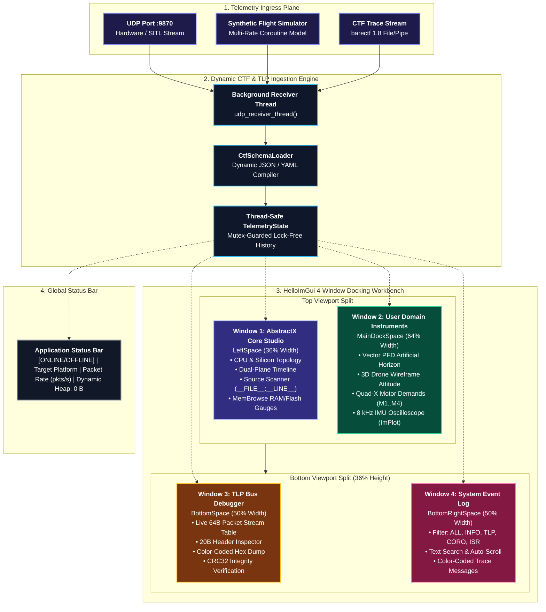

# AbstractX Visualizer Studio Specification (`tools/visualizer`)

This document is the **authoritative architectural design specification** for the **AbstractX Visualizer Studio (`tools/visualizer/`)**. It specifies the multi-window HelloImGui docking workbench, the separation between the **AbstractX Core Studio** and **User Domain Instruments**, the 64-byte TLP bus inspection and header decoding pipelines, the dynamic CTF 1.8 schema engine, the core-and-plugin extensibility SDK, and the MemBrowse zero-heap continuous memory observability model.

---

## 1. Studio Overview & Objectives

The AbstractX Visualizer Studio is a real-time hardware-software co-design observability workbench built in Python using **`imgui-bundle`** (`Dear ImGui` + `ImPlot` + `HelloImGui`). It provides:
1. **Architectural Decoupling**: A clean, physical separation between the low-level **AbstractX Core Studio** (Silicon CPU cores, timeline, SPSC rings, memory budgets) and high-level **User Domain Instruments** (PFD, 3D attitude wireframe, motor demands, real-time sensor graphs).
2. **Full-Screen Multi-Window Docking Layout**: Native HelloImGui docking engine permitting windows to be tiled, docked side-by-side, tabbed, floated across multiple monitors, or toggled via menu bars.
3. **Hardware-Level TLP Bus Inspection**: Dedicated live stream table and byte-level breakdown of 64-byte PCIe-style Transaction Layer Packets (`asp_tlp64_t`), including 20-byte wire header extraction and color-coded hex inspection with IEEE 802.3 CRC32 verification.
4. **Dynamic Schema-Driven Telemetry Ingestion**: CTF 1.8 / barectf schema decoding without hardcoded byte offsets, dynamically extracting engineering scales and units from metadata.
5. **Real-Time System Event Logging**: Filterable, low-latency scrolling console capturing driver lifecycle transitions, coroutine yields, hardware mailbox doorbells, and TLP router events.
6. **Continuous Zero-Heap Auditing**: Static budget tracking (`MemBrowse`) verifying zero dynamic heap usage ($0\text{ B}$) against device physical SRAM and Flash memory maps.



---

## 2. Multi-Window HelloImGui Docking Architecture

The visualizer enforces a multi-window docking layout configured via `hello_imgui.RunnerParams`:
* **Full-Screen Dock Space**: Configured with `hello_imgui.DefaultImGuiWindowType.provide_full_screen_dock_space`.
* **Docking Split Hierarchy**:
  1. `LeftSpace`: Left split from `MainDockSpace` with a ratio of `0.36` (36% width), hosting the low-level **AbstractX Core Studio**.
  2. `BottomSpace`: Bottom split from `MainDockSpace` with a ratio of `0.36` (36% height), hosting the hardware **TLP Bus Debugger**.
  3. `BottomRightSpace`: Right split from `BottomSpace` with a ratio of `0.50` (50% width of bottom region), hosting the **System Event Log**.
  4. `MainDockSpace`: The central, primary canvas hosting the decoupled **User Domain Instruments**.

```
+===================================================================================================+
| ABSTRACTX STUDIO WORKBENCH | Platform: Radxa Cubie A5E (ARM64+E907) | Stream: 8.2 kHz | 0 B Heap   |
+===================================================================================================+
| [WINDOW 1: ABSTRACTX CORE STUDIO]         | [WINDOW 2: USER DOMAIN INSTRUMENTS]                   |
| (LeftSpace: 36% Width)                    | (MainDockSpace: 64% Width)                            |
| ├─ CPU & Silicon Topology                 | ├─ Primary Flight Display (PFD) Artificial Horizon    |
| │  Core 0 (ARM64): [████░░░░] 22.4%       | │  Pitch ladder (+/-30°), Roll arc (-60°..+60°)       |
| │  Core 1 (E907) : [██████░░] 34.1%       | │  Aviation Altimeter tape & Airspeed dial            |
| │  SPU (FPGA)    : [██░░░░░░] 11.2%       | ├─ 3D Quadcopter Perspective Attitude Wireframe       |
| ├─ SPSC Ring Saturation & Doorbell Latency| │  Tait-Bryan Euler orientation (Roll, Pitch, Yaw)    |
| ├─ Dual-Plane Execution Timeline          | ├─ Quad-X Motor Mixer Demands (M1..M4)                |
| │  Plane 1: Hardware DMA / ISR bursts     | │  M1: 650 µs | M2: 650 µs | M3: 650 µs | M4: 650 µs  |
| │  Plane 2: C++20 Stackless Coroutines    | └─ 8 kHz IMU Oscilloscope (ImPlot Real-Time Waves)    |
| ├─ Interactive Source Scanner             |                                                       |
| │  Click event -> Jump to __FILE__:__LINE__|                                                       |
| └─ MemBrowse Static RAM/Flash Budgets     |                                                       |
+-------------------------------------------+-------------------------------------------------------+
| [WINDOW 3: TLP BUS DEBUGGER]              | [WINDOW 4: SYSTEM EVENT LOG]                          |
| (BottomSpace: 50% Bottom Width)           | (BottomRightSpace: 50% Bottom Width)                  |
| ├─ Incoming 64-Byte Packet Stream Table   | ├─ Filters: [ALL] [INFO] [TLP] [CORO] [ISR] [WARN]    |
| │  #0042 | IMU  | Ch:2 | Seq:42 | CRC OK  | ├─ Text Search: [ "doorbell" ] | Auto-Scroll: [X]     |
| ├─ 20B Header Inspector (Type, Addr, Len) | ├─ [00:01.120] [INFO] [System]: Link established      |
| ├─ Raw 64-Byte Color-Coded Hex Dump       | ├─ [00:01.121] [TLP ] [Router]: Pkt #42 from Ch:2     |
| └─ Byte Legend: Header, Payload, CRC32    | ├─ [00:01.122] [CORO] [Engine]: imu_pipeline resumed  |
+-------------------------------------------+-------------------------------------------------------+
| Status: [ONLINE] | Radxa Cubie A5E | Packets: 124,592 | Rate: 8,240 pkts/s | Dynamic Heap: 0 B    |
+===================================================================================================+
```

---

## 3. Window Functional Specifications

### 3.1 Window 1: AbstractX Core Studio (`LeftSpace`)
The Core Studio window provides foundational hardware-software co-design visibility across 5 integrated views:
1. **CPU Gauges & Topology**:
   - **Analog Radial Dial Gauges**: Rendered via vector draw lists featuring 240-degree sweep arcs, dynamic color-coding (Green < 50%, Amber < 80%, Coral Red $\ge 80\%$), needle indicators, and digital readouts for:
     - **Core 0 (Host Linux ARM64 / Cortex-M33)**: Total CPU % load.
     - **Core 1 (Coroutine Engine / XuanTie E907)**: Real-time active duty cycle %.
     - **SPU (FPGA Switch Fabric)**: Logic LUT utilization % and Auto-DMA rate.
   - **Real-Time CPU Load History Line Chart (`ImPlot`)**: Continuous scrolling line chart tracking Core 0, Core 1, and SPU loads over the preceding 30-second window.
   - **Silicon Topology & Interconnect**: Active processing cores, hardware accelerators, SPSC lock-free ring fill, and sub-microsecond mailbox doorbell interrupt latencies.
2. **Tracealyzer Task Timeline & Line Charts**:
   - **Task Execution Gantt Ribbons**: Percepio Tracealyzer style colored execution slices representing active coroutine tasks (`imu_pipeline`, `attitude_ekf`, `flight_control`, `spi_dma_burst`). Clicking any task slice targets the interactive source inspector.
   - **Coroutine Latency & Suspension History Line Chart (`ImPlot`)**: Multi-line waveform tracking execution durations and suspension latencies ($\mu s$) commit-over-commit.
   - **SPSC Interconnect Saturation Line Chart (`ImPlot`)**: Real-time queue occupancy waveforms for `g_sensor_ring` and `g_telemetry_ring` (0 to 64 packets).
3. **Simple Trace Viewer (strace / Tracealyzer Event Log)**:
   - Chronological microsecond-timestamped execution trace table capturing coroutine yields, resumes, `co_await` tokens, hardware DMA completions, and doorbell interrupts.
   - Interactive filtering by silicon core (`[ALL]`, `[Core 0]`, `[Core 1]`, `[SPU]`, `[ISR]`), substring search, pause stream, and auto-scroll locking.
   - Direct integration with the Source Code Scanner: selecting any trace event automatically resolves `__FILE__ : __LINE__` and displays the exact C++ source context.
4. **Dual-Plane Execution Timeline**:
   - **Plane 1 (Hardware Drivers & ISR/DMA)**: Timed burst execution bars for SPI DMA bursts, I2C ISRs, and hardware doorbell signals.
   - **Plane 2 (Cooperative Coroutine Loop)**: Stackless coroutine task execution spans (`Task<void>`), displaying exact suspension reasons (`co_await g_sensor_ring.pop()`, `co_await timer.sleep()`).
5. **MemBrowse Memory Budgets**:
   - Continuously audits memory metrics exported by `tools/track_memory_membrowse.py`.
   - Visualizes RAM and Flash utilization against hardware limits defined in `tools/membrowse-targets.json`.
   - Displays `.text`, `.rodata`, `.data`, and `.bss` section metrics with guaranteed zero dynamic heap reference verification ($0\text{ B}$).

### 3.2 Window 2: User Domain Instruments (`MainDockSpace`)
A high-framerate (120 FPS) canvas hosting domain-specific user instruments:
1. **Vector Primary Flight Display (PFD)**:
   - Dynamic artificial horizon with anti-aliased Sky/Earth tilt polygons rendered via ImGui draw lists.
   - Pitch ladder calibrated in $\pm 10^\circ$, $\pm 20^\circ$, $\pm 30^\circ$ pitch increments.
   - Central aircraft reticle crosshairs and roll angle pointer.
2. **3D Quadcopter Perspective Wireframe**:
   - Full 3D perspective projection computed via Tait-Bryan rotation matrix:
     $$\mathbf{R} = \mathbf{R}_z(\psi) \mathbf{R}_y(\theta) \mathbf{R}_x(\phi)$$
   - Color-coded airframe geometry (Cyan front arms, Coral rear arms) and rotating motor disc indicators.
3. **Quad-X Motor Mixer Demands**:
   - Four real-time bar indicators showing throttle actuation demands for $M_1$ (Front-Right CCW), $M_2$ (Rear-Left CCW), $M_3$ (Front-Left CW), and $M_4$ (Rear-Right CW), centered around a 500 µs hover baseline.
4. **8 kHz IMU Oscilloscope (`ImPlot`)**:
   - High-throughput scrolling waveform plots displaying Gyroscope ($\Omega_x, \Omega_y, \Omega_z$ in $^\circ/\text{s}$) and Accelerometer ($A_x, A_y, A_z$ in $g$) data streams.

### 3.3 Window 3: TLP Bus Debugger (`BottomSpace`)
Low-level transaction inspection for PCIe-style 64-byte Transaction Layer Packets:
1. **Live Packet Stream Table**:
   - Tabular view of incoming packets with Sequence Number, Tag name (`IMU`, `GPS`, `AHRS`, `PLAT`), Channel ID, 64-bit Hardware Timestamp (ns), and CRC verification status.
   - User selectable rows to freeze and inspect arbitrary frames.
2. **Header Inspector (20-Byte Wire Header)**:
   - Deconstructs wire fields: `Type` (1B), `Flags` (1B), `Tag` (1B), `Channel` (1B), `Target Address` (4B), `Length DW` (2B), `Sequence` (2B), and `Timestamp ns` (8B).
3. **Color-Coded 64-Byte Raw Hex Dump**:
   - 16-byte aligned hex view with ASCII sidebar:
     - **Blue (`#64b5f6`)**: 20-Byte TLP Header (`0x00..0x13`).
     - **Green (`#81c784`)**: 40-Byte CTF Telemetry Payload (`0x14..0x3B`).
     - **Orange (`#ffb74d`)**: 4-Byte IEEE 802.3 CRC32 Trailer (`0x3C..0x3F`).
4. **Stream Controls**:
   - Stream Pause/Resume toggle, Packet Buffer Clear, and Packet counter diagnostics.

### 3.4 Window 4: System Event Log (`BottomRightSpace`)
A high-throughput trace log console:
1. **Severity Filter Buttons**:
   - `[ALL]`, `[INFO]`, `[TLP]`, `[CORO]`, `[ISR]`, `[WARN]`.
2. **Interactive Search & Text Filtering**:
   - Real-time case-insensitive substring search across log message content and subsystem source identifiers.
3. **Auto-Scroll Behavior**:
   - Intelligent auto-scroll pinning to latest output with automatic release when user scrolls upward.
4. **Buffer Controls**:
   - Clear Log buffer button and Copy to Clipboard support.

---

## 4. Core-and-Plugin SDK Contract (`tools/visualizer/sdk/plugin.py`)

AbstractX Studio decouples domain-specific instruments through the `AbstractXStudioPlugin` base class.

```python
class AbstractXStudioPlugin(ABC):
    def __init__(self, name: str, version: str = "1.0"): ...
    def on_init(self, context: Dict[str, Any]) -> None: ...
    def on_tlp_packet(self, tlp_header: Dict[str, Any], payload_dict: Dict[str, Any]) -> None: ...
    @abstractmethod
    def render_ui(self, delta_time: float = 0.0, state: Optional[Any] = None) -> None: ...
    def render_menu_items(self) -> None: ...
```

### SDK Invariants:
1. **Thread Separation**: `on_tlp_packet` is invoked asynchronously from the ingestion thread. All state mutations must be synchronized via `TelemetryState.lock`.
2. **Zero Framework Pollution**: Plugins render inside their designated dock space without manipulating parent window flags, menu setups, or low-level GLFW contexts.
3. **Dynamic Discovery**: Domain instruments can be loaded dynamically or registered at startup without modifying core studio source files.

---

## 5. Dynamic CTF 1.8 / barectf Schema Decoding

The visualizer strictly prohibits hardcoded byte offsets for telemetry event payloads. All payload parsing is governed by `CtfSchemaLoader` (`tools/visualizer/ctf_schema_loader.py`):
1. **Schema Ingestion**: Ingests JSON (`trace_schema.json`) or barectf YAML metadata.
2. **Format Compilation**: Dynamically builds Python `struct.unpack` format strings (e.g., `<Bffff` or `<BhhhIhHHHHI`) mapping data types (`uint8`, `int16`, `float32`, `uint32`, etc.).
3. **Engineering Unit Scaling**: Automatically scales raw integers into engineering units (e.g., centidegrees to degrees via `0.01`, millimeters to meters via `0.001`).

---

## 6. Standalone Synthetic Flight Simulation Engine

To enable developer iteration and CI test execution without physical silicon:
1. **Synthetic Producer**: Background generator runs when `--sim` is supplied.
2. **Multi-Rate Modeling**:
   - 8 kHz IMU accelerometer and gyroscope noise streams.
   - 50 Hz Magnetometer earth reference vectors.
   - 10 Hz GPS orbital coordinates, ground speed, and satellite fix metadata.
   - 100 Hz Fused AHRS attitude angles (sinusoidal pitch/roll motions) and motor throttle reactions.
3. **TLP 64-Byte Wire Encoding**: Packs valid headers, payloads, and calculates IEEE 802.3 CRC32 trailers.

---

## 7. Continuous Memory Observability with MemBrowse

AbstractX mandates **Freestanding C++20 with Zero Heap** ($0\text{ B}$ dynamic memory during execution):
1. **Continuous Budget Tracking**: `tools/track_memory_membrowse.py` extracts `.text`, `.rodata`, `.data`, and `.bss` metrics from target ELF binaries.
2. **Silicon Target Boundaries**: Section totals are evaluated against hardware SRAM and Flash boundaries defined in `tools/membrowse-targets.json`.
3. **Visualizer Status Verification**: The workbench displays an explicit `Dynamic Heap: 0 B` badge in the status bar and renders static allocation progress gauges in the Core Studio window.

---

## 8. Normative Specification Requirements Matrix

Every requirement below is verified in code with an `@impl` tag:

### `[SPEC-STUDIO-01]` Full-Screen Multi-Window Docking Layout
The visualizer MUST initialize a Dear ImGui full-screen docking workbench using `hello_imgui` (`DefaultImGuiWindowType.provide_full_screen_dock_space`), partitioning the viewport into dedicated dock spaces (`LeftSpace`, `MainDockSpace`, `BottomSpace`, `BottomRightSpace`).

### `[SPEC-STUDIO-02]` AbstractX Core Studio Silicon & Timeline Window
The visualizer MUST provide a dedicated Core Studio window (`LeftSpace`) displaying multi-core silicon topology (Core 0, Core 1, SPU), SPSC ring queue saturation, dual-plane execution timeline (hardware ISR/DMA vs C++20 coroutines), interactive `__FILE__ : __LINE__` source jumping, and MemBrowse static memory budget gauges.

### `[SPEC-STUDIO-03]` User Domain Instruments Decoupled Canvas
The visualizer MUST provide a dedicated primary canvas (`MainDockSpace`) hosting domain-specific user instruments (Vector Primary Flight Display artificial horizon, 3D attitude wireframe, quad-X motor demands, 8 kHz IMU real-time oscilloscope) decoupled from core framework execution.

### `[SPEC-STUDIO-04]` 64-Byte TLP Bus Debugger & Header Inspector
The visualizer MUST provide a low-level TLP bus debugging window (`BottomSpace`) displaying a live 64-byte packet stream table (Seq, Tag, Channel, Timestamp, CRC status), byte-by-byte header breakdown (20B header, 40B payload, 4B CRC32), color-coded raw hex dump, and stream capture controls.

### `[SPEC-STUDIO-05]` Real-Time System Event Log & Trace Filter
The visualizer MUST provide a real-time event log window (`BottomRightSpace`) displaying timestamped events from drivers, coroutines, and the TLP switch fabric, supporting severity filtering (`ALL`, `INFO`, `TLP`, `CORO`, `ISR`, `WARN`), substring text search, and auto-scrolling.

### `[SPEC-STUDIO-06]` Core-and-Plugin Extensibility SDK
The visualizer MUST decouple domain instruments from core framework logic using the `AbstractXStudioPlugin` base class, defining standard lifecycle hooks (`on_init`, `on_tlp_packet`, `render_ui`, `render_menu_items`) without requiring direct OpenGL/windowing boilerplate.

### `[SPEC-STUDIO-07]` Dynamic CTF 1.8 / barectf Schema Decoding
The visualizer MUST dynamically parse CTF 1.8 / barectf YAML and JSON schemas (`trace_schema.json`) into typed Python structures, resolving engineering scales and units without hardcoded binary struct offsets.

### `[SPEC-STUDIO-08]` Multi-Rate Telemetry Ingestion & Thread Safety
The visualizer MUST ingest 64-byte `asp_tlp64_t` frames asynchronously via a dedicated background receiver thread over UDP (port 9870) or shared memory, synchronizing state with the 120 FPS UI thread via thread-safe lock-free primitives and mutex synchronization (`TelemetryState.lock`).

### `[SPEC-STUDIO-09]` Standalone Synthetic Flight Simulation Engine
The visualizer MUST support a standalone `--sim` mode generating realistic multi-rate synthetic telemetry (8 kHz IMU, 50 Hz Magnetometer, 10 Hz GPS, and 100 Hz AHRS state packets) for full offline visual testing without connected hardware.

### `[SPEC-STUDIO-10]` MemBrowse Zero-Heap Static Budget Verification
The visualizer MUST ingest static section metrics (`.text`, `.rodata`, `.data`, `.bss`) from `memory_metrics.json` and verify compliance with zero-heap invariants, displaying memory budget bars against hardware SRAM and Flash limits and an explicit `0 B` dynamic heap allocation badge.
